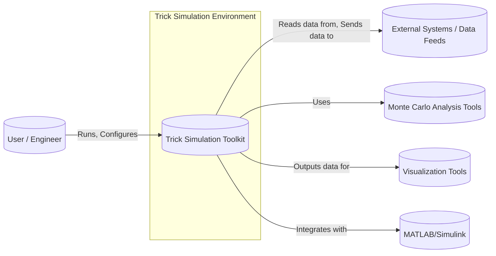
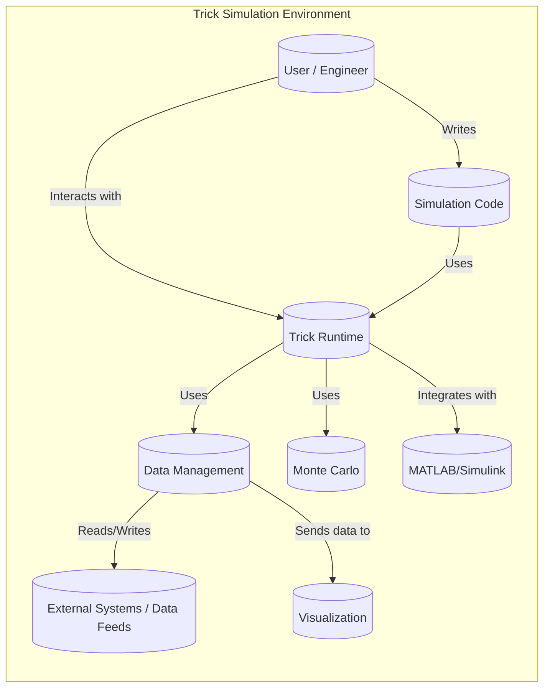
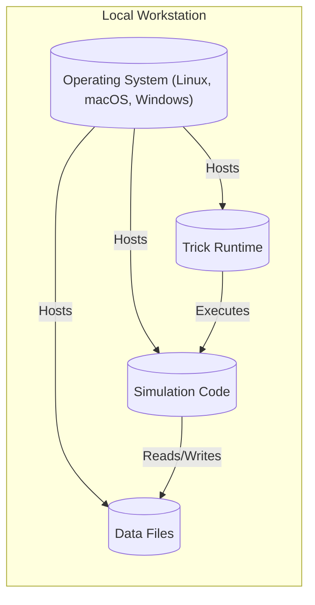
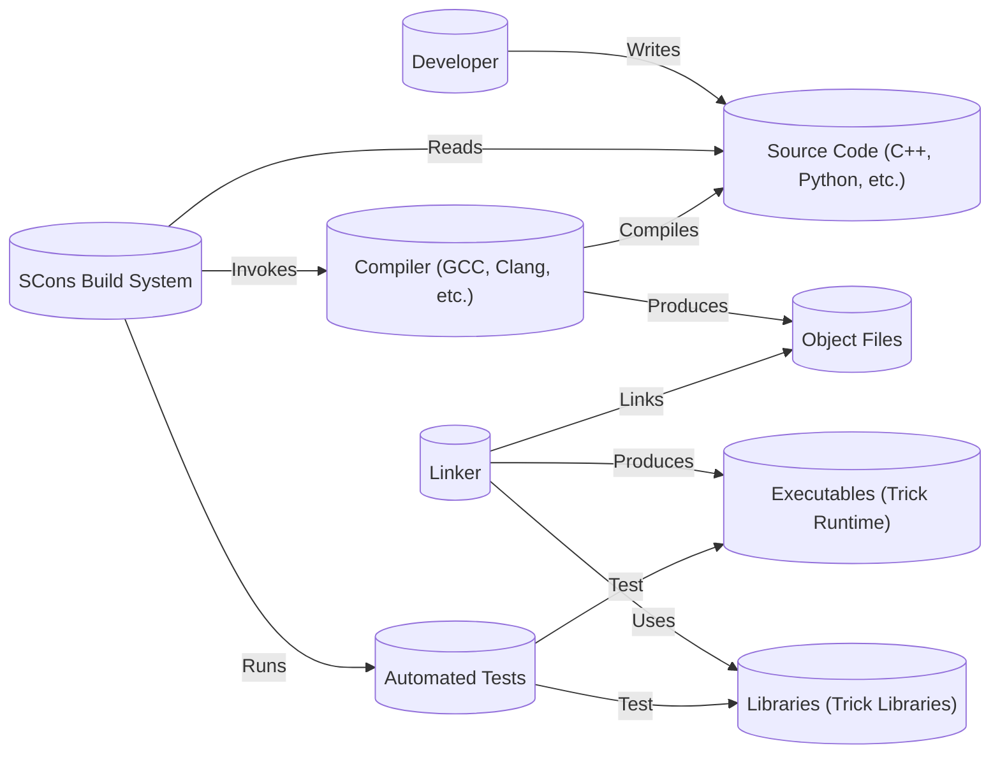

Okay, let's create a design document for the NASA Trick simulation toolkit.

# BUSINESS POSTURE

Trick is a simulation development environment designed to build simulations of various types, from simple to complex, real-time, and human-in-the-loop systems. It appears to be targeted towards internal NASA projects and potentially external collaborators in the aerospace and scientific communities.

Priorities:

*   Provide a flexible and powerful simulation environment.
*   Enable rapid prototyping and development of simulations.
*   Support a wide range of simulation complexities and use cases.
*   Facilitate code reuse and collaboration.
*   Ensure the reliability and accuracy of simulations.

Goals:

*   Become the standard simulation toolkit within NASA.
*   Reduce the time and cost of developing simulations.
*   Improve the quality and fidelity of simulations.
*   Enable the development of new and innovative simulation capabilities.

Business Risks:

*   Inadequate simulation fidelity leading to incorrect conclusions or design flaws.
*   Security vulnerabilities in the simulation environment or resulting simulations, potentially exposing sensitive data or allowing unauthorized control.
*   Lack of adoption by NASA engineers and scientists, hindering its goal of becoming a standard.
*   Difficulty in integrating Trick with existing NASA tools and workflows.
*   Insufficient documentation or training, limiting the usability of the toolkit.
*   Inability to scale to meet the demands of increasingly complex simulations.

# SECURITY POSTURE

Based on the provided GitHub repository, the following security controls and accepted risks are identified. It's important to note that this assessment is based solely on the public repository and may not reflect the full security posture of Trick deployments within NASA.

Existing Security Controls:

*   security control: Code reviews: The GitHub repository shows evidence of a pull request process, suggesting that code reviews are likely part of the development lifecycle. (Inferred from GitHub workflow)
*   security control: Limited external dependencies: The project appears to have a relatively small number of external dependencies, reducing the attack surface. (Observed in repository structure)
*   security control: Input validation: Some level of input validation is likely present within the core Trick codebase to handle user-provided simulation parameters and configurations. (Assumed based on the nature of the software)

Accepted Risks:

*   accepted risk: The simulation environment itself may not be hardened against sophisticated attacks. The focus is likely on the accuracy and functionality of the simulations, rather than the security of the Trick framework itself. This is a common trade-off in scientific computing environments.
*   accepted risk: Simulations created using Trick may inherit vulnerabilities from user-provided code or models. Trick provides the framework, but the security of the specific simulation implementation is the responsibility of the simulation developer.
*   accepted risk: Limited authentication and authorization mechanisms within the core Trick framework. Access control is likely managed at the operating system or deployment environment level.

Recommended Security Controls:

*   Static Application Security Testing (SAST): Integrate SAST tools into the build process to identify potential vulnerabilities in the Trick codebase.
*   Software Composition Analysis (SCA): Use SCA tools to identify and manage vulnerabilities in third-party libraries and dependencies.
*   Dynamic Application Security Testing (DAST): Perform DAST on deployed instances of Trick to identify runtime vulnerabilities.
*   Security Training: Provide security training to developers using Trick, emphasizing secure coding practices and the importance of input validation and output encoding.
*   Documentation: Create security-focused documentation for Trick, guiding users on how to develop secure simulations.

Security Requirements:

*   Authentication: While Trick itself may not require strong authentication, any deployment environment or web interface built around Trick should implement robust authentication mechanisms, preferably integrating with NASA's existing identity management systems.
*   Authorization: Access control should be enforced at the operating system or deployment environment level, limiting access to Trick and simulation data based on user roles and permissions. Consider implementing role-based access control (RBAC) within any web interfaces or APIs built around Trick.
*   Input Validation: Trick should perform robust input validation on all user-provided data, including simulation parameters, configuration files, and external data sources. This is crucial to prevent injection attacks and ensure the stability of the simulation environment. Specific validation rules will depend on the type of data being processed.
*   Cryptography: If Trick handles sensitive data, appropriate cryptographic techniques should be used to protect the data in transit and at rest. This may include using TLS for network communication and encrypting sensitive data stored on disk. The specific cryptographic algorithms and key management practices should adhere to NASA's security policies.

# DESIGN

Trick is a simulation toolkit that provides a set of libraries and utilities for building and running simulations. It is designed to be flexible and extensible, allowing users to create simulations of varying complexity.

## C4 CONTEXT

Element Descriptions:

*   Element:
    *   Name: User / Engineer
    *   Type: Person
    *   Description: A person who interacts with Trick to create, configure, run, and analyze simulations.
    *   Responsibilities: Defining simulation parameters, writing simulation code, running simulations, analyzing results.
    *   Security controls: Authentication and authorization enforced by the operating system or deployment environment.

*   Element:
    *   Name: Trick Simulation Toolkit
    *   Type: Software System
    *   Description: The core simulation environment provided by Trick.
    *   Responsibilities: Providing a framework for building simulations, managing simulation execution, handling data input and output, providing utility functions.
    *   Security controls: Input validation, limited external dependencies.

*   Element:
    *   Name: External Systems / Data Feeds
    *   Type: Software System
    *   Description: External systems that provide data to or receive data from the simulation.
    *   Responsibilities: Providing real-world data, receiving simulation results, acting as external stimuli.
    *   Security controls: Dependent on the specific external system. Data validation should be performed by Trick when interacting with external systems.

*   Element:
    *   Name: Monte Carlo Analysis Tools
    *   Type: Software System
    *   Description: Tools used for performing Monte Carlo simulations and analysis.
    *   Responsibilities: Running multiple simulations with varying parameters, analyzing the statistical distribution of results.
    *   Security controls: Input validation, secure handling of random number generation.

*   Element:
    *   Name: Visualization Tools
    *   Type: Software System
    *   Description: Tools used for visualizing simulation data.
    *   Responsibilities: Displaying simulation results in a graphical format, allowing users to interact with the data.
    *   Security controls: Output encoding to prevent XSS vulnerabilities if the visualization tools are web-based.

*   Element:
    *   Name: MATLAB/Simulink
    *   Type: Software System
    *   Description: A numerical computing environment and simulation tool that can be integrated with Trick.
    *   Responsibilities: Providing additional modeling and simulation capabilities, co-simulation with Trick.
    *   Security controls: Dependent on the specific MATLAB/Simulink configuration and security practices.

## C4 CONTAINER

Since Trick is primarily a toolkit and library, rather than a complex distributed application, the Container diagram is relatively simple and closely resembles the Context diagram. The "containers" in this case represent conceptual components within the Trick framework.

Element Descriptions:

*   Element:
    *   Name: User / Engineer
    *   Type: Person
    *   Description: A person who interacts with Trick to create, configure, run, and analyze simulations.
    *   Responsibilities: Defining simulation parameters, writing simulation code, running simulations, analyzing results.
    *   Security controls: Authentication and authorization enforced by the operating system or deployment environment.

*   Element:
    *   Name: Simulation Code
    *   Type: Code
    *   Description: User-written code that defines the specific simulation logic and models.
    *   Responsibilities: Implementing the simulation model, interacting with the Trick Runtime.
    *   Security controls: Secure coding practices, input validation, output encoding (if applicable).

*   Element:
    *   Name: Trick Runtime
    *   Type: Code
    *   Description: The core engine of Trick that manages simulation execution.
    *   Responsibilities: Scheduling events, managing time, handling data flow, providing utility functions.
    *   Security controls: Input validation, error handling.

*   Element:
    *   Name: Data Management
    *   Type: Code
    *   Description: Components within Trick that handle data input, output, and storage.
    *   Responsibilities: Reading data from external sources, writing data to files or databases, managing simulation state.
    *   Security controls: Input validation, secure file handling, data encryption (if applicable).

*   Element:
    *   Name: External Systems / Data Feeds
    *   Type: Software System
    *   Description: External systems that provide data to or receive data from the simulation.
    *   Responsibilities: Providing real-world data, receiving simulation results, acting as external stimuli.
    *   Security controls: Dependent on the specific external system. Data validation should be performed by Trick when interacting with external systems.

*   Element:
    *   Name: Monte Carlo
    *   Type: Code
    *   Description: Component within Trick that handle Monte Carlo analysis.
    *   Responsibilities: Running multiple simulations.
    *   Security controls: Input validation.

*   Element:
    *   Name: Visualization
    *   Type: Software System
    *   Description: External system that visualize data.
    *   Responsibilities: Displaying data.
    *   Security controls: Output encoding.

*   Element:
    *   Name: MATLAB/Simulink
    *   Type: Software System
    *   Description: External system that can integrate with Trick.
    *   Responsibilities: Co-simulation.
    *   Security controls: Secure communication channel.

## DEPLOYMENT

Trick simulations can be deployed in various ways, depending on the specific needs of the user and the complexity of the simulation. Here are a few possible deployment scenarios:

1.  Local Workstation: A single user runs Trick simulations on their local machine. This is suitable for development, testing, and small-scale simulations.
2.  High-Performance Computing (HPC) Cluster: Trick simulations are deployed on an HPC cluster to leverage parallel processing capabilities for large-scale simulations.
3.  Cloud-Based Environment: Trick simulations are deployed on a cloud platform (e.g., AWS, Azure, GCP) to provide scalability and accessibility.

We will describe the Local Workstation deployment in detail, as it is the simplest and most likely the initial deployment scenario for many users.

Element Descriptions:

*   Element:
    *   Name: Operating System (Linux, macOS, Windows)
    *   Type: Software
    *   Description: The underlying operating system on which Trick is deployed.
    *   Responsibilities: Providing the basic system resources and services.
    *   Security controls: Operating system hardening, user access control, firewall.

*   Element:
    *   Name: Trick Runtime
    *   Type: Software
    *   Description: The compiled Trick runtime environment.
    *   Responsibilities: Executing the simulation, managing resources.
    *   Security controls: Input validation, error handling.

*   Element:
    *   Name: Simulation Code
    *   Type: Code
    *   Description: User-written simulation code.
    *   Responsibilities: Defining the simulation logic.
    *   Security controls: Secure coding practices, input validation.

*   Element:
    *   Name: Data Files
    *   Type: Data
    *   Description: Input and output data files used by the simulation.
    *   Responsibilities: Storing simulation parameters, results, and other data.
    *   Security controls: File permissions, data encryption (if sensitive).

## BUILD

Trick's build process, as evident from the GitHub repository, utilizes SCons (a software construction tool) as its primary build system. The build process transforms the source code into executable binaries and libraries that form the Trick runtime environment.

Security Controls in Build Process:

*   Compiler Warnings and Errors: The build process should be configured to treat compiler warnings as errors, ensuring that potential code quality issues are addressed.
*   Static Analysis: Integrate static analysis tools (e.g., Coverity, SonarQube) into the SCons build process to automatically scan the code for vulnerabilities.
*   Dependency Management: SCons can be used to manage external dependencies, ensuring that only approved and up-to-date libraries are used.
*   Automated Testing: The build process includes automated tests (unit tests, integration tests) to verify the functionality and stability of the Trick codebase.
*   Reproducible Builds: Aim for reproducible builds, where the same source code and build environment consistently produce the same binary output. This enhances trust and auditability.

# RISK ASSESSMENT

Critical Business Processes:

*   Accurate and reliable simulation of aerospace systems.
*   Rapid prototyping and development of new simulation capabilities.
*   Collaboration and knowledge sharing among NASA engineers and scientists.

Data Sensitivity:

*   Simulation Input Data: May include sensitive design parameters, performance data, or proprietary information about aerospace systems. Sensitivity: Potentially High.
*   Simulation Output Data: May contain results that reveal sensitive information about system performance or vulnerabilities. Sensitivity: Potentially High.
*   Simulation Code: May contain proprietary algorithms or intellectual property. Sensitivity: Potentially High.
*   Trick Source Code: The core Trick codebase itself is likely not highly sensitive, as it is open source. Sensitivity: Low.
*   User Credentials: If Trick is integrated with authentication systems, user credentials would be highly sensitive. Sensitivity: High.

# QUESTIONS & ASSUMPTIONS

Questions:

*   What are the specific security policies and guidelines that apply to Trick deployments within NASA?
*   Are there any existing security tools or infrastructure that should be integrated with Trick?
*   What are the expected threat models for Trick simulations (e.g., insider threats, external attacks)?
*   What level of assurance is required for Trick simulations (e.g., certification for use in critical applications)?
*   What are data sensitivity levels for different types of simulations?

Assumptions:

*   BUSINESS POSTURE: It is assumed that Trick is primarily used for research and development purposes, and not for mission-critical real-time control systems without further certification and validation.
*   SECURITY POSTURE: It is assumed that the primary responsibility for securing Trick deployments lies with the users and administrators, rather than the core Trick development team.
*   DESIGN: It is assumed that the Local Workstation deployment scenario is the most common initial use case for Trick.
*   It is assumed that users of Trick have a basic understanding of simulation principles and secure coding practices.