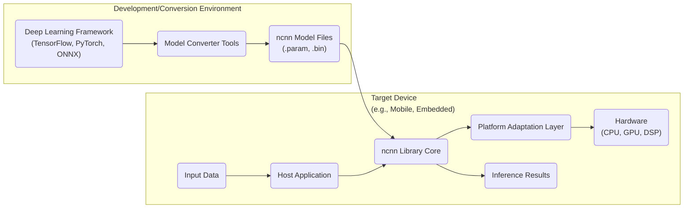
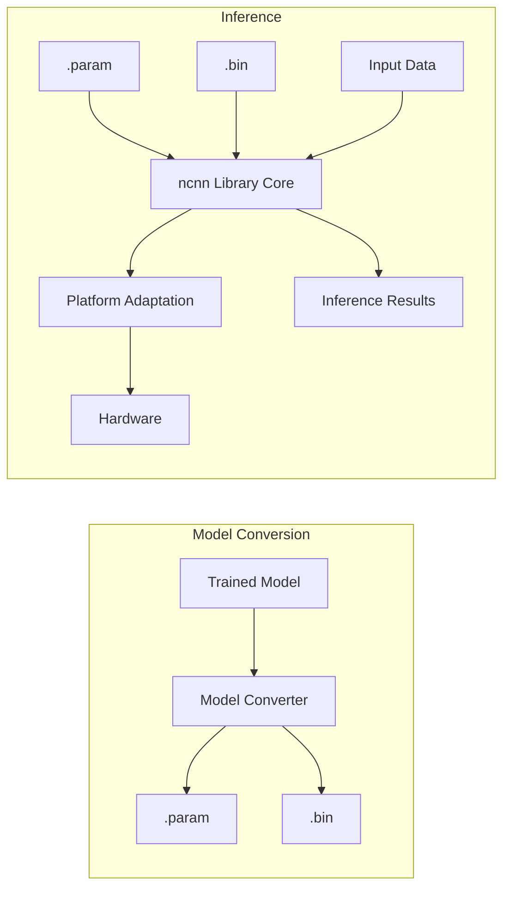

# Project Design Document: ncnn - High-Performance Neural Network Inference Framework

**Version:** 1.1
**Date:** October 26, 2023
**Author:** AI Architecture Expert

## 1. Introduction

This document provides an enhanced architectural design of the ncnn project, a high-performance neural network inference framework developed by Tencent. This revised document offers a more detailed understanding of the system's components, their interactions, and data flow, with a stronger emphasis on aspects relevant to threat modeling. It will serve as a robust foundation for identifying potential security vulnerabilities and risks.

## 2. Project Overview

ncnn is a meticulously engineered C++ library optimized for the efficient execution (inference) of deep learning models, particularly on resource-constrained mobile and embedded platforms. Its core design principles prioritize exceptional performance, minimal memory footprint, and reduced power consumption, making it an ideal choice for on-device AI implementations. ncnn boasts comprehensive support for a wide array of deep learning frameworks through its sophisticated model conversion tools and provides highly optimized implementations tailored to diverse hardware architectures, including CPUs, GPUs, and specialized accelerators.

**Key Goals:**

*   Achieve state-of-the-art high performance for neural network inference.
*   Maintain an extremely low memory footprint and minimize power consumption.
*   Offer seamless support for importing models from various popular deep learning frameworks (e.g., TensorFlow, PyTorch, ONNX).
*   Ensure broad cross-platform compatibility (Android, iOS, Linux, Windows).
*   Facilitate straightforward integration into existing application codebases.

## 3. System Architecture

The ncnn framework is logically structured into the following key components, each with distinct responsibilities:

*   **ncnn Library Core:** The foundational C++ library responsible for the entire lifecycle of neural network inference, including model loading, graph optimization, memory management, and execution.
*   **Model Converter Tools:** A suite of utilities, primarily implemented in Python, that bridge the gap between different deep learning frameworks and ncnn. These tools translate trained models into ncnn's efficient proprietary format (`.param` and `.bin`).
*   **Platform Adaptation Layer:** A crucial abstraction layer that provides hardware-specific optimizations and standardized access to underlying hardware resources, such as CPU instruction sets, GPU compute capabilities, and DSP functionalities.
*   **API Bindings:**  Well-defined interfaces that enable interaction with the ncnn library from various programming languages, including C++, Java (via JNI), and Objective-C (for iOS).
*   **Example Applications and Demos:**  Illustrative sample applications and demonstrations that showcase the practical usage of the ncnn library and provide developers with starting points for integration.

### 3.1. Component Descriptions

*   **Deep Learning Framework ("Deep Learning Framework (TensorFlow, PyTorch, ONNX)")**: Represents the original environment where the neural network model is designed, trained, and validated. ncnn's strength lies in its ability to consume models from these diverse sources.
*   **Model Converter Tools ("Model Converter Tools")**: These tools are critical for adapting models to ncnn's architecture. They perform several key functions:
    *   **Parsing:**  Reading and interpreting the model definition and weights from the source framework's format.
    *   **Graph Transformation:** Optimizing the model graph for efficient execution on target devices, potentially including layer fusion and dead code elimination.
    *   **Quantization (Optional):** Reducing the precision of model weights and activations to decrease memory usage and improve performance.
    *   **Serialization:**  Writing the optimized model into the `.param` (architecture) and `.bin` (weights) files.
*   **ncnn Model Files ("ncnn Model Files (.param, .bin)")**: The standardized representation of the neural network model for ncnn:
    *   `".param"`: A human-readable text file that defines the network's structure, including layers, their types, connections, and basic parameters.
    *   `".bin"`: A binary file containing the numerical weights and biases of the trained model's parameters.
*   **Host Application ("Host Application")**: The software application running on the target device that leverages the ncnn library to perform inference on specific data. This application manages the input data and utilizes the inference results.
*   **ncnn Library Core ("ncnn Library Core")**: The heart of the framework, responsible for:
    *   **Model Loading and Parsing:** Reading and interpreting the `.param` and `.bin` files to reconstruct the neural network in memory.
    *   **Memory Management:** Allocating and managing memory for intermediate computations during inference.
    *   **Operator Implementations:** Providing highly optimized implementations (kernels) for various neural network layers (e.g., convolution, pooling, activation functions). These implementations are often hardware-specific.
    *   **Inference Execution:**  Orchestrating the execution of the neural network graph, feeding data through the layers, and producing the final output.
    *   **Graph Optimization (Runtime):** Performing further optimizations on the loaded model graph at runtime, if applicable.
*   **Platform Adaptation Layer ("Platform Adaptation Layer")**: This layer abstracts away the complexities of the underlying hardware, enabling ncnn to run efficiently on different platforms:
    *   **CPU Backend:** Provides optimized implementations of neural network operators that leverage specific CPU instruction sets (e.g., ARM NEON, x86 SSE/AVX).
    *   **GPU Backend:** Utilizes GPU compute APIs (e.g., Vulkan, OpenGL ES, Metal) to offload computationally intensive tasks to the GPU for parallel processing.
    *   **DSP Backend:**  Offers support for executing parts of the network on Digital Signal Processors (DSPs) available on some embedded devices.
*   **Hardware ("Hardware (CPU, GPU, DSP)")**: The physical processing units where the actual computations of the neural network inference take place.
*   **Input Data ("Input Data")**: The data that is fed into the neural network for processing and analysis. The format and preprocessing requirements depend on the specific model.
*   **Inference Results ("Inference Results")**: The output generated by the neural network after processing the input data. This could be classification labels, object detection bounding boxes, or other forms of processed information.

### 3.2. Component Interactions

The typical workflow for utilizing ncnn involves the following sequence of interactions:

*   A neural network model is developed and trained using a high-level deep learning framework like TensorFlow, PyTorch, or ONNX.
*   The trained model is then processed by the ncnn Model Converter Tools.
*   The Model Converter Tools generate the optimized `.param` and `.bin` files, representing the ncnn-compatible model.
*   These `.param` and `.bin` files are deployed to the target device, typically bundled within the Host Application's resources.
*   The Host Application initializes the ncnn library.
*   The Host Application provides the file paths to the `.param` and `.bin` files to the ncnn Library Core.
*   The ncnn Library Core parses the model architecture from the `.param` file and loads the weights from the `.bin` file into memory.
*   The Host Application prepares and provides the input data to the ncnn Library Core.
*   The ncnn Library Core utilizes the Platform Adaptation Layer to execute the inference computations on the available hardware (CPU, GPU, or DSP).
*   The ncnn Library Core returns the processed Inference Results back to the Host Application.

## 4. Data Flow

The flow of data within the ncnn framework can be broken down into two primary stages: model conversion and inference.

*   **Model Conversion:**
    *   **Input:** A trained model definition and weights from a supported deep learning framework.
    *   **Process:** The Model Converter Tools analyze the input model, perform graph optimizations (e.g., layer fusion), potentially apply quantization techniques, and then serialize the model architecture and weights into the `.param` and `.bin` file formats, respectively.
    *   **Output:** The `.param` file (describing the network structure) and the `.bin` file (containing the model's weights).

*   **Inference:**
    *   **Input:** The `.param` and `.bin` model files, along with the input data that needs to be processed by the neural network.
    *   **Process:**
        *   The ncnn Library Core loads the network architecture from the `".param"` file.
        *   The ncnn Library Core loads the trained weights and biases from the `".bin"` file.
        *   The Host Application provides the `Input Data` to the ncnn Library Core.
        *   The input data is fed into the initial layer of the loaded neural network.
        *   Data propagates through the network's layers. Each layer performs its specific computation (e.g., convolution, pooling, activation). The Platform Adaptation Layer selects and executes the most efficient hardware-specific implementations for these operations.
        *   Intermediate results are stored in memory managed by the ncnn Library Core.
        *   The output from the final layer of the network constitutes the `Inference Results`.
    *   **Output:** The `Inference Results`, which represent the neural network's prediction or analysis of the input data.

## 5. Security Considerations (Detailed for Threat Modeling)

This section provides a more detailed examination of potential security considerations, crucial for effective threat modeling.

*   **Model File Integrity ("Model File Integrity"):**
    *   **Threat:** Tampering with the `".param"` or `".bin"` files can lead to the execution of a modified or malicious model, resulting in incorrect, biased, or even harmful inference outcomes. An attacker might aim to subtly alter the model's behavior or inject backdoors.
    *   **Mitigation Considerations:** Implementing cryptographic signing and verification mechanisms for model files can ensure their integrity and authenticity. Secure storage and transmission of these files are also essential.
*   **Data Confidentiality ("Data Confidentiality"):**
    *   **Threat:** Sensitive input data processed by the neural network could be intercepted or accessed during processing, especially if the target device is compromised. Intermediate results stored in memory might also be vulnerable.
    *   **Mitigation Considerations:** Employing encryption for sensitive input data before feeding it to the ncnn library and considering techniques for secure handling of intermediate results in memory. Secure communication channels should be used if data is transmitted.
*   **Code Injection ("Code Injection"):**
    *   **Threat:** Vulnerabilities in the model parsing logic (within the ncnn Library Core) could potentially be exploited by crafting malicious `".param"` files that, when parsed, execute arbitrary code on the target device.
    *   **Mitigation Considerations:** Rigorous input validation and sanitization of the `".param"` file format are paramount. Employing secure coding practices during the development of the parsing logic is crucial.
*   **Denial of Service (DoS) ("Denial of Service (DoS)"):**
    *   **Threat:** Maliciously crafted input data or specially designed `".param"` files could exploit vulnerabilities in the ncnn Library Core, causing it to crash, hang, or consume excessive resources, effectively denying service.
    *   **Mitigation Considerations:** Implementing robust input validation and resource management within the ncnn Library Core. Setting limits on resource consumption and employing techniques to prevent infinite loops or excessive memory allocation.
*   **Side-Channel Attacks ("Side-Channel Attacks"):**
    *   **Threat:** Attackers might attempt to infer sensitive information about the model or the input data by analyzing side-channel information such as timing variations in inference execution or power consumption patterns.
    *   **Mitigation Considerations:** Employing constant-time algorithms where feasible and considering techniques to obfuscate execution patterns to minimize information leakage through side channels.
*   **Supply Chain Security ("Supply Chain Security"):**
    *   **Threat:** The security of the Model Converter Tools and the ncnn library itself is critical. Compromised tools or libraries could introduce vulnerabilities into the deployed models or inference process.
    *   **Mitigation Considerations:** Implementing secure development practices for the Model Converter Tools and the ncnn library. Regularly performing security audits, vulnerability scanning, and ensuring the integrity of the build and distribution processes.
*   **Permissions and Access Control ("Permissions and Access Control"):**
    *   **Threat:** On the target device, inadequate permissions and access controls could allow unauthorized access to model files or the ncnn library itself, potentially leading to misuse or compromise.
    *   **Mitigation Considerations:** Enforcing the principle of least privilege for the Host Application's access to model files and the ncnn library. Utilizing operating system-level security features to restrict access.

## 6. Deployment Model

ncnn is typically deployed as a dynamically linked or statically linked library that is integrated directly into the Host Application on the target device. The `".param"` and `".bin"` model files are usually packaged with the application as resources or downloaded securely after the application is installed. The Host Application then utilizes the ncnn API to load the model from these files and perform inference on demand.

## 7. Dependencies

The ncnn library relies on several external libraries and system components:

*   **Standard C++ Library:** Provides fundamental functionalities for memory management, input/output operations, and other core tasks.
*   **Platform-Specific Libraries:**
    *   **CPU Backend:** Compiler intrinsics for optimized CPU instructions, threading libraries (e.g., pthreads).
    *   **GPU Backend:** SDKs and drivers for GPU compute APIs such as Vulkan, OpenGL ES, and Metal.
    *   **DSP Backend:**  Specific SDKs and libraries provided by the DSP vendor.
*   **Optional Dependencies:**
    *   **Protocol Buffers:** While ncnn uses a custom format for its core model files, Protocol Buffers might be used in some auxiliary tools or for data serialization in specific use cases.
    *   **Image Processing Libraries (e.g., OpenCV):** Often used in example applications or for pre-processing and post-processing of image data before and after inference.

The Model Converter Tools typically have the following dependencies:

*   **Python:** The primary programming language for the converter tools.
*   **Deep Learning Framework Libraries:** The runtime libraries or SDKs of the deep learning frameworks from which models are being converted (e.g., TensorFlow, PyTorch, ONNX).

## 8. Future Considerations

Ongoing and potential future developments for ncnn include:

*   **Expanded Operator Support:** Continuously adding support for new and emerging neural network architectures and operators.
*   **Advanced Hardware Optimizations:**  Further tailoring the framework to leverage the capabilities of new and evolving hardware platforms, including specialized AI accelerators.
*   **Enhanced Quantization and Pruning Techniques:** Developing more sophisticated tools and algorithms for model size reduction and performance improvement through quantization and pruning.
*   **Strengthened Security Features:** Implementing more robust security mechanisms, such as model encryption at rest and in transit, and enhanced integrity verification processes.
*   **Broader API Bindings:** Providing API bindings for a wider range of programming languages and development environments to facilitate easier integration.

This enhanced design document provides a more comprehensive and detailed understanding of the ncnn project's architecture, data flow, and critical security considerations. It serves as a valuable resource for conducting thorough threat modeling activities and identifying potential vulnerabilities.