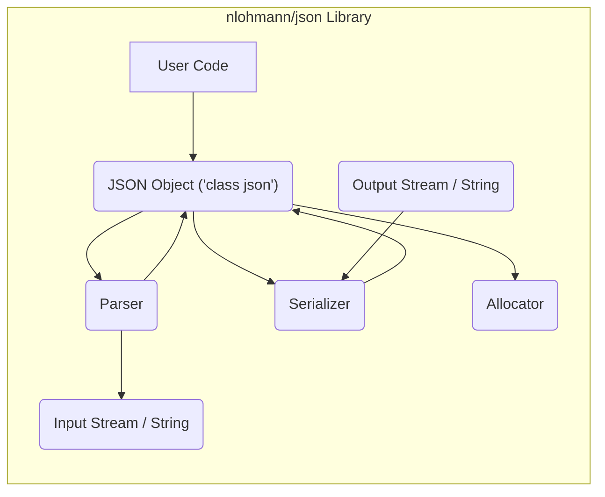
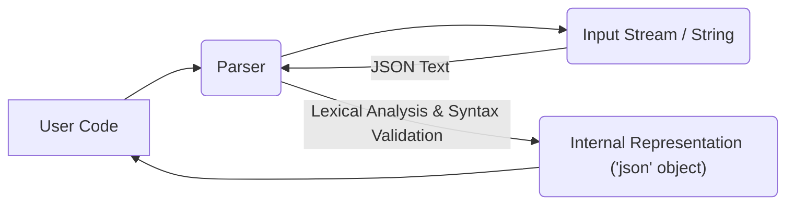
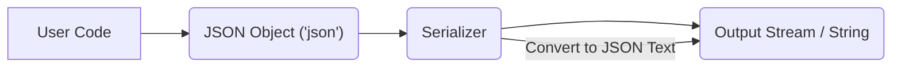

# Project Design Document: nlohmann/json Library

**Version:** 1.1
**Date:** October 26, 2023
**Author:** AI Software Architect

## 1. Introduction

This document provides an enhanced and detailed design overview of the nlohmann/json library, a widely adopted header-only C++ library for working with JSON (JavaScript Object Notation). The purpose of this document is to offer a clear and comprehensive understanding of the library's architecture, internal components, and data flow, making it a valuable resource for subsequent threat modeling and security analysis.

## 2. Project Overview

The nlohmann/json library offers an intuitive and efficient way for C++ developers to interact with JSON data. It facilitates parsing JSON strings into in-memory representations (JSON objects), programmatically constructing and manipulating these JSON objects, and serializing them back into JSON strings. The library prioritizes ease of use, high performance, and strict adherence to established JSON standards (primarily RFC 8259).

## 3. Goals and Non-Goals

*   **Goals:**
    *   Provide a user-friendly and expressive C++ interface for comprehensive JSON manipulation.
    *   Offer highly performant parsing and serialization mechanisms for JSON data.
    *   Fully support all standard JSON data types (objects, arrays, strings, numbers, booleans, and null).
    *   Maintain a header-only design for seamless integration into C++ projects without complex build configurations.
    *   Implement robust and informative error handling for various scenarios involving invalid or malformed JSON input.
*   **Non-Goals:**
    *   Implementation of non-standard or proprietary JSON dialects or extensions beyond the core specification.
    *   Providing advanced JSON schema validation capabilities directly within the library (this could be a separate integration).
    *   Offering language bindings or wrappers for programming languages other than C++.
    *   Directly supporting the handling of extremely large JSON documents that exceed available system memory (streaming approaches might be considered separately).

## 4. System Architecture

The nlohmann/json library employs a modular, component-based architecture, primarily implemented within header files. The core functionality is achieved through the interaction of several key components.

### 4.1. High-Level Architecture Diagram

### 4.2. Component Description

*   **JSON Object (`class json`):** This is the central and most visible component, serving as the primary interface for users. It represents a JSON value, which can be an object, array, string, number (integer or floating-point), boolean, or null. Internally, it manages the underlying JSON data structure and provides a rich set of methods for accessing, modifying, querying, and iterating over the data.
*   **Parser:** This component is responsible for the crucial task of taking an input stream or string containing JSON text and converting it into the in-memory `json` object representation. It performs lexical analysis (breaking the input into tokens), syntax validation (ensuring adherence to JSON rules), and constructs the hierarchical JSON data structure.
*   **Serializer:** The Serializer performs the reverse operation of the Parser. It takes a `json` object as input and transforms it back into a JSON string representation. This serialized string can then be written to an output stream, stored in a string variable, or transmitted over a network. The serializer often supports options for formatting (e.g., indentation for readability).
*   **Input Stream / String:** Represents the source from which the JSON data to be parsed originates. This can be a file stream (`std::ifstream`), an in-memory string (`std::string`), or any other input mechanism that provides character data.
*   **Output Stream / String:** Represents the destination where the serialized JSON data is written. This can be a file stream (`std::ofstream`), a string variable (`std::string`), or any other output mechanism capable of receiving character data.
*   **Allocator:** While not explicitly a separate class exposed to the user, the library internally uses allocators (defaulting to `std::allocator`) for managing the memory required to store the JSON data structure. Custom allocators can sometimes be provided for specific memory management needs.
*   **Exception Handling:** The library relies on C++ exceptions to signal errors that occur during parsing, serialization, or other operations. Specific exception types are used to provide context about the nature of the error (e.g., `json::parse_error`, `json::type_error`).

## 5. Detailed Design

### 5.1. JSON Object (`class json`)

*   **Internal Data Structure:** The `json` class likely employs a variant or tagged union internally to efficiently store the different JSON data types. This allows a single `json` object instance to hold a string, a numerical value, an array of other `json` objects, or another nested object. This design choice optimizes memory usage and allows for flexible representation of JSON structures.
*   **Key Methods and Operators:**
    *   `static parse(input)`: A static method responsible for initiating the parsing process from an input source (stream or string).
    *   `dump(options)`: A method to serialize the `json` object into a string, with options to control formatting (indentation, etc.).
    *   `operator` and `operator`: Overloaded operators for accessing elements within JSON objects (by key) and arrays (by index). These may have different behaviors for non-existent keys/indices.
    *   `at(key)` and `at(index)`: Similar to `operator[]`, but provide bounds checking and throw exceptions for invalid access.
    *   `push_back(value)`: For appending elements to JSON arrays.
    *   `insert(key, value)` or `insert(iterator, value)`: For inserting elements into JSON objects or arrays at specific locations.
    *   `erase(key)` or `erase(iterator)`: For removing elements from JSON objects and arrays.
    *   `find(key)`: For searching for keys within JSON objects.
    *   Type checking methods (e.g., `is_object()`, `is_array()`, `is_string()`, `is_number()`, `is_boolean()`, `is_null()`).
    *   Iterators (`begin()`, `end()`, etc.): For traversing the elements of JSON objects and arrays in a range-based for loop or using standard algorithms.

### 5.2. Parser

*   **Input Handling:** The parser typically reads the input stream or string sequentially, character by character, or in buffered chunks for efficiency.
*   **Lexical Analysis (Tokenization):** The parser identifies atomic units of the JSON syntax, known as tokens. These include:
    *   Structural tokens: `{` (object start), `}` (object end), `[` (array start), `]` (array end), `,` (separator), `:` (name separator).
    *   Value tokens: String literals (enclosed in double quotes), number literals (integers and floating-point), boolean literals (`true`, `false`), and the null literal (`null`).
*   **Syntax Validation:**  The parser enforces the grammatical rules of the JSON specification. This involves verifying:
    *   Balanced and correctly nested brackets and braces.
    *   Proper placement of commas and colons.
    *   Valid data types for values.
    *   Correct encoding of strings (typically UTF-8).
*   **Error Reporting and Handling:** When invalid JSON syntax is encountered, the parser throws an exception (e.g., `json::parse_error`). These exceptions typically provide information about the location (line and column) and the nature of the syntax error.
*   **Internal State Management:** The parser maintains internal state to keep track of its current position in the input, the expected next tokens, and the nesting level of objects and arrays.

### 5.3. Serializer

*   **Input Processing:** The serializer receives a `json` object as its input.
*   **Traversal of the JSON Structure:** The serializer recursively traverses the internal data structure of the `json` object, visiting each element (key-value pair in objects, elements in arrays).
*   **Conversion to JSON Text:** For each element, the serializer converts the corresponding internal data type into its JSON string representation:
    *   Strings are enclosed in double quotes, with appropriate escaping of special characters.
    *   Numbers are converted to their textual representation.
    *   Booleans are converted to `"true"` or `"false"`.
    *   `null` values are converted to `"null"`.
    *   Nested objects and arrays are recursively serialized.
*   **Formatting Options:** The serializer often provides options to control the formatting of the output JSON string, such as:
    *   Indentation: Adding whitespace to improve readability.
    *   Pretty printing:  More elaborate formatting with line breaks and indentation.
    *   Compact output:  Generating the most concise JSON string without extra whitespace.
*   **Output Generation:** The serialized JSON string is then written to the specified output stream or returned as a string value.

## 6. Data Flow

The data flow within the nlohmann/json library follows two primary paths: parsing JSON data from an external source and serializing an in-memory JSON object back into a string representation.

### 6.1. Parsing Data Flow

1. The user code initiates the parsing process by calling a parsing function (e.g., `json::parse()`) and providing the input stream or string containing the JSON data.
2. The Parser component receives the input source.
3. The Parser reads the JSON text from the input source.
4. The Parser performs lexical analysis to break the text into tokens and then validates the syntax according to JSON rules.
5. If the JSON is valid, the Parser constructs the internal representation of the JSON data as a `json` object in memory.
6. The newly created `json` object is then returned to the user code.

### 6.2. Serialization Data Flow

1. The user code has an existing `json` object in memory that needs to be converted into a JSON string.
2. The user code calls a serialization method (e.g., `json::dump()`) on the `json` object, potentially providing an output stream or requesting the result as a string.
3. The Serializer component receives the `json` object.
4. The Serializer traverses the internal structure of the `json` object.
5. The Serializer converts the data held within the `json` object into a JSON text representation.
6. The serialized JSON text is then written to the specified output stream or returned as a string to the user code.

## 7. Security Considerations (For Threat Modeling)

This section outlines potential security considerations and threat vectors relevant to the nlohmann/json library, intended to inform the threat modeling process.

*   **Input Validation Vulnerabilities:**
    *   **Malformed JSON Exploitation:**  The parser must be resilient against maliciously crafted, syntactically invalid JSON input. Failure to properly handle such input could lead to:
        *   **Denial of Service (DoS):**  Causing excessive CPU or memory consumption, potentially crashing the application.
        *   **Unexpected Behavior:** Leading to incorrect program state or logic errors.
    *   **Deeply Nested Structures (Stack Overflow):**  Parsing extremely deeply nested JSON objects or arrays can potentially exhaust the call stack, leading to stack overflow errors and application crashes.
    *   **Integer Overflow/Underflow:** Handling very large numerical values or sizes within the JSON structure during parsing could lead to integer overflow or underflow vulnerabilities, potentially causing memory corruption or unexpected behavior.
    *   **Format String Vulnerabilities (Less Likely):** While less common in modern C++ with proper string handling, vulnerabilities could arise if user-controlled parts of the JSON data are directly used in format strings without proper sanitization.
*   **Resource Exhaustion:**
    *   **Large JSON Payloads (Memory Exhaustion):** Processing exceptionally large JSON documents can consume excessive amounts of memory, potentially leading to memory exhaustion and application crashes or instability.
    *   **Algorithmic Complexity Exploitation:**  Crafted JSON payloads could exploit inefficiencies in the parsing algorithm, leading to significantly increased processing time and resource consumption (algorithmic complexity attacks).
*   **Type Confusion and Data Integrity:**
    *   **Incorrect Type Handling:** Errors in handling different JSON data types during parsing or access could lead to type confusion vulnerabilities, potentially allowing attackers to manipulate data in unexpected ways.
*   **Error Handling and Information Disclosure:**
    *   **Verbose Error Messages:**  Detailed error messages generated during parsing or other operations could inadvertently reveal sensitive information about the system's internal state or data structure to an attacker.
    *   **Uncaught Exceptions:** Failure to properly handle exceptions could lead to program termination in an uncontrolled state, potentially leaving the system vulnerable.
*   **Dependency Chain Security:**
    *   While nlohmann/json is primarily header-only, the security of the compiler and standard library it relies upon is also a consideration. Vulnerabilities in these underlying components could indirectly impact the library's security.

## 8. Assumptions and Dependencies

*   **Standard C++ Compliance:** The library assumes a C++11 (or later) compliant compiler and standard library implementation.
*   **Memory Management Responsibility:** The library relies on the user code and the underlying system for proper memory management. It does not implement its own garbage collection.
*   **JSON Specification Adherence:** The library is designed to strictly adhere to the official JSON specification (primarily RFC 8259).
*   **UTF-8 Encoding:** The library primarily assumes UTF-8 encoding for JSON strings.

## 9. Future Considerations

*   **Schema Validation Support:**  Integrating or providing interfaces for external JSON schema validation libraries could enhance data integrity and security by allowing users to enforce data structure and type constraints.
*   **Asynchronous Parsing and Serialization:**  Exploring asynchronous or non-blocking parsing and serialization mechanisms could improve performance and responsiveness, especially when dealing with large JSON documents.
*   **Security Audits and Penetration Testing:**  Regular security audits and penetration testing are crucial for proactively identifying and addressing potential vulnerabilities in the library.
*   **Fuzzing:** Utilizing fuzzing techniques to automatically generate and test the parser with a wide range of potentially malformed inputs can help uncover unexpected behavior and vulnerabilities.

This enhanced design document provides a more in-depth understanding of the nlohmann/json library's architecture, components, and data flow. It serves as a more robust foundation for conducting thorough threat modeling and security assessments.
