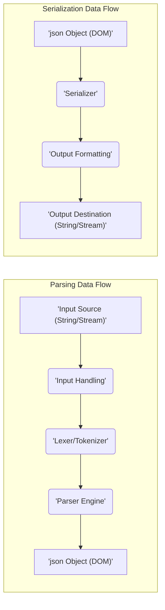
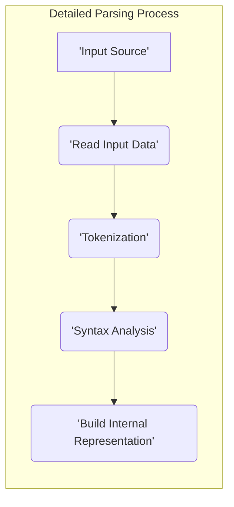
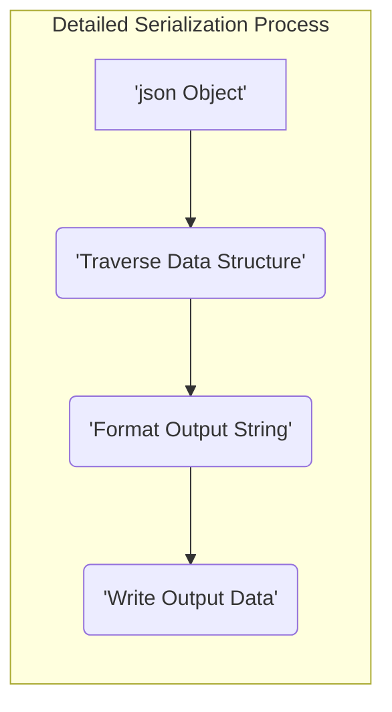

## Project Design Document: nlohmann/json Library - Improved

**1. Introduction**

This document provides an enhanced and detailed design overview of the `nlohmann/json` library, a widely used header-only C++ library for processing JSON (JavaScript Object Notation). The purpose of this document is to offer a comprehensive understanding of the library's internal structure, key components, and data flow mechanisms. This detailed information will serve as a robust foundation for subsequent threat modeling activities, enabling a thorough analysis of potential security vulnerabilities.

**2. Project Overview**

The `nlohmann/json` library is designed to provide C++ developers with an intuitive and efficient way to integrate JSON functionalities into their applications. Its key strengths lie in its ease of use, a well-defined and modern C++ API, and its header-only nature, which simplifies project integration by eliminating the need for separate compilation and linking steps. The library supports a wide range of JSON operations, including parsing, serialization, and in-memory manipulation of JSON data.

**3. Goals and Non-Goals**

* **Goals:**
    * Offer a straightforward and expressive C++ interface for interacting with JSON data.
    * Achieve high performance in both parsing and serialization processes.
    * Fully support the JSON specification, encompassing all valid JSON data types and structures.
    * Ensure seamless integration into C++ projects through its header-only implementation.
    * Provide comprehensive and informative error reporting during JSON processing.
    * Allow for a degree of customization and extension to accommodate specific use cases.

* **Non-Goals:**
    * Implement networking capabilities for retrieving JSON data from remote sources.
    * Provide advanced JSON schema validation beyond basic type checking and structural integrity.
    * Offer fine-grained control over memory allocation (relies on standard C++ allocators).
    * Develop a command-line utility for direct JSON manipulation.
    * Create bindings or wrappers for use with other programming languages.

**4. Architecture and Components**

The core of the `nlohmann/json` library revolves around the `json` class, which acts as a versatile container for representing any valid JSON value. Internally, it employs a variant-like structure to dynamically hold different JSON data types.

* **`json` Class:**
    * The central and most important class, capable of representing any JSON value: objects, arrays, strings, numbers (integers and floating-point), booleans, and the null value.
    * Provides overloaded operators (e.g., `[]` for element access, assignment operators) for convenient manipulation of JSON data. The `.at()` method offers bounds-checked access.
    * Includes methods for parsing JSON data from various input sources, such as `std::string`, `std::istream`, and raw character arrays.
    * Offers methods for serializing the internal JSON representation to different output destinations, including `std::string`, `std::ostream`, and character arrays.
    * Internally manages the storage of JSON data, typically using standard C++ containers like `std::map` for objects and `std::vector` for arrays.

* **Input Adapters (Internal):**
    * Abstract the process of reading raw data and feeding it to the parser.
    * Internally, the library handles different input types through specialized logic within the parsing functions. For example, reading from a `std::istream` involves iterative reading of characters.

* **Output Adapters (Internal):**
    * Handle the process of taking the internal JSON representation and writing it to the desired output.
    * Similar to input adapters, the library internally manages different output types within the serialization functions. Writing to a `std::ostream` involves streaming the formatted JSON string.

* **Parser:**
    * The component responsible for analyzing the input JSON text.
    * Performs lexical analysis (tokenization) to break the input stream into meaningful units.
    * Implements the grammar rules of JSON to interpret the sequence of tokens and build the internal `json` representation.
    * Includes error detection and reporting mechanisms to handle invalid JSON syntax. This often involves throwing specific exception types.

* **Serializer:**
    * Takes the internal `json` object and converts it back into a JSON string representation.
    * Handles formatting options such as indentation for pretty printing and compact output without whitespace.
    * Ensures that the output conforms to the JSON specification.

* **Exception Handling:**
    * Defines a hierarchy of custom exception classes to signal errors during various stages of JSON processing (parsing, serialization, access).
    * Provides informative error messages to aid in debugging. Examples include `json::parse_error`, `json::type_error`, and `json::out_of_range`.

* **Iterators:**
    * Provides standard C++ iterators for traversing the elements within JSON objects and arrays.
    * Enables the use of range-based for loops and other standard C++ iteration patterns for accessing and manipulating JSON data.

* **Callbacks (for SAX-like parsing - Limited):**
    * While not a primary focus, the library offers some limited support for a more event-driven parsing approach, similar to SAX for XML. This involves providing callback functions that are invoked as the parser encounters different elements in the JSON input.

**5. Data Flow**

The following diagrams illustrate the typical flow of data during the parsing and serialization processes within the `nlohmann/json` library.

**Detailed Data Flow - Parsing:**

* **'Input Source':** The raw JSON data, which can be a `std::string`, a `std::istream`, or a character array.
* **'Read Input Data':** The library reads the input data from the specified source. This might involve reading characters from a stream or accessing characters from a string.
* **'Tokenization':** The input stream is broken down into a sequence of tokens, which are the basic building blocks of the JSON syntax (e.g., `{`, `}`, `[`, `]`, `:`, `,`, string literals, number literals, boolean literals, `null`).
* **'Syntax Analysis':** The parser analyzes the sequence of tokens according to the JSON grammar rules. It verifies that the tokens appear in a valid order and structure.
* **'Build Internal Representation':** Based on the parsed tokens, the library constructs the internal `json` object, which represents the JSON data in a tree-like structure (Document Object Model - DOM).

**Detailed Data Flow - Serialization:**

* **'json Object':** The internal representation of the JSON data that needs to be serialized.
* **'Traverse Data Structure':** The serializer traverses the internal `json` object, visiting its elements (key-value pairs in objects, elements in arrays, and primitive values).
* **'Format Output String':** The serializer converts the internal data into a JSON string representation. This includes adding necessary delimiters (e.g., `{`, `}`, `[`, `]`, `,`, `:`) and applying formatting rules (e.g., indentation, escaping special characters).
* **'Write Output Data':** The formatted JSON string is written to the specified output destination, such as a `std::string` or a `std::ostream`.

**6. Security Considerations (Pre-Threat Modeling)**

This section outlines potential security considerations inherent in the design and functionality of the `nlohmann/json` library. These points will be further investigated and elaborated upon during a dedicated threat modeling exercise.

* **Input Validation Vulnerabilities:**
    * **Large or deeply nested JSON structures:** Parsing excessively large or deeply nested JSON data can lead to stack overflow errors due to recursion depth limits or excessive memory allocation, resulting in a Denial of Service (DoS).
    * **Maliciously crafted JSON:** Input containing invalid characters, incorrect syntax, or unexpected data types could trigger parsing errors or lead to undefined behavior if not handled robustly.
    * **Integer overflows during parsing:** When parsing very large numerical values, there's a risk of integer overflow if the library doesn't perform adequate bounds checking.
    * **Format string vulnerabilities (unlikely but worth noting):** While the library primarily handles JSON structures, if any part of the code uses external input in a format string context (e.g., for logging or error messages), it could introduce a format string vulnerability.

* **Resource Exhaustion:**
    * **Memory exhaustion:** Parsing extremely large JSON documents can consume significant amounts of memory, potentially leading to memory exhaustion and program termination.
    * **CPU exhaustion:** Complex or deeply nested JSON structures might require significant processing time during parsing, potentially leading to CPU exhaustion and DoS.

* **Integer Overflow/Underflow:**
    * As mentioned in input validation, parsing very large or very small numbers could lead to integer overflow or underflow if not handled correctly during the conversion from string to numerical types.

* **Exception Handling and Error Propagation:**
    * While the library uses exceptions for error reporting, improper handling of these exceptions in the calling application could lead to unexpected program behavior or security vulnerabilities (e.g., leaking sensitive information in error messages).

* **Dependency Chain Security:**
    * Although header-only, the library relies on the underlying C++ standard library implementation. Vulnerabilities within the standard library could indirectly impact the security of applications using `nlohmann/json`. The compiler used also plays a role in how the code is compiled and executed.

* **Potential for ReDoS (Regular Expression Denial of Service):**
    * While the core JSON parsing logic likely doesn't rely heavily on complex regular expressions, any use of regular expressions within the library (e.g., for input validation or string manipulation) could be susceptible to ReDoS vulnerabilities if not carefully implemented.

**7. Dependencies**

The `nlohmann/json` library is designed to be lightweight and has minimal external dependencies due to its header-only nature. Its primary dependency is the C++ Standard Library.

* **C++ Standard Library:**  Essential for core functionalities such as string manipulation (`<string>`), input/output operations (`<iostream>`, `<sstream>`), containers (`<vector>`, `<map>`, `<variant>`), and algorithms (`<algorithm>`). The specific requirements might vary slightly depending on the C++ standard being used (e.g., C++11, C++17).
* **Compiler:** The C++ compiler used to compile the application that includes the `nlohmann/json` headers is a crucial dependency. The compiler's implementation and adherence to standards can affect the library's behavior and performance.

**8. Deployment Considerations**

Deploying applications that utilize the `nlohmann/json` library is straightforward due to its header-only nature:

* **Include Headers:**  The primary step is to include the `json.hpp` header file in the C++ source files where JSON processing is required.
* **Compilation:** The C++ compiler will directly process the header files during the compilation of the application's source code. No separate compilation or linking of the `nlohmann/json` library is necessary.
* **Distribution:**  The `json.hpp` header file needs to be distributed along with the application's source code or as part of the project's include directories.

**9. Future Considerations**

Potential future enhancements and considerations for the `nlohmann/json` library could include:

* **Performance Optimizations:** Continued efforts to optimize parsing and serialization performance, especially for very large JSON documents.
* **Enhanced Schema Validation:**  Adding more comprehensive JSON schema validation capabilities to ensure data integrity and structure.
* **Custom Memory Allocation:** Providing options for users to supply custom memory allocators for more control over memory management.
* **Formal Security Audits:** Conducting regular and thorough security audits by external experts to proactively identify and address potential vulnerabilities.
* **Support for More Advanced JSON Features:**  Exploring support for features beyond the basic JSON specification, if deemed beneficial.

This improved design document provides a more detailed and comprehensive understanding of the `nlohmann/json` library's architecture, components, and data flow. This enhanced information will be invaluable for conducting a thorough and effective threat model, enabling the identification and mitigation of potential security risks associated with the library's use.