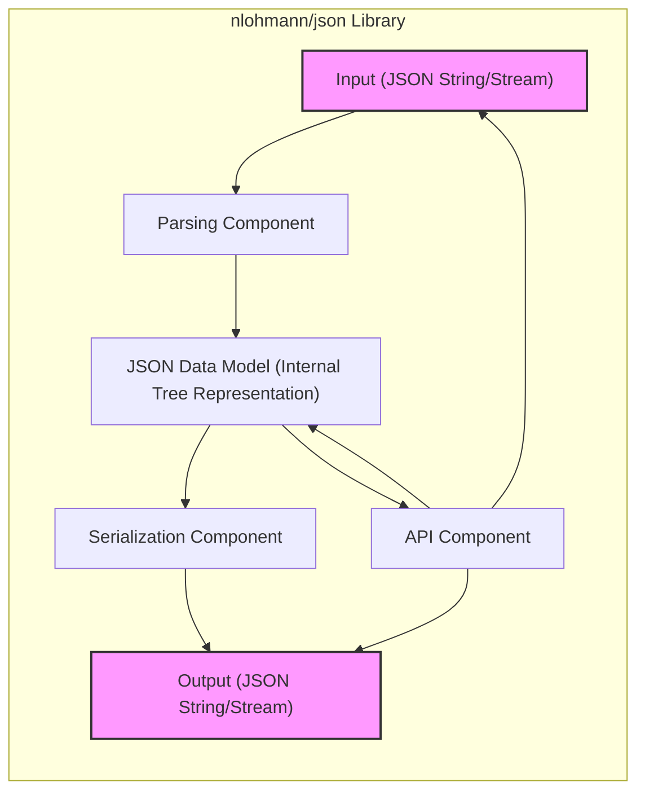
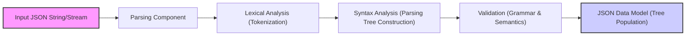
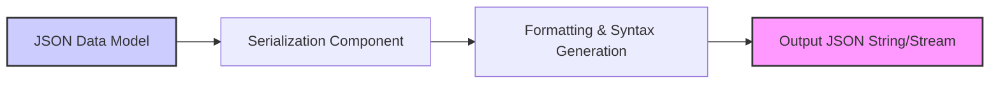

# Project Design Document: nlohmann/json Library

**Version:** 1.1
**Date:** 2023-10-27
**Author:** AI Expert (Based on request)

## 1. Introduction

This document provides a detailed design overview of the `nlohmann/json` library (referred to as "the library" or "json.hpp" in this document), a popular header-only C++ library for parsing, generating, and manipulating JSON data. This document is intended to serve as a foundation for threat modeling activities, providing a clear understanding of the library's architecture, components, and data flow. It outlines the key elements of the library from a software architecture and security perspective.

**Project Link:** [https://github.com/nlohmann/json](https://github.com/nlohmann/json)

**Purpose of this Document:**

*   To describe the architecture and design of the `nlohmann/json` library.
*   To identify key components and their interactions.
*   To illustrate data flow within the library for parsing and serialization.
*   To highlight areas relevant for security considerations and threat modeling, focusing on potential vulnerabilities.
*   To serve as a reference for security audits, vulnerability assessments, and secure development practices.

**Target Audience:**

*   Security engineers and threat modelers performing security analysis.
*   Developers using or contributing to the `nlohmann/json` library who need to understand its internal workings for secure integration.
*   Anyone interested in understanding the design and security aspects of a modern C++ JSON library.

## 2. Project Goals and Scope

The primary goal of the `nlohmann/json` library is to provide a user-friendly, efficient, and header-only C++ library for working with JSON data, adhering to the JSON standard (RFC 8259). Key features and goals include:

*   **Ease of Use:**  Provide an intuitive and expressive C++ API, mimicking standard C++ idioms and data structures.
*   **Performance:** Offer competitive performance for parsing and serialization, suitable for performance-sensitive applications while maintaining usability.
*   **Header-Only:** Simplify library integration by avoiding complex build processes and external dependencies.
*   **Modern C++:**  Utilize modern C++ features (e.g., move semantics, templates, exceptions) for code safety, efficiency, and maintainability.
*   **Standard Compliance:**  Strictly adhere to the JSON specification to ensure correct parsing and generation of JSON data.
*   **Flexibility and Extensibility:**  Provide options for customization and extension to accommodate diverse use cases.

**Scope of this Document:**

This document focuses on the core architectural design of the library, with a strong emphasis on aspects relevant to security. It covers:

*   High-level architecture and detailed component breakdown.
*   Data flow through the library during both parsing and serialization processes.
*   Key data structures and algorithms employed within critical components.
*   In-depth analysis of areas presenting potential security concerns and vulnerabilities.

This document does not delve into:

*   Line-by-line code implementation details.
*   Comprehensive performance benchmarks and optimization strategies.
*   Detailed API usage examples (refer to the library's official documentation and examples).
*   Specific threat modeling exercises or vulnerability exploitation techniques (this document is a *precursor* to these activities).

## 3. Architecture Overview

The `nlohmann/json` library is designed with a modular component-based architecture. The core is the JSON Data Model, around which parsing, serialization, and API interaction components are built. This design promotes separation of concerns and maintainability.

### 3.1. High-Level Component Diagram

**Component Descriptions:**

*   **"Input (JSON String/Stream)"**:  The initial entry point for JSON data. This component handles various input formats, including C++ strings, input streams (e.g., `std::istream`), and potentially custom input sources.
*   **"Parsing Component"**:  The core of the input processing. This component is responsible for:
    *   Lexical analysis of the input stream.
    *   Syntactic analysis to build a parse tree.
    *   Validation against JSON grammar rules and data type constraints.
    *   Conversion of parsed JSON into the internal "JSON Data Model".
*   **"JSON Data Model (Internal Tree Representation)"**:  This is the central data structure of the library. It represents JSON data internally, typically as a tree-like structure. Each node in the tree represents a JSON value (object, array, string, number, boolean, null). It likely uses a variant type internally to store different JSON value types efficiently.
*   **"Serialization Component"**:  The inverse of the parsing component. It takes the "JSON Data Model" as input and converts it back into a JSON string or stream representation. This includes formatting options like pretty printing and compact output.
*   **"Output (JSON String/Stream)"**: The final output of the library, representing the serialized JSON data in string or stream format. This can be used for writing to files, network sockets, or other output destinations.
*   **"API Component"**:  The public interface exposed to users. It provides functions and methods for:
    *   Parsing JSON from various sources.
    *   Serializing the "JSON Data Model" to different outputs.
    *   Accessing and manipulating data within the "JSON Data Model" (e.g., using path-based access, iterators, object/array manipulation methods).
    *   Querying and searching within the JSON data.

## 4. Component Details

This section provides a more detailed breakdown of each component, focusing on functionality and security considerations.

### 4.1. Parsing Component

**Functionality:**

*   **Input Handling:** Accepts JSON data from strings, input streams, and potentially custom input sources.
*   **Lexical Analysis (Tokenization):** Scans the input stream and breaks it down into a stream of tokens. Tokens represent basic JSON elements like braces, brackets, colons, commas, strings, numbers, booleans, and null.
*   **Syntax Analysis (Parsing):**  Organizes the tokens according to JSON grammar rules. This stage typically builds an Abstract Syntax Tree (AST) or a similar intermediate representation, implicitly or explicitly, to represent the JSON structure.
*   **Validation:**  Enforces JSON specification rules, including:
    *   Correct syntax and grammar.
    *   Valid data types for values.
    *   Uniqueness of keys within JSON objects (depending on strictness settings).
    *   Handling of escape sequences in strings.
*   **Error Handling:** Detects and reports parsing errors. Robust error handling is crucial for security and usability. Error messages should be informative for debugging but avoid leaking sensitive path or internal information.
*   **Data Conversion & Model Population:** Converts parsed JSON values into the library's internal "JSON Data Model" representation, building the tree structure.

**Security Considerations:**

*   **Input Validation is Paramount:** The parsing component is the primary attack surface. Strict and comprehensive input validation is essential to prevent vulnerabilities.
    *   **Malformed JSON Injection:**  Prevent parsing of invalid JSON that could lead to unexpected behavior or exploits.
    *   **Bypass of Validation:** Ensure validation logic cannot be bypassed by crafted inputs.
*   **Denial of Service (DoS):**  The parser must be resilient to maliciously crafted JSON designed to consume excessive resources and cause DoS.
    *   **Deeply Nested Structures:**  Limit recursion depth to prevent stack overflow or excessive processing time with deeply nested objects or arrays. Example: `[[[[[[[[...]]]]]]]]`.
    *   **Extremely Long Strings:**  Limit the maximum length of strings to prevent excessive memory allocation and processing. Example: `"key": "AAAAAAAAAAAAAAAAAAAAAAAAAAAAAAAAAAAAAAAAAAAAAAAA..."`.
    *   **Large Number of Keys/Array Elements:**  Limit the number of keys in objects or elements in arrays to prevent hash collisions (if hash maps are used internally) or excessive memory usage. Example: `{"key1": "val1", "key2": "val2", ..., "keyN": "valN"}` where N is very large.
*   **Memory Safety:** Parsing involves dynamic memory allocation and string manipulation.
    *   **Buffer Overflows:**  Prevent buffer overflows when handling strings, especially during escape sequence processing.
    *   **Memory Leaks:** Ensure proper memory management to avoid leaks, especially when handling errors or complex JSON structures.
    *   **Use-After-Free/Double-Free:**  Avoid memory corruption issues related to incorrect pointer management.
*   **Integer Overflows:**  When parsing numerical values, especially large integers, handle potential integer overflows gracefully and securely. Use appropriate data types and validation to prevent unexpected behavior.

### 4.2. Serialization Component

**Functionality:**

*   **Input Processing:** Takes the internal "JSON Data Model" as input.
*   **Formatting & Output Generation:** Converts the "JSON Data Model" into a JSON string or stream. This includes:
    *   Generating correct JSON syntax (braces, brackets, quotes, commas, colons).
    *   Handling data type conversions back to JSON representations (e.g., C++ strings to JSON strings, numbers to JSON numbers).
    *   Applying formatting options like indentation and whitespace for pretty printing or minimizing whitespace for compact output.
    *   Escaping special characters in strings for valid JSON output.
*   **Output Destination Handling:**  Writes the serialized JSON to strings, output streams, or potentially custom output destinations.

**Security Considerations:**

*   **Output Encoding:** Ensure correct character encoding (typically UTF-8 for JSON) when serializing to prevent character encoding issues and potential misinterpretations by consuming systems.
*   **Data Integrity:** Serialization must accurately represent the "JSON Data Model" without data loss or corruption. Verify that the serialized output correctly reflects the internal data.
*   **DoS (Less Likely):** While less prone to DoS than parsing, extremely large or deeply nested JSON structures *could* theoretically lead to resource exhaustion during serialization, although this is less common.  Focus should primarily be on parsing DoS vulnerabilities.
*   **Injection (Less Direct):**  While serialization itself is less vulnerable to direct injection, improper handling of data *before* serialization could lead to injection vulnerabilities in systems that consume the serialized JSON.  For example, if data is not properly sanitized before being inserted into the JSON data model and then serialized, it could lead to issues in downstream systems interpreting the JSON.

### 4.3. JSON Data Model Component (Internal Tree Representation)

**Functionality:**

*   **Data Storage:**  Defines the internal data structures to represent JSON values. This is typically a tree-like structure where:
    *   JSON objects are represented as nodes with key-value pairs.
    *   JSON arrays are represented as ordered lists of values.
    *   JSON primitive values (strings, numbers, booleans, null) are represented as leaf nodes.
    *   Likely uses a variant type (e.g., `std::variant` or similar) to efficiently store different JSON value types within the same data structure.
*   **Data Access and Manipulation:** Provides methods for:
    *   Accessing elements within objects and arrays (by key, index, path).
    *   Iterating over objects and arrays.
    *   Modifying the JSON structure (adding, removing, updating elements).
    *   Querying and searching for specific data within the model.
*   **Type Safety & Type Checking:** Maintains type information for each JSON value and provides mechanisms for type checking and safe type conversions.

**Security Considerations:**

*   **Memory Management is Critical:**  Efficient and safe memory management is paramount for the data model.
    *   **Memory Leaks:**  Ensure no memory leaks occur during data model operations, especially during modifications and error handling.
    *   **Dangling Pointers/References:** Avoid dangling pointers or references that could lead to use-after-free vulnerabilities.
    *   **Double-Free:** Prevent double-free errors that can corrupt memory.
*   **Data Integrity:** The data model must maintain the integrity of the JSON data throughout its lifecycle. Operations should not corrupt or unintentionally modify data.
*   **Complexity & Algorithmic Vulnerabilities:**  The complexity of data model operations (e.g., deep copying, searching, path-based access) could introduce algorithmic vulnerabilities if not implemented efficiently.  Avoid algorithms with worst-case time complexity that could be exploited for DoS.
*   **Logic Errors:** Bugs in the data model's implementation (e.g., in copy constructors, assignment operators, or data manipulation methods) could lead to unexpected behavior, data corruption, or security vulnerabilities. Thorough testing and code reviews are essential.

### 4.4. API Component

**Functionality:**

*   **Public Interface:**  Provides the user-facing API for interacting with the library.
*   **Parsing API:** Functions to initiate JSON parsing from various input sources (strings, streams, files).
*   **Serialization API:** Functions to serialize the "JSON Data Model" to different output formats (strings, streams, files).
*   **Data Access API:** Methods for accessing and querying elements within the "JSON Data Model" using intuitive syntax (e.g., array indexing, object key access, JSON Pointer/Path).
*   **Data Modification API:** Methods for modifying the "JSON Data Model" (adding, removing, updating values, objects, arrays).
*   **Type Conversion & Value Extraction API:** Functions for safely converting JSON values to C++ types and extracting data from the model.
*   **Error Handling & Reporting API:** Mechanisms for users to handle parsing and other errors gracefully.

**Security Considerations:**

*   **API Design for Secure Usage:** The API should be designed to encourage secure coding practices and minimize the risk of misuse.
    *   **Clear Documentation & Examples:** Provide comprehensive documentation and clear examples demonstrating secure API usage.
    *   **Principle of Least Privilege:** Design the API to expose only necessary functionality and avoid overly permissive operations that could be misused.
*   **Error Handling & Reporting (Securely):** API functions should handle errors gracefully and provide informative error messages to users *without* leaking sensitive internal information or path details that could aid attackers.
*   **Input Validation at API Boundary (Context-Specific):** While the parsing component handles core JSON validation, the API might need to perform *additional* input validation depending on the specific API functions and parameters. For example, validating user-provided keys or indices before accessing the "JSON Data Model".
*   **Preventing API Misuse & Logic Errors:** The API should be designed to prevent common programming errors that could lead to security vulnerabilities in applications using the library.
    *   **Bounds Checking:** Implement bounds checking for array and string access to prevent out-of-bounds reads/writes.
    *   **Type Safety:** Enforce type safety to prevent type confusion vulnerabilities.
    *   **Resource Management:**  Ensure proper resource management within API functions to prevent leaks or resource exhaustion.

## 5. Data Flow

The following diagrams illustrate the typical data flow within the `nlohmann/json` library during parsing and serialization operations, highlighting the interaction between components.

### 5.1. Data Flow Diagram (Parsing)

**Data Flow (Parsing):**

1.  **"Input JSON String/Stream"**: JSON data enters the parsing pipeline.
2.  **"Parsing Component"**:  The main parsing component orchestrates the parsing process.
3.  **"Lexical Analysis (Tokenization)"**: The input stream is scanned and broken into tokens representing JSON elements.
4.  **"Syntax Analysis (Parsing Tree Construction)"**: Tokens are parsed and organized into a parse tree (or similar structure) representing the JSON syntax.
5.  **"Validation (Grammar & Semantics)"**: The parse tree and input are validated against JSON grammar rules and semantic constraints (e.g., data types, key uniqueness).
6.  **"JSON Data Model (Tree Population)"**: A valid JSON input is transformed into the internal "JSON Data Model" representation, populating the tree structure based on the parsed and validated data.

### 5.2. Data Flow Diagram (Serialization)

**Data Flow (Serialization):**

1.  **"JSON Data Model"**: The internal "JSON Data Model" is the input to the serialization process.
2.  **"Serialization Component"**: The main serialization component manages the serialization process.
3.  **"Formatting & Syntax Generation"**: The data model is traversed, and JSON syntax is generated, including formatting (whitespace, indentation) and handling data type conversions to JSON representations.
4.  **"Output JSON String/Stream"**: The serialized JSON data is output as a string or stream.

## 6. Security Considerations Summary

Based on the architecture and component details, the following areas are of primary concern for security and should be the focus of threat modeling for the `nlohmann/json` library:

*   **Parsing Component Input Validation Vulnerabilities:** This remains the most critical attack surface. Robust input validation is paramount to prevent a wide range of vulnerabilities.
*   **Memory Safety Issues in Parsing and Data Model:** As a C++ library, memory safety is a key concern. Careful memory management in the parsing component and the "JSON Data Model" is essential to prevent memory corruption vulnerabilities.
*   **Denial of Service (DoS) via Malicious JSON Payloads:** The library must be designed to handle potentially malicious JSON inputs without excessive resource consumption, preventing DoS attacks.
*   **API Misuse Leading to Vulnerabilities:** While less direct, improper or insecure usage of the API in applications could introduce vulnerabilities. Clear API design, documentation, and secure coding guidelines are important.
*   **Integer Overflows and Numerical Handling:**  Careful handling of numerical values during parsing is required to prevent integer overflows and related vulnerabilities.

## 7. Threat Modeling Focus Areas

For effective threat modeling of the `nlohmann/json` library, prioritize the following areas and potential threats:

*   **Input Validation Vulnerabilities in the Parsing Component:**
    *   **Malformed JSON Injection:** Exploiting parser weaknesses to inject invalid JSON that triggers errors or unexpected behavior.
    *   **Validation Bypass:** Crafting JSON inputs that bypass validation checks and are processed in unintended ways.
    *   **Parser Logic Flaws:** Exploiting vulnerabilities in the parser's logic to cause crashes, incorrect parsing, or other security issues.
*   **Memory Safety Vulnerabilities:**
    *   **Buffer Overflows in Parsing & String Handling:** Exploiting buffer overflows during string processing, escape sequence handling, or tokenization.
    *   **Memory Leaks in Data Model or Parsing:** Causing memory leaks through crafted JSON inputs or error conditions, leading to resource exhaustion.
    *   **Use-After-Free or Double-Free Vulnerabilities:** Triggering memory corruption vulnerabilities through specific JSON structures or parsing sequences.
*   **Denial of Service (DoS) Attacks:**
    *   **Resource Exhaustion via Deeply Nested JSON:** Sending JSON with excessive nesting to consume stack space or processing time.
    *   **Resource Exhaustion via Extremely Large JSON Strings/Numbers:**  Sending JSON with very long strings or numbers to exhaust memory or processing resources.
    *   **Algorithmic Complexity Attacks in Parsing:** Exploiting inefficient parsing algorithms with crafted JSON inputs to cause excessive processing time (e.g., hash collision attacks if hash maps are used for object keys).
*   **API Security & Misuse:**
    *   **API Misuse Leading to Application Vulnerabilities:** Identifying API usage patterns that could lead to vulnerabilities in applications using the library (e.g., improper error handling, lack of input sanitization before serialization).
    *   **Information Leakage through Error Messages:**  While less likely, consider if error messages could inadvertently leak sensitive information.

## 8. Conclusion

This enhanced design document provides a more detailed and security-focused overview of the `nlohmann/json` library's architecture, components, and data flow. By understanding these aspects and focusing on the identified security considerations and threat modeling areas, security professionals and developers can conduct more effective security assessments and implement secure coding practices when using this widely adopted library. This document serves as a robust foundation for further threat modeling exercises, security audits, and secure development efforts related to applications that rely on `nlohmann/json`.