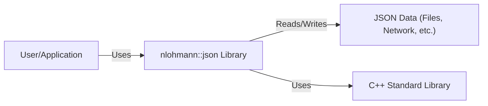
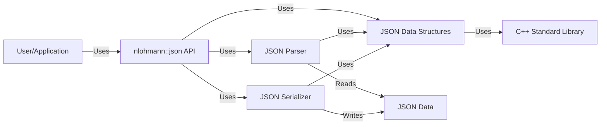
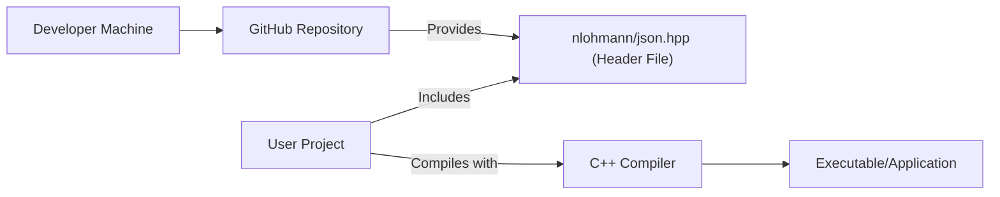
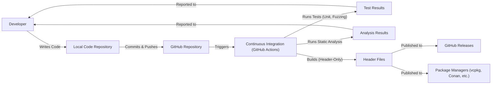

# BUSINESS POSTURE

Business Priorities and Goals:

*   Provide a modern, user-friendly, and efficient JSON library for C++.
*   Ensure high performance and minimal overhead for JSON parsing and serialization.
*   Maintain broad compatibility across different C++ compilers and platforms.
*   Offer a permissive open-source license (MIT) to encourage widespread adoption and community contributions.
*   Minimize external dependencies to simplify integration and reduce potential conflicts.
*   Provide comprehensive documentation and examples to facilitate ease of use.

Business Risks:

*   Vulnerabilities in the library could expose applications using it to various attacks, including denial-of-service, remote code execution, and data breaches.
*   Performance bottlenecks in the library could negatively impact the performance of applications using it.
*   Compatibility issues could limit the library's adoption and usefulness.
*   Lack of community engagement could hinder the library's long-term maintenance and development.
*   Bugs or design flaws could lead to data corruption or incorrect processing of JSON data.

# SECURITY POSTURE

Existing Security Controls:

*   security control: The library is released under the permissive MIT license, allowing for extensive scrutiny and modification by the community.
*   security control: The library has a fuzzing infrastructure using OSS-Fuzz, which continuously tests the library for vulnerabilities and crashes. (Described in the repository's README and fuzzing directory).
*   security control: The library has extensive unit tests to ensure correctness and prevent regressions. (Described in the repository's README and test directory).
*   security control: The library's code is regularly analyzed using static analysis tools like clang-tidy and Coverity Scan. (Mentioned in the documentation and CI workflows).
*   security control: The library minimizes external dependencies, reducing the attack surface.
*   security control: The library uses standard C++ features and avoids platform-specific or non-portable code where possible, enhancing security and maintainability.

Accepted Risks:

*   accepted risk: While fuzzing and static analysis are used, there's always a residual risk of undiscovered vulnerabilities, especially in complex parsing logic.
*   accepted risk: The library relies on the correctness and security of the underlying C++ standard library implementation.
*   accepted risk: The library's performance optimizations, while beneficial, could potentially introduce subtle bugs or vulnerabilities.

Recommended Security Controls:

*   security control: Integrate a Software Composition Analysis (SCA) tool to identify and track any potential vulnerabilities in dependencies (even though the library aims to minimize them).
*   security control: Implement regular security audits and code reviews, focusing on areas handling untrusted input and complex parsing logic.
*   security control: Establish a clear security policy and vulnerability reporting process to encourage responsible disclosure.
*   security control: Consider adding more specific security-focused tests, such as those targeting common JSON-related vulnerabilities (e.g., injection attacks, excessive resource consumption).

Security Requirements:

*   Authentication: Not directly applicable, as the library itself doesn't handle authentication.
*   Authorization: Not directly applicable, as the library itself doesn't handle authorization.
*   Input Validation:
    *   The library MUST correctly handle all valid JSON inputs as defined by the relevant specifications (RFC 8259, ECMA-404).
    *   The library MUST gracefully handle invalid JSON inputs, avoiding crashes or undefined behavior.
    *   The library SHOULD provide mechanisms to limit resource consumption during parsing (e.g., maximum nesting depth, maximum string length) to prevent denial-of-service attacks.
    *   The library SHOULD provide options to sanitize or escape potentially dangerous characters in JSON strings, if required by the application.
*   Cryptography: Not directly applicable, as the library doesn't perform cryptographic operations. However, if the application using the library deals with sensitive data within JSON, it should use appropriate cryptographic mechanisms independently of the library.

# DESIGN

## C4 CONTEXT

Element Descriptions:

*   User/Application:
    *   Name: User/Application
    *   Type: External Entity (Software System or User)
    *   Description: Represents any C++ application or user that utilizes the nlohmann::json library for JSON processing.
    *   Responsibilities:
        *   Integrates the nlohmann::json library into its codebase.
        *   Calls the library's functions to parse, serialize, and manipulate JSON data.
        *   Handles any errors or exceptions returned by the library.
        *   Provides the JSON data to be processed or receives the processed JSON data.
    *   Security controls:
        *   Input validation of data before passing it to the library.
        *   Proper error handling to prevent unexpected behavior.
        *   Secure handling of any sensitive data processed by the library.

*   nlohmann::json Library:
    *   Name: nlohmann::json Library
    *   Type: Software System (This Project)
    *   Description: The core library providing JSON parsing, serialization, and manipulation capabilities.
    *   Responsibilities:
        *   Parsing JSON data from various sources (strings, files, streams).
        *   Serializing C++ data structures into JSON format.
        *   Providing an API for accessing and modifying JSON data.
        *   Handling different JSON data types (objects, arrays, strings, numbers, booleans, null).
        *   Ensuring compliance with JSON standards.
    *   Security controls:
        *   Fuzzing with OSS-Fuzz.
        *   Static analysis with tools like clang-tidy and Coverity Scan.
        *   Extensive unit testing.
        *   Minimal external dependencies.

*   JSON Data:
    *   Name: JSON Data
    *   Type: Data
    *   Description: Represents the JSON data being processed, which can originate from various sources like files, network streams, or in-memory strings.
    *   Responsibilities:
        *   Provides the raw JSON data to be parsed.
        *   Receives the serialized JSON data.
    *   Security controls:
        *   Data source validation (e.g., checking file integrity, validating network sources).
        *   Content Security Policy (CSP) if applicable (e.g., in web environments).

*   C++ Standard Library:
    *   Name: C++ Standard Library
    *   Type: External Dependency
    *   Description: The standard library of the C++ programming language, providing fundamental functionalities used by the nlohmann::json library.
    *   Responsibilities:
        *   Provides basic data structures (e.g., strings, vectors, maps).
        *   Offers memory management functions.
        *   Provides input/output operations.
        *   Supports other core functionalities required by the library.
    *   Security controls:
        *   Relies on the security and correctness of the specific C++ standard library implementation used.

## C4 CONTAINER

Since this project is a library, the container diagram is essentially an extension of the context diagram.

Element Descriptions:

*   User/Application: (Same as in C4 Context)

*   nlohmann::json API:
    *   Name: nlohmann::json API
    *   Type: API
    *   Description: The public interface of the library, providing functions for users to interact with JSON data.
    *   Responsibilities:
        *   Exposes functions for parsing, serializing, accessing, and modifying JSON data.
        *   Provides a user-friendly and consistent interface.
        *   Handles error reporting and exceptions.
    *   Security controls:
        *   Well-defined API documentation to guide secure usage.

*   JSON Parser:
    *   Name: JSON Parser
    *   Type: Component
    *   Description: The component responsible for parsing JSON data from various sources into internal data structures.
    *   Responsibilities:
        *   Reads JSON data from strings, files, or streams.
        *   Validates the JSON syntax according to the relevant specifications.
        *   Handles different character encodings (e.g., UTF-8).
        *   Constructs the internal JSON data structures.
    *   Security controls:
        *   Fuzzing to identify parsing vulnerabilities.
        *   Input validation to prevent crashes or unexpected behavior.
        *   Resource limits to mitigate denial-of-service attacks.

*   JSON Serializer:
    *   Name: JSON Serializer
    *   Type: Component
    *   Description: The component responsible for converting internal data structures into JSON text.
    *   Responsibilities:
        *   Takes the internal JSON data structures.
        *   Generates JSON text conforming to the relevant specifications.
        *   Provides options for formatting the output (e.g., pretty-printing).
    *   Security controls:
        *   Proper escaping of special characters to prevent injection attacks.

*   JSON Data Structures:
    *   Name: JSON Data Structures
    *   Type: Component
    *   Description: The internal data structures used to represent JSON data within the library.
    *   Responsibilities:
        *   Stores JSON objects, arrays, strings, numbers, booleans, and null values.
        *   Provides efficient access and modification of JSON data.
    *   Security controls:
        *   Robust data structure design to prevent memory corruption or other vulnerabilities.

*   JSON Data: (Same as in C4 Context)

*   C++ Standard Library: (Same as in C4 Context)

## DEPLOYMENT

Possible Deployment Solutions:

1.  Header-Only Library: The library is distributed as a single header file (or a set of header files) that users can directly include in their projects. No separate compilation or linking is required.
2.  Static Library: The library is compiled into a static library (.a or .lib) that users can link with their applications.
3.  Dynamic Library: The library is compiled into a dynamic library (.so, .dll, or .dylib) that is loaded at runtime.
4.  Package Manager: The library is distributed through a package manager (e.g., vcpkg, Conan, apt, yum) that handles installation, dependencies, and updates.

Chosen Solution (Header-Only):

The nlohmann/json library is primarily distributed as a header-only library. This simplifies integration, as users only need to include the header file(s) in their projects.

Element Descriptions:

*   Developer Machine:
    *   Name: Developer Machine
    *   Type: Development Environment
    *   Description: The machine where the library's source code is developed and maintained.
    *   Responsibilities:
        *   Code development and testing.
        *   Version control management (using Git).
        *   Pushing code to the GitHub repository.
    *   Security controls:
        *   Secure development environment.
        *   Code signing (optional).

*   GitHub Repository:
    *   Name: GitHub Repository
    *   Type: Source Code Repository
    *   Description: The public repository hosting the library's source code, documentation, and issue tracker.
    *   Responsibilities:
        *   Storing the library's source code.
        *   Providing access to the code for users.
        *   Managing issues and pull requests.
    *   Security controls:
        *   Access controls (e.g., branch protection rules).
        *   Code review processes.

*   Header File (nlohmann/json.hpp):
    *   Name: nlohmann/json.hpp (Header File)
    *   Type: Source Code File
    *   Description: The main header file containing the library's implementation.
    *   Responsibilities:
        *   Provides the library's functionality to user projects.
    *   Security controls:
        *   Code reviews.
        *   Static analysis.
        *   Fuzzing.

*   User Project:
    *   Name: User Project
    *   Type: User Application
    *   Description: A C++ project that uses the nlohmann/json library.
    *   Responsibilities:
        *   Includes the nlohmann/json.hpp header file.
        *   Uses the library's API to process JSON data.
    *   Security controls:
        *   Secure coding practices.
        *   Input validation.

*   C++ Compiler:
    *   Name: C++ Compiler
    *   Type: Tool
    *   Description: The compiler used to build the user's project, including the nlohmann/json library.
    *   Responsibilities:
        *   Compiles the C++ code, including the library's header file.
        *   Links the code to create the final executable.
    *   Security controls:
        *   Compiler security flags (e.g., stack protection, ASLR).

*   Executable/Application:
    *   Name: Executable/Application
    *   Type: Executable
    *   Description: The final compiled application that uses the nlohmann/json library.
    *   Responsibilities:
        *   Runs the application's logic, including JSON processing.
    *   Security controls:
        *   Operating system security features.
        *   Regular security updates.

## BUILD

Build Process Description:

1.  Developer writes code and commits it to the local repository.
2.  Changes are pushed to the GitHub repository.
3.  GitHub Actions (CI) is triggered by the push.
4.  CI runs unit tests and fuzzing tests (using OSS-Fuzz).
5.  CI runs static analysis tools (clang-tidy, Coverity Scan).
6.  CI builds the header-only library (which essentially involves packaging the header files).
7.  Build artifacts (header files) are published to GitHub Releases.
8.  Build artifacts are also published to various package managers (vcpkg, Conan, etc.).
9.  Test results and analysis results are reported back to the developer.

Security Controls in Build Process:

*   security control: Continuous Integration (GitHub Actions): Automates the build, testing, and analysis process, ensuring consistency and repeatability.
*   security control: Unit Tests: Verify the correctness of individual components and prevent regressions.
*   security control: Fuzzing (OSS-Fuzz): Continuously tests the library with a wide range of inputs to identify vulnerabilities and crashes.
*   security control: Static Analysis (clang-tidy, Coverity Scan): Detects potential code quality issues, bugs, and security vulnerabilities.
*   security control: Dependency Management: The library minimizes external dependencies, reducing the risk of supply chain attacks.  If dependencies are added, SCA tools should be used.
*   security control: Code Review: All changes are reviewed by other developers before being merged.
*   security control: Branch Protection Rules: Enforce policies on the main branch (e.g., requiring pull requests, code reviews, and passing CI checks).

# RISK ASSESSMENT

Critical Business Processes:

*   Reliable JSON parsing and serialization: The library's core function is to correctly and efficiently process JSON data. Failure to do so can disrupt applications relying on it.
*   Maintaining compatibility: The library needs to remain compatible with a wide range of C++ compilers and platforms to ensure its continued usability.
*   Community trust and adoption: The library's reputation and adoption depend on its security, reliability, and ease of use.

Data Sensitivity:

The library itself does not handle specific data. It provides the functionality to process JSON data, but the sensitivity of that data depends entirely on the application using the library.  Therefore, the library should be treated as a component that *could* handle highly sensitive data, and appropriate security measures should be taken.  The *types* of data the library might handle include:

*   Configuration data: May contain sensitive information like API keys, database credentials, or other secrets.
*   User data: Could include personally identifiable information (PII), financial data, or other sensitive user-specific information.
*   Application data: May contain proprietary business logic, intellectual property, or other confidential information.
*   Communication data: JSON is often used for data exchange between systems, potentially including sensitive messages or commands.

# QUESTIONS & ASSUMPTIONS

Questions:

*   Are there any specific performance requirements or limitations for the library?
*   Are there any specific target platforms or compilers that need to be prioritized?
*   Are there any plans to add support for other JSON-related standards (e.g., JSON Schema, JSON Patch)?
*   What is the process for handling bug reports and security vulnerabilities?
*   What level of backward compatibility needs to be maintained?

Assumptions:

*   BUSINESS POSTURE: The primary goal is to provide a high-quality, reliable, and secure JSON library for C++.  The project prioritizes correctness, security, and ease of use over adding every possible feature.
*   SECURITY POSTURE: The development team is committed to following secure coding practices and addressing security vulnerabilities promptly.  The community is encouraged to report any security concerns.
*   DESIGN: The library will remain header-only for the foreseeable future.  The API will be kept as stable as possible, with any breaking changes being carefully considered and documented. The library will continue to minimize external dependencies.