# Project Design Document: node-oracledb

**Version:** 1.1
**Date:** October 26, 2023
**Author:** AI Software Architect

## 1. Introduction

This document provides a detailed design overview of the `node-oracledb` project, a Node.js add-on enabling Node.js applications to connect to Oracle Databases. This document serves as a foundation for subsequent threat modeling activities by outlining the system's architecture, components, and data flow.

## 2. Goals

*   Provide a comprehensive and clear architectural overview of the `node-oracledb` project.
*   Identify key components, their responsibilities, and interactions.
*   Detail the data flow within the system, highlighting potential transformation points.
*   Explicitly outline security-relevant aspects and potential vulnerabilities within each component.
*   Serve as a precise and informative input for threat modeling exercises.

## 3. Architectural Overview

The `node-oracledb` project acts as a crucial intermediary, bridging the gap between asynchronous Node.js environments and synchronous Oracle Database interactions. It achieves this by leveraging Node.js's native addon capabilities to interface with Oracle Client libraries. The core functionalities include:

*   Establishing and managing connections to Oracle Databases, including connection pooling.
*   Executing a wide range of SQL and PL/SQL statements, from simple queries to complex stored procedures.
*   Retrieving data from the database in various formats.
*   Facilitating database transactions with ACID properties.
*   Supporting advanced Oracle features like LOBs, REF CURSORs, and Oracle Wallet.

The architecture is structured into distinct layers, each with specific responsibilities:

*   **Node.js Application Layer:** The user's application code, written in JavaScript, that utilizes the `node-oracledb` API to interact with the database.
*   **`node-oracledb` JavaScript Layer:**  The JavaScript codebase within the `node-oracledb` module. This layer provides the high-level, asynchronous API exposed to Node.js applications and manages the interaction with the native addon.
*   **`node-oracledb` Native Addon Layer (C/C++):**  A performance-critical native Node.js addon implemented in C/C++. This layer serves as the direct interface to the Oracle Client Libraries, handling low-level communication and data marshalling between JavaScript and Oracle's C-based API.
*   **Oracle Client Libraries:**  A suite of libraries provided by Oracle (e.g., OCI - Oracle Call Interface) that enable applications to establish connections, send requests, and receive responses from the Oracle Database. These libraries must be installed on the system running the Node.js application.
*   **Oracle Database Server:** The target Oracle Database instance responsible for storing, processing, and managing data.

## 4. Component Details

### 4.1. Node.js Application Layer

*   **Description:** This represents the custom application logic developed by users that imports and utilizes the `node-oracledb` module to perform database operations.
*   **Responsibilities:**
    *   Initiating database connections using connection strings or connection pools.
    *   Constructing and executing SQL and PL/SQL statements, often incorporating user-provided data.
    *   Processing data retrieved from the database, transforming it for application use.
    *   Handling potential errors returned by `node-oracledb`.
    *   Managing transaction boundaries (commit and rollback).
*   **Security Considerations:**
    *   **SQL Injection Vulnerability:**  If user input is directly incorporated into SQL queries without proper sanitization or parameterized queries, it can lead to SQL injection attacks.
    *   **Credential Exposure:**  Storing database credentials directly in the application code or in insecure configuration files poses a significant risk.
    *   **Information Disclosure:**  Verbose error handling that exposes sensitive database details can be exploited by attackers.
    *   **Dependency Vulnerabilities:**  Vulnerabilities in other npm packages used by the application could be exploited to compromise database interactions.

### 4.2. `node-oracledb` JavaScript Layer

*   **Description:** This layer comprises the JavaScript code within the `node-oracledb` npm package. It provides the primary API for developers to interact with the native addon.
*   **Responsibilities:**
    *   Providing a user-friendly, asynchronous API for common database operations (e.g., `getConnection`, `execute`, `close`).
    *   Validating user-provided parameters before passing them to the native addon.
    *   Marshalling data between JavaScript data types and the formats expected by the native addon.
    *   Managing connection pools, including acquiring and releasing connections.
    *   Handling asynchronous operations and callbacks/promises.
*   **Security Considerations:**
    *   **Insufficient Input Validation:**  If the JavaScript layer does not adequately validate input before passing it to the native addon, vulnerabilities in the native layer could be triggered.
    *   **API Misuse:**  Improper use of the API by developers (e.g., incorrect handling of connection objects) could lead to unexpected behavior or security issues.
    *   **Dependency Vulnerabilities:**  Vulnerabilities in the JavaScript dependencies of `node-oracledb` could potentially be exploited.
    *   **Denial of Service:**  Resource exhaustion vulnerabilities in connection pool management could lead to denial of service.

### 4.3. `node-oracledb` Native Addon Layer (C/C++)

*   **Description:** This is the core of `node-oracledb`, implemented as a Node.js native addon using C/C++. It acts as the crucial bridge to the Oracle Client Libraries.
*   **Responsibilities:**
    *   Directly interacting with the Oracle Client Libraries (OCI).
    *   Handling the low-level details of establishing connections, executing statements, and fetching results.
    *   Marshalling data between JavaScript data structures and the C-based structures used by the Oracle Client Libraries.
    *   Managing connection and statement handles.
    *   Implementing performance-critical operations that benefit from native code execution.
*   **Security Considerations:**
    *   **Memory Corruption Vulnerabilities:**  Bugs in the C/C++ code, such as buffer overflows or use-after-free errors, could lead to crashes or arbitrary code execution.
    *   **Incorrect Data Marshalling:**  Errors in converting data between JavaScript and C/C++ representations could lead to unexpected behavior or security vulnerabilities.
    *   **Oracle Client Library Version Mismatches:**  Incompatibilities or vulnerabilities in the linked Oracle Client Libraries can introduce security risks.
    *   **Credential Handling:**  Securely handling database credentials passed from the JavaScript layer to the Oracle Client Libraries is critical.

### 4.4. Oracle Client Libraries

*   **Description:** A set of libraries provided by Oracle that are essential for any application connecting to an Oracle Database.
*   **Responsibilities:**
    *   Establishing network connections to the Oracle Database server.
    *   Handling authentication and authorization with the database.
    *   Formatting and transmitting SQL and PL/SQL statements to the database.
    *   Receiving and parsing data returned from the database.
    *   Managing network protocols and data encoding.
*   **Security Considerations:**
    *   **Vulnerabilities in Oracle Client Libraries:**  Known vulnerabilities in specific versions of the Oracle Client Libraries can be exploited. Keeping these libraries updated is crucial.
    *   **Configuration Issues:**  Incorrect configuration of client libraries (e.g., `sqlnet.ora`, `tnsnames.ora`) can weaken security.
    *   **Credential Storage:**  The client libraries might store credentials in configuration files, which need to be protected.
    *   **Downgrade Attacks:**  Older, vulnerable versions of the client libraries might be targeted for downgrade attacks.

### 4.5. Oracle Database Server

*   **Description:** The target Oracle Database instance that stores and manages the data.
*   **Responsibilities:**
    *   Storing and managing persistent data.
    *   Processing SQL and PL/SQL statements.
    *   Enforcing database security policies (authentication, authorization, row-level security).
    *   Managing transactions and ensuring data integrity.
    *   Providing auditing and logging capabilities.
*   **Security Considerations:**
    *   **Database Vulnerabilities:**  Vulnerabilities in the Oracle Database software itself are a primary concern. Regular patching is essential.
    *   **Weak Authentication:**  Using weak or default passwords for database users can lead to unauthorized access.
    *   **Insufficient Authorization:**  Granting excessive privileges to database users increases the potential impact of a compromise.
    *   **SQL Injection (Indirect):** While `node-oracledb` aims to prevent direct SQL injection, vulnerabilities in stored procedures or database triggers could still be exploited.
    *   **Data Exfiltration:**  Insufficient access controls or encryption can lead to unauthorized data access and exfiltration.

## 5. Data Flow Diagram

```mermaid
graph LR
    A("Node.js Application") --> B("node-oracledb JavaScript Layer");
    B -- "API Call (e.g., execute)" --> C("node-oracledb Native Addon (C/C++)");
    C -- "OCI Function Calls" --> D("Oracle Client Libraries");
    D -- "Network Communication" --> E("Oracle Database Server");
    E -- "Data Response" --> D;
    D -- "OCI Function Returns" --> C;
    C -- "Callback/Promise Resolution" --> B;
    B --> A;
    style A fill:#f9f,stroke:#333,stroke-width:2px,color:#000
    style B fill:#ccf,stroke:#333,stroke-width:2px,color:#000
    style C fill:#ccf,stroke:#333,stroke-width:2px,color:#000
    style D fill:#ccf,stroke:#333,stroke-width:2px,color:#000
    style E fill:#f9f,stroke:#333,stroke-width:2px,color:#000
```

**Data Flow Description:**

1. The "Node.js Application" initiates a database operation by calling a function in the `node-oracledb` JavaScript API (e.g., `execute` with an SQL query).
2. The "node-oracledb JavaScript Layer" receives the API call, validates the input, and prepares the necessary parameters for the native addon.
3. The "node-oracledb JavaScript Layer" invokes the "node-oracledb Native Addon (C/C++)", passing the operation details and data.
4. The "node-oracledb Native Addon (C/C++)" uses the "Oracle Client Libraries" by making calls to OCI functions to communicate with the database.
5. The "Oracle Client Libraries" handle the "Network Communication" to send the request to the "Oracle Database Server".
6. The "Oracle Database Server" processes the request and sends the "Data Response" back to the "Oracle Client Libraries".
7. The "Oracle Client Libraries" pass the results back to the "node-oracledb Native Addon (C/C++)" through OCI function returns.
8. The "node-oracledb Native Addon (C/C++)" marshals the data and triggers a "Callback/Promise Resolution" in the "node-oracledb JavaScript Layer".
9. The "node-oracledb JavaScript Layer" returns the processed data to the "Node.js Application".

## 6. Security Considerations

This section provides a more detailed breakdown of security considerations for each component.

*   **Node.js Application Layer:**
    *   **Mitigation for SQL Injection:** Employ parameterized queries or prepared statements consistently. Sanitize user input rigorously if dynamic query construction is unavoidable. Use an ORM (Object-Relational Mapper) with built-in protection against SQL injection.
    *   **Secure Credential Management:** Utilize environment variables, secure configuration management tools (e.g., HashiCorp Vault), or cloud provider secrets management services to store database credentials. Avoid hardcoding credentials.
    *   **Error Handling Best Practices:** Implement generic error messages for end-users and log detailed error information securely for debugging purposes.
    *   **Dependency Scanning:** Regularly scan application dependencies for known vulnerabilities using tools like `npm audit` or Snyk.

*   **`node-oracledb` JavaScript Layer:**
    *   **Robust Input Validation:** Implement comprehensive input validation to check data types, formats, and ranges before passing data to the native addon.
    *   **API Usage Guidance:** Provide clear documentation and examples to guide developers on the secure usage of the `node-oracledb` API.
    *   **Dependency Updates:** Keep the JavaScript dependencies of `node-oracledb` up-to-date to patch security vulnerabilities.
    *   **Rate Limiting:** Implement mechanisms to prevent excessive connection attempts or query executions that could lead to denial of service.

*   **`node-oracledb` Native Addon Layer (C/C++):**
    *   **Secure Coding Practices:** Adhere to secure coding practices to prevent memory corruption vulnerabilities. Perform thorough code reviews and utilize static and dynamic analysis tools (e.g., Valgrind, AddressSanitizer).
    *   **Safe Data Marshalling:** Implement robust and secure data marshalling techniques to prevent buffer overflows or other memory-related issues during data conversion.
    *   **Oracle Client Library Version Control:** Clearly document the supported and recommended versions of the Oracle Client Libraries and advise users on potential security implications of using older versions.
    *   **Secure Credential Handling:** Ensure that database credentials passed from the JavaScript layer are handled securely within the native addon and when interacting with the Oracle Client Libraries.

*   **Oracle Client Libraries:**
    *   **Regular Updates and Patching:**  Maintain up-to-date Oracle Client Libraries by applying the latest security patches provided by Oracle.
    *   **Secure Configuration:**  Configure `sqlnet.ora` and `tnsnames.ora` files with appropriate security settings, restricting access and using secure protocols.
    *   **Credential Protection:**  If storing credentials in client configuration files, ensure appropriate file system permissions are set to restrict access.
    *   **Network Security:**  Utilize secure network protocols (e.g., TLS/SSL) for communication between the client and the database.

*   **Oracle Database Server:**
    *   **Regular Patching:**  Apply Oracle Database security patches promptly.
    *   **Strong Authentication:** Enforce strong password policies and consider multi-factor authentication.
    *   **Principle of Least Privilege:** Grant only the necessary privileges to database users. Implement role-based access control.
    *   **SQL Injection Prevention (Database Side):**  While `node-oracledb` helps prevent client-side SQL injection, implement security measures within the database, such as using parameterized queries in stored procedures and validating input.
    *   **Data Encryption:**  Implement data encryption at rest and in transit to protect sensitive information.
    *   **Auditing and Monitoring:**  Enable database auditing to track database activity and detect suspicious behavior.

## 7. Deployment Considerations

*   **Oracle Client Libraries Installation and Configuration:**  Provide clear instructions on how to install and configure the required Oracle Client Libraries on the deployment environment. Specify the compatible versions.
*   **Environment Variables for Credentials:**  Emphasize the use of environment variables for managing database connection details and credentials.
*   **Operating System and Architecture Compatibility:**  Document the supported operating systems and architectures for `node-oracledb` and the Oracle Client Libraries.
*   **Containerization Best Practices:**  When deploying in containers, ensure the Oracle Client Libraries are included in the container image or are accessible via volumes. Follow security best practices for container image creation and management.
*   **Cloud Deployment Considerations:**  In cloud environments, leverage managed database services and secure credential management services offered by the cloud provider. Consider using instance profiles or managed identities for authentication.

## 8. Future Considerations

*   **Enhanced Security Features Integration:** Explore integrating support for more advanced Oracle security features, such as Oracle Wallet for secure credential storage and retrieval directly within `node-oracledb`.
*   **Improved Logging and Auditing:** Enhance logging capabilities within `node-oracledb` to provide more detailed information for security monitoring and incident response.
*   **Regular Security Audits and Penetration Testing:** Conduct periodic security assessments of the `node-oracledb` codebase and its integration with applications to identify potential vulnerabilities.
*   **Support for Modern Authentication Mechanisms:** Investigate and implement support for modern authentication methods beyond basic username/password authentication.

This improved design document provides a more detailed and security-focused overview of the `node-oracledb` project, making it a more effective input for threat modeling activities.