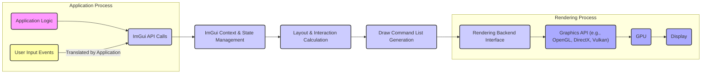

## Project Design Document: Dear ImGui (Improved)

**Project Title:** Dear ImGui - Immediate Mode Graphical User Interface Library

**Version:** 1.1

**Date:** October 26, 2023

**Author:** Gemini (AI Language Model)

### 1. Introduction

This document provides an enhanced design overview of the Dear ImGui library, an immediate-mode graphical user interface library written in C++. This revised document aims to offer a more detailed and security-focused understanding of the library's architecture, components, and data flow. It is specifically intended to serve as a comprehensive resource for subsequent threat modeling activities.

### 2. Project Overview

Dear ImGui (often referred to as ImGui) is a C++ library designed for creating user interfaces within applications. It operates on an immediate-mode paradigm, meaning the UI is described and rendered anew in each frame, simplifying state management. ImGui prioritizes portability and platform independence by relying on standard C++ and minimal external dependencies. Its primary use cases include the development of debugging tools, in-application editors, and visualization interfaces where rapid iteration and ease of integration are paramount. It is not intended for complex, data-driven application UIs.

### 3. Goals and Objectives

*   Enable straightforward and efficient creation of user interfaces within C++ applications.
*   Implement an immediate-mode approach to UI development, reducing the complexity of persistent state management within the UI library itself.
*   Maintain a high degree of portability across various operating systems and graphics APIs.
*   Minimize external dependencies to facilitate easy integration into diverse project environments.
*   Support rapid prototyping and iterative design of user interface elements.
*   Focus on providing tools for developers, such as debugging interfaces and in-application editors, rather than complex end-user application UIs.

### 4. Target Audience

*   C++ software developers.
*   Game developers integrating UI into their engines.
*   Graphics programmers needing in-application control panels.
*   Engine developers building internal tools.
*   Technical artists creating custom workflows.
*   QA engineers developing in-application testing tools.

### 5. System Architecture

ImGui's architecture is centered around its immediate-mode nature. The application drives the UI rendering process each frame by making calls to ImGui functions.

**Description of Components:**

*   **Application Logic:** The core of the application, responsible for managing application state and calling ImGui functions to define the UI.
*   **ImGui API Calls:** The set of functions provided by the ImGui library (e.g., `ImGui::Begin()`, `ImGui::Button()`, `ImGui::SliderFloat()`) that the application uses to describe the UI structure and elements for the current frame.
*   **ImGui Context & State Management:**  A central object within ImGui that stores global settings, style information, font data, and transient UI state for the current frame (e.g., mouse position, active widgets). This state is largely rebuilt each frame.
*   **Layout & Interaction Calculation:** ImGui's internal logic that determines the position, size, and interaction behavior of UI elements based on the API calls and input. This includes hit-testing and managing focus.
*   **Draw Command List Generation:** The process where ImGui translates the defined UI elements and their state into a list of low-level drawing commands (e.g., draw triangles, draw text) with associated vertex and index buffers, texture coordinates, and clipping information.
*   **Rendering Backend Interface:** An abstraction layer that separates ImGui's core logic from the specifics of the underlying graphics API. The application (or a provided backend) implements this interface to handle the actual rendering of ImGui's draw commands.
*   **Graphics API:** The underlying graphics library (e.g., OpenGL, DirectX, Vulkan) used by the rendering backend to draw the UI.
*   **GPU:** The Graphics Processing Unit responsible for executing the rendering commands.
*   **Display:** The output device where the rendered UI is presented.
*   **User Input Events:** Raw input events from devices like the mouse, keyboard, and gamepads. The application is responsible for translating these events into a format ImGui can understand.

### 6. Key Components

*   **Core ImGui Library (imgui.h, imgui.cpp):**
    *   Contains the fundamental implementation of ImGui, including the immediate-mode logic, widget definitions (buttons, sliders, windows), layout algorithms, and state management for the current frame.
    *   **Security Relevance:** Potential vulnerabilities could exist in the parsing of input data or the logic for handling user interactions, leading to unexpected behavior or crashes.
*   **Drawing Primitives (imgui_draw.h, imgui_draw.cpp):**
    *   Responsible for generating the low-level draw commands (vertex buffers, index buffers, textures, clipping) based on the UI elements defined by the application.
    *   **Security Relevance:** Bugs in draw command generation could potentially lead to out-of-bounds access or other memory safety issues when processed by the rendering backend.
*   **Rendering Backends (e.g., imgui_impl_opengl3.cpp):**
    *   Platform and graphics API-specific code that takes the draw command list generated by ImGui and submits it to the underlying graphics API for rendering.
    *   **Security Relevance:** This is a critical area for security. Vulnerabilities in the rendering backend (e.g., improper resource management, shader issues) could be exploited. The backend handles the interface with the GPU, making it a potential target.
*   **Input Handling (Application Responsibility):**
    *   ImGui relies on the host application to feed it with processed input events (mouse position, key presses, etc.). ImGui itself does not directly handle raw input.
    *   **Security Relevance:** The security of ImGui's input handling heavily depends on the application's implementation. Failure to sanitize or validate input before passing it to ImGui can lead to vulnerabilities.
*   **Font Rendering:**
    *   ImGui includes built-in font rendering capabilities, supporting custom font loading and generating texture atlases.
    *   **Security Relevance:**  Loading untrusted font files could potentially introduce vulnerabilities if the font parsing logic has flaws.
*   **Configuration and Styling:**
    *   Provides APIs to customize the appearance and behavior of ImGui elements.
    *   **Security Relevance:** While generally not a direct security risk, overly complex or dynamically generated styles could potentially impact performance and lead to denial-of-service scenarios.

### 7. Data Flow

The flow of data within an application using ImGui during a single frame:

```mermaid
graph LR
    A("Application Starts Frame") --> B("Poll and Process User Input");
    B --> C("Update Application State");
    C --> D("ImGui::NewFrame()");
    D --> E("Application Calls ImGui API to Define UI");
    E --> F("ImGui Internal Layout and State Update");
    F --> G("ImGui::Render()");
    G --> H("Generate Draw Command List");
    H --> I("Rendering Backend Processes Draw Data");
    I --> J("Submit Render Calls to Graphics API");
    J --> K("GPU Renders UI");
    K --> L("Display Presents Frame");
    style A fill:#eee,stroke:#333,stroke-width:1px
    style B fill:#eee,stroke:#333,stroke-width:1px
    style C fill:#eee,stroke:#333,stroke-width:1px
    style D fill:#eee,stroke:#333,stroke-width:1px
    style E fill:#eee,stroke:#333,stroke-width:1px
    style F fill:#eee,stroke:#333,stroke-width:1px
    style G fill:#eee,stroke:#333,stroke-width:1px
    style H fill:#eee,stroke:#333,stroke-width:1px
    style I fill:#eee,stroke:#333,stroke-width:1px
    style J fill:#eee,stroke:#333,stroke-width:1px
    style K fill:#eee,stroke:#333,stroke-width:1px
    style L fill:#eee,stroke:#333,stroke-width:1px
```

**Detailed Steps:**

1. **Application Starts Frame:** The beginning of the rendering loop.
2. **Poll and Process User Input:** The application retrieves raw input events and translates them into a format suitable for ImGui.
3. **Update Application State:** The application updates its internal state based on input and other logic.
4. **`ImGui::NewFrame()`:**  Signals the start of a new ImGui frame, resetting internal state.
5. **Application Calls ImGui API to Define UI:** The application code uses ImGui functions to describe the desired UI elements for the current frame.
6. **ImGui Internal Layout and State Update:** ImGui calculates the layout of the UI elements and updates its internal state based on the API calls and input.
7. **`ImGui::Render()`:** Finalizes the UI definition for the current frame and triggers the generation of draw data.
8. **Generate Draw Command List:** ImGui creates a list of drawing commands with associated data.
9. **Rendering Backend Processes Draw Data:** The rendering backend takes the draw command list and translates it into API-specific rendering calls.
10. **Submit Render Calls to Graphics API:** The rendering backend submits the rendering commands to the graphics API.
11. **GPU Renders UI:** The GPU executes the rendering commands.
12. **Display Presents Frame:** The rendered frame is displayed on the screen.

### 8. Technology Stack

*   **Core Language:** C++ (typically requires C++11 or later)
*   **Build Integration:** Designed to be integrated into the application's existing build system (e.g., CMake, Makefiles).
*   **Graphics API Interfacing (via Backends):**
    *   OpenGL (various versions)
    *   DirectX 9, 10, 11, 12
    *   Vulkan
    *   Metal
    *   WebGPU (through community contributions)
*   **Windowing and Input (Application Responsibility, with Helper Implementations):**
    *   GLFW
    *   SDL
    *   Win32 API
    *   Cocoa
    *   Other platform-specific APIs

### 9. Security Considerations

This section outlines potential security considerations relevant to ImGui.

*   **Input Validation and Sanitization:** Since the application is responsible for feeding input to ImGui, inadequate validation or sanitization of user input before passing it to ImGui can lead to vulnerabilities. Malicious input could potentially cause unexpected behavior, crashes, or even be leveraged for exploits if ImGui's internal logic is susceptible.
*   **Rendering Backend Vulnerabilities:** The rendering backend, which interfaces directly with the graphics API, is a critical point. Vulnerabilities in the backend, such as improper handling of draw commands, shader issues, or resource management errors, could be exploited. Using community-provided backends requires careful review for potential security flaws.
*   **Resource Exhaustion:** While less likely in typical usage, a malicious application could potentially generate an extremely large number of UI elements or complex layouts, leading to excessive memory allocation or processing time, causing a denial-of-service.
*   **Information Disclosure:** Displaying sensitive information through ImGui, especially in debug builds or in scenarios where the display is not secure, can lead to unintended information disclosure.
*   **Third-Party Integrations and Extensions:** If the application uses third-party extensions or modifications to ImGui, the security of these components must be considered.
*   **Font Loading Vulnerabilities:** Loading fonts from untrusted sources could potentially expose vulnerabilities in the font parsing logic.
*   **Clipboard Interaction:** ImGui provides functionality for interacting with the system clipboard. Improper handling of clipboard data could introduce vulnerabilities if the application doesn't sanitize data pasted from the clipboard.

### 10. Assumptions and Constraints

*   **Immediate Mode Paradigm:** The fundamental design relies on the immediate-mode approach, where UI state is transient and largely managed by the application.
*   **Single-Threaded UI Logic (Typically):** While rendering might occur on a separate thread, the core ImGui logic for defining and interacting with UI elements is generally assumed to be single-threaded.
*   **Application's Responsibility for Input and Windowing:** ImGui relies on the integrating application to handle raw input events and manage the application window.
*   **No Built-in Security Features:** ImGui itself does not provide built-in security features like access control or encryption. Security is the responsibility of the integrating application.
*   **Focus on Developer Tools:** ImGui's design prioritizes developer convenience and rapid iteration, which might sometimes come at the expense of features required for highly secure end-user applications.

### 11. Security Architecture Considerations

From a security perspective, the following aspects of ImGui's architecture are particularly relevant:

*   **Trust Boundary:** The primary trust boundary lies between the application code and the ImGui library, and further between the ImGui library and the rendering backend. The application must provide valid and safe input to ImGui, and the rendering backend must correctly and securely interpret ImGui's draw commands.
*   **Attack Surface:** The main attack surface includes:
    *   The ImGui API calls made by the application.
    *   The input data provided by the application to ImGui.
    *   The rendering backend implementation.
    *   Any third-party integrations or extensions.
*   **Data Sensitivity:** While ImGui itself doesn't store persistent application data, the data displayed and manipulated through the UI might be sensitive. The application must ensure appropriate handling of this data.
*   **Authentication and Authorization:** ImGui does not provide any built-in authentication or authorization mechanisms. These must be implemented by the integrating application if required.
*   **Auditing and Logging:** ImGui does not inherently provide auditing or logging capabilities. The application would need to implement any necessary logging of user interactions or UI state changes.

This improved design document provides a more detailed and security-conscious overview of the Dear ImGui library. This enhanced understanding will be valuable for conducting a more thorough and effective threat modeling exercise.
