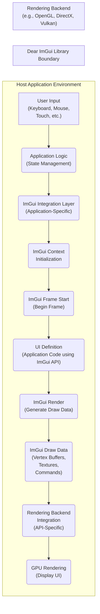

# Project Design Document: Dear ImGui Integration

**Version:** 1.1
**Date:** October 26, 2023
**Author:** AI Software Architect

## 1. Introduction

This document details the design of a system integrating the Dear ImGui library (https://github.com/ocornut/imgui) into a hypothetical application. This design serves as a crucial artifact for subsequent threat modeling, enabling the identification of potential security vulnerabilities. Dear ImGui is a C++ library providing an immediate mode graphical user interface. It focuses on generating optimized vertex buffers for rendering within an existing application's 3D pipeline. Its key characteristics include speed, portability, renderer agnosticism, and self-containment (minimal external dependencies).

This document emphasizes the architectural aspects of the integration, the flow of data, and the interactions between key components. The primary objective is to provide a clear and comprehensive understanding of how ImGui interacts with the host application, which is essential for effectively identifying potential security weaknesses during threat modeling.

## 2. Goals and Objectives

*   To precisely define the architecture of a system incorporating Dear ImGui.
*   To thoroughly describe the data flow between the host application and the ImGui library.
*   To clearly identify the key components involved and their interactions within the integrated system.
*   To establish a solid foundation for conducting a detailed and effective threat model of the ImGui integration.
*   To proactively highlight potential areas of security concern based on the defined design, facilitating early mitigation strategies.

## 3. Architectural Overview

The integration of Dear ImGui adheres to the immediate mode GUI paradigm. A defining characteristic of this paradigm is that the GUI's state is not maintained internally by the ImGui library itself. Instead, the host application is responsible for managing and storing the application's UI state. In each frame, the host application provides input data to ImGui, describes the desired UI elements programmatically, and then renders the graphical output generated by ImGui.

The following diagram illustrates the high-level architecture of this integration:

**Detailed Component Descriptions:**

*   **User Input (Keyboard, Mouse, Touch, etc.):** Represents the raw input events generated by user interaction with input devices.
*   **Application Logic (State Management):** The core of the host application, responsible for processing user input, managing the application's internal state, and determining the desired UI based on that state. This component holds the data that ImGui visualizes.
*   **ImGui Integration Layer (Application-Specific):**  The portion of the host application's codebase that directly interacts with the ImGui library. This layer handles tasks such as initializing the ImGui context, feeding user input events to ImGui, defining the UI elements for each frame, and then processing the generated draw data for rendering.
*   **ImGui Context Initialization:** The process of setting up the ImGui environment, including loading fonts, configuring styles, and initializing internal data structures. This is typically done once at application startup.
*   **ImGui Frame Start (Begin Frame):** The beginning of each rendering frame where the host application signals to ImGui to prepare for processing. This involves updating internal ImGui state based on the provided input.
*   **UI Definition (Application Code using ImGui API):** The application code that utilizes ImGui functions (e.g., `ImGui::Begin()`, `ImGui::Button()`, `ImGui::Text()`, `ImGui::SliderFloat()`) to describe the structure, layout, and content of the user interface for the current frame. This is where the immediate mode nature is most evident.
*   **ImGui Render (Generate Draw Data):** The core ImGui processing step where, based on the UI definitions provided by the application, ImGui calculates the layout, determines which elements need to be drawn, and generates the necessary draw commands.
*   **ImGui Draw Data (Vertex Buffers, Textures, Commands):** A data structure containing the optimized vertex and index buffers, texture information, clipping rectangles, and other rendering commands required to draw the UI. This is the output of the ImGui rendering process.
*   **Rendering Backend Integration (API-Specific):** The application-specific code responsible for taking the `ImGui Draw Data` and translating it into the appropriate rendering calls for the chosen graphics API (e.g., OpenGL `glDrawElements`, DirectX `DrawIndexed`, Vulkan command buffer submissions). This is a critical interface point.
*   **GPU Rendering (Display UI):** The final stage where the graphics processing unit executes the rendering commands, drawing the user interface on the screen.

## 4. Data Flow

The flow of data within the ImGui integration can be visualized as follows:

```mermaid
graph LR
    A["User Interaction"] --> B("Host Application\nInput Event Handling");
    B --> C("ImGui Input Update\n(Feeding Input Events)");
    C --> D("ImGui Frame Processing\n(Internal State Update)");
    D --> E("UI Definition\n(Application Code)");
    E --> F("ImGui Layout & Logic\n(Calculation & Interaction)");
    F --> G("ImGui Draw Command\nGeneration");
    G --> H("ImGui Draw Data\nOutput");
    H --> I("Rendering Backend\nProcessing");
    I --> J("Rendered UI\n(On Screen)");
```

**Detailed Data Flow Description:**

*   **User Interaction:** The user interacts with the application through input devices (keyboard, mouse, touch, etc.).
*   **Host Application Input Event Handling:** The host application captures and processes these raw input events, translating them into a format suitable for further processing.
*   **ImGui Input Update (Feeding Input Events):** The host application feeds the processed input events to the ImGui library using functions provided by ImGui (e.g., `ImGuiIO& io = ImGui::GetIO(); io.AddKeyEvent(...)`, `io.AddMouseButtonEvent(...)`, `io.AddMousePosEvent(...)`).
*   **ImGui Frame Processing (Internal State Update):** ImGui processes the received input, updates its internal state related to widget interactions (e.g., button presses, slider movements), and determines which UI elements are currently active or being interacted with.
*   **UI Definition (Application Code):** The host application's code uses the ImGui API to define the desired UI elements for the current frame. This definition is based on the application's current state and logic.
*   **ImGui Layout & Logic (Calculation & Interaction):** ImGui calculates the layout and positioning of the defined UI elements. It also handles basic interaction logic, such as determining if a mouse click occurred within a button's bounds.
*   **ImGui Draw Command Generation:** Based on the layout and active UI elements, ImGui generates a series of low-level draw commands. These commands specify how the UI elements should be rendered, including vertex data, texture coordinates, and clipping information.
*   **ImGui Draw Data Output:** The generated draw commands are packaged into the `ImGui Draw Data` structure. This structure is the primary output of the ImGui rendering process.
*   **Rendering Backend Processing:** The host application's rendering backend receives the `ImGui Draw Data` and interprets it, translating the abstract draw commands into API-specific rendering calls for the chosen graphics API.
*   **Rendered UI (On Screen):** The final output, where the graphics API renders the UI elements on the screen, making them visible to the user.

## 5. Security Considerations for Threat Modeling

This section outlines potential security considerations relevant for threat modeling the ImGui integration. Understanding these potential vulnerabilities is crucial for designing secure applications.

*   **Input Handling Vulnerabilities:**
    *   **Malicious Input Injection:** If the host application fails to adequately sanitize or validate user input before passing it to ImGui, attackers might inject malicious input strings or values. This could potentially lead to unexpected behavior within ImGui, such as triggering assertions, causing crashes, or even influencing the generated draw data in unintended ways. For example, excessively long strings for text input fields could lead to buffer overflows if not handled correctly by the application or ImGui.
    *   **Integer Overflows/Underflows:**  Improper handling of input values, such as mouse coordinates, scroll wheel deltas, or text input lengths, before being passed to ImGui could lead to integer overflows or underflows within ImGui's internal logic. This could result in incorrect calculations, unexpected behavior, or potentially exploitable conditions.
*   **Rendering Backend Vulnerabilities:**
    *   **Exploiting Rendering API Flaws:** While ImGui itself generates draw commands, the actual rendering is performed by the host application's rendering backend using APIs like OpenGL, DirectX, or Vulkan. Vulnerabilities within these rendering APIs could be exploited through the draw commands generated by ImGui. For instance, carefully crafted vertex data or texture coordinates could trigger driver bugs or security flaws in the graphics API implementation.
    *   **Resource Exhaustion (Denial of Service):** Maliciously crafted UI definitions, either through direct manipulation of application state or by exploiting application logic flaws, could lead to an excessive number of draw calls, an extremely large amount of vertex data, or the allocation of excessive textures. This could overwhelm the GPU, leading to a denial-of-service condition, making the application unresponsive.
*   **Application Logic Vulnerabilities (Indirectly Exploiting ImGui):**
    *   **State Manipulation Leading to UI Exploits:** While ImGui doesn't retain UI state, the host application does. Vulnerabilities in the application logic that manages this state could be indirectly exploited through UI interactions. For example, manipulating application state to display sensitive information in an insecure way through the ImGui interface.
    *   **Information Disclosure through UI:**  Care must be taken to ensure that sensitive information is not inadvertently displayed or exposed through the UI rendered by ImGui. This includes avoiding displaying confidential data in debug windows or through UI elements accessible to unauthorized users.
*   **Dependency Vulnerabilities:**
    *   While ImGui has minimal direct dependencies, the rendering backend and the host application itself will have dependencies on various libraries and system components. Vulnerabilities in these dependencies could indirectly impact the security of the ImGui integration. For example, a vulnerability in the FreeType library used for font rendering could be a potential attack vector.
*   **Font Loading Vulnerabilities:**
    *   If the application allows loading custom fonts for ImGui, vulnerabilities in the font parsing libraries used by ImGui or the rendering backend could be exploited by providing malicious font files. This could potentially lead to code execution or denial-of-service.

## 6. Dependencies

The core Dear ImGui library is designed to have minimal external dependencies. However, a successful integration requires the following:

*   **C++ Compiler:** A standard-compliant C++ compiler (e.g., GCC, Clang, MSVC) to compile the ImGui source code and the host application.
*   **Build System:** A build system (e.g., CMake, Make, Visual Studio project files) to manage the compilation and linking process for the host application and ImGui.
*   **Rendering API:** A graphics rendering API (e.g., OpenGL, DirectX, Vulkan) and its associated SDKs and runtime libraries. This is essential for the host application to render the UI generated by ImGui.
*   **Operating System Libraries:** Standard operating system libraries for tasks such as window creation, input handling, and threading. The specific libraries required will depend on the target platform.

## 7. Deployment

Dear ImGui is typically deployed by including its source code directly into the host application's project or by linking against a pre-compiled library. The deployment process generally involves:

*   **Source Code Inclusion:** Adding the ImGui source files (typically `.cpp` and `.h` files) to the host application's project structure and including them in the build process.
*   **Library Linking:** Compiling ImGui separately into a static or dynamic library and then linking the host application against this library.
*   **Platform and Renderer Backend Integration:** Ensuring that the appropriate platform backend (e.g., for handling window creation and input on Windows, Linux, macOS) and renderer backend (e.g., for OpenGL, DirectX) implementations are included and correctly configured within the host application.
*   **Distribution:** Distributing the compiled host application along with any necessary runtime libraries for the chosen rendering API and platform.

## 8. Future Considerations and Mitigation Strategies

*   **Regular Security Audits and Penetration Testing:** Conducting periodic security audits and penetration testing specifically targeting the ImGui integration and the host application can help identify and address potential vulnerabilities proactively.
*   **Robust Input Validation and Sanitization:** Implementing comprehensive input validation and sanitization within the host application before passing any user-provided data to ImGui is crucial to mitigate input-related vulnerabilities. This includes checking data types, ranges, and formats, and escaping or encoding potentially harmful characters.
*   **Principle of Least Privilege for Rendering Context:** If possible, consider running the rendering process with the least privileges necessary to perform its function, limiting the potential impact of rendering backend exploits.
*   **Address Space Layout Randomization (ASLR) and Data Execution Prevention (DEP):** Ensuring that the host application and its dependencies, including the rendering backend, are compiled with ASLR and DEP enabled can help mitigate memory corruption vulnerabilities.
*   **Regular Updates and Patching:** Keeping the ImGui library, the rendering backend, and all other dependencies up-to-date with the latest versions and security patches is essential for addressing known vulnerabilities.
*   **Consider Sandboxing or Isolation:** For applications with high security requirements, consider sandboxing or isolating the rendering process to further limit the impact of potential exploits.

This detailed design document provides a comprehensive understanding of the Dear ImGui integration, highlighting key architectural components, data flow, and potential security considerations. This information is essential for conducting thorough threat modeling and implementing appropriate security measures to protect the application.