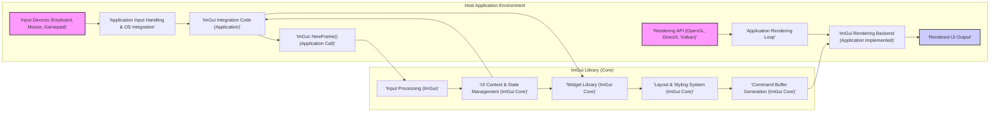
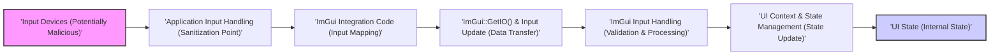

# Project Design Document: ImGui for Threat Modeling (Improved)

**Project:** ImGui (Immediate Mode GUI)
**Version:** Based on the repository at [https://github.com/ocornut/imgui](https://github.com/ocornut/imgui)
**Document Version:** 1.1
**Date:** October 26, 2023
**Author:** AI Software & Security Architect

## 1. Introduction

This document provides an enhanced and more detailed design overview of the ImGui (Immediate Mode GUI) library, specifically tailored for effective threat modeling. Building upon the initial design document, this version further clarifies the system's architecture, data flow, external interfaces, and expands on initial security considerations. This document is intended to be a practical resource for security professionals and developers to conduct thorough threat modeling and identify potential vulnerabilities and security risks associated with integrating and using ImGui in various applications.

ImGui, as a reminder, is a portable, renderer-agnostic, and self-contained C++ GUI library designed for integration into 3D-pipeline enabled applications. Its immediate mode paradigm offers ease of use and rapid UI development, making it popular for tools, prototyping, and game development.

This improved document maintains focus on the core ImGui library and its interaction with a host application, while providing more granular detail relevant to security analysis. Backend implementations and host application specifics are considered as they relate to ImGui's security posture.

## 2. System Overview

ImGui's core principle of "immediate mode" GUI rendering is central to understanding its architecture and security characteristics.  In contrast to retained mode GUIs, ImGui does not maintain a persistent scene graph. Instead, the entire UI is described and rendered anew in each frame. This approach has performance and simplicity benefits but also implications for state management and potential vulnerabilities.

**Key Characteristics (Expanded):**

*   **Immediate Mode Paradigm:** UI is defined and rendered every frame based on the application's current state. This means UI state is transient in the application code but managed internally by ImGui for UI consistency across frames. This paradigm can simplify UI development but requires careful consideration of state management and potential side effects if UI rendering logic has vulnerabilities.
*   **C++ Library with Minimal Dependencies:** Primarily written in C++ and designed to be self-contained, reducing external dependency risks. The core library's single-header distribution (`imgui.h`) simplifies integration but necessitates careful compilation and dependency management in the host application.
*   **Renderer Agnostic Architecture:**  Abstracts away the underlying rendering API, promoting portability. However, the security of the rendering process ultimately depends on the chosen backend implementation and the security of the rendering API itself (OpenGL, DirectX, Vulkan, etc.).
*   **Input Driven and Event-Based (Internally):** UI interactions are driven by user input events processed by the host application and fed into ImGui. Internally, ImGui manages events and state changes based on this input. Input handling is a critical area for security consideration.
*   **Internal State Management for UI Consistency:** While immediate mode, ImGui *does* manage internal state for UI elements (window positions, widget states, focus, etc.) to ensure UI consistency across frames. This internal state management is crucial for UI functionality and needs to be robust against manipulation or corruption.
*   **Developer Productivity and Customization:**  Prioritizes ease of use and rapid UI development, offering extensive customization options through styling and theming.  Customization, while powerful, can also introduce security considerations if not handled carefully.

**Intended Use Cases (Expanded Security Context):**

*   **Debugging Tools (Security Relevance):** Creating in-application debug UIs.  Security-sensitive debug tools might expose internal application state or controls, requiring careful access control and secure UI design to prevent unauthorized access or manipulation.
*   **Game Development Tools (Security Relevance):** Level editors, game parameter tweaking interfaces. Game development tools might handle sensitive game assets or configuration data. Vulnerabilities in these tools could lead to game exploits or asset compromise.
*   **Prototyping (Security Relevance in Later Stages):** Quickly creating user interfaces for application prototypes. Prototypes might evolve into production systems, and security considerations introduced in early prototyping with ImGui might persist if not addressed.
*   **Embedded Systems (Resource Constraints & Security):** Suitable for resource-constrained environments. In embedded systems, resource constraints often intersect with security concerns, requiring efficient and secure UI implementations.

## 3. Architectural Design (Enhanced Detail)

ImGui's architecture is designed for efficiency and flexibility.  Understanding the interaction between components is crucial for threat modeling.

**Component Diagram (Mermaid - Improved Labels):**

**Description of Components (Enhanced):**

*   **'Input Devices (Keyboard, Mouse, Gamepad)':** Physical input devices. Security considerations here are primarily related to the operating system and hardware level, outside ImGui's direct scope, but relevant to the overall system security.
*   **'Application Input Handling & OS Integration':** Host application's code responsible for capturing raw input events from the operating system and potentially performing initial input sanitization or filtering. This component is a critical security boundary as it's the first point of contact for external user input.
*   **'ImGui Integration Code (Application)':** Application-specific code that bridges ImGui with the host application. This includes initialization, input feeding, rendering backend setup, and potentially custom widget implementations or extensions.  Vulnerabilities here can arise from incorrect integration or insecure custom code.
*   **'ImGui::NewFrame() (Application Call)':** The entry point into ImGui's frame processing.  Called by the application at the start of each frame.
*   **'Input Processing (ImGui)':** ImGui's internal component that receives input data from the application (via `ImGuiIO`) and processes it. This includes handling keyboard, mouse, and gamepad input, and managing input focus. Input validation and secure handling within this component are crucial.
*   **'UI Context & State Management (ImGui Core)':** Manages the core UI state, including window positions, sizes, widget states (active/inactive, values), input focus, style settings, and internal flags. This component is central to ImGui's operation and any vulnerability here could have wide-ranging impacts on UI behavior and potentially application security.  State corruption or manipulation could lead to unexpected UI behavior or even application-level exploits.
*   **'Widget Library (ImGui Core)':** Provides the collection of pre-built UI widgets.  Security considerations within widgets might include vulnerabilities in widget logic, rendering, or state management. Custom widgets, if implemented, need careful security review.
*   **'Layout & Styling System (ImGui Core)':**  Handles UI layout and visual styling. While primarily aesthetic, vulnerabilities in layout calculations or style processing could potentially lead to DoS or unexpected rendering behavior.
*   **'Command Buffer Generation (ImGui Core)':**  Generates the list of drawing commands.  Vulnerabilities in command buffer generation could lead to rendering errors, crashes, or potentially exploitable issues if the command buffer is mishandled by the rendering backend.
*   **'ImGui Rendering Backend (Application Implemented)':** Application-provided code that interprets ImGui's command buffer and renders it using a specific rendering API.  Security here depends heavily on the backend implementation and the security of the chosen rendering API. Buffer overflows or incorrect API usage in the backend could be critical vulnerabilities.
*   **'Rendering API (OpenGL, DirectX, Vulkan)':** The underlying graphics API. Security vulnerabilities in the rendering API itself are less directly related to ImGui but are still relevant to the overall system security.
*   **'Application Rendering Loop':** The main rendering loop of the host application where ImGui rendering is integrated.
*   **'Rendered UI Output':** The final rendered user interface displayed to the user.

## 4. Data Flow (Enhanced Security Focus)

Understanding the data flow, especially concerning user input and rendering commands, is vital for threat modeling.

**4.1. Input Data Flow (Security Perspective):**

1.  **'Input Events (Potentially Malicious)':** User interactions, which could be intentionally crafted to be malicious.
2.  **'Application Input Handling (Sanitization Point)':**  Crucial point for input sanitization and validation.  Insufficient sanitization here is a major vulnerability point.
3.  **'ImGui Integration Code (Input Mapping)':** Maps application input to ImGui's input structures. Incorrect mapping or mishandling of input data can introduce vulnerabilities.
4.  **'ImGui::GetIO() & Input Update (Data Transfer)':** Data transfer of input to ImGui.
5.  **'ImGui Input Handling (Validation & Processing)':** ImGui's internal input processing and validation.  Vulnerabilities here could be exploited if input validation is insufficient or flawed.
6.  **'UI Context & State Management (State Update)':** UI state is updated based on processed input. State corruption vulnerabilities could arise here.
7.  **'UI State (Internal State)':** ImGui's internal UI state, which if compromised, can lead to UI manipulation or application-level issues.

**Data Flow Diagram - Input (Mermaid - Improved Labels):**

**4.2. Rendering Data Flow (Security Perspective):**

1.  **'UI Description Code (Application - UI Logic)':** Application code defining the UI.  Vulnerabilities in UI logic could lead to unexpected UI behavior or security issues.
2.  **'Widget & Layout Processing (UI Structure)':** ImGui processes widget definitions and layout.
3.  **'Command Buffer Generation (Drawing Commands)':** Generation of drawing commands.  Vulnerabilities here could lead to rendering issues or potentially exploitable command sequences.
4.  **'ImGui::Render() (Command Buffer Finalization)':** Finalizes the command buffer.
5.  **'ImGui::GetDrawData() (Command Buffer Retrieval)':** Application retrieves the command buffer.
6.  **'ImGui Rendering Backend (Command Execution)':** Backend executes the drawing commands.  Backend vulnerabilities are a major concern, especially buffer overflows or incorrect API usage.
7.  **'Rendering API Calls (API Interaction)':** Interaction with the rendering API.
8.  **'Rendered UI (Visual Output)':** The final rendered UI.

**Data Flow Diagram - Rendering (Mermaid - Improved Labels):**

```mermaid
graph LR
    A["'UI Description Code (Application - UI Logic)'"] --> B["'Widget & Layout Processing (UI Structure)'"];
    B --> C["'Command Buffer Generation (Drawing Commands)'"];
    C --> D["'ImGui::Render() (Command Buffer Finalization)'"];
    D --> E["'ImGui::GetDrawData() (Command Buffer Retrieval)'"];
    E --> F["'ImGui Rendering Backend (Command Execution)'"];
    F --> G["'Rendering API Calls (API Interaction)'"];
    G --> H["'Rendered UI (Visual Output)'"];

    style A fill:#f9f,stroke:#333,stroke-width:2px
    style H fill:#ccf,stroke:#333,stroke-width:2px
```

## 5. External Interfaces (Security Deep Dive)

External interfaces are key attack surfaces.  Understanding their security implications is crucial.

*   **'Input Devices (Keyboard, Mouse, Gamepad)' (Indirect Interface):**  Security depends on the host OS and hardware. ImGui indirectly interfaces through the application's input handling. *Security Implication:* Input from these devices is the primary attack vector for UI-based applications.
*   **'Rendering API (OpenGL, DirectX, Vulkan, etc.)' (Backend Interface):** ImGui relies on the application-provided backend. *Security Implication:* Backend vulnerabilities (buffer overflows, incorrect API usage) are critical. The security of the rendering API itself is also a factor, though less directly attributable to ImGui.
*   **'Host Application Memory' (Memory Interface):** ImGui operates within the application's memory space. *Security Implication:* Memory safety vulnerabilities in ImGui or the application can lead to memory corruption, information disclosure, or code execution. Shared memory space means vulnerabilities in ImGui can potentially be exploited to affect the host application and vice versa.
*   **'Clipboard' (OS Interface):** ImGui's clipboard functionality interacts with the OS clipboard. *Security Implication:* Clipboard operations can be a source of information leakage or injection.  Data sanitization when pasting from the clipboard is important.
*   **'File System (Indirect via Application)' (Application Interface):** ImGui itself has minimal direct file system access. Applications using ImGui might load resources. *Security Implication:* File system operations triggered or controlled by the ImGui UI need to be secured against path traversal, malicious file loading, etc.  ImGui UI elements can be attack vectors to trigger file system vulnerabilities in the host application.
*   **'Network (Indirect via Application)' (Application Interface):** ImGui itself does not directly interact with the network. Applications might use ImGui to control network operations. *Security Implication:* Network operations initiated through the ImGui UI need to be secured against injection attacks, unauthorized access, etc. ImGui UI elements can be attack vectors to trigger network vulnerabilities in the host application.

## 6. Security Considerations (Detailed and Categorized)

This section expands on the initial security considerations, categorizing threats and providing more detail.

**6.1. Input Validation and Sanitization Vulnerabilities:**

*   **Threat:** Input Injection (e.g., into text input fields, potentially influencing application logic).
*   **Description:** Insufficient input validation in the application's input handling or within ImGui itself could allow malicious input to be processed, potentially leading to unexpected UI behavior, application crashes, or even code execution if input is used to construct commands or queries.
*   **Example:**  A text input field in ImGui used to filter data. If not properly sanitized, a malicious user could inject SQL or command injection payloads if the filter logic is vulnerable.
*   **Mitigation:** Implement robust input validation and sanitization in the application's input handling *before* passing data to ImGui. Use parameterized queries or safe APIs when processing user input.

**6.2. Memory Safety Vulnerabilities (C++ Specific):**

*   **Threat:** Buffer Overflows, Use-After-Free, Double-Free, Memory Corruption.
*   **Description:** C++ code is susceptible to memory safety issues. Vulnerabilities in ImGui's C++ code could lead to memory corruption, crashes, or exploitable conditions.
*   **Example:** Buffer overflow in string handling within ImGui widgets or internal data structures. Use-after-free in ImGui's internal state management.
*   **Mitigation:** Code reviews, static analysis tools, fuzzing, and careful memory management practices in ImGui development.  For applications integrating ImGui, ensure safe compilation practices and consider memory safety tools.

**6.3. Denial of Service (DoS) Vulnerabilities:**

*   **Threat:** UI Overload, Resource Exhaustion.
*   **Description:** Maliciously crafted UI descriptions or input sequences could lead to excessive CPU or memory consumption, or overly complex rendering, causing performance degradation or DoS.
*   **Example:**  Creating a UI with an extremely large number of widgets, deeply nested windows, or triggering computationally expensive layout calculations. Sending rapid input events to overwhelm ImGui's processing.
*   **Mitigation:** Implement UI complexity limits, input rate limiting, and resource monitoring. Design UI defensively to avoid unbounded resource consumption.

**6.4. Clipboard Security Vulnerabilities:**

*   **Threat:** Information Disclosure, Clipboard Injection.
*   **Description:**  Clipboard operations can expose sensitive data if not handled carefully. Malicious applications or users could potentially inject malicious content into the clipboard, which could be pasted into the application via ImGui.
*   **Example:** Copying sensitive data to the clipboard via ImGui and a malicious application reading the clipboard. Pasting malicious text from the clipboard into an ImGui text input field that is then processed unsafely by the application.
*   **Mitigation:** Sanitize data before copying to the clipboard. Sanitize data pasted from the clipboard before processing it within the application. Consider disabling or restricting clipboard functionality in security-sensitive contexts.

**6.5. Rendering Backend Vulnerabilities (Application Responsibility):**

*   **Threat:** Buffer Overflows in Rendering Commands, Incorrect API Usage.
*   **Description:** Vulnerabilities in the application-implemented rendering backend are a significant concern. Incorrect handling of ImGui's command buffer, buffer overflows when processing vertex or index data, or incorrect rendering API calls can lead to crashes, rendering errors, or potentially exploitable conditions.
*   **Example:** Buffer overflow when copying vertex data from ImGui's command buffer to rendering API buffers. Incorrectly sized buffers in the rendering backend.
*   **Mitigation:** Thoroughly review and test the rendering backend implementation. Use safe rendering API practices. Employ memory safety techniques in the backend code.

**6.6. UI Injection/Spoofing (Contextual Vulnerability):**

*   **Threat:** Misleading Users, UI Manipulation.
*   **Description:** In contexts where ImGui displays dynamic content or user-provided text, insufficient sanitization when displaying text within ImGui widgets could lead to UI injection or spoofing. This is less like traditional XSS but more about manipulating the UI context to mislead users.
*   **Example:** Displaying user-provided usernames or messages in an ImGui window. If not properly encoded, malicious usernames or messages could inject UI elements or misrepresent information within the UI.
*   **Mitigation:** Properly encode and sanitize any dynamic content or user-provided text displayed within ImGui widgets to prevent UI injection or spoofing.

## 7. Next Steps (Actionable Threat Modeling Process)

This design document is the first step in a comprehensive threat modeling process. The following actionable steps should be taken:

1.  **Threat Identification Workshop:** Conduct a threat modeling workshop with security experts, developers, and stakeholders. Use this design document as a basis to brainstorm and systematically identify potential threats for each component and data flow described. Utilize threat modeling methodologies like STRIDE or PASTA.
    *   *Action Items:* Schedule workshop, invite participants, prepare workshop materials (including this document), document identified threats.
2.  **Threat Analysis and Prioritization:** Analyze each identified threat to assess its likelihood and impact. Use a risk scoring system (e.g., CVSS-like scoring or a custom risk matrix) to prioritize threats based on their risk level.
    *   *Action Items:*  Assign risk scores to each threat, prioritize threats based on risk, document the analysis and prioritization.
3.  **Mitigation Strategy Development:** For each prioritized threat, develop specific mitigation strategies. These strategies should be documented and assigned to responsible teams or individuals for implementation. Mitigation strategies can include code changes, architectural modifications, security controls, or process improvements.
    *   *Action Items:*  Develop mitigation strategies for each prioritized threat, document mitigation strategies, assign responsibility for implementation.
4.  **Security Requirements Definition:** Based on the identified threats and mitigation strategies, define specific security requirements for the ImGui integration and the host application. These requirements should be incorporated into the development process and tracked for compliance.
    *   *Action Items:*  Document security requirements, integrate requirements into development lifecycle, track requirement compliance.
5.  **Security Testing and Validation:** Implement security testing techniques to validate the effectiveness of mitigation strategies and identify any residual vulnerabilities. This should include:
    *   **Code Reviews:** Review ImGui integration code and rendering backend implementation for security vulnerabilities.
    *   **Static Analysis:** Use static analysis tools to identify potential code-level vulnerabilities in ImGui integration and backend code.
    *   **Fuzzing:** Fuzz ImGui input handling and rendering backend to identify crash-causing or exploitable inputs.
    *   **Penetration Testing:** Conduct penetration testing to simulate real-world attacks and assess the overall security posture of the application using ImGui.
    *   *Action Items:* Plan and execute security testing activities, document testing results, remediate identified vulnerabilities.
6.  **Continuous Monitoring and Improvement:** Security is an ongoing process. Implement continuous security monitoring and regularly review and update the threat model as the application evolves and new threats emerge.
    *   *Action Items:* Establish security monitoring processes, schedule regular threat model reviews, update threat model and mitigation strategies as needed.

This improved design document, combined with the outlined next steps, provides a robust framework for effectively threat modeling ImGui integrations and enhancing the security of applications that utilize this powerful UI library. This document should be considered a living document and updated throughout the project lifecycle.