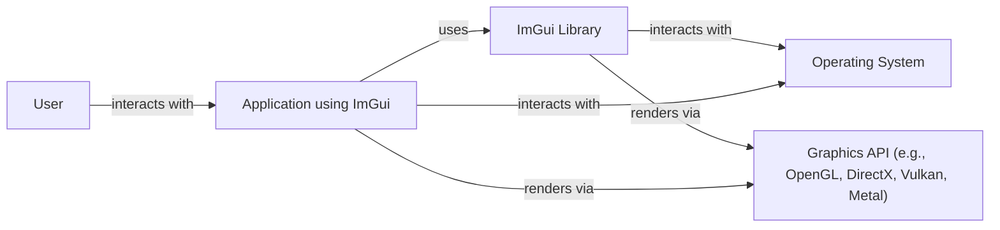
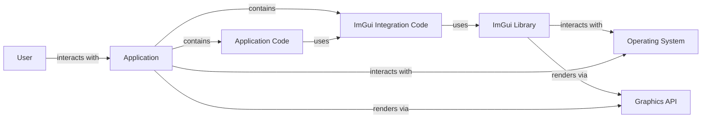
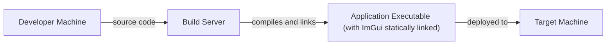
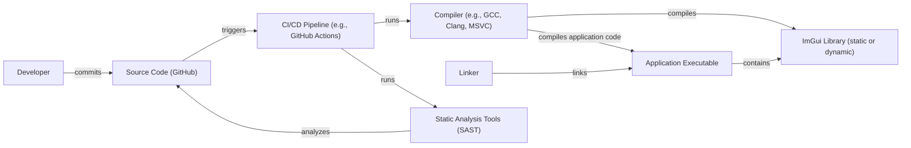

# BUSINESS POSTURE

Business Priorities and Goals:

*   Provide a simple, immediate mode, cross-platform graphical user interface (GUI) library for C++.
*   Minimize dependencies and maximize portability for easy integration into various projects, particularly games and other graphical applications.
*   Enable rapid prototyping and development of tools and debug interfaces.
*   Maintain a bloat-free, self-contained library with minimal overhead.
*   Foster a large and active community for support, contributions, and continuous improvement.

Business Risks:

*   Vulnerabilities in the library could be exploited in applications that integrate it, potentially leading to security breaches in those applications. Since ImGui is often used in development tools and debug interfaces, vulnerabilities could expose sensitive development data or provide attack vectors into production systems if debug interfaces are accidentally left enabled.
*   The library's widespread use means that any discovered vulnerability could have a broad impact across many projects.
*   Reliance on external contributors for bug fixes and security patches introduces a risk if the community becomes inactive or slow to respond to critical issues.
*   Lack of formal security audits or certifications could deter adoption in high-security environments.
*   Compatibility issues with different platforms or graphics APIs could limit the library's usefulness and increase maintenance burden.

# SECURITY POSTURE

Existing Security Controls:

*   security control: The library is designed to be self-contained and has minimal external dependencies, reducing the attack surface. (Described in the project's README and design philosophy).
*   security control: The project uses GitHub's issue tracker for reporting and addressing bugs, including potential security vulnerabilities. (Visible on the GitHub repository).
*   security control: Community involvement in code review and testing helps identify and fix potential issues. (Visible in pull requests and discussions on GitHub).
*   security control: The library's focus on simplicity and immediate mode rendering can reduce the likelihood of certain types of GUI-related vulnerabilities. (Described in the project's design philosophy).

Accepted Risks:

*   accepted risk: The library does not implement specific security features like sandboxing or privilege separation. It relies on the integrating application to provide these protections.
*   accepted risk: The library's primary focus is on ease of use and portability, not on providing robust security guarantees.
*   accepted risk: The library is primarily developed and maintained by volunteers, which may lead to delays in addressing security issues.

Recommended Security Controls:

*   security control: Integrate static analysis tools (SAST) into the build process to automatically detect potential vulnerabilities.
*   security control: Perform regular security audits and penetration testing of the library.
*   security control: Develop a clear security policy and vulnerability disclosure process.
*   security control: Consider using a Software Composition Analysis (SCA) tool to manage and monitor any third-party dependencies (even if minimal).
*   security control: Provide guidance to developers on how to securely integrate ImGui into their applications, including best practices for input validation and handling user-provided data.

Security Requirements:

*   Authentication: Not directly applicable to the library itself. ImGui is a UI library and does not handle authentication. Authentication should be handled by the application integrating ImGui.
*   Authorization: Not directly applicable to the library itself. Authorization should be handled by the application integrating ImGui.
*   Input Validation:
    *   The library should handle invalid or unexpected input gracefully, without crashing or exhibiting undefined behavior.
    *   Applications integrating ImGui should perform their own input validation to prevent injection attacks or other vulnerabilities. ImGui provides mechanisms for input, but the application is responsible for sanitizing that input.
*   Cryptography: Not directly applicable to the library itself. If cryptographic operations are needed (e.g., for secure communication or data storage), they should be handled by the application or a separate library.
*   Output Encoding:
    *   ImGui renders text and UI elements. Applications using ImGui should ensure that any data displayed through ImGui is properly encoded to prevent cross-site scripting (XSS) or other injection vulnerabilities if displaying user-supplied content.

# DESIGN

## C4 CONTEXT

Context Diagram Element List:

*   Element:
    *   Name: User
    *   Type: Person
    *   Description: Represents a user interacting with an application that uses ImGui.
    *   Responsibilities: Interacts with the application's UI.
    *   Security controls: None (handled by the application).

*   Element:
    *   Name: ImGui Library
    *   Type: Software System
    *   Description: The Dear ImGui library itself.
    *   Responsibilities: Provides immediate mode GUI functionality.
    *   Security controls: Minimal dependencies, community code review.

*   Element:
    *   Name: Application using ImGui
    *   Type: Software System
    *   Description: An application that integrates the ImGui library.
    *   Responsibilities: Implements the application's core logic and uses ImGui for its UI.
    *   Security controls: Responsible for implementing authentication, authorization, input validation, and other security measures.

*   Element:
    *   Name: Operating System
    *   Type: Software System
    *   Description: The underlying operating system (e.g., Windows, macOS, Linux).
    *   Responsibilities: Provides system resources and APIs.
    *   Security controls: OS-level security features (e.g., ASLR, DEP).

*   Element:
    *   Name: Graphics API
    *   Type: Software System
    *   Description: The graphics API used for rendering (e.g., OpenGL, DirectX, Vulkan, Metal).
    *   Responsibilities: Handles low-level rendering operations.
    *   Security controls: Driver-level security features.

## C4 CONTAINER

Container Diagram Element List:

*   Element:
    *   Name: User
    *   Type: Person
    *   Description: Represents a user interacting with the application.
    *   Responsibilities: Interacts with the application's UI.
    *   Security controls: None (handled by the application).

*   Element:
    *   Name: Application
    *   Type: Software System
    *   Description: The overall application that integrates ImGui.
    *   Responsibilities: Implements the application's core logic and UI.
    *   Security controls: Responsible for overall application security.

*   Element:
    *   Name: ImGui Library
    *   Type: Library
    *   Description: The Dear ImGui library.
    *   Responsibilities: Provides immediate mode GUI functionality.
    *   Security controls: Minimal dependencies, community code review.

*   Element:
    *   Name: Operating System
    *   Type: Software System
    *   Description: The underlying operating system.
    *   Responsibilities: Provides system resources and APIs.
    *   Security controls: OS-level security features.

*   Element:
    *   Name: Graphics API
    *   Type: Software System/Library
    *   Description: The graphics API used for rendering.
    *   Responsibilities: Handles low-level rendering operations.
    *   Security controls: Driver-level security features.

*   Element:
    *   Name: Application Code
    *   Type: Code Component
    *   Description: The application's core logic.
    *   Responsibilities: Implements the application's functionality.
    *   Security controls: Input validation, output encoding, authentication, authorization (application-specific).

*   Element:
    *   Name: ImGui Integration Code
    *   Type: Code Component
    *   Description: Code that integrates ImGui into the application.
    *   Responsibilities: Handles ImGui initialization, event handling, and rendering.
    *   Security controls: Input validation (related to ImGui input), output encoding (if displaying user data through ImGui).

## DEPLOYMENT

Deployment Solutions:

1.  Static Linking: ImGui is often statically linked into the application executable. This is the simplest and most common deployment method.
2.  Dynamic Linking: ImGui can be built as a dynamic library (DLL, SO, DYLIB) and linked at runtime. This can reduce executable size but requires distributing the ImGui library alongside the application.
3.  Source Inclusion: The application can directly include the ImGui source files and compile them as part of the application build.

Chosen Solution (Static Linking):

Deployment Diagram Element List:

*   Element:
    *   Name: Developer Machine
    *   Type: Workstation
    *   Description: The developer's workstation where the code is written and modified.
    *   Responsibilities: Code development, testing.
    *   Security controls: Development environment security best practices.

*   Element:
    *   Name: Build Server
    *   Type: Server
    *   Description: A server that builds the application and links ImGui statically. Could be a local machine or a CI/CD server.
    *   Responsibilities: Compiling, linking, testing.
    *   Security controls: Build server security, access controls, secure build environment.

*   Element:
    *   Name: Application Executable (with ImGui statically linked)
    *   Type: Executable File
    *   Description: The final application executable, with ImGui code included.
    *   Responsibilities: Running the application and providing the UI.
    *   Security controls: Application-level security controls, OS-level protections.

*   Element:
    *   Name: Target Machine
    *   Type: Workstation/Server
    *   Description: The machine where the application is deployed and run.
    *   Responsibilities: Running the application.
    *   Security controls: OS-level security, application-level security.

## BUILD

Build Process Description:

1.  Developer commits code changes to the GitHub repository.
2.  A CI/CD pipeline (e.g., GitHub Actions, Jenkins) is triggered.
3.  The CI/CD pipeline checks out the source code.
4.  Static analysis tools (SAST) are run on the source code to identify potential vulnerabilities.
5.  The compiler (e.g., GCC, Clang, MSVC) compiles the ImGui source code and the application code.
6.  The linker links the compiled code, either statically linking ImGui into the application executable or creating a separate ImGui dynamic library.
7.  The build process produces the application executable and, if applicable, the ImGui dynamic library.

Security Controls in Build Process:

*   security control: Use of a CI/CD pipeline automates the build process and ensures consistency.
*   security control: Integration of static analysis tools (SAST) helps identify vulnerabilities early in the development lifecycle.
*   security control: Use of a secure build environment (e.g., isolated containers) can prevent tampering with the build process.
*   security control: Code signing of the final executable can ensure authenticity and integrity.

# RISK ASSESSMENT

Critical Business Processes:

*   Software development and deployment: ImGui is a tool used in the development of other software. Vulnerabilities in ImGui could compromise the development process or the resulting software.
*   Debugging and testing: ImGui is often used for debugging and testing. Vulnerabilities could expose sensitive information during these processes.
*   Rapid prototyping: ImGui facilitates rapid prototyping. Security issues could lead to vulnerabilities in prototypes that are later developed into full applications.

Data Sensitivity:

*   Source code: If ImGui is used in a development tool, it might have access to source code, which is highly sensitive.
*   Debug information: ImGui is often used to display debug information, which could include sensitive data about the application or its users.
*   Application data: Depending on how ImGui is integrated, it might handle or display application data, which could have varying levels of sensitivity.
*   User input: ImGui handles user input within the UI. While ImGui itself doesn't store this data long-term, the *application* using ImGui is responsible for handling this input securely.  If the application doesn't sanitize input received through ImGui widgets, it could be vulnerable to injection attacks.

# QUESTIONS & ASSUMPTIONS

Questions:

*   Are there any specific compliance requirements (e.g., GDPR, HIPAA) that apply to applications using ImGui?
*   What is the expected lifetime of applications using ImGui, and what is the plan for long-term maintenance and security updates?
*   What level of security expertise is expected from developers integrating ImGui into their applications?
*   Are there any specific threat models or attack scenarios that are of particular concern?
*   What are the target platforms for applications using ImGui (e.g., specific operating systems, hardware)?

Assumptions:

*   BUSINESS POSTURE: The primary goal is to provide a user-friendly and portable GUI library, with security being a secondary but important consideration.
*   SECURITY POSTURE: Developers integrating ImGui are responsible for the overall security of their applications, including authentication, authorization, and data protection. ImGui provides a minimal security and it's up to application to implement security controls.
*   DESIGN: ImGui is typically statically linked into applications, and the application is responsible for managing its own deployment and updates. The build process is assumed to be automated using a CI/CD pipeline.