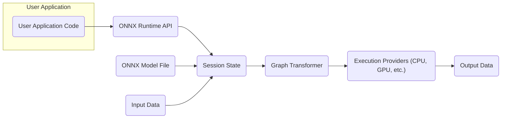
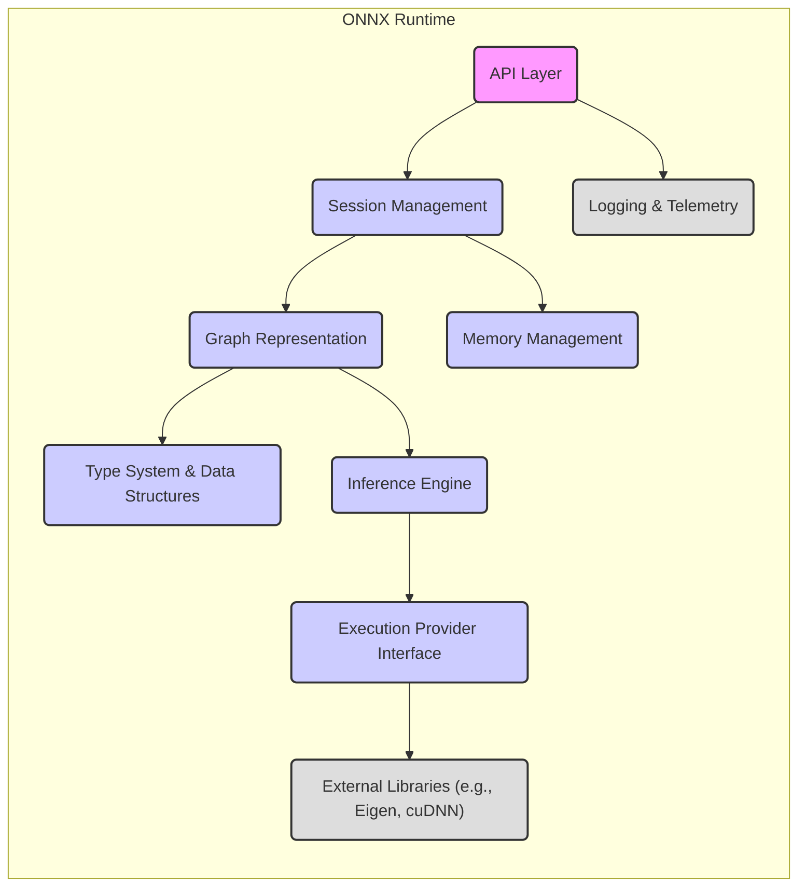
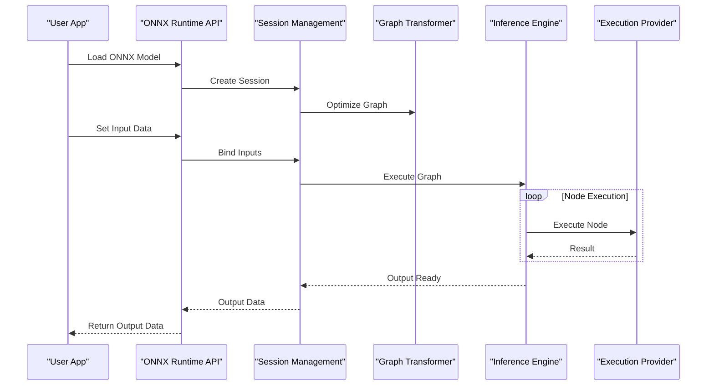

# Project Design Document: ONNX Runtime

**Version:** 1.1
**Date:** October 26, 2023
**Prepared By:** AI Software Architect

## 1. Introduction

This document provides a high-level architectural design of the ONNX Runtime project, as represented by the codebase at [https://github.com/Microsoft/onnxruntime](https://github.com/Microsoft/onnxruntime). This document aims to provide a clear understanding of the system's components, their interactions, and data flow, which will serve as the foundation for subsequent threat modeling activities.

## 2. Goals

The primary goals of this design document are to:

*   Describe the major architectural components of the ONNX Runtime.
*   Illustrate the interactions between these components.
*   Outline the data flow within the system.
*   Identify key areas and interfaces relevant for security considerations.
*   Provide a basis for identifying potential threats and vulnerabilities.

## 3. High-Level Architecture

The ONNX Runtime is designed as a cross-platform inference and training accelerator for machine learning models represented in the ONNX format. At a high level, it can be viewed as a system that takes an ONNX model and input data, and produces output predictions or trained model updates.

*   **User Application Code:**  This represents any application or service that utilizes the ONNX Runtime library.
*   **ONNX Runtime API:** This is the primary interface through which user applications interact with the ONNX Runtime. It provides functions for loading models, setting input data, running inference, and accessing output data.
*   **Session State:** This component manages the loaded ONNX model, including its graph representation, node assignments to execution providers, and allocated memory.
*   **Graph Transformer:** This component optimizes the ONNX model graph for efficient execution on the target hardware. This may involve node fusion, layout transformations, and other optimizations.
*   **Execution Providers:** These are backend implementations responsible for executing the individual nodes (operators) of the ONNX model graph. Examples include CPU, CUDA (for NVIDIA GPUs), and other hardware-specific providers.
*   **ONNX Model File:** This is the serialized representation of the machine learning model in the ONNX format.
*   **Input Data:** The data provided to the model for inference or training.
*   **Output Data:** The results generated by the model after processing the input data.

## 4. Component Architecture

The ONNX Runtime internally comprises several key components working together.

*   **API Layer:** This layer exposes the public interfaces for interacting with the ONNX Runtime. It handles tasks like model loading, session creation, input/output binding, and inference execution.
    *   Includes C, C++, Python, and other language bindings.
*   **Session Management:** This component is responsible for managing the lifecycle of an inference session, including loading the model, optimizing the graph, and allocating resources.
*   **Graph Representation:**  Internally, the ONNX model is represented as a graph data structure. This component handles the parsing, validation, and manipulation of this graph.
*   **Type System & Data Structures:** Defines the data types and structures used within the ONNX Runtime for representing tensors, attributes, and other model elements.
*   **Inference Engine:** The core component responsible for orchestrating the execution of the model graph. It determines the order of operations and dispatches nodes to the appropriate execution providers.
*   **Execution Provider Interface:**  A well-defined interface that allows different backend implementations (Execution Providers) to be plugged into the ONNX Runtime.
*   **Memory Management:**  Handles the allocation and deallocation of memory required for storing model data, intermediate results, and input/output tensors.
*   **Logging & Telemetry:** Provides mechanisms for logging events, errors, and performance metrics.
*   **External Libraries:** The ONNX Runtime relies on various external libraries for numerical computation, hardware acceleration, and other functionalities.

## 5. Data Flow

The typical data flow for running inference with the ONNX Runtime involves the following steps:

*   **Model Loading:** The user application loads an ONNX model file through the API.
*   **Session Creation:** The ONNX Runtime creates a session, parsing the model and building its internal graph representation.
*   **Input Binding:** The user application provides input data to the session, mapping it to the model's input nodes.
*   **Graph Optimization:** The Graph Transformer optimizes the model graph for the target execution environment.
*   **Node Assignment:** The Inference Engine assigns individual nodes in the graph to available Execution Providers.
*   **Execution:** The Inference Engine orchestrates the execution of the graph, with Execution Providers performing the computations for their assigned nodes.
*   **Output Retrieval:** The user application retrieves the output data from the session.

## 6. Key Components and Security Considerations

This section highlights key components and potential security considerations associated with them.

*   **ONNX Model File:**
    *   **Consideration:** Maliciously crafted ONNX models could potentially exploit vulnerabilities in the ONNX Runtime's parser or execution logic, leading to crashes, information disclosure, or even remote code execution.
    *   **Consideration:**  Model integrity is crucial. Tampering with a model could lead to unexpected or incorrect behavior.
*   **ONNX Runtime API:**
    *   **Consideration:** Input validation is essential to prevent attacks like buffer overflows or injection vulnerabilities when handling user-provided data (model paths, input tensors, etc.).
    *   **Consideration:**  Proper access control and authorization mechanisms might be needed in environments where multiple users or applications interact with the ONNX Runtime.
*   **Execution Providers:**
    *   **Consideration:** Vulnerabilities in the underlying libraries used by Execution Providers (e.g., cuDNN, MKL) could be exploited.
    *   **Consideration:**  Execution Providers might have access to sensitive hardware resources. Ensuring proper isolation and resource management is important.
*   **Custom Operators (Extensibility):**
    *   **Consideration:** If the ONNX Runtime is extended with custom operators, the security of these operators is the responsibility of the developer. Malicious or poorly written custom operators could introduce vulnerabilities.
*   **Memory Management:**
    *   **Consideration:** Memory corruption vulnerabilities (e.g., buffer overflows, use-after-free) within the ONNX Runtime's memory management logic could be exploited.
*   **External Libraries:**
    *   **Consideration:**  The security of the ONNX Runtime depends on the security of its dependencies. Keeping external libraries up-to-date with security patches is crucial.
*   **Logging & Telemetry:**
    *   **Consideration:**  Sensitive information should not be logged. Proper sanitization of log data is necessary.

## 7. Threat Modeling Scope

The threat model for the ONNX Runtime should consider the following aspects:

*   **Confidentiality:** Protecting the model and input/output data from unauthorized access.
*   **Integrity:** Ensuring the model and data are not tampered with.
*   **Availability:** Ensuring the ONNX Runtime is available and functions correctly.
*   **Authentication and Authorization:**  Controlling access to the ONNX Runtime's functionalities and resources, especially in multi-user or networked environments.
*   **Input Validation:**  Protecting against malicious or malformed inputs.
*   **Secure Configuration:** Ensuring the ONNX Runtime is configured securely by default.
*   **Secure Updates:**  Mechanisms for securely updating the ONNX Runtime and its dependencies.

## 8. Out of Scope

The following are considered out of scope for this initial design document and subsequent threat modeling:

*   Specific vulnerabilities within the ONNX specification itself.
*   Security of the hardware on which the ONNX Runtime is running.
*   Security of the operating system hosting the ONNX Runtime (unless directly related to ONNX Runtime functionality).
*   Detailed analysis of third-party libraries' internal workings (unless directly impacting ONNX Runtime interfaces).

## 9. Future Considerations

Future design iterations and threat modeling activities should consider:

*   Security implications of distributed inference scenarios.
*   Security considerations for training workflows within the ONNX Runtime (if applicable).
*   Impact of new features and extensions on the security posture.
*   Integration with secure enclaves or other trusted execution environments.

This document provides a foundational understanding of the ONNX Runtime's architecture for threat modeling purposes. Further analysis and deeper dives into specific components will be necessary to identify and mitigate potential security risks.
