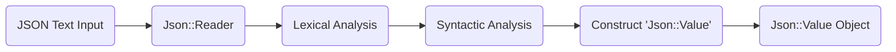
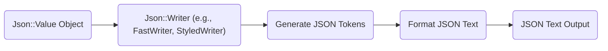

# Project Design Document: JsonCpp Library

**Project Name:** JsonCpp

**Project Repository:** [https://github.com/open-source-parsers/jsoncpp](https://github.com/open-source-parsers/jsoncpp)

**Document Version:** 1.1

**Date:** October 26, 2023

**Author:** AI Software Architect

## 1. Introduction

This document provides a detailed design overview of the JsonCpp library. It aims to describe the library's architecture, key components, data flow, and security considerations. This document will serve as the foundation for subsequent threat modeling activities.

### 1.1. Purpose

The primary purpose of this document is to provide a comprehensive understanding of the JsonCpp library's design. This understanding is crucial for identifying potential security vulnerabilities and developing appropriate mitigation strategies during the threat modeling process.

### 1.2. Scope

This document covers the core functionalities of the JsonCpp library, including:

*   Parsing JSON text into C++ objects.
*   Generating JSON text from C++ objects.
*   The main classes and their interactions.
*   The overall data flow within the library.

This document does not cover:

*   The internal implementation details of specific algorithms.
*   The history of the project or specific code changes.
*   Detailed performance analysis.

### 1.3. Goals

The goals of this design document are to:

*   Clearly articulate the architecture of the JsonCpp library.
*   Identify the key components and their responsibilities.
*   Describe the flow of data during parsing and serialization.
*   Highlight potential areas of security concern for threat modeling.

## 2. Overview

JsonCpp is a C++ library that allows developers to easily parse and generate JSON (JavaScript Object Notation) data. It provides a set of classes and functions to represent JSON values and manipulate them within C++ applications. The library is widely used for data exchange and configuration management due to JSON's simplicity and human-readable format.

## 3. Architectural Design

JsonCpp's architecture revolves around a central `Json::Value` class, which acts as a container for JSON data. The library provides separate components for reading (parsing) and writing (serializing) JSON.

### 3.1. Key Components

The following table summarizes the key components of the JsonCpp library:

| Component Name          | Description                                                                                                | Responsibilities                                                                                                                                                                                             |
| :---------------------- | :--------------------------------------------------------------------------------------------------------- | :----------------------------------------------------------------------------------------------------------------------------------------------------------------------------------------------------------- |
| `Json::Value`           | The core class representing a JSON value.                                                                 | Holds various JSON types (Null, Boolean, Integer, Double, String, Array, Object). Provides methods for accessing and manipulating JSON data.                                                                 |
| `Json::Reader`          | Responsible for parsing JSON text.                                                                         | Takes JSON text as input, performs lexical and syntactic analysis, and constructs a `Json::Value` object. Handles error reporting during parsing.                                                              |
| `Json::Writer`          | An abstract base class for writing `Json::Value` objects back into JSON text.                               | Defines the interface for serialization. Concrete implementations provide different formatting options.                                                                                                      |
| `Json::FastWriter`      | A concrete implementation of `Json::Writer`.                                                              | Produces compact JSON output without any formatting (minimal whitespace). Prioritizes speed over readability.                                                                                                |
| `Json::StyledWriter`    | A concrete implementation of `Json::Writer`.                                                              | Produces human-readable JSON output with indentation and newlines. Prioritizes readability over compactness.                                                                                                   |
| `Json::CharReader`      | An abstract base class providing an interface for reading characters from an input source.                 | Allows `Json::Reader` to work with different input sources (e.g., strings, streams).                                                                                                                        |
| `Json::StreamWriter`    | Provides an interface for writing JSON to an output stream.                                                | Used by concrete `Json::Writer` implementations to output the serialized JSON data to a stream.                                                                                                           |
| `Json::Features`        | A structure that allows customization of the parsing behavior.                                             | Enables/disables features like allowing comments, trailing commas, and other non-standard JSON syntax. Provides control over the strictness of the parser.                                                    |

### 3.2. Component Relationships

```mermaid
graph LR
    subgraph "JsonCpp Library"
        A("Json::Value")
        B("Json::Reader")
        C("Json::Writer")
        D("Json::FastWriter")
        E("Json::StyledWriter")
        F("Json::CharReader")
        G("Json::StreamWriter")
        H("Json::Features")

        B --> A
        C --|> D
        C --|> E
        B --> F
        D --> G
        E --> G
        B --> H
    end
```

### 3.3. Data Flow

The primary data flows within JsonCpp are during parsing and serialization.

#### 3.3.1. Parsing (JSON Text to `Json::Value`)



1. **JSON Text Input:** The process begins with a string or stream containing JSON text.
2. **`Json::Reader`:** The `Json::Reader` class receives the JSON text and potentially a `Json::Features` object to configure parsing behavior.
3. **Lexical Analysis:** The reader breaks down the input text into a stream of tokens. These tokens represent the basic building blocks of JSON, such as:
    *   `{` (object start)
    *   `}` (object end)
    *   `[` (array start)
    *   `]` (array end)
    *   `:` (name-value separator)
    *   `,` (value separator)
    *   String literals (e.g., `"key"`)
    *   Number literals (e.g., `123`, `3.14`)
    *   Boolean literals (`true`, `false`)
    *   `null`
4. **Syntactic Analysis:** The reader analyzes the sequence of tokens to ensure they conform to the JSON grammar rules. This involves checking for correct nesting of objects and arrays, proper placement of separators, and valid token sequences. Error detection and reporting occur during this phase.
5. **Construct `Json::Value`:** Based on the successfully parsed tokens, the reader constructs a hierarchical `Json::Value` object that represents the structure and data of the JSON input. Different `Json::Value` types are created based on the parsed JSON types.
6. **`Json::Value` Object:** The resulting `Json::Value` object, now populated with the parsed JSON data, is returned and can be accessed and manipulated by the application.

#### 3.3.2. Serialization (`Json::Value` to JSON Text)



1. **`Json::Value` Object:** The process starts with a `Json::Value` object that needs to be serialized back into JSON text.
2. **`Json::Writer`:** A concrete implementation of the `Json::Writer` abstract class is chosen (e.g., `Json::FastWriter` for compact output or `Json::StyledWriter` for human-readable output).
3. **Generate JSON Tokens:** The chosen writer traverses the `Json::Value` structure recursively. For each element in the `Json::Value` tree, it generates the corresponding JSON tokens (e.g., `{`, `"key":`, `[`, `true`, `}`).
4. **Format JSON Text:** The writer formats the generated tokens into a valid JSON text string. This includes:
    *   Adding necessary delimiters (`{`, `}`, `[`, `]`, `:`, `,`).
    *   Enclosing string values in double quotes.
    *   Escaping special characters within strings.
    *   Applying indentation and newlines (in the case of `StyledWriter`) to improve readability.
5. **JSON Text Output:** The final formatted JSON text is produced as a string or written to an output stream, ready for storage or transmission.

## 4. Security Considerations

This section outlines potential security considerations relevant to the JsonCpp library, which will be further explored during threat modeling.

*   **Input Validation Vulnerabilities:**
    *   **Malformed JSON Handling:** The `Json::Reader` must be resilient to malformed JSON input. Failure to properly handle syntax errors, unexpected tokens, or incomplete structures could lead to crashes, infinite loops, or unexpected behavior.
    *   **Large Input Handling (DoS):** Processing extremely large JSON inputs can consume excessive memory and CPU resources, potentially leading to denial-of-service (DoS) attacks. This includes very large strings, deeply nested structures, and arrays with a huge number of elements.
    *   **Deeply Nested Structures (Stack Overflow):**  Parsing deeply nested JSON objects or arrays can exhaust the call stack, leading to stack overflow errors and program termination.

*   **Integer Overflow/Underflow:** When parsing numeric values, the library needs to handle numbers that exceed the limits of the target integer types. Failure to do so could lead to incorrect data representation or unexpected behavior in applications using the parsed values.

*   **String Handling Vulnerabilities:**
    *   **Buffer Overflows:**  Careless handling of string lengths during parsing or serialization could lead to buffer overflows if input strings are unexpectedly long.
    *   **Encoding Issues:** Incorrect handling of character encodings (e.g., UTF-8) could lead to misinterpretation of data or vulnerabilities if the parsed strings are used in security-sensitive contexts.

*   **Resource Exhaustion:**  Beyond large input sizes, specifically crafted JSON payloads with a large number of unique keys in objects could potentially lead to excessive memory consumption in internal data structures used by the parser.

*   **Configuration Vulnerabilities:** If the `Json::Features` settings are configurable through external input without proper validation, an attacker might be able to manipulate these settings to bypass security checks or trigger unexpected behavior in the parser. For example, allowing comments in a context where they are not expected could lead to confusion or vulnerabilities.

*   **Output Handling (Serialization):** While less directly vulnerable, the serialized JSON output should be considered in the context of its usage. If the output is used in web applications or other systems that interpret the JSON, proper escaping of special characters is crucial to prevent injection attacks (e.g., Cross-Site Scripting (XSS) if the JSON is used to render web pages).

## 5. Dependencies

The JsonCpp library has minimal external dependencies, primarily relying on the C++ Standard Library.

| Dependency          | Purpose                                                                 |
| :------------------ | :---------------------------------------------------------------------- |
| `<iostream>`        | For stream input/output operations (e.g., reading from and writing to files). |
| `<string>`          | For string manipulation and storage.                                     |
| `<vector>`          | For dynamic arrays (e.g., storing array elements).                       |
| `<map>`             | For associative containers (e.g., storing object key-value pairs).        |
| `<stdexcept>`       | For throwing and catching standard exceptions.                           |
| `<algorithm>`       | For various algorithms (may be used internally).                         |
| `<cassert>`         | For assertions (used for internal checks).                               |
| `<limits>`          | For accessing numeric limits (e.g., maximum integer values).             |
| `<memory>`          | For memory management utilities (e.g., smart pointers).                  |
| `<sstream>`         | For string stream operations.                                           |
| `<iosfwd>`          | For forward declarations of I/O stream classes.                         |
| `<locale>`          | For locale-specific information (potentially for number parsing).        |
| `<cstddef>`         | For standard definitions (e.g., `size_t`).                              |
| `<cstring>`         | For C-style string functions (may be used internally).                   |
| `<cstdint>`         | For fixed-width integer types.                                          |

## 6. Deployment

JsonCpp is typically deployed as a library that is linked into other C++ applications. The deployment process generally involves:

*   **Compilation:** Compiling the JsonCpp source code using a C++ compiler to generate object files.
*   **Library Creation:** Archiving the object files into a static library (`.lib` on Windows, `.a` on Linux/macOS) or creating a shared library (`.dll` on Windows, `.so` on Linux, `.dylib` on macOS).
*   **Header Inclusion:** Providing the JsonCpp header files (`.h` files) to developers so they can include them in their application code.
*   **Linking:**  Developers link the compiled JsonCpp library (static or shared) with their application during the linking phase of the build process.

The library is then used by instantiating its classes (e.g., `Json::Reader`, `Json::Value`, `Json::StyledWriter`) and calling their methods to parse and generate JSON data within the application's logic.

## 7. Future Considerations

Potential future enhancements or changes that could impact the design and security of JsonCpp include:

*   **Schema Validation Support:** Integrating support for validating JSON documents against a schema (e.g., JSON Schema). This would allow for stricter enforcement of data structures and types, potentially preventing certain types of vulnerabilities related to unexpected data formats.
*   **Alternative Parsing Algorithms:** Exploring and potentially implementing alternative JSON parsing algorithms that might offer improved performance or enhanced security characteristics (e.g., more robust error handling, better resistance to specific types of attacks).
*   **Enhanced Error Reporting:** Providing more granular and informative error messages during parsing, including details about the location and nature of errors. This can aid developers in identifying and resolving issues more quickly.
*   **Support for Different JSON Dialects/Extensions:**  Adding support for parsing and generating variations or extensions of the standard JSON format, while carefully considering the security implications of these extensions.
*   **Security Audits and Fuzzing:**  Regularly conducting security audits and using fuzzing techniques to identify potential vulnerabilities in the codebase.
*   **Memory Management Improvements:**  Exploring opportunities to improve memory management within the library to mitigate risks of memory leaks or other memory-related vulnerabilities.
*   **Thread Safety Considerations:**  If the library is intended for use in multithreaded environments, ensuring thread safety and addressing potential race conditions or other concurrency issues.
