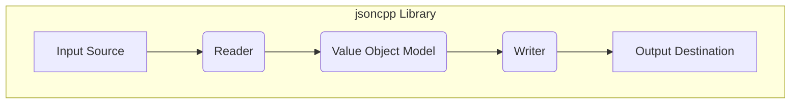
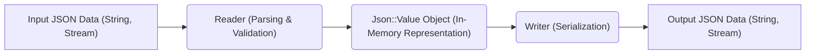

## Project Design Document: jsoncpp Library (Improved)

**1. Introduction**

This document provides an enhanced design overview of the jsoncpp library, an open-source C++ library for parsing and generating JSON (JavaScript Object Notation). This improved version provides more detailed information suitable for comprehensive threat modeling activities.

**2. Project Overview**

The jsoncpp library enables C++ applications to seamlessly interact with JSON data. It offers functionalities for reading JSON from diverse input sources (in-memory strings, input streams like `std::ifstream`), parsing this data into a structured in-memory representation, manipulating this representation programmatically, and subsequently writing the modified or newly created JSON back to various output destinations (in-memory strings, output streams like `std::ofstream`). The library prioritizes portability across different operating systems and compilers, alongside efficient performance.

**3. Goals**

* Provide a highly robust and reliable C++ API for parsing JSON documents adhering to relevant standards.
* Offer comprehensive functionalities for generating valid JSON from C++ data structures.
* Ensure straightforward integration into a wide range of existing C++ projects with minimal dependencies.
* Maintain a strong focus on performance for both parsing and generation operations.
* Achieve broad portability across major operating systems (Windows, Linux, macOS) and C++ compilers (GCC, Clang, MSVC).
* Offer a flexible and extensible design that allows for customization and adaptation to specific needs.

**4. Non-Goals**

* Implementing network-related functionalities for directly fetching JSON data from remote network locations (e.g., HTTP requests). This remains the responsibility of the application using jsoncpp.
* Incorporating a specific, built-in JSON schema validation mechanism within the core library. While extension points might exist, core validation is out of scope.
* Providing direct language bindings for programming languages other than C++. Interoperability with other languages would typically involve separate binding projects.
* Guaranteeing strict real-time performance characteristics or deterministic execution times. The library is designed for general-purpose JSON processing.

**5. Target Audience**

The primary target audience for the jsoncpp library consists of C++ software developers requiring JSON data manipulation capabilities within their applications. This includes developers working on:

* Backend web services and RESTful APIs that exchange data in JSON format.
* Applications utilizing JSON for configuration file management and parsing.
* Systems requiring data serialization and deserialization using JSON as the interchange format.
* Applications employing inter-process communication (IPC) mechanisms where JSON serves as the data payload format.

**6. High-Level Architecture**

* **Input Source:** Represents the origin of the JSON data to be processed. Common examples include:
    * In-memory strings (`std::string`).
    * Input file streams (`std::ifstream`).
    * Network sockets (handled by the application, providing data to the Reader).
* **Reader:** This is the core parsing component. Its responsibilities include:
    * Consuming character data from the Input Source.
    * Performing lexical analysis to break the input stream into meaningful tokens.
    * Parsing the sequence of tokens according to the JSON grammar rules.
    * Constructing the in-memory representation of the JSON data using the `Value Object Model`.
    * Handling and reporting potential parsing errors and exceptions encountered during the process.
    * Supporting configurable parsing options, such as allowing comments or trailing commas in the JSON input.
* **Value Object Model:** This component serves as the central data structure within jsoncpp, representing the parsed JSON data in a hierarchical manner. Key features include:
    * Support for all standard JSON data types: objects, arrays, strings, numbers (integers and floating-point), booleans, and the null value.
    * Mechanisms for accessing and manipulating the contained JSON values, allowing developers to traverse and modify the data structure.
    * Type safety features to help prevent accidental misuse of data.
* **Writer:** This component is responsible for the reverse process of generating JSON output. Its functionalities include:
    * Accepting the `Value Object Model` as input.
    * Serializing the in-memory representation into a valid JSON string.
    * Writing the generated JSON string to the specified Output Destination.
    * Offering various output formatting options, such as pretty-printing with indentation for readability or compact output without extra whitespace for efficiency.
* **Output Destination:** Represents the destination where the generated JSON data is sent. Examples include:
    * In-memory strings (`std::string`).
    * Output file streams (`std::ofstream`).
    * Network sockets (handled by the application, receiving data from the Writer).

**7. Detailed Design**

This section provides a more in-depth look at the internal workings of the key components.

**7.1. Reader**

* **Responsibilities:** (Expanded)
    * Reads raw character data from the provided input source using an abstraction like `Json::CharReader`.
    * Implements a state machine-based parser to process the JSON syntax.
    * Performs validation of the input against the JSON specification (RFC 7159 or similar).
    * Handles different character encodings, typically assuming UTF-8.
    * Manages memory allocation for the `Value` objects being created.
    * Provides error reporting with details about the location and nature of parsing errors.
    * Supports features like allowing C-style comments or trailing commas through parser configuration.
* **Key Classes/Interfaces:**
    * `Json::Reader`: The primary class used for initiating and controlling the JSON parsing process.
    * `Json::CharReader`: An abstract base class defining the interface for reading characters from an input source. Concrete implementations include:
        * `Json::StreamReader`: Reads from `std::istream`.
        * Potentially custom implementations for reading from other sources.
    * Internal classes and data structures for managing the parser state, token stream, and error information.
* **Security Considerations:** (More Specific)
    * **Input Validation Vulnerabilities:** Failure to properly validate input can lead to vulnerabilities like:
        * **Malformed JSON Exploits:**  Crafted invalid JSON could cause parsing errors leading to crashes or unexpected behavior.
        * **Denial of Service (DoS):**  Extremely large or deeply nested JSON structures could exhaust memory or CPU resources.
    * **Resource Exhaustion:**
        * **Memory Allocation Issues:**  Parsing very large JSON documents could lead to excessive memory allocation, potentially causing out-of-memory errors and crashes.
        * **Stack Overflow:**  Parsing deeply nested structures might exceed stack limits in recursive parsing implementations (though jsoncpp is generally iterative).
    * **Integer Overflow:** When parsing numerical values, especially large integers, the library must handle potential overflows to prevent incorrect data representation or security issues in downstream code.
    * **Buffer Overflow:** While jsoncpp manages its own memory, vulnerabilities could arise if string handling within the parser is not carefully implemented, potentially leading to buffer overflows if excessively long strings are encountered.

**7.2. Value Object Model (Json::Value)**

* **Responsibilities:** (Expanded)
    * Dynamically stores JSON data of various types.
    * Provides a flexible API for accessing and modifying JSON elements using array-like and object-like syntax.
    * Manages the lifetime of the stored data, including memory allocation and deallocation.
    * Offers methods for querying the type of a stored value.
    * Supports implicit and explicit type conversions between compatible JSON types.
    * Can be serialized and deserialized by the `Writer` and `Reader` components.
* **Key Classes/Interfaces:**
    * `Json::Value`: The central class representing a JSON value. It can hold any valid JSON data type. Internally, it might use a tagged union or a similar mechanism to store different types.
    * Enumerations or constants defining the different JSON value types (object, array, string, etc.).
    * Methods like `operator[]`, `get()`, `set()`, `isObject()`, `isArray()`, `asString()`, `asInt()`, etc., for accessing and manipulating the stored data.
* **Security Considerations:** (More Specific)
    * **Memory Management Issues:**
        * **Memory Leaks:** Improper deallocation of memory associated with `Json::Value` objects could lead to memory leaks if not handled carefully by the application.
        * **Dangling Pointers/References:**  Care must be taken to avoid accessing `Json::Value` objects after they have been deallocated.
    * **Type Confusion Vulnerabilities:**  Incorrectly assuming the type of a `Json::Value` and performing inappropriate operations could lead to unexpected behavior or security flaws in the application logic. For example, treating a string as an integer.

**7.3. Writer**

* **Responsibilities:** (Expanded)
    * Accepts a `Json::Value` object as input, representing the JSON data to be serialized.
    * Traverses the `Json::Value` structure recursively or iteratively.
    * Generates the corresponding JSON string representation based on the data types and values.
    * Handles different output formatting styles, including:
        * **Styled Output:**  Indented and formatted for human readability.
        * **Fast Output:**  Minimal whitespace for efficiency and reduced size.
    * Provides options for controlling the output encoding (typically UTF-8).
    * May offer options to escape non-ASCII characters or control the representation of special characters.
* **Key Classes/Interfaces:**
    * `Json::Writer`: An abstract base class defining the interface for writing JSON.
    * Concrete implementations:
        * `Json::StyledWriter`: Produces human-readable, indented JSON.
        * `Json::FastWriter`: Generates compact JSON with minimal whitespace.
        * Potentially custom writer implementations.
    * Internal logic for converting `Json::Value` types to their JSON string representations.
* **Security Considerations:** (More Specific)
    * **Output Encoding Issues:**  Incorrect output encoding could lead to:
        * **Character Encoding Vulnerabilities:**  If the output encoding doesn't match the expected encoding of the receiving system, it could lead to misinterpretation of data or security issues.
        * **Injection Vulnerabilities:**  If special characters are not properly escaped according to the output encoding, it could open doors for injection attacks if the JSON is used in a context where it might be interpreted as code.
    * **Injection Attacks:** If the data within the `Json::Value` originates from untrusted sources, the `Writer` must properly escape special characters (e.g., `<`, `>`, `&`, quotes) to prevent JSON injection attacks when the output is used in web contexts or other systems where the JSON might be interpreted. Failure to do so could allow attackers to inject malicious data or scripts.

**8. Data Flow**

The typical data flow within the jsoncpp library remains as described before, but with more context:

1. **Input JSON Data:** Raw JSON data is provided to the `Reader`. This data can originate from various sources.
2. **Reader (Parsing & Validation):** The `Reader` parses the input, validating its structure and syntax according to the JSON specification. It constructs the `Json::Value` object.
3. **Json::Value Object:** This object holds the parsed JSON data in a structured, in-memory format.
4. **Writer (Serialization):** The `Writer` takes the `Json::Value` object and serializes it back into a JSON string.
5. **Output JSON Data:** The generated JSON string is sent to the designated output destination.

**9. Key Security Considerations (for Threat Modeling)**

This section provides a more structured list of security considerations relevant for threat modeling:

* **Input Handling and Validation:**
    * **Malformed JSON Handling:** How does the library handle syntactically invalid JSON? Does it throw exceptions, return error codes, or exhibit undefined behavior?
    * **Maximum Input Size:** Are there limits on the size of JSON documents that can be parsed to prevent resource exhaustion?
    * **Nesting Depth Limits:** Are there limits on the nesting depth of JSON objects and arrays to prevent stack overflow or excessive memory usage?
    * **Handling of Non-Standard JSON:**  If the application allows parsing of JSON with extensions (e.g., comments), understand the security implications.
* **Resource Management:**
    * **Memory Allocation:** How does the library manage memory allocation for `Json::Value` objects? Are there potential memory leaks?
    * **CPU Usage:**  Can maliciously crafted JSON cause excessive CPU usage during parsing?
* **Data Integrity:**
    * **Integer Overflow/Underflow:** How are large numerical values handled to prevent overflows or underflows?
    * **Floating-Point Precision:** Be aware of potential precision issues when handling floating-point numbers.
* **Output Handling and Escaping:**
    * **Character Encoding:** Ensure the output encoding is appropriate for the intended use of the JSON data.
    * **Injection Prevention:**  If JSON data is used in contexts where injection is a risk (e.g., web applications), ensure proper escaping of special characters.
* **Dependency Security:**
    * **Third-Party Dependencies:** Are there any third-party dependencies with known vulnerabilities? (jsoncpp generally has minimal dependencies).
* **Error Handling:**
    * **Information Disclosure:** Do error messages reveal sensitive information about the system or data?
    * **Failure Modes:** How does the library behave in error conditions? Does it fail safely?

**10. Deployment Considerations**

Deployment considerations remain similar, but with added emphasis on security:

* **Supply Chain Security:** Verify the integrity of the jsoncpp library source code and binaries. Use trusted sources for downloads.
* **Secure Build Process:** Implement secure build practices to prevent tampering with the library during compilation.
* **Least Privilege:** Ensure that applications using jsoncpp operate with the minimum necessary privileges.

**11. Future Considerations**

Future enhancements with potential security implications:

* **Schema Validation:** Integrating schema validation could help prevent processing of unexpected or malicious data structures.
* **Security Audits:** Regular security audits and penetration testing are crucial for identifying and addressing potential vulnerabilities.
* **Fuzzing:** Using fuzzing techniques to test the library's robustness against malformed inputs.

This improved design document provides a more detailed and security-focused overview of the jsoncpp library, intended to be a valuable resource for comprehensive threat modeling activities.