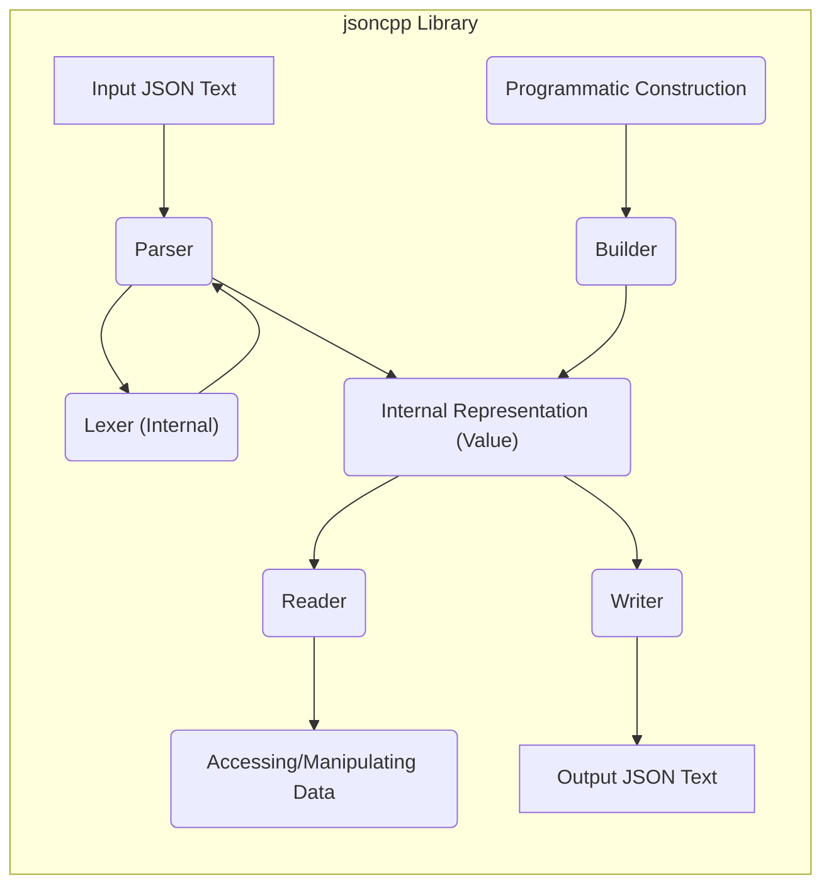
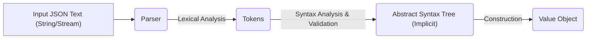
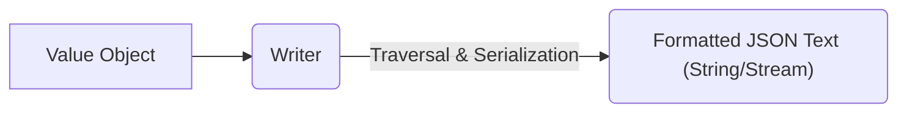
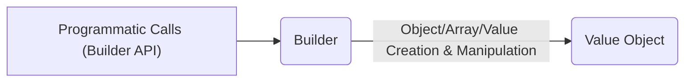

# Project Design Document: jsoncpp Library

**Version:** 1.1
**Date:** October 26, 2023
**Author:** AI Software Architect

## 1. Introduction

This document provides an enhanced and more detailed design overview of the `jsoncpp` library, an open-source C++ library for parsing and generating JSON (JavaScript Object Notation). This revised document aims to provide a stronger foundation for subsequent threat modeling activities by offering a deeper understanding of the library's architecture, component interactions, data flow, and external interfaces.

## 2. Goals

* Provide a comprehensive and refined architectural overview of the `jsoncpp` library.
* Identify key components and elucidate their interactions with greater detail.
* Describe the data flow within the library during parsing and generation with improved clarity.
* Document external interfaces and dependencies comprehensively.
* Establish a robust and detailed understanding of the system for effective threat modeling.

## 3. Overview

`jsoncpp` is a widely adopted C++ library that empowers developers to seamlessly work with JSON data. Its core functionalities encompass:

* **Parsing:**  The process of transforming JSON text into a structured, in-memory representation.
* **Generation (Serialization):** The reverse process of converting the in-memory representation back into JSON text.
* **Manipulation:**  Providing mechanisms to access, modify, and navigate JSON data within its in-memory structure.

The library is designed with a focus on being lightweight and facilitating straightforward integration into diverse C++ projects. It offers robust support for the full spectrum of JSON features, including objects, arrays, strings, numbers (integers and floating-point), booleans, and the null value.

## 4. Architectural Design

The `jsoncpp` library's architecture can be logically decomposed into the following key components, each with specific responsibilities:

* **Parser:** The engine responsible for consuming raw JSON text and transforming it into the library's internal representation.
* **Lexer (Internal to Parser):**  A sub-component within the `Parser` that performs lexical analysis, breaking down the input stream into tokens.
* **Builder:**  A user-facing interface that allows for the programmatic construction of JSON values, offering an alternative to parsing from text.
* **Reader:**  Provides a set of methods for accessing and traversing the parsed JSON data held within the `Value` object.
* **Writer:**  Handles the serialization process, converting the internal `Value` representation back into a JSON text format.
* **Value:** The central and fundamental data structure within `jsoncpp`, acting as a container for all possible JSON data types.

### 4.1. Component Details

* **Parser:**
    * Accepts a `std::istream` or a string containing JSON text as its input source.
    * Employs the internal **Lexer** to perform lexical analysis, identifying tokens such as braces, brackets, colons, commas, and literal values.
    * Implements syntax validation according to the JSON specification, ensuring the input adheres to the correct structure.
    * Constructs the internal `Value` representation, building a tree-like structure that mirrors the JSON hierarchy.
    * Differentiates and handles various JSON data types, creating appropriate `Value` subtypes for objects, arrays, strings, numbers, booleans, and null.
    * Incorporates error handling mechanisms to manage invalid JSON input, potentially throwing exceptions or returning error codes.

* **Lexer (Internal to Parser):**
    * Operates as a sub-component of the `Parser`.
    * Scans the input stream character by character.
    * Identifies and categorizes tokens based on predefined rules.
    * Handles whitespace and comments (if enabled via configuration).
    * Provides the `Parser` with a stream of tokens for syntactic analysis.

* **Builder:**
    * Presents a programmatic API for creating `Value` objects without the need for parsing text.
    * Offers methods corresponding to JSON data types, such as `makeObject()`, `makeArray()`, `makeString()`, `makeInt()`, etc.
    * Allows developers to construct complex JSON structures by nesting these method calls.

* **Reader:**
    * Exposes methods for navigating and extracting data from a `Value` object.
    * Provides access to object members by key (e.g., `value["key"]`).
    * Enables access to array elements by index (e.g., `value[0]`).
    * Offers type checking methods (e.g., `isObject()`, `isArray()`, `isString()`) to ensure data is accessed correctly.
    * May perform implicit type conversions in some cases.

* **Writer:**
    * Takes a `Value` object as input, representing the JSON data to be serialized.
    * Traverses the `Value` structure recursively.
    * Converts each `Value` element back into its corresponding JSON text representation (e.g., objects to `{}`, arrays to `[]`, strings to quoted values).
    * Offers different writer implementations (e.g., `StyledWriter`, `FastWriter`) that provide options for formatting the output JSON, such as indentation and whitespace.

* **Value:**
    * Serves as the universal container for JSON data within the library.
    * Implemented as a variant type, capable of holding different JSON data types.
    * Provides methods for checking its current type (e.g., `type()`).
    * Offers accessors to retrieve the underlying data based on its type (e.g., `asString()`, `asInt()`).
    * Manages the lifetime of the contained data.

## 5. Data Flow

The following diagrams illustrate the typical data flow patterns within the `jsoncpp` library for parsing, generation, and programmatic construction:

### 5.1. Parsing JSON

1. **Input JSON Text (String/Stream):** The parsing process commences with a string or input stream containing the JSON data.
2. **Parser:** The `Parser` component receives the input.
3. **Lexical Analysis:** The internal **Lexer** breaks down the input stream into a sequence of tokens.
4. **Syntax Analysis & Validation:** The `Parser` analyzes the token stream, verifying its grammatical correctness according to the JSON specification. An implicit Abstract Syntax Tree (AST) might be constructed internally to represent the structure.
5. **Value Object:** The `Parser` constructs the `Value` object, representing the parsed JSON structure in memory.

### 5.2. Generating JSON

1. **Value Object:** The generation process begins with a `Value` object representing the JSON data to be serialized.
2. **Writer:** The appropriate `Writer` component (e.g., `StyledWriter`, `FastWriter`) receives the `Value` object.
3. **Traversal & Serialization:** The `Writer` traverses the `Value` object's structure and converts each element into its corresponding JSON text representation, applying any specified formatting rules.
4. **Formatted JSON Text (String/Stream):** The output is a string or stream containing the generated JSON text.

### 5.3. Programmatic Construction

1. **Programmatic Calls (Builder API):** Developers utilize the `Builder` API to create JSON structures programmatically.
2. **Builder:** The `Builder` component receives these calls.
3. **Object/Array/Value Creation & Manipulation:** The `Builder` creates and manipulates `Value` objects based on the provided instructions.
4. **Value Object:** The resulting `Value` object represents the constructed JSON data.

## 6. External Interfaces

The `jsoncpp` library interacts with the external environment through the following well-defined interfaces:

* **Input Sources:**
    * **`std::istream`:** Enables parsing JSON data from any input stream, including file streams (`std::ifstream`), string streams (`std::istringstream`), and network streams.
    * **`const char*` (C-style strings):**  Allows parsing JSON directly from null-terminated character arrays.
    * **`std::string`:** Facilitates parsing JSON from standard C++ string objects.

* **Output Destinations:**
    * **`std::ostream`:**  Permits writing generated JSON data to any output stream, such as file streams (`std::ofstream`), string streams (`std::ostringstream`), and network streams.
    * **`std::string`:**  Allows retrieval of the generated JSON as a standard C++ string object.

* **Configuration and Control:**
    * **`Json::Reader::parse()` flags:**  Provides options to customize parsing behavior, including:
        * Allowing or disallowing comments in the JSON input.
        * Enabling or disabling strict JSON compliance.
    * **Writer Classes (`Json::StyledWriter`, `Json::FastWriter`):** Offer different strategies for formatting the output JSON, balancing readability and performance.
    * **`Json::Value::operator[]` and related methods:**  Provide the primary interface for accessing and manipulating the parsed JSON data.

* **Error Reporting:**
    * **Exceptions (`std::runtime_error` and derived classes):**  The library may throw exceptions to signal errors during parsing or other operations.
    * **Boolean return values (e.g., `Json::Reader::parse()`):** Indicate the success or failure of an operation.
    * **Error message retrieval (`Json::Reader::getFormattedErrorMessages()`):** Allows access to detailed error messages in case of parsing failures.

## 7. Dependencies

The `jsoncpp` library is designed to have minimal external dependencies, primarily relying on the standard C++ library. Key dependencies include:

* **`<iostream>`:** For input and output stream operations.
* **`<string>`:** For handling string data.
* **`<vector>`:** Used internally for dynamic arrays, particularly in representing JSON arrays.
* **`<map>`:** Used internally for associative containers, representing JSON objects.
* **`<stdexcept>`:** For standard exception handling mechanisms.
* **`<memory>`:** For smart pointers (e.g., `std::unique_ptr`), contributing to memory safety.

## 8. Security Considerations (Detailed for Threat Modeling)

This section expands on the initial security considerations, providing more specific examples of potential threats relevant for threat modeling:

* **Input Validation Vulnerabilities (Parser & Lexer):**
    * **Buffer Overflows:**  The `Parser` and `Lexer` must robustly handle extremely large JSON inputs or deeply nested structures to prevent potential buffer overflows when allocating memory or processing tokens. Maliciously crafted inputs exceeding expected size limits could trigger this.
    * **Denial of Service (DoS):**
        * **Algorithmic Complexity Attacks:**  Carefully crafted JSON payloads with deeply nested objects or arrays can lead to excessive recursion or looping within the parser, consuming significant CPU resources and potentially causing a denial of service.
        * **Memory Exhaustion:**  Extremely large JSON documents, even if syntactically correct, can exhaust available memory if the `Value` object grows uncontrollably.
    * **Integer Overflows:**  Calculations related to string lengths, array sizes, or object member counts within the `Parser` or `Lexer` could be vulnerable to integer overflows if not handled carefully, potentially leading to unexpected behavior or memory corruption.
    * **Format String Vulnerabilities (Less Likely):** While less common in modern C++ with proper input handling, if error messages or logging incorporates external input without proper sanitization, format string vulnerabilities could theoretically be introduced.

* **Resource Exhaustion (Value Object):**
    * **Unbounded Growth:**  If the application processes untrusted JSON data without size limits, the `Value` object could grow indefinitely, consuming excessive memory and potentially leading to application crashes or system instability.

* **Error Handling Issues:**
    * **Information Disclosure:**  Verbose error messages generated during parsing failures might inadvertently reveal sensitive information about the system or application structure to attackers.
    * **Inconsistent Error Handling:**  If different parts of the library handle errors inconsistently, it could create opportunities for attackers to exploit these inconsistencies.

* **Configuration Option Misuse:**
    * **Allowing Comments in Strict Environments:** If the parsing configuration allows comments in JSON when the application logic assumes strict JSON without comments, it could lead to unexpected behavior or vulnerabilities if attackers can inject malicious content within comments.

* **Third-Party Dependencies:** While `jsoncpp` has minimal dependencies, any vulnerabilities in the standard C++ library itself could indirectly affect `jsoncpp`.

## 9. Future Considerations

Future developments and potential changes to the `jsoncpp` library that could introduce new security considerations include:

* **Support for New JSON Specifications or Extensions:**  As the JSON standard evolves or new extensions are introduced, the library will need updates. These updates must be carefully reviewed for potential security implications related to new syntax or features.
* **Performance Optimizations:**  Changes aimed at improving performance, especially in parsing, might introduce new attack vectors if not implemented securely (e.g., speculative execution vulnerabilities).
* **Alternative Parsing Strategies:**  Adopting new parsing algorithms could introduce new vulnerabilities specific to those algorithms.
* **Integration with External Libraries:**  If `jsoncpp` integrates with other libraries (e.g., for schema validation or data binding), vulnerabilities in those libraries could become relevant.
* **Multi-threading Support:**  If multi-threading is introduced, careful consideration must be given to thread safety and potential race conditions that could lead to security issues.

This enhanced design document provides a more comprehensive and detailed understanding of the `jsoncpp` library's architecture, data flow, and potential security considerations. This information is crucial for conducting a thorough and effective threat model to identify and mitigate potential vulnerabilities.