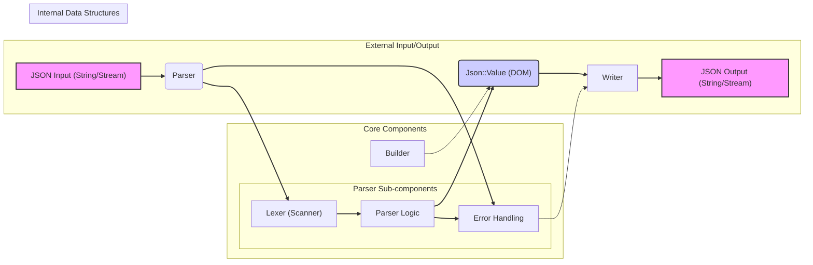

# Project Design Document: jsoncpp Library for Threat Modeling (Improved)

**Project Name:** jsoncpp

**Project Repository:** [https://github.com/open-source-parsers/jsoncpp](https://github.com/open-source-parsers/jsoncpp)

**Version:**  (This document is based on the current state of the repository as of October 26, 2023.  Specific versions should be referenced for actual threat modeling.)

**Document Version:** 1.1

**Date:** October 27, 2023

**Author:** AI Software Architect

## 1. Introduction

This document provides an enhanced design overview of the jsoncpp library, an open-source C++ library for parsing and generating JSON data. It is specifically tailored for use in threat modeling activities. The document details the architecture, key components, data flow, and functionalities of jsoncpp to facilitate the identification and analysis of potential security vulnerabilities. This improved version aims for greater clarity, detail, and a stronger focus on security considerations relevant to threat modeling.

## 2. Project Overview

jsoncpp is a widely adopted C++ library designed to simplify working with JSON data. Its core functionalities include:

*   **JSON Parsing:**  Transforming JSON formatted input (strings or streams) into an in-memory C++ representation using the `Json::Value` class.
*   **JSON Generation:**  Converting `Json::Value` objects back into JSON formatted output (strings or streams).
*   **JSON Data Manipulation:**  Providing a C++ API to programmatically access, modify, and construct JSON data structures represented by `Json::Value`.

The library prioritizes portability, efficiency, and ease of integration into C++ projects. It is primarily used in applications requiring JSON data exchange, such as web services, configuration management, data serialization, and inter-process communication.

## 3. System Architecture

The following diagram illustrates the refined high-level architecture of the jsoncpp library, highlighting key sub-components within the Parser.

### 3.1. Component Description (Detailed)

*   **"JSON Input (String/Stream)"**: The entry point for JSON data. It accepts JSON text as:
    *   C++ `std::string` objects.
    *   Input streams like `std::istream` (e.g., file streams, network streams).
    *   Character arrays (less common in typical usage but potentially supported).

*   **"Parser"**: The central component responsible for transforming JSON input into the `Json::Value` DOM. It is further divided into:
    *   **"Lexer (Scanner)"**:  This sub-component performs lexical analysis. It reads the input stream character by character and groups them into tokens based on JSON syntax rules. Tokens represent keywords (e.g., `true`, `false`, `null`), literals (strings, numbers), operators (`:`, `,`, `[`, `{`, `]`, `}`), and whitespace.  The lexer is responsible for:
        *   Identifying token boundaries.
        *   Classifying tokens (e.g., STRING_LITERAL, NUMBER_TOKEN, BEGIN_OBJECT).
        *   Potentially handling character encoding (e.g., UTF-8 decoding).
    *   **"Parser Logic"**: This sub-component takes the stream of tokens from the Lexer and applies JSON grammar rules to construct the `Json::Value` object. It implements the parsing algorithm (e.g., recursive descent parsing). Key responsibilities include:
        *   Validating token order and structure against JSON grammar.
        *   Building the hierarchical `Json::Value` tree representing objects and arrays.
        *   Handling different JSON value types (string, number, boolean, null, object, array).
        *   Invoking "Error Handling" for syntax violations or semantic errors.

*   **"Json::Value (DOM)"**:  The core data structure representing JSON data in memory. It's a variant type capable of holding any valid JSON value. Key features:
    *   **Tree-like Structure:** Represents JSON objects and arrays as nested structures, allowing for hierarchical data representation.
    *   **Variant Type:** Can store different JSON types (object, array, string, number, boolean, null) within a single `Json::Value` instance.
    *   **API for Access and Manipulation:** Provides methods to access elements within objects and arrays (e.g., using string keys for objects, integer indices for arrays), modify existing values, and add new values.
    *   **Memory Management:**  Manages the memory allocation and deallocation for the JSON data it holds.

*   **"Builder"**:  Provides a programmatic interface to construct `Json::Value` objects directly in C++ code, without parsing from a JSON string. This is useful for programmatically creating JSON data. It offers a more type-safe and structured approach compared to string manipulation.

*   **"Writer"**:  Performs the reverse operation of the parser, converting a `Json::Value` object back into a JSON formatted string or stream.  Different writer styles are typically supported:
    *   **Styled/Pretty-printed Output:**  Generates human-readable JSON with indentation and whitespace for formatting.
    *   **Compact Output:**  Produces minimal JSON output without extra whitespace, optimized for size.
    *   **Stream Output:**  Writes JSON directly to an output stream (e.g., `std::ostream`).

*   **"JSON Output (String/Stream)"**: The output of the library, representing the JSON data serialized by the "Writer". This can be:
    *   C++ `std::string` objects containing the JSON text.
    *   Output streams like `std::ostream` where the JSON is written.

*   **"Error Handling"**:  A critical component for managing errors during parsing and writing.  Responsibilities include:
    *   **Syntax Error Detection:** Identifying violations of JSON syntax during parsing (e.g., unexpected tokens, missing delimiters).
    *   **Semantic Error Detection:**  Detecting logical errors (though JSON itself has limited semantics, issues like duplicate keys in some contexts might be considered).
    *   **Error Reporting:** Providing informative error messages, including location (line/column) of the error in the input, and error type. Error reporting mechanisms might include exceptions, error codes, or status flags.
    *   **Resource Exhaustion Handling:**  Managing situations where parsing or writing might consume excessive resources (e.g., memory limits).

## 4. Data Flow (Detailed)

The data flow within jsoncpp involves the following stages:

1.  **Input Stage:** JSON data enters the "JSON Input (String/Stream)" component.
2.  **Parsing Stage:**
    *   The "Parser" receives the input.
    *   The "Lexer" tokenizes the input stream.
    *   The "Parser Logic" analyzes the tokens, validates JSON syntax, and constructs the `Json::Value` DOM.
    *   During parsing, if syntax errors are encountered, the "Error Handling" component is invoked to report the error and potentially halt parsing.
3.  **In-Memory Representation Stage:** The parsed JSON data is now represented as a `Json::Value` object in memory.
4.  **Application Processing Stage (Optional):**  The application code interacts with the `Json::Value` object to access, modify, or query the JSON data. This stage is outside the scope of jsoncpp library itself but is where vulnerabilities in application logic using jsoncpp might arise.
5.  **Serialization Stage:**
    *   When JSON output is required, the `Json::Value` object is passed to the "Writer".
    *   The "Writer" serializes the `Json::Value` back into JSON text according to the chosen output style (e.g., styled or compact).
    *   During writing, if errors occur (e.g., issues with output stream), the "Error Handling" component might be invoked.
6.  **Output Stage:** The JSON formatted text is outputted through the "JSON Output (String/Stream)" component.

**Error Flow:**  If errors are detected during parsing or writing, the "Error Handling" component is activated. The error information is then typically propagated back to the calling application, often through exceptions or error codes. The application is responsible for handling these errors appropriately.

## 5. Technology Stack

*   **Programming Language:** C++ (Primarily targeting C++98/03 compatibility for broad adoption, with some features potentially leveraging later C++ standards where available).
*   **Build System:** CMake (for cross-platform build configuration and management).
*   **Standard Library:**  Relies heavily on the C++ Standard Library (STL) for core functionalities like string manipulation, input/output streams, and data structures.
*   **External Dependencies:**  Designed to be largely self-contained, minimizing external dependencies to enhance portability and reduce dependency-related security risks.  Ideally, it should only depend on standard C++ library components.

## 6. Security Considerations for Threat Modeling (Component-Focused)

This section details security considerations organized by component, providing a more targeted approach for threat modeling.

**6.1. Parser Component (Lexer & Parser Logic)**

*   **Input Validation Vulnerabilities:**
    *   **Malformed JSON Handling:**
        *   **Issue:**  Failure to correctly handle syntactically invalid JSON input could lead to crashes, unexpected behavior, or denial of service.
        *   **Threats:** DoS, potentially information disclosure if error messages reveal internal state.
    *   **Large/Deeply Nested JSON:**
        *   **Issue:** Processing extremely large JSON documents or deeply nested structures can exhaust memory or CPU resources.
        *   **Threats:** DoS (resource exhaustion).
    *   **Integer Overflow/Underflow in Number Parsing:**
        *   **Issue:**  Parsing very large or very small numbers might lead to integer overflow or underflow vulnerabilities if not handled with sufficient range checks.
        *   **Threats:**  Potential for incorrect data interpretation, unexpected behavior, or in extreme cases, memory corruption.
    *   **String Parsing Vulnerabilities:**
        *   **Issue:**  Handling excessively long strings or strings with specific characters (e.g., escape sequences, Unicode characters) incorrectly could lead to buffer overflows or other memory safety issues.
        *   **Threats:** Buffer overflows, DoS, potentially code execution if buffer overflows are exploitable.
    *   **Encoding Issues (UTF-8 Handling):**
        *   **Issue:** Incorrect handling of UTF-8 encoding, especially malformed UTF-8 sequences, could lead to vulnerabilities.
        *   **Threats:**  Incorrect data interpretation, potential for bypass of input validation, DoS.

*   **Memory Safety Issues:**
    *   **Buffer Overflows in Lexer/Parser:**
        *   **Issue:**  Bugs in the lexer or parser logic could lead to buffer overflows when processing input, especially when handling strings or complex structures.
        *   **Threats:**  Code execution, DoS, information disclosure.
    *   **Memory Leaks in Parser:**
        *   **Issue:**  Improper memory management within the parser could result in memory leaks, especially when handling errors or complex JSON structures.
        *   **Threats:**  DoS (resource exhaustion over time).

**6.2. Writer Component**

*   **Output Buffer Overflows:**
        *   **Issue:**  If the writer doesn't correctly calculate the required buffer size for the output JSON string, it could lead to buffer overflows when writing the serialized JSON.
        *   **Threats:**  Code execution, DoS, information disclosure.
*   **Format String Vulnerabilities (Less Likely but Possible):**
        *   **Issue:**  If the writer uses format strings incorrectly (though less common in modern C++), it could potentially be vulnerable to format string attacks.
        *   **Threats:**  Information disclosure, potentially code execution (highly unlikely in well-written C++).
*   **Encoding Issues in Output:**
        *   **Issue:**  Incorrect encoding of output JSON strings (e.g., not properly UTF-8 encoded) could lead to interoperability problems or security issues in systems consuming the output.
        *   **Threats:**  Data corruption, interoperability issues, potential for misinterpretation of data by consuming systems.

**6.3. Json::Value (DOM) Component**

*   **Memory Management Issues:**
    *   **Use-After-Free:**
        *   **Issue:**  Bugs in `Json::Value`'s memory management could lead to use-after-free vulnerabilities if objects are accessed after being deallocated.
        *   **Threats:**  Code execution, crashes, unpredictable behavior.
    *   **Double-Free:**
        *   **Issue:**  Incorrect deallocation logic could lead to double-free vulnerabilities, corrupting memory.
        *   **Threats:**  Crashes, unpredictable behavior, potentially exploitable for code execution.

**6.4. Error Handling Component**

*   **Insufficient Error Reporting:**
        *   **Issue:**  Lack of detailed or informative error messages might hinder debugging and security analysis, making it harder to identify and fix vulnerabilities.
        *   **Threats:**  Increased difficulty in vulnerability detection and mitigation.
*   **Error Handling Bypass/Inconsistency:**
        *   **Issue:**  Inconsistent or incomplete error handling throughout the parsing and writing process could leave vulnerabilities exploitable by triggering error conditions that are not properly managed.
        *   **Threats:**  Potential for bypassing security checks or error recovery mechanisms, leading to exploitable states.

## 7. Threat Modeling Scope (Component-Specific)

The threat modeling exercise should specifically focus on the following aspects of each component:

*   **Parser Component (Lexer & Parser Logic):**
    *   **Scope:** Input validation routines, string and number parsing logic, UTF-8 decoding, memory allocation during parsing, error handling within the parser.
    *   **Focus:**  Vulnerabilities related to malformed JSON, large inputs, integer overflows, buffer overflows, and encoding issues.

*   **Writer Component:**
    *   **Scope:**  JSON serialization logic, output buffer management, encoding of output strings, error handling during writing.
    *   **Focus:** Buffer overflows during serialization, encoding issues in output, and potential format string vulnerabilities (though less likely).

*   **Json::Value (DOM) Component:**
    *   **Scope:** Memory management routines within `Json::Value`, API for accessing and manipulating JSON data, handling of different JSON types.
    *   **Focus:** Use-after-free, double-free, memory leaks, and vulnerabilities related to incorrect memory management.

*   **Error Handling Component:**
    *   **Scope:** Error reporting mechanisms, consistency of error handling across components, error recovery attempts (if any).
    *   **Focus:**  Insufficient error reporting, error handling bypasses, and vulnerabilities arising from inadequate error management.

**Out of Scope (for this library-focused threat model):**

*   Application-level vulnerabilities in code *using* jsoncpp.
*   Operating system or hardware level vulnerabilities.
*   Network transport security (TLS, etc.).
*   Business logic vulnerabilities related to the *meaning* of the JSON data.

## 8. Conclusion

This improved design document provides a more detailed and component-focused overview of the jsoncpp library, specifically for threat modeling purposes. By breaking down the library into key components and outlining component-specific security considerations and threat modeling scope, this document facilitates a more targeted and effective threat modeling process.  It encourages a deeper analysis of input validation, memory safety, and error handling within each component.  Further steps should include detailed code review, static and dynamic analysis, and penetration testing to comprehensively assess and mitigate potential security vulnerabilities in jsoncpp.