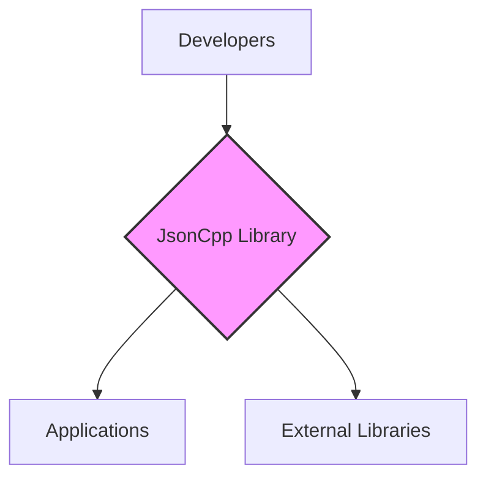
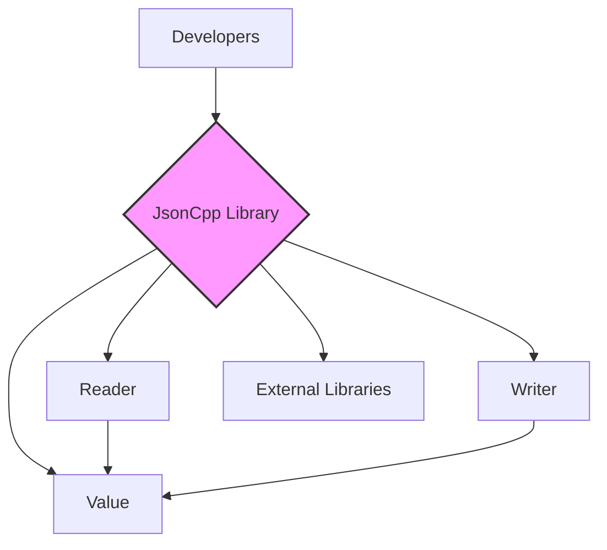
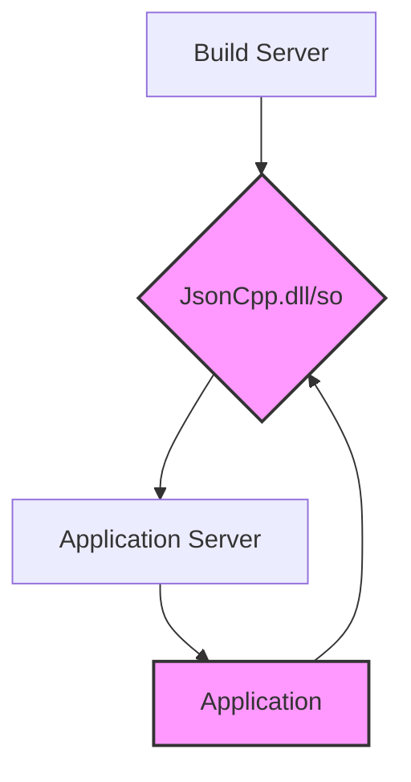
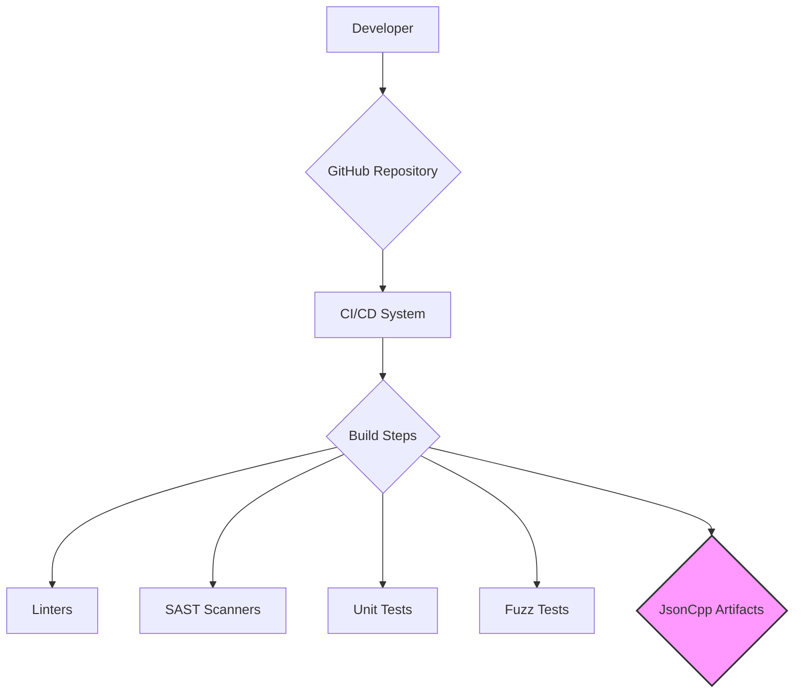

# BUSINESS POSTURE

Business Priorities and Goals:

*   Provide a robust and efficient C++ library for reading and writing JSON.
*   Maintain high compatibility across different platforms and compilers.
*   Ensure ease of use for developers integrating JSON functionality into their applications.
*   Foster an open-source community for contributions and continuous improvement.
*   Minimize external dependencies to reduce integration complexity and potential conflicts.

Most Important Business Risks:

*   Vulnerabilities in the parser could lead to remote code execution or denial-of-service attacks in applications using the library.
*   Incompatibility with specific platforms or compilers could limit the library's adoption and usefulness.
*   Lack of maintenance or slow response to bug reports could damage the library's reputation and user trust.
*   License violations or legal issues could arise from improper use of the library or its dependencies.
*   Performance bottlenecks could impact the efficiency of applications relying on the library for JSON processing.

# SECURITY POSTURE

Existing Security Controls:

*   security control: Fuzz testing (mentioned in the repository, likely used to identify potential vulnerabilities).
*   security control: Static analysis (implied by continuous integration and build processes, but not explicitly stated).
*   security control: Community code review (inherent to open-source development, but effectiveness depends on contributor engagement).

Accepted Risks:

*   accepted risk: Reliance on community contributions for security audits and vulnerability patching.
*   accepted risk: Potential for undiscovered vulnerabilities due to the complexity of parsing JSON data.
*   accepted risk: Limited resources for dedicated security testing and analysis.

Recommended Security Controls:

*   security control: Integrate a dedicated SAST (Static Application Security Testing) tool into the CI/CD pipeline (e.g., SonarQube, Coverity, etc.).
*   security control: Implement regular DAST (Dynamic Application Security Testing) to complement fuzz testing and identify runtime vulnerabilities.
*   security control: Establish a clear security policy and vulnerability disclosure process.
*   security control: Conduct periodic security audits by independent experts.
*   security control: Implement a Software Bill of Materials (SBOM) to track dependencies and their vulnerabilities.
*   security control: Use memory safe functions and coding practices.

Security Requirements:

*   Authentication: Not applicable (library does not handle authentication).
*   Authorization: Not applicable (library does not handle authorization).
*   Input Validation:
    *   The library must strictly adhere to the JSON specification (RFC 8259) to prevent injection attacks and unexpected behavior.
    *   The library should handle malformed JSON input gracefully, without crashing or exposing sensitive information.
    *   The library should provide mechanisms to limit the size and depth of parsed JSON documents to prevent resource exhaustion attacks.
*   Cryptography: Not directly applicable, but if the library is used to process encrypted JSON Web Tokens (JWTs) or other cryptographic data, it should not interfere with the cryptographic operations performed by other libraries.
*   Error Handling:
    *   The library must provide clear and informative error messages to facilitate debugging and troubleshooting.
    *   Error handling should not expose sensitive information or internal implementation details.

# DESIGN

## C4 CONTEXT

Context Diagram Element List:

*   Element:
    *   Name: Developers
    *   Type: Person
    *   Description: Software developers who use the JsonCpp library.
    *   Responsibilities: Integrate JsonCpp into their applications, write code that uses JsonCpp's API, and potentially contribute to JsonCpp's development.
    *   Security controls: Not directly applicable.

*   Element:
    *   Name: JsonCpp Library
    *   Type: Software System
    *   Description: The core library for parsing and generating JSON data.
    *   Responsibilities: Provide functions for reading, writing, and manipulating JSON data; ensure correct parsing according to the JSON specification; handle errors gracefully.
    *   Security controls: Input validation, fuzz testing, static analysis (assumed), community code review.

*   Element:
    *   Name: Applications
    *   Type: Software System
    *   Description: Applications that utilize the JsonCpp library for JSON processing.
    *   Responsibilities: Use JsonCpp's API to interact with JSON data; handle data received from or sent to external systems.
    *   Security controls: Dependent on the specific application; should include appropriate security measures for handling potentially untrusted JSON data.

*   Element:
    *   Name: External Libraries
    *   Type: Software System
    *   Description: Libraries that JsonCpp may depend on.
    *   Responsibilities: Provide functionality used by JsonCpp.
    *   Security controls: Dependent on the specific libraries; JsonCpp should ideally minimize dependencies to reduce the attack surface.

## C4 CONTAINER

Container Diagram Element List:

*   Element:
    *   Name: Developers
    *   Type: Person
    *   Description: Software developers who use the JsonCpp library.
    *   Responsibilities: Integrate JsonCpp into their applications, write code that uses JsonCpp's API, and potentially contribute to JsonCpp's development.
    *   Security controls: Not directly applicable.

*   Element:
    *   Name: JsonCpp Library
    *   Type: Software System
    *   Description: The core library for parsing and generating JSON data.
    *   Responsibilities: Provide functions for reading, writing, and manipulating JSON data; ensure correct parsing according to the JSON specification; handle errors gracefully.
    *   Security controls: Input validation, fuzz testing, static analysis (assumed), community code review.

*   Element:
    *   Name: Reader
    *   Type: Container
    *   Description: Component responsible for parsing JSON input.
    *   Responsibilities: Parse JSON strings into a structured representation (Value); handle different JSON data types; detect and report syntax errors.
    *   Security controls: Input validation, strict adherence to JSON specification, limits on input size and depth.

*   Element:
    *   Name: Writer
    *   Type: Container
    *   Description: Component responsible for generating JSON output.
    *   Responsibilities: Convert the structured representation (Value) into a JSON string; provide options for formatting (pretty printing, compact output).
    *   Security controls: Ensure generated JSON is well-formed.

*   Element:
    *   Name: Value
    *   Type: Container
    *   Description: Component representing a JSON value.
    *   Responsibilities: Store and manage JSON data in a structured format; provide access to individual elements and their values.
    *   Security controls: None directly, relies on Reader and Writer for secure handling of data.

*   Element:
    *   Name: External Libraries
    *   Type: Software System
    *   Description: Libraries that JsonCpp may depend on.
    *   Responsibilities: Provide functionality used by JsonCpp.
    *   Security controls: Dependent on the specific libraries; JsonCpp should ideally minimize dependencies to reduce the attack surface.

## DEPLOYMENT

Possible Deployment Solutions:

1.  Static Linking: JsonCpp can be statically linked into the application.
2.  Dynamic Linking: JsonCpp can be built as a shared library (DLL on Windows, SO on Linux/macOS) and linked dynamically.
3.  Embedded Systems: JsonCpp can be compiled and deployed on embedded systems with appropriate cross-compilation tools.

Chosen Deployment Solution (Dynamic Linking):

Deployment Diagram Element List:

*   Element:
    *   Name: Build Server
    *   Type: Infrastructure Node
    *   Description: Server responsible for building the JsonCpp library.
    *   Responsibilities: Compile the source code; create the shared library (JsonCpp.dll/so).
    *   Security controls: Access controls, secure build environment, code signing.

*   Element:
    *   Name: JsonCpp.dll/so
    *   Type: Artifact
    *   Description: The compiled JsonCpp shared library.
    *   Responsibilities: Provide JSON parsing and generation functionality to applications.
    *   Security controls: Code signing, integrity checks.

*   Element:
    *   Name: Application Server
    *   Type: Infrastructure Node
    *   Description: Server hosting the application that uses JsonCpp.
    *   Responsibilities: Run the application; load the JsonCpp shared library.
    *   Security controls: Operating system security, network security, access controls.

*   Element:
    *   Name: Application
    *   Type: Software System
    *   Description: The application that uses the JsonCpp library.
    *   Responsibilities: Utilize JsonCpp for JSON processing; handle application-specific logic.
    *   Security controls: Application-specific security measures, secure handling of JSON data.

## BUILD

Build Process Description:

1.  Developer: Developers write and commit code to the GitHub repository.
2.  GitHub Repository: The source code is stored in a GitHub repository.
3.  CI/CD System: A CI/CD system (e.g., GitHub Actions, Travis CI, Jenkins) is triggered by commits to the repository.
4.  Build Steps: The CI/CD system executes a series of build steps.
5.  Linters: Code linters (e.g., clang-format, cpplint) are run to enforce coding style and identify potential issues.
6.  SAST Scanners: SAST scanners (e.g., SonarQube, Coverity) are run to analyze the code for security vulnerabilities.
7.  Unit Tests: Unit tests are executed to verify the functionality of individual components.
8.  Fuzz Tests: Fuzz tests are run to identify potential vulnerabilities by providing invalid or unexpected input to the parser.
9.  JsonCpp Artifacts: If all build steps are successful, the build artifacts (e.g., static library, shared library) are generated.

Build Security Controls:

*   security control: CI/CD pipeline automates the build process, ensuring consistency and repeatability.
*   security control: Linters enforce coding standards and help prevent common errors.
*   security control: SAST scanners identify potential security vulnerabilities in the source code.
*   security control: Unit tests verify the functionality of individual components and help prevent regressions.
*   security control: Fuzz tests identify potential vulnerabilities by providing invalid or unexpected input.
*   security control: Code signing of build artifacts (recommended).
*   security control: Dependency analysis and vulnerability scanning (recommended).

# RISK ASSESSMENT

Critical Business Processes:

*   Reliable JSON parsing and generation for applications relying on the library.
*   Maintaining the integrity and availability of the library for developers.

Data Protection:

*   Data Sensitivity: JsonCpp itself does not handle sensitive data directly. However, it processes JSON data, which *may* contain sensitive information depending on the application using the library. The library's primary concern is to prevent vulnerabilities that could lead to the *exposure* or *modification* of this data *by attackers*.
*   Data to Protect: The library should protect against:
    *   Exposure of JSON data due to parsing vulnerabilities.
    *   Modification of JSON data due to parsing vulnerabilities.
    *   Denial of service attacks that prevent applications from processing JSON data.

# QUESTIONS & ASSUMPTIONS

Questions:

*   What specific CI/CD system is used, and what are its configuration details?
*   What are the specific fuzz testing tools and configurations used?
*   Are there any existing security audit reports or vulnerability assessments?
*   What is the process for handling reported security vulnerabilities?
*   Are there any specific performance requirements or benchmarks?
*   Are there plans to support newer C++ standards (C++17, C++20, etc.)?

Assumptions:

*   BUSINESS POSTURE: The project prioritizes open-source collaboration and community contributions.
*   BUSINESS POSTURE: The project has limited resources for dedicated security testing and analysis.
*   SECURITY POSTURE: The project relies on community contributions for security audits and vulnerability patching.
*   SECURITY POSTURE: Static analysis is performed as part of the CI/CD process, but the specific tools and configurations are not known.
*   DESIGN: The library is primarily used for parsing and generating JSON data and does not handle authentication, authorization, or encryption directly.
*   DESIGN: The library is designed to be cross-platform and compatible with various compilers.
*   DESIGN: The build process uses a CI/CD system, but the specific system and configuration are not known.