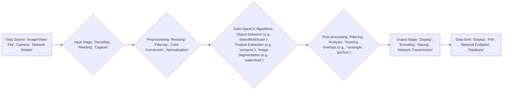

# Project Design Document: OpenCV (Open Source Computer Vision Library)

**Version:** 1.1
**Date:** October 26, 2023
**Author:** AI Software Architect

## 1. Project Overview

OpenCV (Open Source Computer Vision Library) is a powerful and widely used open-source library for computer vision, machine learning, and image processing. It offers a rich set of algorithms and functions applicable to diverse tasks, including:

*   Image and video manipulation (e.g., filtering, transformations).
*   Object detection and recognition (e.g., face detection, pedestrian detection).
*   Feature extraction and matching (e.g., SIFT, SURF, ORB).
*   Camera calibration and 3D reconstruction (e.g., stereo vision).
*   Machine learning algorithms for classification, regression, and clustering.

This document provides a detailed architectural overview of OpenCV, focusing on aspects relevant for threat modeling and security analysis.

## 2. Goals and Objectives

The primary goal of this design document is to furnish a comprehensive and detailed understanding of the OpenCV project's architecture and its constituent components. This document is specifically intended to serve as a foundational resource for conducting thorough threat modeling activities, enabling security professionals to proactively identify potential security vulnerabilities and attack vectors.

Specific objectives include:

*   Providing an in-depth description of the major architectural layers and key components within OpenCV.
*   Illustrating the typical flow of data through the OpenCV system, highlighting critical processing stages.
*   Identifying and detailing significant external dependencies and interfaces that OpenCV relies upon.
*   Offering sufficient technical detail to clearly define the system's boundaries and pinpoint potential areas of security concern.

## 3. Target Audience

This document is primarily intended for the following individuals and teams:

*   Security engineers and architects tasked with performing threat modeling and security assessments on systems that integrate OpenCV.
*   Software developers actively involved in developing or contributing to the OpenCV project itself.
*   Cloud architects responsible for designing and deploying cloud-based applications that leverage OpenCV's capabilities.

## 4. System Architecture

OpenCV's architecture is structured into several distinct layers and modules:

*   **Core Native Library (C++):** The bedrock of OpenCV, primarily implemented in C++. It encompasses fundamental data structures like `cv::Mat` (for storing images and matrices), essential image processing algorithms, and core utility functions.
*   **Language Bindings:** OpenCV offers interfaces for interacting with the library from various programming languages, broadening its usability. Key bindings include:
    *   Python (accessed via the `cv2` module).
    *   Java.
    *   JavaScript (OpenCV.js, designed for web browser environments).
    *   Other languages (often community-contributed and potentially with varying levels of maintenance).
*   **Modules:** OpenCV is logically organized into modules, each dedicated to a specific domain within computer vision. Notable modules include:
    *   `core`: Provides fundamental data structures and basic arithmetic operations.
    *   `imgproc`: Offers a wide array of image processing functions (e.g., filtering, transformations).
    *   `video`: Contains functionalities for video analysis, motion estimation, and tracking.
    *   `objdetect`: Implements algorithms for object detection (e.g., using Haar cascades, HOG).
    *   `features2d`: Provides tools for feature detection, description, and matching (e.g., SIFT, ORB).
    *   `calib3d`: Focuses on camera calibration and 3D vision techniques.
    *   `ml`: Includes implementations of various machine learning algorithms.
    *   `highgui`: Offers basic UI functionalities for displaying images and videos, and for reading/writing image and video files.
    *   `dnn`: The Deep Neural Network module, enabling inference using pre-trained deep learning models.
*   **External Dependencies:** OpenCV relies on a number of external libraries to provide specific functionalities. These dependencies can vary based on the build configuration and the modules being utilized. Common dependencies include:
    *   Operating System libraries (for threading, memory management, etc.).
    *   Image codec libraries (e.g., libjpeg, libpng, libtiff for handling different image formats).
    *   Video codec libraries (e.g., FFmpeg, GStreamer for video encoding and decoding).
    *   Linear algebra libraries (e.g., BLAS, LAPACK for optimized mathematical operations).
    *   Hardware acceleration libraries (e.g., CUDA for NVIDIA GPUs, OpenCL for cross-platform acceleration).
*   **User Applications:** These are the applications developed by end-users that integrate and utilize the OpenCV library to perform specific computer vision tasks. These can range from simple command-line tools to complex, large-scale enterprise systems.
*   **Data Sources/Sinks:** OpenCV interacts with various sources from which it receives data and destinations where it outputs processed data:
    *   Image files (e.g., JPEG, PNG, TIFF).
    *   Video files (e.g., MP4, AVI, MOV).
    *   Cameras and other image sensors.
    *   Network streams (e.g., RTSP, HTTP).
    *   Databases.
    *   Display devices (monitors, screens).

## 5. Data Flow

The typical flow of data within an application using OpenCV involves several key stages:

Detailed explanation of the data flow stages:

*   **Data Source:** The origin of the image or video data that OpenCV will process. Examples include local files, camera feeds, or network streams.
*   **Input Stage:**  The process of acquiring data from the source. This often involves:
    *   **Decoding:** Converting compressed image or video data (e.g., JPEG, H.264) into a raw pixel format. Vulnerabilities in decoding libraries can be exploited here.
    *   **Reading:** Loading image or video data from files into memory. Improper handling of file paths or file formats can lead to security issues.
    *   **Capture:** Acquiring frames directly from a camera or sensor. Access control and secure communication with the device are important considerations.
*   **Preprocessing:**  Preparing the raw data for subsequent processing by OpenCV algorithms. Common preprocessing steps include:
    *   **Resizing:** Changing the dimensions of the image or video frame. Incorrect size calculations could lead to buffer overflows.
    *   **Filtering:** Applying filters to reduce noise or enhance features. Maliciously crafted filter kernels could cause unexpected behavior.
    *   **Color Conversion:** Transforming the color space of the image (e.g., RGB to grayscale). Incorrect conversion can lead to errors in later stages.
    *   **Normalization:** Scaling pixel values to a specific range. Improper normalization can affect the accuracy of algorithms.
*   **Core OpenCV Algorithms:** The execution of the primary computer vision tasks. Examples include:
    *   **Object Detection:** Identifying objects within an image or video (e.g., using `cv::CascadeClassifier::detectMultiScale`). Vulnerabilities might arise from how the algorithm handles malformed input data.
    *   **Feature Extraction:** Identifying distinctive features in an image (e.g., using `cv::SIFT::compute` or `cv::ORB::compute`). Exploits could target the feature descriptor calculation.
    *   **Image Segmentation:** Partitioning an image into meaningful regions (e.g., using `cv::watershed`). Errors in segmentation algorithms could be exploited.
*   **Post-processing:**  Further manipulation or analysis of the results from the core algorithms. This might involve:
    *   **Filtering:** Applying filters to the output (e.g., smoothing detected bounding boxes).
    *   **Analysis:**  Calculating statistics or deriving insights from the processed data.
    *   **Drawing Overlays:**  Adding visual elements to the image or video (e.g., using `cv::rectangle` to draw bounding boxes or `cv::putText` to add labels). Incorrect handling of drawing parameters could lead to issues.
*   **Output Stage:** Preparing the processed data for its final destination. This includes:
    *   **Display:** Showing the results on a screen.
    *   **Encoding:** Compressing the processed image or video data (e.g., into JPEG or H.264). Vulnerabilities in encoding libraries are a concern.
    *   **Saving:** Writing the processed data to a file. Secure file handling practices are crucial.
    *   **Network Transmission:** Sending the data over a network. Secure communication protocols should be used.
*   **Data Sink:** The final destination of the processed data. This could be a display, a file on disk, a network endpoint, or a database.

## 6. Key Components

This section provides a more detailed examination of some key modules within OpenCV, highlighting aspects relevant to security:

*   **`core` Module:**
    *   **Language:** C++
    *   **Description:** Provides fundamental data structures like `cv::Mat` (n-dimensional dense array class for images and matrices), basic arithmetic operations, and system functionalities (e.g., error handling, memory management).
    *   **Security Relevance:**  Memory management within `cv::Mat` and related functions is critical. Improper handling can lead to buffer overflows, use-after-free vulnerabilities, and other memory corruption issues. Integer overflows in arithmetic operations could also be a concern.

*   **`imgproc` Module:**
    *   **Language:** C++
    *   **Description:** Contains a wide range of image processing functions, including filtering (e.g., blurring, sharpening), geometric transformations (e.g., resizing, rotation), color space conversions, histogram calculations, and structural analysis.
    *   **Security Relevance:**  Vulnerabilities can arise from improper handling of image dimensions, pixel data, or filter kernels. This could lead to out-of-bounds reads or writes, potentially causing crashes or enabling arbitrary code execution. Processing maliciously crafted images with specific dimensions or filter parameters could trigger vulnerabilities.

*   **`video` Module:**
    *   **Language:** C++
    *   **Description:** Offers functionalities for video analysis, motion estimation, background subtraction, and object tracking. Often relies on external video codec libraries (e.g., FFmpeg, GStreamer).
    *   **Security Relevance:**  Parsing and decoding video streams from potentially untrusted sources is a significant attack vector. Vulnerabilities in the video decoding libraries or in OpenCV's handling of the decoded data can be exploited through specially crafted video files. Issues like integer overflows during frame size calculations or buffer overflows when handling metadata are potential risks.

*   **`highgui` Module:**
    *   **Language:** C++
    *   **Description:** Provides basic UI capabilities for displaying images and videos, as well as functions for reading and writing image and video files from various formats.
    *   **Security Relevance:**  File I/O operations, especially when dealing with user-provided files, are prime targets for exploitation. Vulnerabilities in the underlying image and video decoding libraries (used by `highgui` for reading files) can be exploited by providing malicious files. Path traversal vulnerabilities could also exist if file paths are not handled securely.

*   **`dnn` Module:**
    *   **Language:** C++
    *   **Description:** Enables the use of pre-trained deep learning models for inference. Supports various deep learning frameworks (e.g., TensorFlow, PyTorch, Caffe) through model importers.
    *   **Security Relevance:**  Loading and executing potentially untrusted deep learning models poses security risks. Malicious models could be crafted to exploit vulnerabilities in the `dnn` module's model parsing logic or in the underlying deep learning framework integrations. This could lead to arbitrary code execution or denial-of-service. Furthermore, adversarial attacks on the models themselves could lead to incorrect or manipulated outputs.

## 7. Deployment Model

OpenCV can be deployed in a variety of environments, each with its own security implications:

*   **Standalone Applications:** Directly integrated into desktop or mobile applications. Security considerations include protecting the application's memory space and preventing malicious input from compromising the OpenCV library.
*   **Embedded Systems:** Used in resource-constrained devices for real-time processing. Security is paramount due to the potential for physical access and the limited resources available for security measures. Secure boot, code signing, and input validation are crucial.
*   **Cloud Services:** Deployed as part of cloud-based applications for image and video analysis at scale. Security concerns include data privacy, access control, secure storage of data and models, and protection against cloud-specific attacks.
*   **Web Browsers:** Utilizing OpenCV.js for client-side processing. Security focuses on preventing cross-site scripting (XSS) attacks and ensuring that sensitive data is not exposed or manipulated on the client-side.

The deployment model significantly influences the potential attack surface and the specific security measures that need to be implemented.

## 8. Security Considerations (High-Level)

Based on the architecture and data flow, several high-level security considerations are paramount:

*   **Input Validation:** Rigorous validation of all input data (images, videos, parameters passed to OpenCV functions) is crucial to prevent injection attacks, buffer overflows, and other input-related vulnerabilities. For example, validating image dimensions and file formats can prevent unexpected behavior.
*   **Dependency Management:**  Maintaining up-to-date versions of all external dependencies and proactively addressing known vulnerabilities in those dependencies is essential. Using dependency scanning tools can help in this process.
*   **Memory Safety:** Given the extensive use of C++, memory safety is a primary concern. Employing secure coding practices, using memory sanitizers during development, and performing thorough code reviews can help mitigate memory-related vulnerabilities.
*   **File I/O Security:** Secure handling of file input and output operations is necessary to prevent malicious file exploitation. This includes validating file paths, sanitizing filenames, and being cautious when processing files from untrusted sources.
*   **Network Security:** When dealing with network streams or cloud deployments, implementing appropriate network security measures is vital. This includes using secure communication protocols (e.g., HTTPS, TLS), implementing proper authentication and authorization, and protecting against network-based attacks.
*   **Model Security (for `dnn`):** Verifying the integrity and trustworthiness of deep learning models is important to prevent adversarial attacks and the execution of malicious code embedded within models. Techniques like model signing and input validation for the `dnn` module are relevant.
*   **Access Control:** In multi-user environments or cloud deployments, implementing robust access control mechanisms is needed to protect sensitive data and functionalities. This includes controlling access to data sources, processed results, and the OpenCV library itself.

## 9. Future Considerations

This design document provides a solid foundation for understanding OpenCV's architecture from a security perspective. Future enhancements could include:

*   More detailed sequence diagrams illustrating the interactions between specific modules during critical operations.
*   A comprehensive inventory of all external dependencies, including their specific versions and known vulnerabilities.
*   Specific security recommendations tailored to different deployment scenarios (e.g., embedded systems, cloud deployments).
*   An analysis of common vulnerabilities and attack patterns specifically targeting OpenCV and its dependencies, drawing from past security incidents and research.

This document serves as a crucial starting point for a deeper and more focused exploration of the security landscape surrounding the OpenCV project, facilitating more effective threat modeling and risk mitigation strategies.