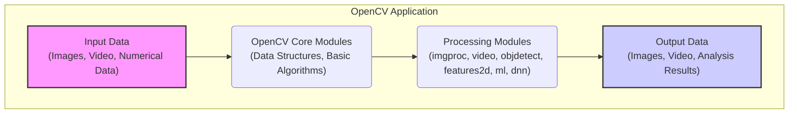

# Project Design Document: OpenCV Library

**Document Version:** 1.1
**Date:** October 26, 2023
**Prepared By:** Gemini AI Assistant

## 1. Introduction

This document provides a detailed design overview of the OpenCV (Open Source Computer Vision Library) project. It describes the key architectural components, data flow, and external interfaces of OpenCV, with a focus on providing the necessary information for effective threat modeling.

## 2. Project Overview

OpenCV is a powerful open-source library designed for computer vision, machine learning, and image processing tasks. Its extensive collection of algorithms and functions facilitates the development of applications for:

*   Advanced image and video manipulation, including editing, enhancement, and analysis.
*   Sophisticated object detection and recognition systems for identifying and classifying objects within visual data.
*   Robust feature extraction and matching techniques for tasks like image stitching, object tracking, and 3D reconstruction.
*   Precise camera calibration methods to correct for lens distortion and establish accurate spatial relationships.
*   Complex 3D reconstruction from multiple images or video streams.
*   Integration of various machine learning algorithms for tasks like classification, regression, and clustering.

Written primarily in C++, OpenCV offers bindings for other popular programming languages, such as Python, Java, and JavaScript, broadening its applicability. Its architecture is optimized for performance, enabling deployment across diverse platforms, from high-performance desktops to resource-constrained embedded systems.

## 3. Architectural Design

OpenCV adopts a modular architecture, organizing its functionalities into distinct core and contributed modules. This design promotes code reusability, maintainability, and allows developers to selectively include necessary components, optimizing application size and resource usage.

### 3.1. Core Modules

These modules provide the foundational functionalities of OpenCV:

*   **Core (`core`):**
    *   Defines fundamental data structures:
        *   `Mat`: A versatile multi-dimensional array used to represent images, matrices, and other numerical data.
        *   `Point`, `Size`, `Rect`: Basic geometric primitives.
    *   Implements core algorithms:
        *   Basic array operations (element-wise arithmetic, logical operations).
        *   Mathematical functions (trigonometry, logarithms, exponentiation).
        *   Random number generation.
    *   Provides utilities:
        *   XML and YAML file input/output for data persistence.
        *   Error handling mechanisms.
        *   Dynamic memory management and allocation tools.
        *   Basic multi-threading support.
*   **Image Processing (`imgproc`):**
    *   Offers a comprehensive suite of image manipulation functions:
        *   Filtering: Smoothing, sharpening, edge detection (e.g., Gaussian blur, Sobel, Laplacian).
        *   Geometric Transformations: Resizing, rotation, translation, warping, affine and perspective transformations.
        *   Color Space Conversions: Transformations between various color spaces (e.g., RGB, HSV, grayscale).
        *   Histograms: Calculation, equalization, and comparison.
        *   Structural Analysis: Morphological operations (erosion, dilation), contour detection, and image segmentation.
*   **Video Analysis (`video`):**
    *   Provides algorithms for video-related tasks:
        *   Motion Estimation: Techniques for tracking the movement of objects or the camera.
        *   Background Subtraction: Identifying foreground objects by modeling the background.
        *   Object Tracking: Following specific objects across video frames (e.g., using Kalman filters, optical flow).
        *   Video Stabilization: Reducing unwanted camera shake in video sequences.
*   **Object Detection (`objdetect`):**
    *   Implements algorithms for locating objects within images and videos:
        *   Classical methods: Haar cascade classifiers, Local Binary Patterns (LBP) classifiers for face and object detection.
        *   Support for pre-trained models for various object categories.
*   **High-Level GUI (`highgui`):**
    *   Offers platform-dependent functions for basic user interface tasks:
        *   Creating and managing windows for displaying images and videos.
        *   Handling basic user input events (mouse clicks, keyboard presses).
        *   Providing simple trackbar controls for adjusting parameters.
        *   Note: This module's functionality and security aspects are highly dependent on the underlying operating system's GUI framework (e.g., Windows API, X11, macOS Cocoa).
*   **Camera Calibration and 3D Reconstruction (`calib3d`):**
    *   Provides tools for:
        *   Camera Calibration: Estimating intrinsic and extrinsic camera parameters.
        *   Stereo Vision: Computing depth maps from stereo image pairs.
        *   3D Reconstruction: Creating 3D models from multiple views.
*   **Feature Detection and Matching (`features2d`):**
    *   Implements algorithms for identifying and matching distinctive features in images:
        *   Feature Detectors: SIFT (Scale-Invariant Feature Transform), SURF (Speeded-Up Robust Features), ORB (Oriented FAST and Rotated BRIEF), and others.
        *   Feature Descriptors: Representing the local neighborhood around detected features.
        *   Feature Matchers: Algorithms for finding corresponding features between images.
*   **Machine Learning (`ml`):**
    *   Offers a collection of classical machine learning algorithms:
        *   Supervised learning: Support Vector Machines (SVMs), Decision Trees, Random Forests, K-Nearest Neighbors (KNN).
        *   Unsupervised learning: K-Means clustering.
        *   Statistical models: Normal Bayes classifier.
*   **Computational Photography (`photo`):**
    *   Contains algorithms for enhancing and manipulating images:
        *   Image Denoising: Reducing noise in images.
        *   Image Inpainting: Filling in missing or damaged parts of an image.
        *   High Dynamic Range (HDR) Imaging: Combining multiple exposures to create images with a wider dynamic range.
*   **Fast Approximate Nearest Neighbor Search (`flann`):**
    *   Provides efficient algorithms for finding the nearest neighbors of a given point in a high-dimensional space, often used in feature matching and retrieval.
*   **Graph API (`gapi`):**
    *   A higher-level interface for constructing and executing image processing pipelines as directed acyclic graphs.
    *   Enables optimization and heterogeneous execution across different hardware backends (CPU, GPU).

### 3.2. Contributed Modules (`opencv_contrib`)

This repository houses modules that are either under active development, have specific licensing terms, or address niche functionalities. Examples include:

*   Advanced tracking algorithms beyond those in the core `video` module.
*   Optical Character Recognition (OCR) and text recognition capabilities.
*   The Deep Neural Network (`dnn`) module, providing an interface for running inference with pre-trained deep learning models from various frameworks.
*   Modules for specialized applications like augmented reality, bio-inspired vision, and surface matching.

### 3.3. Bindings

OpenCV offers interfaces for seamless integration with other programming languages:

*   **Python:** Provides a Pythonic interface, making OpenCV accessible to the vast Python ecosystem for scientific computing and machine learning.
*   **Java:** Enables the use of OpenCV in Java-based applications, particularly relevant for Android development and enterprise applications.
*   **JavaScript (OpenCV.js):** Allows running OpenCV algorithms directly within web browsers, enabling client-side image and video processing.

### 3.4. Build System

*   OpenCV relies on **CMake** as its cross-platform build system. CMake configures the build process based on the target platform and generates native build files (e.g., Makefiles for Linux/macOS, Visual Studio project files for Windows). This process involves detecting dependencies, setting compiler flags, and managing the compilation and linking of the library.

## 4. Data Flow

The typical data flow within an application utilizing OpenCV involves these key stages:

*   **Input Acquisition:**
    *   **Image/Video Loading:** Reading image or video data from various sources:
        *   Local file system (e.g., JPEG, PNG, TIFF, MP4, AVI files) using functions like `cv::imread()` and `cv::VideoCapture`.
        *   Directly from cameras or video capture devices through the `cv::VideoCapture` interface.
        *   Network streams (e.g., RTSP, HTTP) often handled indirectly through external libraries or custom user code that feeds data to OpenCV.
    *   **Numerical Data Input:** Loading numerical parameters or data:
        *   Calibration parameters from files (XML, YAML).
        *   Feature vectors or descriptors.
        *   Pre-trained model weights for machine learning algorithms.
*   **Data Representation and Processing:**
    *   Input data is primarily represented and manipulated using the `cv::Mat` object, a versatile container for multi-dimensional arrays.
    *   Processing involves applying various algorithms from OpenCV's modules:
        *   **Image Preprocessing:** Operations like resizing, color conversion, noise reduction using functions from the `imgproc` module.
        *   **Feature Extraction:** Identifying key points and descriptors using algorithms from the `features2d` module.
        *   **Object Detection:** Locating objects of interest using algorithms from the `objdetect` module.
        *   **Machine Learning Inference:** Running pre-trained models using the `ml` or `dnn` modules.
        *   **Video Analysis:** Processing video frames sequentially using functions from the `video` module.
    *   Data transformations occur as algorithms are applied, modifying the `cv::Mat` objects or generating new data structures.
*   **Output Generation:**
    *   **Visual Output:** Displaying processed images or videos on the screen using functions from the `highgui` module (`cv::imshow()`).
    *   **Data Output:** Saving processed images or videos to files using functions like `cv::imwrite()` and `cv::VideoWriter`.
    *   **Information Output:** Returning extracted data (e.g., bounding box coordinates of detected objects, feature matches) to the calling application for further use or analysis.

## 5. External Interfaces

OpenCV interacts with the external environment through a variety of interfaces:

*   **File System Interaction:**
    *   Reading image files: `cv::imread()` supports various formats like BMP, PNG, JPEG, TIFF, etc. Vulnerabilities could arise from parsing malformed or malicious image files.
    *   Reading video files: `cv::VideoCapture` handles formats like AVI, MP4, MOV. Parsing vulnerabilities exist here as well.
    *   Writing image files: `cv::imwrite()` writes to formats like PNG, JPEG. Issues could occur if output paths are not sanitized.
    *   Writing video files: `cv::VideoWriter`. Similar path sanitization concerns.
    *   Loading data from XML/YAML: `cv::FileStorage`. Deserialization of untrusted data can lead to vulnerabilities.
*   **Operating System (OS) API Calls:**
    *   Memory allocation (`malloc`, `new`): Incorrect memory management can lead to leaks or vulnerabilities like buffer overflows.
    *   Thread management (pthreads, Windows Threads): Incorrect synchronization can cause race conditions.
    *   Accessing hardware (camera drivers): Potential for vulnerabilities in the underlying drivers.
    *   GUI interaction (`highgui` uses platform-specific APIs): Vulnerabilities in the OS's GUI framework could be exploited.
*   **Hardware Interfaces:**
    *   Camera and video capture devices: Interaction through device drivers. Exploits in drivers could compromise the system.
    *   GPU acceleration (CUDA, OpenCL): While often abstracted, vulnerabilities in GPU drivers or the acceleration framework could be a concern.
*   **Third-Party Library Dependencies:**
    *   Image codec libraries (libjpeg, libpng, etc.): Vulnerabilities in these libraries can directly impact OpenCV.
    *   Video codec libraries (FFmpeg, etc.): Similar vulnerability concerns.
    *   BLAS/LAPACK libraries for numerical computations: Potential for vulnerabilities in these fundamental libraries.
*   **Network Interaction (Indirect):**
    *   Applications using OpenCV might fetch data or models over the network. This introduces standard network security risks (e.g., man-in-the-middle attacks, insecure protocols).
    *   The `dnn` module can download model files from URLs, posing a risk if the source is untrusted or the connection is insecure.
*   **Application Programming Interface (API):**
    *   The C++, Python, Java, and JavaScript APIs are the primary interface for developers. Incorrect usage of the API can lead to vulnerabilities (e.g., passing incorrect buffer sizes).
*   **Build System (CMake):**
    *   The build process involves executing CMake scripts and potentially downloading dependencies. Malicious CMake scripts or compromised dependency sources can inject vulnerabilities.

## 6. Deployment Considerations

OpenCV's versatility allows for deployment in diverse environments, each with its own security implications:

*   **Desktop Applications (Windows, macOS, Linux):**  Vulnerabilities can be exploited through local access or by targeting user interaction with malicious input files.
*   **Mobile Applications (Android, iOS):**  Mobile deployments introduce risks related to the mobile OS security model, app permissions, and potential exposure of sensitive data.
*   **Embedded Systems (Robotics, IoT devices):**  Resource constraints and often limited security features make embedded systems attractive targets. Vulnerabilities in OpenCV could be exploited for device compromise.
*   **Web Browsers (via OpenCV.js):**  Web deployments are susceptible to standard web security threats (e.g., cross-site scripting (XSS)) if input is not properly sanitized and if the hosting environment is compromised.
*   **Cloud Environments (AWS, Azure, GCP):**  Cloud deployments require careful consideration of access control, data encryption, and the security of the underlying infrastructure.

## 7. Security Considerations (Detailed)

This section elaborates on potential security considerations for threat modeling:

*   **Input Validation Vulnerabilities:**
    *   **Image Parsing Vulnerabilities:** Processing malformed or crafted image files (e.g., oversized headers, incorrect color information) could lead to buffer overflows, denial-of-service, or arbitrary code execution. Specific formats like TIFF are known for complex structures that can be exploited.
    *   **Video Parsing Vulnerabilities:** Similar to image parsing, vulnerabilities can exist in how OpenCV decodes video streams, potentially leading to crashes or remote code execution.
    *   **Numerical Data Deserialization:** Loading untrusted data through `cv::FileStorage` could lead to object injection or other deserialization vulnerabilities if not handled carefully.
*   **Memory Management Errors:**
    *   **Buffer Overflows:** Incorrectly handling image or video data in `cv::Mat` or other data structures can lead to writing beyond allocated memory.
    *   **Use-After-Free:** Accessing memory that has already been freed can cause crashes or exploitable conditions.
    *   **Memory Leaks:** While not directly a security vulnerability, memory leaks can lead to resource exhaustion and denial of service.
*   **Integer Overflow/Underflow:**
    *   Arithmetic operations on pixel values or image dimensions could result in integer overflows or underflows, leading to unexpected behavior or security bypasses (e.g., incorrect memory allocation sizes).
*   **Dependency Vulnerabilities:**
    *   Outdated or vulnerable versions of dependent libraries (image codecs, video codecs, BLAS/LAPACK) can introduce security flaws into OpenCV.
*   **Build System Security:**
    *   Compromised CMake scripts could execute arbitrary code during the build process, injecting malicious code into the compiled library.
    *   Downloading dependencies from untrusted sources during the build can introduce compromised libraries.
*   **API Misuse:**
    *   Developers might misuse OpenCV's API, for example, by providing incorrect buffer sizes to functions, leading to buffer overflows.
*   **Algorithm-Specific Vulnerabilities:**
    *   Certain computer vision algorithms might be susceptible to adversarial attacks where carefully crafted input can cause misclassification or unexpected behavior.
*   **Permissions and Access Control:**
    *   Inadequate file system permissions could allow attackers to replace legitimate image or video files with malicious ones.
    *   Lack of proper access control for camera devices could allow unauthorized access.
*   **Third-Party Module Risks:**
    *   Modules in `opencv_contrib` might not have undergone the same level of security scrutiny as core modules, potentially containing vulnerabilities.
*   **Insecure Network Communication (Indirect):**
    *   If applications using OpenCV download resources (e.g., pre-trained models) over insecure connections (HTTP), they are vulnerable to man-in-the-middle attacks.

## 8. Conclusion

This document provides a comprehensive design overview of the OpenCV library, detailing its architecture, data flow, and external interfaces. The detailed security considerations outlined here serve as a crucial foundation for conducting thorough threat modeling activities. By understanding these potential vulnerabilities, developers and security professionals can implement appropriate mitigation strategies to enhance the security posture of applications built with OpenCV.
