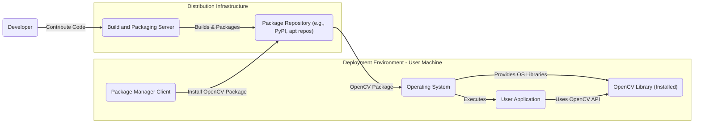

# BUSINESS POSTURE

The primary business goal of the OpenCV project is to provide a comprehensive, open-source library for computer vision, image processing, and machine learning. This aims to empower developers and researchers globally to build innovative applications and advance the field of computer vision. The project prioritizes broad accessibility, high performance, and continuous improvement through community contributions.

Key business priorities include:
- Maintaining a robust and feature-rich library that meets the evolving needs of the computer vision community.
- Fostering a vibrant and active community of contributors and users.
- Ensuring the library is widely adopted and used in diverse applications.
- Maintaining the project's open-source nature and accessibility.
- Ensuring the long-term sustainability of the project through community support and potentially organizational backing.

Most important business risks to address:
- Security vulnerabilities in the library could lead to misuse in applications, damaging the reputation and trust in OpenCV.
- Supply chain attacks targeting dependencies or build processes could compromise the integrity of the library.
- Lack of consistent security practices across a large open-source project could lead to vulnerabilities being introduced or overlooked.
- Reputational damage due to security incidents could hinder adoption and community growth.
- Misuse of OpenCV in malicious applications could negatively impact public perception of the project.

# SECURITY POSTURE

Existing security controls:
- security control: Code review process for contributions, primarily focused on functionality and code quality, with some attention to obvious security flaws. (Implemented on GitHub through pull requests and maintainer reviews. Described in contribution guidelines.)
- security control: Public vulnerability reporting through issue trackers and community forums. (Implemented on GitHub and OpenCV forums. Described in project documentation.)
- security control: Reliance on community contributions for identifying and fixing security vulnerabilities. (Implicitly implemented through the open-source nature of the project.)
- accepted risk: Potential for vulnerabilities to exist for some time before being discovered and patched due to the nature of open-source development and reliance on community reporting.
- accepted risk: Limited resources dedicated specifically to proactive security testing and vulnerability research.
- accepted risk: Dependence on external dependencies, which may introduce vulnerabilities.

Recommended security controls:
- recommended security control: Implement automated Static Application Security Testing (SAST) in the CI/CD pipeline to identify potential vulnerabilities in code changes.
- recommended security control: Implement Software Composition Analysis (SCA) to track and manage dependencies, and identify known vulnerabilities in them.
- recommended security control: Establish a clear and documented vulnerability disclosure and response process, including a security team or designated security contact.
- recommended security control: Conduct regular security audits and penetration testing, potentially through bug bounty programs or partnerships with security firms.
- recommended security control: Implement input validation and sanitization practices across the codebase, especially in modules dealing with external data and file formats.

Security requirements:
- Authentication: Not directly applicable to the OpenCV library itself. Authentication might be relevant for related infrastructure like the project website or issue tracker, but not within the library's core functionality.
- Authorization: Authorization within the library is primarily about API access control, ensuring that functions are used as intended.  This is enforced through API design and documentation rather than explicit authorization mechanisms.
- Input Validation: Robust input validation is critical for OpenCV. The library processes images and videos from various sources, which could be potentially malicious. All input data, including image formats, dimensions, and parameters, must be rigorously validated to prevent vulnerabilities like buffer overflows, format string bugs, and injection attacks.
- Cryptography: OpenCV includes modules that utilize cryptography.  Security requirements include using well-vetted cryptographic libraries, following secure cryptographic practices, and avoiding implementation of custom cryptography where possible.  When cryptography is used, it must be implemented correctly to protect data confidentiality and integrity where required (e.g., in modules dealing with secure communication or data storage, if any).

# DESIGN

## C4 CONTEXT

```mermaid
flowchart LR
    subgraph OpenCV Project Context
        center "OpenCV Library" as opencv
    end

    subgraph Users
        direction TB
        uDev("Developers")
        uApp("Applications")
    end

    subgraph External Systems
        direction TB
        extGH("GitHub Repository")
        extPM("Package Managers")
        extDS("Data Sources")
    end

    uDev -- "Contribute code, report issues, use library" --> opencv
    uApp -- "Integrate OpenCV for computer vision tasks" --> opencv
    opencv -- "Source code, issue tracking, collaboration" --> extGH
    opencv -- "Distribution, installation" --> extPM
    uApp -- "Provide images, videos as input" --> extDS
    extDS -- "Images, videos" --> opencv

    linkStyle 0,1,2,3,4,5 stroke:#333,stroke-width:2px;
```

### Context Diagram Elements

- Name: OpenCV Library
  - Type: Software System
  - Description: The OpenCV (Open Source Computer Vision Library) is a comprehensive software library for computer vision, image processing, and machine learning. It provides a wide range of algorithms and tools for tasks such as object detection, image segmentation, video analysis, and more.
  - Responsibilities:
    - Provide a comprehensive set of computer vision algorithms and functionalities.
    - Offer a high-performance and efficient library for various platforms.
    - Maintain cross-platform compatibility.
    - Provide clear and comprehensive documentation.
    - Facilitate community contributions and collaboration.
  - Security controls:
    - security control: Code review for contributions (GitHub Pull Requests).
    - security control: Public vulnerability reporting (GitHub Issues).
    - security control: Input validation within library functions.

- Name: Developers
  - Type: Person
  - Description: Software developers, researchers, and enthusiasts who use OpenCV to build applications, contribute to the library, report issues, and engage with the community.
  - Responsibilities:
    - Utilize OpenCV to develop computer vision applications.
    - Contribute code, bug fixes, and feature requests to the OpenCV project.
    - Report issues and vulnerabilities.
    - Participate in the OpenCV community.
  - Security controls:
    - security control: Secure coding practices when using OpenCV API.
    - security control: Reporting potential vulnerabilities responsibly.

- Name: Applications
  - Type: Software System
  - Description: Various software applications across different domains (robotics, security, automotive, etc.) that integrate and utilize the OpenCV library for computer vision functionalities.
  - Responsibilities:
    - Leverage OpenCV to perform computer vision tasks within their functionality.
    - Manage input data securely before passing it to OpenCV.
    - Handle outputs from OpenCV securely.
  - Security controls:
    - security control: Input sanitization before using OpenCV functions.
    - security control: Secure handling of data processed by OpenCV.
    - security control: Regular updates to the OpenCV library to incorporate security patches.

- Name: GitHub Repository
  - Type: External System
  - Description: The official GitHub repository hosting the OpenCV source code, issue tracker, contribution guidelines, and project documentation.
  - Responsibilities:
    - Host the source code of the OpenCV library.
    - Manage issue tracking and bug reports.
    - Facilitate code contributions through pull requests.
    - Provide project documentation and contribution guidelines.
  - Security controls:
    - security control: GitHub's security features for repository access control and vulnerability scanning.
    - security control: Branch protection and access control for code changes.

- Name: Package Managers
  - Type: External System
  - Description: Package management systems (e.g., pip, apt, conda) used to distribute and install pre-built OpenCV binaries and packages for different platforms and programming languages.
  - Responsibilities:
    - Distribute OpenCV binaries and packages to users.
    - Manage dependencies for OpenCV packages.
    - Provide installation and update mechanisms.
  - Security controls:
    - security control: Package signing and verification by package managers.
    - security control: Security scanning of packages by package manager infrastructure (sometimes).

- Name: Data Sources
  - Type: External System
  - Description: External sources of image and video data that are processed by applications using OpenCV. These can include files, cameras, network streams, and other sensors.
  - Responsibilities:
    - Provide image and video data to applications using OpenCV.
    - Data integrity and availability.
  - Security controls:
    - security control: Access control to data sources.
    - security control: Data integrity checks for input data.

## C4 CONTAINER

```mermaid
flowchart LR
    subgraph OpenCV Project Context
        subgraph "OpenCV Library" as opencv
            direction TB
            core("Core Modules (C++)")
            imgproc("Image Processing Modules")
            video("Video Analysis Modules")
            ml("Machine Learning Modules")
            other("Other Modules (e.g., highgui, calib3d)")
            bindings("Language Bindings (Python, Java, etc.)")
            docs("Documentation")
        end
    end

    subgraph Users
        direction TB
        uDev("Developers")
        uApp("Applications")
    end

    subgraph External Systems
        direction TB
        extGH("GitHub Repository")
        extPM("Package Managers")
        extDS("Data Sources")
    end

    uDev -- "Contribute code, report issues, use API" --> opencv
    uApp -- "Integrate modules for vision tasks" --> opencv
    opencv -- "Source code, issue tracking, collaboration" --> extGH
    opencv -- "Distribution, installation" --> extPM
    uApp -- "Provide images, videos as input" --> extDS
    extDS -- "Images, videos" --> opencv

    core -- "Provides fundamental data structures and algorithms" --> opencv
    imgproc -- "Image filtering, transformations, analysis" --> opencv
    video -- "Video capture, motion analysis, tracking" --> opencv
    ml -- "Machine learning algorithms for vision" --> opencv
    other -- "Various utility modules" --> opencv
    bindings -- "Expose C++ API to other languages" --> opencv
    docs -- "Library documentation and tutorials" --> opencv

    linkStyle 0,1,2,3,4,5,6,7,8,9,10,11,12,13,14 stroke:#333,stroke-width:2px;
```

### Container Diagram Elements

- Name: Core Modules (C++)
  - Type: Container - Library
  - Description: The core C++ modules of OpenCV, providing fundamental data structures (e.g., Mat) and algorithms that are the foundation for other modules.
  - Responsibilities:
    - Implement core data structures and algorithms.
    - Provide low-level functionalities used by other modules.
    - Ensure performance and efficiency of core operations.
  - Security controls:
    - security control: Memory safety checks in C++ code.
    - security control: Input validation at the core algorithm level.

- Name: Image Processing Modules
  - Type: Container - Library
  - Description: Modules dedicated to image processing functionalities, including filtering, transformations, color manipulation, and image analysis algorithms.
  - Responsibilities:
    - Implement various image processing algorithms.
    - Provide functions for image enhancement, restoration, and analysis.
    - Handle different image formats and data types.
  - Security controls:
    - security control: Input validation for image data and parameters.
    - security control: Buffer overflow protection in image processing functions.
    - security control: Protection against format string vulnerabilities when handling image formats.

- Name: Video Analysis Modules
  - Type: Container - Library
  - Description: Modules focused on video processing and analysis, including video capture, motion analysis, object tracking, and video stabilization.
  - Responsibilities:
    - Implement video processing algorithms.
    - Provide functionalities for video input and output.
    - Support various video codecs and formats.
  - Security controls:
    - security control: Input validation for video data and parameters.
    - security control: Handling of potentially malicious video streams.
    - security control: Protection against vulnerabilities in video decoding and encoding.

- Name: Machine Learning Modules
  - Type: Container - Library
  - Description: Modules providing machine learning algorithms and tools for computer vision tasks, such as classification, object detection, and feature extraction.
  - Responsibilities:
    - Implement machine learning algorithms relevant to computer vision.
    - Provide interfaces for training and using machine learning models.
    - Support different machine learning techniques.
  - Security controls:
    - security control: Secure handling of machine learning models and data.
    - security control: Protection against adversarial attacks on machine learning models (where applicable).
    - security control: Input validation for data used in machine learning algorithms.

- Name: Other Modules (e.g., highgui, calib3d)
  - Type: Container - Library
  - Description: A collection of other utility modules that provide functionalities like GUI (highgui), camera calibration (calib3d), and other specialized tools.
  - Responsibilities:
    - Provide various utility functions and tools.
    - Support user interface elements (highgui).
    - Implement camera calibration algorithms (calib3d).
  - Security controls:
    - security control: Input validation for module-specific inputs.
    - security control: Secure handling of GUI elements (if applicable and relevant to security).

- Name: Language Bindings (Python, Java, etc.)
  - Type: Container - Library
  - Description: Language bindings that allow developers to use OpenCV in programming languages other than C++, such as Python, Java, and others.
  - Responsibilities:
    - Expose the C++ API to other programming languages.
    - Provide language-specific interfaces and wrappers.
    - Ensure compatibility and performance across different language bindings.
  - Security controls:
    - security control: Secure implementation of language bindings to prevent vulnerabilities in the interface between languages.
    - security control: Input validation at the binding layer to handle language-specific data types securely.

- Name: Documentation
  - Type: Container - Documentation
  - Description: Comprehensive documentation for the OpenCV library, including API references, tutorials, examples, and contribution guidelines.
  - Responsibilities:
    - Provide clear and accurate documentation for all library functionalities.
    - Offer tutorials and examples to help users understand and use OpenCV.
    - Document security considerations and best practices for using OpenCV.
  - Security controls:
    - security control: Review of documentation for accuracy and security-related information.
    - security control: Secure hosting and access control for documentation website.

## DEPLOYMENT

OpenCV library is primarily deployed as:

1.  Pre-compiled Binaries/Packages: Distributed through package managers (pip, conda, apt, etc.) for various operating systems and programming languages. This is the most common deployment method for end-users.
2.  Source Code: Available on GitHub for developers to build from source, customize, and contribute. This is used for development, research, and when specific configurations are needed.
3.  Pre-built Docker Images: Docker images containing OpenCV and necessary dependencies for containerized applications.

We will focus on the deployment of pre-compiled binaries/packages via package managers as it is the most common deployment scenario for users integrating OpenCV into their applications.



### Deployment Diagram Elements

- Name: User Application
  - Type: Software System
  - Description: The application developed by users that integrates and utilizes the OpenCV library for its computer vision functionalities.
  - Responsibilities:
    - Execute user-defined logic and utilize OpenCV API.
    - Manage input and output data for OpenCV functions.
    - Run within the user's operating system environment.
  - Security controls:
    - security control: Application-level security controls (authentication, authorization, etc.).
    - security control: Secure coding practices in application development.
    - security control: Regular updates of dependencies, including OpenCV.

- Name: Operating System
  - Type: Infrastructure - Operating System
  - Description: The user's operating system (e.g., Windows, Linux, macOS) on which the user application and OpenCV library are installed and executed.
  - Responsibilities:
    - Provide the runtime environment for applications and libraries.
    - Manage system resources and security.
    - Facilitate installation and execution of software.
  - Security controls:
    - security control: Operating system security features (firewall, access control, etc.).
    - security control: Regular OS updates and patching.

- Name: Package Manager Client
  - Type: Software Application
  - Description: The package manager client (e.g., pip, apt, conda) installed on the user's machine, used to download and install OpenCV packages from package repositories.
  - Responsibilities:
    - Communicate with package repositories.
    - Download and install packages.
    - Manage package dependencies.
  - Security controls:
    - security control: Package manager's security features (e.g., HTTPS for communication, package verification).
    - security control: Keeping package manager client updated.

- Name: OpenCV Library (Installed)
  - Type: Software System - Library
  - Description: The OpenCV library binaries installed on the user's operating system via a package manager.
  - Responsibilities:
    - Provide computer vision functionalities to user applications.
    - Execute within the user's operating system environment.
  - Security controls:
    - security control: Security controls inherited from the build and packaging process.
    - security control: Operating system level security controls.

- Name: Package Repository (e.g., PyPI, apt repos)
  - Type: Infrastructure - Repository
  - Description: Online repositories that host and distribute OpenCV packages and binaries. Examples include PyPI for Python packages, apt repositories for Debian/Ubuntu packages, and conda-forge for conda packages.
  - Responsibilities:
    - Store and distribute OpenCV packages.
    - Manage package versions and dependencies.
    - Provide access to packages for package manager clients.
  - Security controls:
    - security control: Repository infrastructure security (access control, intrusion detection, etc.).
    - security control: Package signing and verification mechanisms.
    - security control: Security scanning of hosted packages (sometimes).

- Name: Build and Packaging Server
  - Type: Infrastructure - Server
  - Description: Servers used by the OpenCV project to build, test, and package the OpenCV library into distributable binaries and packages.
  - Responsibilities:
    - Automate the build process for different platforms and configurations.
    - Run automated tests to ensure library quality.
    - Package the built library into distributable formats.
    - Upload packages to package repositories.
  - Security controls:
    - security control: Secure build environment and access control.
    - security control: Automated security checks during the build process (SAST, SCA, etc.).
    - security control: Secure communication channels for uploading packages.

## BUILD

The OpenCV build process is complex due to its cross-platform nature and support for various configurations.  A simplified overview of a typical build process, focusing on security aspects, is as follows:

```mermaid
flowchart LR
    subgraph Development Environment
        developer("Developer")
    end

    subgraph GitHub
        gitRepo("GitHub Repository")
    end

    subgraph CI/CD Pipeline (e.g., GitHub Actions)
        ciServer("CI Server")
        codeCheckout("Code Checkout")
        dependencyCheck("Dependency Check (SCA)")
        sastScan("SAST Scan")
        buildProcess("Build (CMake)")
        testExecution("Test Execution")
        artifactPackaging("Artifact Packaging")
        artifactSigning("Artifact Signing")
        artifactStorage("Artifact Storage")
    end

    subgraph Distribution
        packageRepo("Package Repository")
    end

    developer -- "Code Commit" --> gitRepo
    gitRepo -- "Webhook" --> ciServer
    ciServer -- "Trigger Pipeline" --> codeCheckout
    codeCheckout -- "Source Code" --> dependencyCheck
    dependencyCheck -- "Dependency Report" --> ciServer
    codeCheckout -- "Source Code" --> sastScan
    sastScan -- "Vulnerability Report" --> ciServer
    codeCheckout -- "Source Code" --> buildProcess
    buildProcess -- "Build Artifacts" --> testExecution
    testExecution -- "Test Results" --> ciServer
    buildProcess -- "Build Artifacts" --> artifactPackaging
    artifactPackaging -- "Packages" --> artifactSigning
    artifactSigning -- "Signed Packages" --> artifactStorage
    artifactStorage -- "Packages" --> packageRepo
    ciServer -- "Pipeline Status & Reports" --> developer

    linkStyle 0,1,2,3,4,5,6,7,8,9,10,11,12,13,14,15 stroke:#333,stroke-width:2px;
```

Key security controls in the build process:

- security control: Secure Development Environment: Developers should use secure development environments to prevent malware injection or compromise of their code.
- security control: Version Control (GitHub): Using Git and GitHub provides version history, code review capabilities, and access control.
- security control: Automated CI/CD Pipeline: Automation reduces manual errors and ensures consistent build processes.
- security control: Dependency Check (SCA): Software Composition Analysis tools should be used to scan dependencies for known vulnerabilities. This should be integrated into the CI pipeline to fail builds on critical vulnerabilities.
- security control: Static Application Security Testing (SAST): SAST tools should be integrated into the CI pipeline to automatically scan the source code for potential security vulnerabilities.
- security control: Build Process (CMake): CMake is used for build automation and cross-platform compatibility. The build process itself should be configured securely, avoiding insecure build flags or practices.
- security control: Test Execution: Automated tests, including unit tests and integration tests, help ensure code quality and can catch some types of vulnerabilities. Security-focused tests should be included.
- security control: Artifact Packaging: Packages should be created securely, ensuring integrity and preventing tampering.
- security control: Artifact Signing: Digitally signing build artifacts (packages, binaries) provides assurance of origin and integrity, allowing users to verify that the software comes from a trusted source and has not been tampered with.
- security control: Artifact Storage: Build artifacts should be stored securely, with access control to prevent unauthorized modifications or access.
- security control: CI Server Security: The CI server itself needs to be secured to prevent compromise of the build pipeline. This includes access control, regular updates, and security monitoring.

# RISK ASSESSMENT

Critical business process to protect:
- Development and maintenance of the OpenCV library: Ensuring the integrity and availability of the source code and development infrastructure is crucial for the project's sustainability and continued operation.
- Build and distribution process: Protecting the build pipeline and distribution channels is vital to ensure that users receive trusted and untampered versions of the OpenCV library.
- Community trust and reputation: Maintaining the community's trust in the security and reliability of OpenCV is essential for its continued adoption and growth.

Data to protect and their sensitivity:
- Source code: Publicly available, but integrity is paramount. Unauthorized modifications or introduction of vulnerabilities would be a critical risk.
- Build artifacts (binaries, packages): Publicly distributed, but integrity is critical. Compromised build artifacts could lead to widespread security issues in applications using OpenCV.
- Documentation: Publicly available, integrity is important for usability and trust.
- Developer credentials and CI/CD secrets: Confidential. Compromise could lead to unauthorized code changes, build tampering, and distribution of malicious software.
- Vulnerability reports: Sensitive until patched. Public disclosure before a patch is available could increase the risk of exploitation.

# QUESTIONS & ASSUMPTIONS

Questions:
- What is the target audience for this design document? Is it primarily for the OpenCV development team, security auditors, or application developers using OpenCV? (Assumption: Primarily for the OpenCV development team and security auditors to improve project security posture.)
- What is the scope of the threat model that this design document will inform? Is it focused on threats to the OpenCV library itself, or also threats to applications built using OpenCV? (Assumption: Primarily focused on threats to the OpenCV library and its development/distribution infrastructure.)
- What is the acceptable risk level for the OpenCV project? As an open-source project, is there a different risk appetite compared to a commercial software product? (Assumption: While open-source projects may have different resource constraints, maintaining a strong security posture is still crucial for OpenCV due to its wide usage and potential impact.)

Assumptions:
- BUSINESS POSTURE: The primary business goal is to provide a secure and reliable open-source computer vision library for broad use. Community trust and project sustainability are key business priorities.
- SECURITY POSTURE: Current security controls are primarily based on community contributions and standard open-source development practices. There is room for improvement in proactive security measures, especially in automated security testing and vulnerability management.
- DESIGN: The C4 model provides a suitable framework for describing the architecture of the OpenCV project at different levels of abstraction. The deployment model focuses on the common scenario of distributing pre-compiled binaries through package managers. The build process includes standard CI/CD practices with potential for enhanced security checks.