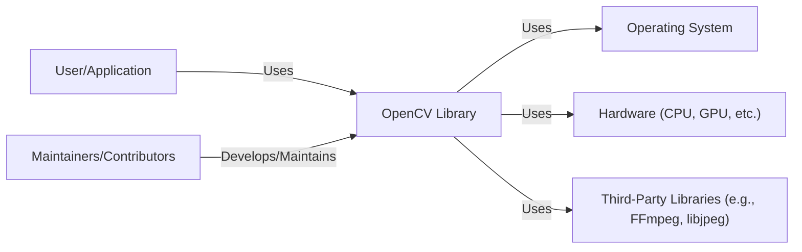
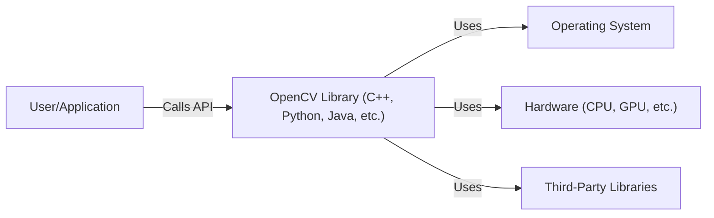
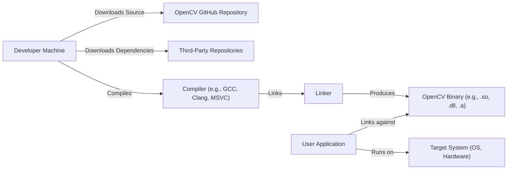
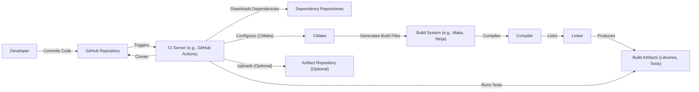

Okay, let's create a design document for the OpenCV project, keeping in mind its purpose and potential security considerations.

# BUSINESS POSTURE

OpenCV (Open Source Computer Vision Library) is a widely-used, open-source library focused on real-time computer vision.  It's used in a vast array of applications, from robotics and image editing to medical imaging and security systems.

Priorities and Goals:

*   Provide a comprehensive, efficient, and easy-to-use library for computer vision tasks.
*   Maintain cross-platform compatibility (Windows, Linux, macOS, Android, iOS, etc.).
*   Foster a large and active community of users and contributors.
*   Offer a permissive open-source license (BSD) that encourages both academic and commercial use.
*   Ensure high performance and optimized code for real-time applications.
*   Provide bindings for multiple programming languages (C++, Python, Java, etc.).

Most Important Business Risks:

*   Malicious Code Injection:  Given its widespread use, especially in security-sensitive applications, vulnerabilities in OpenCV could be exploited to inject malicious code, leading to system compromise, data breaches, or denial of service. This is the most critical risk.
*   Supply Chain Attacks: Compromise of the build process or distribution channels could lead to the distribution of tainted versions of OpenCV, impacting a large number of users.
*   Intellectual Property Theft: While OpenCV is open-source, specific implementations or algorithms contributed by users or integrated into the library might be vulnerable to theft or unauthorized use.
*   Reputational Damage:  Major security vulnerabilities or incidents could damage the reputation of OpenCV and erode trust within the community.
*   Lack of Secure Development Practices: Inconsistent application of secure coding practices and a lack of rigorous security testing could lead to vulnerabilities.
*   Denial of Service: Specially crafted input images or data could trigger bugs or vulnerabilities in OpenCV, leading to crashes or excessive resource consumption, causing denial of service.

# SECURITY POSTURE

Existing Security Controls:

*   security control: Open Source Code: The code is publicly available for review and scrutiny by the community, allowing for identification and reporting of vulnerabilities. (Described in: GitHub repository)
*   security control: Community Contributions:  A large and active community contributes to the project, including bug fixes and security improvements. (Described in: GitHub repository, Contributor guidelines)
*   security control: Issue Tracking:  A public issue tracker (GitHub Issues) is used to report and track bugs and security vulnerabilities. (Described in: GitHub repository)
*   security control: Code Reviews: Pull requests are subject to code review by maintainers and other contributors. (Described in: GitHub repository, Contributor guidelines)
*   security control: Static Analysis (sporadic): There's evidence of some use of static analysis tools, but it's not consistently applied across the entire codebase. (Described in: Some CI configurations, sporadic reports in issues)
*   security control: Fuzzing (limited): Some fuzzing efforts have been undertaken, but more comprehensive fuzzing is needed. (Described in: Some documentation and community discussions)
*   security control: Permissive License (BSD): The BSD license allows for flexible use and modification, but also places responsibility on users to ensure the security of their applications.

Accepted Risks:

*   accepted risk: Resource Constraints: As an open-source project, OpenCV relies on volunteer contributions and may have limited resources for dedicated security audits and testing.
*   accepted risk: Legacy Code: The codebase has a long history, and some parts may contain older code that is more difficult to secure.
*   accepted risk: Third-Party Dependencies: OpenCV depends on various third-party libraries, which may introduce their own vulnerabilities.
*   accepted risk: User Responsibility:  Users are ultimately responsible for securing their applications that utilize OpenCV and for validating inputs.

Recommended Security Controls (High Priority):

*   security control: Integrate Continuous Static Analysis: Implement continuous static analysis (SAST) into the CI/CD pipeline to automatically detect potential vulnerabilities during development.
*   security control: Comprehensive Fuzzing:  Establish a robust fuzzing framework to continuously test OpenCV with a wide range of inputs, including malformed and edge-case data.
*   security control: Dependency Management:  Implement a robust dependency management system to track and update third-party libraries, and to assess their security posture.
*   security control: Security Training: Provide security training and guidelines for contributors to promote secure coding practices.
*   security control: Vulnerability Disclosure Program:  Establish a formal vulnerability disclosure program to encourage responsible reporting of security issues.
*   security control: Code Signing: Digitally sign releases to ensure their integrity and authenticity.

Security Requirements:

*   Authentication: Not directly applicable to the library itself, but applications using OpenCV may need to implement authentication mechanisms.
*   Authorization: Not directly applicable to the library itself, but applications using OpenCV may need to implement authorization mechanisms to control access to resources and functionality.
*   Input Validation:
    *   Strictly validate all input data, including image dimensions, pixel formats, and data types.
    *   Sanitize inputs to prevent injection attacks.
    *   Implement checks for buffer overflows and other memory-related vulnerabilities.
    *   Handle unexpected or invalid inputs gracefully, without crashing or exposing sensitive information.
*   Cryptography:
    *   If OpenCV is used for cryptographic operations (e.g., image encryption), use well-vetted and up-to-date cryptographic libraries.
    *   Avoid implementing custom cryptographic algorithms.
    *   Ensure proper key management and secure storage of sensitive data.

# DESIGN

## C4 CONTEXT

Element Descriptions:

*   Element:
    *   Name: User/Application
    *   Type: External Entity (Person or System)
    *   Description: Represents a user or an application that utilizes the OpenCV library for computer vision tasks.
    *   Responsibilities: Provides input data (images, videos, etc.) to OpenCV, processes the results, and handles user interaction.
    *   Security controls: Input validation, output sanitization, secure handling of sensitive data.

*   Element:
    *   Name: OpenCV Library
    *   Type: Software System
    *   Description: The core OpenCV library, providing a wide range of computer vision algorithms and functionalities.
    *   Responsibilities: Image processing, object detection, feature extraction, video analysis, machine learning, etc.
    *   Security controls: Input validation, secure coding practices, regular security audits, fuzzing.

*   Element:
    *   Name: Operating System
    *   Type: External System
    *   Description: The underlying operating system (Windows, Linux, macOS, etc.) on which OpenCV runs.
    *   Responsibilities: Provides system resources (memory, CPU, file system, etc.) to OpenCV.
    *   Security controls: OS-level security features (e.g., ASLR, DEP), regular security updates.

*   Element:
    *   Name: Hardware (CPU, GPU, etc.)
    *   Type: External System
    *   Description: The hardware components that OpenCV utilizes for processing, including CPU, GPU, and other specialized hardware.
    *   Responsibilities: Executes OpenCV code and performs computations.
    *   Security controls: Hardware-level security features (e.g., secure boot, trusted execution environment).

*   Element:
    *   Name: Third-Party Libraries (e.g., FFmpeg, libjpeg)
    *   Type: External System
    *   Description: External libraries that OpenCV depends on for specific functionalities (e.g., video decoding, image format support).
    *   Responsibilities: Provide specific functionalities as required by OpenCV.
    *   Security controls: Regular updates, vulnerability scanning, dependency management.

*   Element:
    *   Name: Maintainers/Contributors
    *   Type: External Entity (Person)
    *   Description: The developers and maintainers who contribute to the OpenCV project.
    *   Responsibilities: Develop new features, fix bugs, review code, and maintain the overall health of the project.
    *   Security controls: Secure coding practices, code reviews, security training.

## C4 CONTAINER

Since OpenCV is primarily a library, the container diagram is relatively simple and closely resembles the context diagram.  It's a single "container" in the sense that it's a single, cohesive unit of code.

Element Descriptions:

*   Element:
    *   Name: User/Application
    *   Type: External Entity (Person or System)
    *   Description: Represents a user or an application that utilizes the OpenCV library.
    *   Responsibilities: Provides input, processes results, handles user interaction.
    *   Security controls: Input validation, output sanitization, secure data handling.

*   Element:
    *   Name: OpenCV Library (C++, Python, Java, etc.)
    *   Type: Container (Library)
    *   Description: The core OpenCV library, providing computer vision functionalities. This is the "container" in this context.
    *   Responsibilities: Image processing, object detection, feature extraction, etc.
    *   Security controls: Input validation, secure coding, fuzzing, regular audits.

*   Element:
    *   Name: Operating System
    *   Type: External System
    *   Description: The underlying operating system.
    *   Responsibilities: Provides system resources.
    *   Security controls: OS-level security, regular updates.

*   Element:
    *   Name: Hardware (CPU, GPU, etc.)
    *   Type: External System
    *   Description: Hardware components used for processing.
    *   Responsibilities: Executes code, performs computations.
    *   Security controls: Hardware-level security features.

*   Element:
    *   Name: Third-Party Libraries
    *   Type: External System
    *   Description: External libraries OpenCV depends on.
    *   Responsibilities: Provide specific functionalities.
    *   Security controls: Regular updates, vulnerability scanning, dependency management.

## DEPLOYMENT

OpenCV can be deployed in various ways:

1.  **Direct Compilation and Linking:** Users can download the source code and compile it directly on their target system, linking it into their applications.
2.  **Pre-built Binaries:** OpenCV provides pre-built binaries for various platforms and configurations, which users can download and install.
3.  **Package Managers:** OpenCV is available through various package managers (e.g., apt, yum, pip, conda), simplifying installation and dependency management.
4.  **Docker Containers:**  Docker images containing OpenCV are available, providing a consistent and isolated environment for development and deployment.
5.  **Cloud-based Services:**  Some cloud providers offer services that utilize OpenCV or provide pre-configured environments with OpenCV installed.

We'll describe the **Direct Compilation and Linking** approach in detail, as it's the most fundamental and exposes the most relevant security considerations for the library itself.

Element Descriptions:

*   Element:
    *   Name: Developer Machine
    *   Type: Workstation
    *   Description: The machine used by the developer to build OpenCV.
    *   Responsibilities: Downloads source code and dependencies, compiles and links the library.
    *   Security controls: Secure development environment, up-to-date software, malware protection.

*   Element:
    *   Name: OpenCV GitHub Repository
    *   Type: Source Code Repository
    *   Description: The official repository for OpenCV source code.
    *   Responsibilities: Stores and manages the source code.
    *   Security controls: Access controls, code reviews, branch protection.

*   Element:
    *   Name: Third-Party Repositories
    *   Type: Source Code/Binary Repository
    *   Description: Repositories containing the source code or pre-built binaries of third-party dependencies.
    *   Responsibilities: Provide dependencies required by OpenCV.
    *   Security controls: Varies depending on the repository.

*   Element:
    *   Name: Compiler (e.g., GCC, Clang, MSVC)
    *   Type: Software Tool
    *   Description: The compiler used to translate the source code into machine code.
    *   Responsibilities: Compiles the code.
    *   Security controls: Compiler security flags (e.g., stack protection, buffer overflow detection).

*   Element:
    *   Name: Linker
    *   Type: Software Tool
    *   Description: The linker used to combine the compiled code with libraries into an executable or library.
    *   Responsibilities: Links the code.
    *   Security controls: Linker security flags.

*   Element:
    *   Name: OpenCV Binary (e.g., .so, .dll, .a)
    *   Type: Library File
    *   Description: The compiled OpenCV library.
    *   Responsibilities: Provides computer vision functionalities.
    *   Security controls: Code signing (recommended).

*   Element:
    *   Name: User Application
    *   Type: Software Application
    *   Description: The application that uses the OpenCV library.
    *   Responsibilities: Implements the application logic and utilizes OpenCV.
    *   Security controls: Input validation, secure coding practices, etc.

*   Element:
    *   Name: Target System (OS, Hardware)
    *   Type: Deployment Environment
    *   Description: The system where the user application and OpenCV will run.
    *   Responsibilities: Provides the runtime environment.
    *   Security controls: OS-level security, hardware security features.

## BUILD

The OpenCV build process typically involves the following steps:

1.  **Source Code Acquisition:** Developers obtain the source code from the official GitHub repository.
2.  **Dependency Resolution:**  Dependencies (third-party libraries) are downloaded or built.
3.  **Configuration:**  The build system (CMake) is used to configure the build process, specifying options such as target platform, build type (Release, Debug), and enabled modules.
4.  **Compilation:** The source code is compiled into object files.
5.  **Linking:** The object files and libraries are linked together to create the final OpenCV library files (e.g., .so, .dll, .a).
6.  **Testing (Optional):**  Unit tests and performance tests can be run to verify the build.
7.  **Installation (Optional):** The library files and headers can be installed to a system-wide location.
8.  **Packaging (Optional):**  Packages (e.g., .deb, .rpm, .zip) can be created for distribution.

OpenCV uses CMake as its build system and often leverages CI environments like GitHub Actions for automated builds and testing.

Security Controls in the Build Process:

*   security control: Version Control (Git):  The use of Git and GitHub provides a history of changes and allows for code review.
*   security control: CI/CD (GitHub Actions):  Automated builds and tests help ensure consistency and can be used to integrate security checks.
*   security control: CMake: CMake allows for configuring build options, including security-related flags (e.g., enabling compiler warnings, stack protection).
*   security control: Compiler and Linker Flags:  Using appropriate compiler and linker flags can enhance security (e.g., stack canaries, ASLR, DEP).
*   security control: Static Analysis (Limited):  Some CI configurations include static analysis, but it should be more comprehensive.
*   security control: Testing: Unit tests and performance tests can help identify bugs that could lead to vulnerabilities.

# RISK ASSESSMENT

Critical Business Processes to Protect:

*   Image and Video Processing: The core functionality of OpenCV, used in a wide range of applications.
*   Object Detection and Recognition:  Used in security systems, autonomous vehicles, and other critical applications.
*   Real-time Performance:  Essential for applications requiring low latency, such as robotics and video surveillance.

Data to Protect and Sensitivity:

*   Image and Video Data:  The primary data processed by OpenCV. Sensitivity varies greatly depending on the application.  It can range from publicly available images to highly sensitive data like medical images, surveillance footage, or biometric data.
*   Model Data:  Machine learning models used by OpenCV may contain sensitive information or intellectual property.
*   Configuration Data:  Configuration files or settings used by applications integrating OpenCV may contain sensitive information.
*   User Data: Applications using OpenCV may collect and process user data, which needs to be protected according to privacy regulations.

# QUESTIONS & ASSUMPTIONS

Questions:

*   What is the current level of static analysis coverage and which tools are being used?
*   What is the current fuzzing strategy, and what tools are being used?
*   Is there a formal process for managing and updating third-party dependencies?
*   Are there any specific security certifications or compliance requirements that OpenCV needs to meet?
*   What is the process for handling reported security vulnerabilities?
*   Is there a dedicated security team or point of contact for security issues?

Assumptions:

*   BUSINESS POSTURE: The OpenCV project prioritizes functionality, performance, and community engagement, but security is a growing concern.
*   SECURITY POSTURE: The project relies heavily on community contributions for security, but there's a need for more proactive and systematic security measures.
*   DESIGN: The design is primarily focused on providing a flexible and efficient library, with security considerations being addressed primarily through input validation and secure coding practices. The build process is reasonably well-defined, but security integration could be improved.