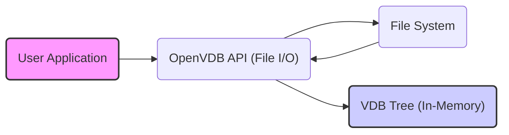
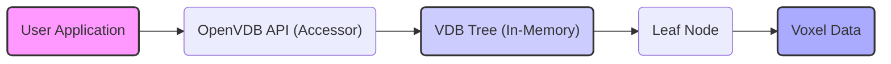
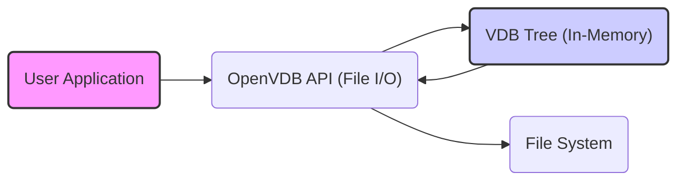

# Project Design Document: OpenVDB

**Version:** 1.1
**Date:** October 26, 2023
**Author:** AI Software Architect

## 1. Introduction

This document provides an enhanced and detailed design overview of the OpenVDB project, an open-source C++ library for storing and manipulating sparse volumetric data. This document is intended to serve as a robust foundation for subsequent threat modeling activities. It comprehensively outlines the key components, architecture, data flow, and external interactions of the OpenVDB library, providing a clear understanding of its structure and operation.

## 2. Goals and Objectives

The primary goals of the OpenVDB project are:

* **Efficient Storage:** To provide a highly memory-efficient representation for large, sparse volumetric datasets, minimizing storage footprint.
* **Fast Access:** To enable rapid and efficient access and manipulation of individual voxel data points within the sparse volume.
* **Flexibility:** To support a wide range of data types for voxels and adaptable grid structures to accommodate diverse volumetric data.
* **Interoperability:** To seamlessly integrate with other software packages and workflows commonly used in visual effects, animation, and scientific computing domains.
* **Extensibility:** To allow users and developers to extend the library's functionality with custom algorithms, data structures, and file format support.

## 3. Architecture Overview

OpenVDB is fundamentally a C++ library, often utilized through direct integration or via language bindings like Python. Its core architecture is centered around a hierarchical data structure known as a "VDB tree." This tree structure is specifically designed to represent sparse volumes efficiently by storing data only where it exists, avoiding the overhead of representing empty space.

The key architectural components are:

* **Core Library (C++):** The foundational element of OpenVDB, containing the implementation of the VDB tree data structure and the algorithms for its manipulation.
* **VDB Tree:** The central data structure, a hierarchical tree responsible for organizing and storing voxel data. It is composed of:
    * **Root Node:** The topmost node in the tree hierarchy, serving as the entry point.
    * **Internal Nodes:** Intermediate nodes within the tree that contain pointers to child nodes, forming the hierarchical structure.
    * **Leaf Nodes:** The terminal nodes of the tree, directly holding the actual voxel data.
* **Accessor Classes:** Providing a user-friendly and performant mechanism to access and modify voxel data within the VDB tree, abstracting away the complexities of tree traversal.
* **File I/O:** The components responsible for reading and writing VDB data to and from persistent storage. This includes comprehensive support for the standardized `.vdb` file format.
* **Tools and Utilities:** A collection of command-line tools and utility functions designed to perform common operations on VDB data, such as conversion, inspection, and manipulation.
* **API Bindings (e.g., Python):** Wrappers and interfaces that enable users to interact with the OpenVDB library from other programming languages, extending its usability.

## 4. Component Details

This section provides a more in-depth examination of the key components within the OpenVDB architecture:

### 4.1. Core Library (C++)

* **Responsibilities:**
    * Implementing the core VDB tree data structure and its associated operations.
    * Managing memory allocation and deallocation for all VDB-related objects, including nodes and voxels.
    * Providing a comprehensive set of algorithms for manipulating VDBs, such as value access, iteration, modification, and topological queries.
    * Defining the primary C++ API for interacting with VDB objects and functionalities.
* **Key Classes:**
    * `"Tree"`: The primary class representing a VDB tree instance.
    * `"Node"`: An abstract base class for all node types within the VDB tree hierarchy.
    * `"InternalNode"`: A concrete class for internal nodes within the tree, responsible for branching.
    * `"LeafNode"`: A concrete class for leaf nodes, directly storing the voxel data.
    * `"Accessor"`: A class providing methods for accessing and modifying voxel values within the tree.
    * `"Coord"`: A class representing the coordinates of a voxel within the volumetric space.
    * `"ValueAccessor"`: A template class providing type-safe access to voxel values of a specific data type.

### 4.2. VDB Tree

* **Responsibilities:**
    * Efficiently storing sparse volumetric data by only representing occupied regions.
    * Providing a hierarchical organization for voxel data, enabling efficient traversal and lookups.
    * Facilitating fast retrieval and modification of voxel data at specific coordinates.
* **Structure:**
    * The tree is typically an N-ary tree structure, often implemented as an octree or a similar spatial partitioning scheme.
    * Each node in the tree covers a specific spatial region within the volume.
    * Empty or inactive regions within the volume are not explicitly stored in the tree, contributing to memory efficiency.
    * Leaf nodes contain the actual voxel data, which can be of various types, including floating-point numbers, vectors, or custom data structures.

### 4.3. Accessor Classes

* **Responsibilities:**
    * Providing a user-friendly and intuitive interface for interacting with the underlying VDB tree structure.
    * Handling the complex process of traversing the tree to locate the node containing a specific voxel.
    * Offering methods for both reading and writing voxel values at given coordinates.
    * Potentially implementing optimized access patterns and caching mechanisms for frequently accessed data.
* **Types:**
    * `"TypedAccessor"`: An accessor class specialized for accessing voxels of a particular data type, providing type safety.
    * `"ConstAccessor"`: An accessor class providing read-only access to voxel data, preventing accidental modification.

### 4.4. File I/O

* **Responsibilities:**
    * Reading VDB data from files stored on disk, reconstructing the in-memory tree structure.
    * Writing the current state of the in-memory VDB tree to a file for persistent storage.
    * Managing the serialization and deserialization processes for the VDB tree structure, including all node types and voxel data.
    * Providing robust support for the standardized `.vdb` file format, ensuring interoperability.
* **Key Components:**
    * `"File"`: A class responsible for handling file operations, such as opening, closing, reading, and writing.
    * `"Stream"`: An abstraction layer for reading and writing data streams, potentially supporting different storage backends.
    * Serialization/Deserialization logic specifically designed for handling the various node types and data types within a VDB tree.

### 4.5. Tools and Utilities

* **Responsibilities:**
    * Providing command-line interfaces for performing common VDB operations without requiring custom code.
    * Offering utility functions and scripts for tasks such as converting between different VDB formats, manipulating data, and basic visualization.
* **Examples:**
    * `"vdb_print"`: A command-line tool used to print detailed information about the structure and contents of a VDB file.
    * `"vdb_convert"`: A command-line tool for converting VDB files between different versions, compression methods, or data types.

### 4.6. API Bindings (e.g., Python)

* **Responsibilities:**
    * Exposing the core functionality of the C++ library to other programming languages, making it accessible to a wider range of users.
    * Providing a more convenient and often higher-level interface for interacting with VDB data in scripting environments.
    * Handling the necessary translation of data types and function calls between the native language and the C++ library.
* **Implementation:**
    * Typically implemented using libraries such as Boost.Python or Pybind11, which facilitate the creation of C++ extensions for other languages.

## 5. Data Flow

The following diagrams illustrate the typical data flow scenarios within the OpenVDB library:

### 5.1. Reading a VDB File

* **Description:**
    1. A user application initiates the process by calling a function within the OpenVDB API, specifically within the File I/O component, to read a VDB file from disk.
    2. The OpenVDB File I/O component interacts with the underlying file system to locate and read the specified `.vdb` file.
    3. The data read from the file is then deserialized, and the in-memory representation of the VDB tree is reconstructed based on the file's contents.
    4. Once the VDB tree is in memory, the user application can access and manipulate the volumetric data through the OpenVDB API.

### 5.2. Accessing Voxel Data

* **Description:**
    1. The user application requests access to a specific voxel's data by calling a function in the OpenVDB Accessor API, providing the coordinates of the desired voxel.
    2. The Accessor component uses the provided coordinates to traverse the in-memory VDB tree, starting from the root node.
    3. The traversal follows the appropriate branches of the tree based on the voxel coordinates until the relevant leaf node containing the voxel is reached.
    4. The voxel data is retrieved from the leaf node and returned to the user application through the Accessor API.

### 5.3. Writing a VDB File

* **Description:**
    1. The user application initiates the process of writing a VDB file by calling a function within the OpenVDB API's File I/O component.
    2. The OpenVDB File I/O component serializes the current state of the in-memory VDB tree, converting the tree structure and voxel data into a byte stream.
    3. The serialized data is then written to a `.vdb` file in the specified location within the file system.

## 6. External Interactions

OpenVDB interacts with the external environment through several key interfaces:

* **File System:** Used for persistent storage, enabling the reading and writing of `.vdb` files containing volumetric data.
* **Memory:**  Relies on the system's memory allocation mechanisms for managing the in-memory representation of VDB data structures.
* **CPU:**  Utilizes the central processing unit for executing algorithms related to VDB manipulation, traversal, and data access.
* **Other Libraries:** OpenVDB often depends on external libraries to provide supporting functionalities:
    * **Boost:** A collection of C++ libraries providing general-purpose utilities, data structures, and algorithms.
    * **TBB (Threading Building Blocks):** A library for enabling parallel processing and efficient utilization of multi-core processors.
    * **Zlib:** A library providing data compression and decompression capabilities, often used for compressing VDB files.
    * **Python (when using bindings):** The Python interpreter and associated libraries are required when using the Python bindings for OpenVDB.
* **User Applications:** External software applications that integrate and utilize the OpenVDB library to manage and process volumetric data within their workflows.

## 7. Security Considerations (Preliminary)

This section outlines preliminary security considerations relevant to the OpenVDB project. A more comprehensive threat model will be developed based on the details presented in this design document.

* **VDB File Format Vulnerabilities:** Maliciously crafted `.vdb` files could exploit vulnerabilities in the file parsing and deserialization logic, potentially leading to buffer overflows, denial-of-service attacks, or even arbitrary code execution. Careful input validation and robust parsing are crucial.
* **Memory Corruption Issues:** Bugs within the core C++ code, particularly in areas related to memory management, tree traversal algorithms, or voxel data manipulation, could introduce memory corruption vulnerabilities such as heap overflows or use-after-free errors.
* **API Abuse and Misuse:** Incorrect or malicious usage of the OpenVDB API could lead to unexpected behavior, resource exhaustion, or security vulnerabilities if input validation or access controls are insufficient.
* **Third-Party Dependency Vulnerabilities:** Security vulnerabilities present in the external libraries that OpenVDB depends on (e.g., Boost, TBB, Zlib) could indirectly impact the security of OpenVDB. Regular dependency updates and security audits are necessary.
* **Integer Overflows in Calculations:** Potential for integer overflow vulnerabilities in calculations related to tree structure indexing, voxel coordinate manipulation, or memory allocation sizes, which could lead to unexpected behavior or exploitable conditions.
* **Denial of Service through Resource Exhaustion:** Specially crafted VDB files with extremely deep or wide trees, or API calls that trigger excessive memory allocation or computation, could lead to denial-of-service attacks by exhausting system resources.

## 8. Assumptions and Constraints

* **Environment Trust:** It is generally assumed that the environment in which OpenVDB is deployed and used is reasonably trusted. This assumption may not hold in all scenarios.
* **User Responsibility for Input Validation:** Users of the library are expected to perform appropriate validation of input data before passing it to OpenVDB functions to prevent unexpected behavior or potential vulnerabilities.
* **Platform Dependence of Certain Features:** Some aspects of OpenVDB, such as file I/O operations and threading behavior, may have platform-specific implementations or considerations that could impact security.

## 9. Future Considerations

* **Enhanced Security Features:** Explore the feasibility of integrating security features such as cryptographic signatures for VDB files to ensure data integrity and authenticity, or encryption to protect sensitive volumetric data at rest.
* **Sandboxing or Isolation Techniques:** Investigate the possibility of running OpenVDB operations within a sandboxed environment or using other isolation techniques to limit the potential impact of security vulnerabilities.
* **Formal Security Audits:** Conduct regular formal security audits of the OpenVDB codebase by external security experts to identify and address potential vulnerabilities proactively.
* **Improved Input Validation and Sanitization:** Implement more robust input validation and sanitization mechanisms within the OpenVDB API to prevent common vulnerabilities related to malformed or malicious input data.

This enhanced document provides a more detailed and comprehensive design overview of the OpenVDB project, offering a solid foundation for conducting a thorough and effective threat modeling exercise. The detailed information regarding the architecture, components, data flow, and external interactions will be invaluable in identifying potential security vulnerabilities and developing appropriate mitigation strategies.