# Project Design Document: node-oracledb

**Version:** 1.1
**Date:** October 26, 2023
**Author:** AI Software Architect

## 1. Introduction

This document provides an enhanced design overview of the `node-oracledb` project, a Node.js add-on facilitating connections between Node.js applications and Oracle Databases. This detailed design serves as a crucial input for subsequent threat modeling activities, enabling a comprehensive security assessment.

## 2. Goals

*   Present a refined and more detailed architectural blueprint of the `node-oracledb` project.
*   Clearly delineate the responsibilities and interactions of each key component.
*   Provide a precise description of the data flow within the system, highlighting critical pathways.
*   Thoroughly examine security-relevant aspects of the design, including potential vulnerabilities and attack surfaces.
*   Serve as a robust and informative foundation for detailed threat modeling exercises.

## 3. Architectural Overview

The `node-oracledb` project acts as a vital intermediary, enabling seamless communication between Node.js applications and Oracle Databases. It leverages Node.js's native addon capabilities, specifically N-API, to interface with Oracle Client libraries. The core functionalities include:

*   Establishing and managing connections to Oracle Databases, including support for connection strings and connection pools.
*   Executing a wide range of SQL and PL/SQL statements, including DML, DDL, and stored procedures.
*   Retrieving data from the database in various formats, handling different data types and large objects (LOBs).
*   Managing database transactions with support for commit and rollback operations.
*   Providing features for advanced database interactions, such as fetching metadata and handling events.

The architecture is structured into distinct layers, each with specific responsibilities:

*   **Node.js Application Layer:** The user's application code, written in JavaScript or TypeScript, that utilizes the `node-oracledb` API to interact with the database.
*   **`node-oracledb` JavaScript Layer:** The JavaScript codebase within the `node-oracledb` module. This layer exposes the high-level API, handles user requests, and orchestrates interactions with the native addon.
*   **`node-oracledb` Native Addon Layer (C/C++):** A native Node.js addon implemented in C/C++, utilizing Node-API (N-API) for stability across Node.js versions. This layer serves as the critical bridge between the JavaScript layer and the Oracle Client libraries, managing low-level communication and data transformation.
*   **Oracle Client Libraries:** A suite of libraries provided by Oracle (e.g., OCI - Oracle Call Interface, Network Layer) that are essential for establishing connections, sending requests, and receiving responses from the Oracle Database. These libraries must be installed on the system running the Node.js application.
*   **Oracle Database Server:** The target Oracle Database instance responsible for storing, processing, and managing data.

## 4. Component Details

### 4.1. Node.js Application Layer

*   **Description:** This layer encompasses the custom application logic developed by users, leveraging the `node-oracledb` module for database interactions.
*   **Responsibilities:**
    *   Importing and initializing the `node-oracledb` module.
    *   Configuring database connection parameters (e.g., connection string, username, password).
    *   Acquiring connections from the connection pool or establishing new connections.
    *   Constructing and executing SQL and PL/SQL statements, potentially incorporating user-provided data.
    *   Processing data returned from the database, transforming it for application use.
    *   Implementing error handling and transaction management logic.
*   **Security Considerations:**
    *   **SQL Injection Vulnerability:**  A primary concern if user input is directly incorporated into SQL queries without proper sanitization or parameterized queries.
    *   **Credential Exposure:** Risk of exposing sensitive database credentials if hardcoded or stored insecurely.
    *   **Information Disclosure:** Improper error handling can reveal sensitive database schema or data information.
    *   **Dependency Vulnerabilities:**  Vulnerabilities in other npm packages used by the application could be exploited.

### 4.2. `node-oracledb` JavaScript Layer

*   **Description:** This layer provides the public API of the `node-oracledb` module, offering a set of functions and classes for database interaction.
*   **Responsibilities:**
    *   Providing a user-friendly and consistent API for common database operations.
    *   Validating user-provided parameters before passing them to the native addon.
    *   Managing connection pools, including creation, resizing, and connection recycling.
    *   Orchestrating asynchronous operations and managing callbacks/promises.
    *   Marshalling data between JavaScript data types and the formats expected by the native addon.
    *   Handling high-level error conditions and translating native addon errors into JavaScript exceptions.
*   **Security Considerations:**
    *   **Insufficient Input Validation:**  If this layer fails to adequately validate input, it could pass malicious data to the native addon, potentially leading to vulnerabilities.
    *   **API Misuse:**  The API design should be robust enough to prevent common misuse patterns that could introduce security flaws.
    *   **Dependency Vulnerabilities:**  Vulnerabilities in npm packages used by this layer could be exploited.
    *   **Denial of Service:**  Potential for resource exhaustion if connection pool management is flawed or susceptible to manipulation.

### 4.3. `node-oracledb` Native Addon Layer (C/C++)

*   **Description:** This layer, implemented as a Node.js native addon using C/C++ and N-API, acts as the core interface with the Oracle Client Libraries.
*   **Responsibilities:**
    *   Initializing and managing the Oracle Client environment.
    *   Establishing and managing connections to the Oracle Database using the Oracle Call Interface (OCI).
    *   Executing SQL and PL/SQL statements through OCI.
    *   Fetching data from the database and marshalling it back to JavaScript.
    *   Handling data type conversions between JavaScript and Oracle data types.
    *   Managing LOB (Large Object) data.
    *   Implementing performance-critical operations efficiently.
*   **Security Considerations:**
    *   **Memory Corruption Vulnerabilities:**  C/C++ code is susceptible to buffer overflows, use-after-free errors, and other memory management issues if not carefully implemented.
    *   **Incorrect Pointer Handling:**  Improper handling of pointers can lead to crashes or exploitable vulnerabilities.
    *   **Oracle Client Library Versioning:**  Dependencies on specific versions of the Oracle Client Libraries can introduce vulnerabilities if those libraries have known security flaws.
    *   **Credential Handling:**  Securely handling database credentials passed from the JavaScript layer and when interacting with the Oracle Client Libraries.
    *   **External Library Vulnerabilities:**  If the addon uses any external C/C++ libraries, vulnerabilities in those libraries could be a concern.

### 4.4. Oracle Client Libraries

*   **Description:** A collection of libraries provided by Oracle that enable applications to communicate with Oracle Databases. Key components include OCI (Oracle Call Interface) and the network layer.
*   **Responsibilities:**
    *   Establishing network connections to the Oracle Database based on connection strings and configuration files (e.g., `tnsnames.ora`, `sqlnet.ora`).
    *   Handling authentication and authorization with the database.
    *   Encrypting and decrypting data transmitted over the network (if configured).
    *   Formatting and transmitting SQL and PL/SQL statements to the database server.
    *   Receiving and parsing data returned from the database.
    *   Managing network protocols and data encoding.
*   **Security Considerations:**
    *   **Vulnerabilities in Oracle Client Libraries:**  Security flaws in the Oracle Client Libraries themselves can be exploited. Keeping these libraries updated with the latest patches is critical.
    *   **Configuration Vulnerabilities:**  Misconfigurations in client-side configuration files (e.g., insecure authentication methods, weak encryption settings) can weaken security.
    *   **Man-in-the-Middle Attacks:**  If network traffic is not encrypted, attackers could intercept sensitive data, including credentials and query results.
    *   **Downgrade Attacks:**  Attackers might try to force the use of older, less secure versions of the communication protocols.

### 4.5. Oracle Database Server

*   **Description:** The core database system responsible for storing, managing, and processing data.
*   **Responsibilities:**
    *   Storing and retrieving data based on SQL and PL/SQL queries.
    *   Enforcing security policies, including authentication, authorization, and data access controls.
    *   Managing transactions and ensuring data integrity.
    *   Auditing database activities.
    *   Protecting data at rest through encryption.
*   **Security Considerations:**
    *   **Database Vulnerabilities:**  The database server software itself can have vulnerabilities that attackers could exploit. Regular patching is essential.
    *   **Weak Authentication:**  Using weak or default passwords for database users can lead to unauthorized access.
    *   **Insufficient Authorization:**  Granting excessive privileges to database users increases the potential impact of a security breach.
    *   **SQL Injection (Indirect):** While `node-oracledb` aims to prevent this, vulnerabilities in stored procedures or database triggers could still be exploited.
    *   **Data Exfiltration:**  Attackers who gain access could exfiltrate sensitive data.
    *   **Denial of Service:**  Attackers could overload the database with requests, causing it to become unavailable.

## 5. Data Flow Diagram

```mermaid
graph LR
    A("Node.js Application") --> B("node-oracledb JavaScript Layer");
    B --> C("node-oracledb Native Addon (C/C++)");
    C --> D("Oracle Client Libraries");
    D --> E("Oracle Database Server");
    E -- "Data Response" --> D;
    D -- "Data Response" --> C;
    C -- "Data Response" --> B;
    B -- "Data Response" --> A;
    style A fill:#f9f,stroke:#333,stroke-width:2px
    style B fill:#ccf,stroke:#333,stroke-width:2px
    style C fill:#ccf,stroke:#333,stroke-width:2px
    style D fill:#ccf,stroke:#333,stroke-width:2px
    style E fill:#f9f,stroke:#333,stroke-width:2px
```

**Data Flow Description:**

1. The **Node.js Application** initiates a database operation, such as executing a query or updating data.
2. The request is passed to the **`node-oracledb` JavaScript Layer**, which validates the input and prepares it for the native addon.
3. The **`node-oracledb` Native Addon (C/C++)** receives the request and uses the **Oracle Client Libraries** to communicate with the **Oracle Database Server**.
4. The **Oracle Client Libraries** establish a network connection and transmit the SQL or PL/SQL statement to the **Oracle Database Server**.
5. The **Oracle Database Server** processes the request and generates a response containing the requested data or the result of the operation.
6. The **Oracle Database Server** sends the **Data Response** back through the **Oracle Client Libraries**.
7. The **Oracle Client Libraries** pass the **Data Response** to the **`node-oracledb` Native Addon (C/C++)**.
8. The native addon marshals the data and sends the **Data Response** to the **`node-oracledb` JavaScript Layer**.
9. The JavaScript layer processes the **Data Response** and returns it to the **Node.js Application**.

## 6. Security Considerations and Potential Attack Surfaces

This section details security considerations and potential attack surfaces for each component.

*   **Node.js Application Layer:**
    *   **Attack Surface:** Direct interaction with user input, construction of SQL queries.
    *   **Threats:** SQL injection, credential theft, information disclosure through errors, exploitation of application dependencies.
    *   **Mitigation:** Input sanitization, parameterized queries, secure credential management (e.g., environment variables, secrets management), regular dependency updates.

*   **`node-oracledb` JavaScript Layer:**
    *   **Attack Surface:** Public API exposed to the application layer.
    *   **Threats:** Exploitation of vulnerabilities in the JavaScript code, API misuse leading to unexpected behavior, denial of service through resource exhaustion, attacks targeting dependencies.
    *   **Mitigation:** Thorough input validation, secure API design, regular dependency updates, rate limiting for connection requests.

*   **`node-oracledb` Native Addon Layer (C/C++):**
    *   **Attack Surface:** Interface with the JavaScript layer and the Oracle Client Libraries.
    *   **Threats:** Memory corruption vulnerabilities (buffer overflows, use-after-free), incorrect pointer handling, vulnerabilities due to outdated Oracle Client Libraries, insecure credential handling.
    *   **Mitigation:** Secure coding practices, memory safety checks, regular updates of Oracle Client Libraries, secure storage and handling of credentials.

*   **Oracle Client Libraries:**
    *   **Attack Surface:** Network communication with the database server, handling of configuration files.
    *   **Threats:** Exploitation of vulnerabilities in the client libraries, man-in-the-middle attacks, downgrade attacks, exposure of sensitive information through insecure configuration.
    *   **Mitigation:** Keeping client libraries updated, enforcing secure network protocols (TLS/SSL), secure configuration of client settings.

*   **Oracle Database Server:**
    *   **Attack Surface:** Network interface, database user accounts.
    *   **Threats:** SQL injection (indirect), unauthorized access due to weak credentials, data breaches, denial of service, exploitation of database vulnerabilities.
    *   **Mitigation:** Strong authentication and authorization policies, regular patching, network segmentation, data encryption at rest and in transit, database activity monitoring.

## 7. Deployment Considerations

*   **Oracle Client Libraries Installation and Configuration:**  The correct version of the Oracle Client Libraries must be installed and properly configured on the deployment environment. This includes setting environment variables like `LD_LIBRARY_PATH` (Linux) or `PATH` (Windows) to point to the client libraries.
*   **Credential Management in Deployment:**  Database credentials should be managed securely in the deployment environment. Options include:
    *   **Environment Variables:** Storing credentials as environment variables.
    *   **Configuration Files:** Using configuration files with restricted access permissions.
    *   **Secrets Management Services:** Utilizing dedicated secrets management services provided by cloud providers (e.g., AWS Secrets Manager, Azure Key Vault, Google Cloud Secret Manager).
*   **Operating System and Node.js Compatibility:** Ensure compatibility between the `node-oracledb` version, the Node.js runtime, and the operating system of the deployment environment.
*   **Containerization (e.g., Docker):** When deploying in containers, the Oracle Client Libraries need to be included in the container image or mounted as a volume. Proper configuration of environment variables within the container is also crucial.
*   **Cloud Deployment:** In cloud environments, consider using managed Oracle Database services (e.g., Oracle Cloud Infrastructure Database) and leveraging cloud-specific security features. Network security groups and firewalls should be configured to restrict access to the database.
*   **Network Security:** Ensure network security measures are in place to protect communication between the application server and the database server. This includes firewalls and potentially VPNs or private network connections.

## 8. Future Considerations

*   **Enhanced Security Auditing:** Implement more comprehensive logging and auditing within `node-oracledb` to track database interactions and potential security events.
*   **Support for Advanced Oracle Security Features:** Explore and integrate support for more advanced Oracle security features, such as Oracle Data Redaction and Transparent Data Encryption.
*   **Improved Error Handling and Security Context:** Enhance error messages to avoid revealing sensitive information while providing sufficient detail for debugging. Consider incorporating security context into error reporting.
*   **Regular Security Assessments and Penetration Testing:** Conduct periodic security assessments and penetration testing of the `node-oracledb` module and applications using it to identify and address potential vulnerabilities proactively.

This enhanced design document provides a more detailed and comprehensive understanding of the `node-oracledb` project's architecture and security considerations. This information will be invaluable for conducting thorough threat modeling and implementing appropriate security measures.