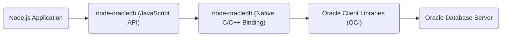
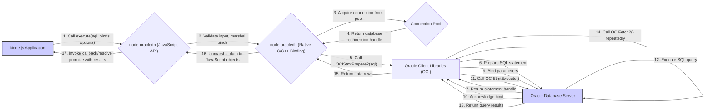

# Project Design Document: node-oracledb

**Version:** 1.1
**Date:** October 26, 2023
**Author:** AI Software Architect

## 1. Introduction

This document provides a detailed design overview of the `node-oracledb` project, a Node.js add-on that enables Node.js applications to connect to and interact with Oracle Database. This document is specifically tailored to serve as a foundation for subsequent threat modeling activities, providing a clear and comprehensive understanding of the system's architecture, components, data flows, and potential security considerations.

## 2. Goals and Objectives

The primary goals of the `node-oracledb` project are:

*   Provide a high-performance, native interface for Node.js applications to access Oracle Database, minimizing overhead.
*   Support a comprehensive range of Oracle Database features, including complex SQL queries, PL/SQL procedure calls, handling of large objects (LOBs), advanced queuing mechanisms, and Oracle Real Application Clusters (RAC).
*   Offer a developer-friendly, well-documented, and intuitive API for Node.js developers, abstracting away the complexities of the underlying Oracle Call Interface (OCI).
*   Maintain broad compatibility across various actively supported Node.js versions and Oracle Database releases, ensuring longevity and ease of adoption.
*   Ensure the secure and reliable transfer of data between the Node.js application and the Oracle Database, protecting data integrity and confidentiality.

## 3. System Architecture

The `node-oracledb` project acts as a crucial intermediary, bridging the gap between the asynchronous, event-driven nature of the Node.js runtime environment and the synchronous, procedural nature of the Oracle Client libraries. It comprises both JavaScript and native C/C++ components working in concert.

### 3.1. High-Level Architecture

*   **"Node.js Application"**: The user's application code, written in JavaScript, that utilizes the `node-oracledb` API to interact with the database.
*   **"node-oracledb (JavaScript API)"**: This layer provides the public-facing API for developers. Its responsibilities include:
    *   Validating input parameters passed by the application.
    *   Managing callbacks and promises for asynchronous operations.
    *   Marshaling data between JavaScript data types and formats suitable for the native layer.
    *   Implementing higher-level abstractions and convenience functions.
*   **"node-oracledb (Native C/C++ Binding)"**: This is the core of the add-on, implemented in C/C++. It uses Node.js's N-API (or a compatible abstraction like Nan) to interface with the JavaScript layer and directly interacts with the Oracle Call Interface (OCI) provided by the Oracle Client Libraries. Key functions include:
    *   Managing the lifecycle of OCI handles (environments, connections, statements).
    *   Implementing connection pooling logic.
    *   Executing SQL statements and PL/SQL blocks using OCI.
    *   Fetching data from the database and unmarshaling it into JavaScript data structures.
    *   Handling asynchronous operations and event loop integration.
    *   Managing transactions.
*   **"Oracle Client Libraries (OCI)"**: A set of libraries provided by Oracle Corporation. These libraries are essential for establishing network connections, authenticating with the database, sending and receiving data, and managing sessions. They handle the low-level communication protocols with the Oracle Database Server.
*   **"Oracle Database Server"**: The actual Oracle Database instance responsible for storing, managing, and processing data.

### 3.2. Detailed Component Breakdown

*   **JavaScript API Layer Components:**
    *   **Connection Management Module:** Handles establishing, managing, and releasing database connections using methods like `getConnection()` and `close()`.
    *   **Statement Execution Module:** Provides functions like `execute()` and `executeMany()` for executing SQL queries and PL/SQL blocks, including handling bind parameters and execution options.
    *   **Result Set Handling Module:**  Manages the retrieval and processing of data returned from the database, including fetching rows, handling LOBs, and managing cursors.
    *   **Transaction Management Module:** Offers methods like `commit()` and `rollback()` to control database transactions.
    *   **LOB Support Module:**  Provides specific functionality for working with large objects (CLOBs and BLOBs), including reading and writing data in chunks.
    *   **Polling and Continuous Query Notification Module:** Implements features for subscribing to database events and changes using Oracle's Continuous Query Notification (CQN) feature.
    *   **Data Type Mapping Logic:** Contains the rules and functions for converting data types between JavaScript (strings, numbers, dates, buffers) and corresponding Oracle Database data types.
    *   **Error Handling and Callback Management:** Implements mechanisms for handling errors originating from both the JavaScript and native layers, and for managing asynchronous callbacks and promises.
    *   **Configuration Object:** Holds configuration settings such as connection string details, connection pool parameters, and fetch sizes.

*   **Native C/C++ Layer Components:**
    *   **N-API/Nan Interface:**  The code responsible for bridging the gap between the Node.js runtime and the native C/C++ code, allowing JavaScript to call native functions and vice versa.
    *   **OCI Handle Management:**  Manages the allocation, use, and deallocation of various OCI handles (e.g., `OCIEnv`, `OCISvcCtx`, `OCIStmt`).
    *   **Connection Pool Implementation:**  Manages a pool of pre-established database connections to reduce the overhead of creating new connections for each request. This includes logic for acquiring, releasing, and maintaining connections.
    *   **Statement Preparation and Execution Logic:**  Uses OCI functions like `OCIStmtPrepare2()` and `OCIStmtExecute()` to prepare and execute SQL statements.
    *   **Data Fetching and Marshalling Logic:**  Utilizes OCI functions like `OCIFetch2()` and `OCIDefineByPos()` to retrieve data from the database and convert it into JavaScript-compatible formats.
    *   **Transaction Management Implementation (OCI Calls):**  Translates JavaScript transaction commands (`commit`, `rollback`) into corresponding OCI function calls.
    *   **Error Handling and Exception Propagation:**  Handles errors returned by OCI functions and propagates them to the JavaScript layer, often by creating JavaScript `Error` objects.
    *   **Asynchronous Operation Handling:**  Integrates with Node.js's event loop to perform database operations asynchronously, preventing blocking of the main thread.

*   **Oracle Client Libraries (OCI) Components (Illustrative):**
    *   **Network Communication Layer:** Handles establishing and maintaining network connections to the Oracle Database using protocols like TCP/IP.
    *   **Authentication and Authorization Layer:** Manages the process of verifying user credentials and ensuring the user has the necessary privileges to access the database.
    *   **SQL Parsing and Execution Engine:**  Parses and executes SQL statements received from the client.
    *   **Data Access Layer:**  Manages the retrieval and storage of data within the database.
    *   **Transaction Management (Database Side):**  Ensures the atomicity, consistency, isolation, and durability (ACID) properties of database transactions.
    *   **Security Components:**  Provides features like data encryption, auditing, and access control.

## 4. Data Flow

The following illustrates the typical data flow when a Node.js application executes a SQL query using `node-oracledb`:

1. The Node.js application initiates a database operation by calling a method like `execute()` on the `node-oracledb` API, providing the SQL query, bind parameters (if any), and execution options.
2. The JavaScript API layer validates the input arguments, marshals the bind parameters into a format suitable for the native layer, and prepares the necessary data structures.
3. The JavaScript layer invokes a corresponding function in the native C/C++ binding.
4. The native binding attempts to acquire a database connection from the internal connection pool.
5. The native binding uses the Oracle Client Libraries (OCI) to prepare the SQL statement by calling `OCIStmtPrepare2()`.
6. The Oracle Client Libraries send the SQL statement to the Oracle Database Server for preparation.
7. The Oracle Database Server parses and prepares the SQL statement and returns a statement handle to the Oracle Client Libraries.
8. If there are bind parameters, the native binding uses OCI functions like `OCIBindByPos()` or `OCIBindByName()` to bind the provided values to the placeholders in the SQL statement.
9. The bind parameter information is sent to the Oracle Database Server.
10. The Oracle Database Server acknowledges the binding of the parameters.
11. The native binding then calls `OCIStmtExecute()` to execute the prepared SQL statement.
12. The Oracle Client Libraries send the execution request to the Oracle Database Server.
13. The Oracle Database Server executes the SQL query.
14. The Oracle Database Server returns the query results to the Oracle Client Libraries.
15. The native binding uses OCI functions like `OCIFetch2()` repeatedly to retrieve the data rows from the result set.
16. The native binding unmarshals the data from the OCI data structures into JavaScript objects or arrays.
17. Finally, the JavaScript API layer invokes the callback function provided by the application or resolves the promise with the retrieved data.

## 5. Security Considerations

Security is paramount in `node-oracledb` to protect sensitive data and prevent unauthorized access. The following highlights key security considerations for threat modeling:

*   **Database Credentials Management Vulnerabilities:**
    *   **Threat:** Hardcoding database credentials directly in the application code or configuration files.
    *   **Vulnerability:** Exposes credentials if the codebase or configuration files are compromised.
    *   **Mitigation:** Utilize environment variables, secure configuration management tools (e.g., HashiCorp Vault), or Oracle's external authentication mechanisms. Avoid storing plain-text credentials.
*   **SQL Injection Attacks:**
    *   **Threat:** Malicious users injecting arbitrary SQL code through application inputs.
    *   **Vulnerability:**  Improperly sanitized user inputs used in dynamically constructed SQL queries.
    *   **Mitigation:**  **Always** use parameterized queries (bind variables) provided by `node-oracledb`. Avoid dynamic SQL construction where possible, and if necessary, implement rigorous input validation and sanitization.
*   **Insecure Connection Security:**
    *   **Threat:** Eavesdropping or man-in-the-middle attacks intercepting database communication.
    *   **Vulnerability:** Lack of encryption for the connection between the Node.js application and the Oracle Database.
    *   **Mitigation:** Configure Oracle Net Services to use TLS/SSL encryption for all database connections. Ensure the `sqlnet.ora` and `tnsnames.ora` files are configured correctly.
*   **Data Exposure through Logging and Error Messages:**
    *   **Threat:** Sensitive data being inadvertently logged or included in error messages.
    *   **Vulnerability:**  Overly verbose logging configurations or poorly handled exceptions.
    *   **Mitigation:** Implement careful logging practices, avoiding the logging of sensitive data. Sanitize error messages before displaying them to users.
*   **Dependency Vulnerabilities:**
    *   **Threat:** Known vulnerabilities in `node-oracledb`'s dependencies (including the Oracle Client Libraries).
    *   **Vulnerability:** Using outdated or vulnerable versions of dependencies.
    *   **Mitigation:** Regularly update `node-oracledb` and the Oracle Client Libraries to their latest stable versions. Use dependency scanning tools to identify and address vulnerabilities.
*   **Insufficient Input Validation:**
    *   **Threat:**  Exploiting vulnerabilities by providing unexpected or malicious input data.
    *   **Vulnerability:**  Lack of proper validation of user inputs before they are used in database operations.
    *   **Mitigation:** Implement robust input validation on the application side to ensure data conforms to expected formats and constraints before being passed to `node-oracledb`.
*   **Error Handling Revealing Information:**
    *   **Threat:**  Detailed error messages exposing internal system information or database structure.
    *   **Vulnerability:**  Returning raw database error messages directly to the user.
    *   **Mitigation:** Implement generic error handling and logging. Avoid displaying detailed database error messages to end-users. Log detailed errors securely for debugging purposes.
*   **Lack of Least Privilege:**
    *   **Threat:** The database user used by the application having excessive permissions.
    *   **Vulnerability:**  If the application is compromised, attackers gain access to more database resources than necessary.
    *   **Mitigation:** Adhere to the principle of least privilege. Grant the database user used by the application only the necessary permissions required for its specific operations.
*   **Insecure Configuration:**
    *   **Threat:**  Misconfigured `node-oracledb` settings leading to security weaknesses.
    *   **Vulnerability:**  Using default or insecure configuration options.
    *   **Mitigation:** Review `node-oracledb` configuration options carefully. Set appropriate connection timeouts, pool sizes, and other parameters to enhance security.
*   **Client-Side Data Handling:**
    *   **Threat:**  Sensitive data being mishandled or stored insecurely on the client-side (within the Node.js application).
    *   **Vulnerability:**  Lack of proper data protection measures within the application.
    *   **Mitigation:** Implement secure coding practices within the Node.js application to protect sensitive data retrieved from the database. This includes using appropriate encryption, secure storage mechanisms, and access controls within the application itself.

## 6. Deployment Considerations

*   **Oracle Client Libraries Installation and Configuration:** The correct version of the Oracle Client Libraries must be installed and properly configured on the system where the Node.js application is deployed. Ensure the `LD_LIBRARY_PATH` (or equivalent environment variable) is set correctly.
*   **Node.js Environment Compatibility:** Verify that the deployed Node.js version is compatible with the installed `node-oracledb` version and the Oracle Client Libraries.
*   **Operating System Compatibility:**  `node-oracledb` has specific operating system requirements that must be met during deployment.
*   **Containerization (e.g., Docker):** When deploying in containers, ensure the Oracle Client Libraries are included in the container image and properly configured. Consider using multi-stage builds to minimize the image size.
*   **Cloud Environment Considerations:**  When deploying in cloud environments, leverage cloud-specific services for managing database connections and secrets securely. Consider using managed Oracle Database services offered by cloud providers.
*   **Network Configuration:** Ensure proper network connectivity between the Node.js application and the Oracle Database server, including firewall rules and network segmentation.

## 7. Assumptions and Constraints

*   It is assumed that the underlying Oracle Database server is securely configured and managed, including appropriate access controls, patching, and security auditing.
*   The security of the underlying operating system and network infrastructure where the Node.js application is deployed is considered the responsibility of the deployment environment.
*   This document primarily focuses on the design and security considerations within the `node-oracledb` library itself and its direct interaction with the Oracle Database. Security practices within the consuming Node.js application are the responsibility of the application developers.

## 8. Future Considerations

*   Explore tighter integration with modern authentication and authorization protocols like Kerberos or OAuth 2.0 for database access.
*   Investigate enhancements for secure credential management directly within the driver, potentially leveraging operating system keychains or secure enclaves (while maintaining the primary responsibility on the application side).
*   Enhance support for advanced Oracle Database security features such as data redaction and Virtual Private Database (VPD).
*   Consider adding built-in mechanisms for logging database interactions and SQL queries for auditing purposes, with options for secure storage and redaction of sensitive data.
*   Explore the possibility of providing more granular control over connection encryption and integrity settings.

This improved design document provides a more detailed and security-focused overview of the `node-oracledb` project. This enhanced information will be valuable for conducting thorough threat modeling exercises and implementing robust security measures.