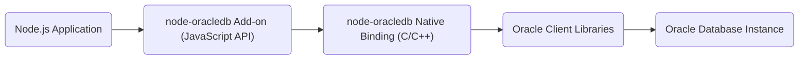
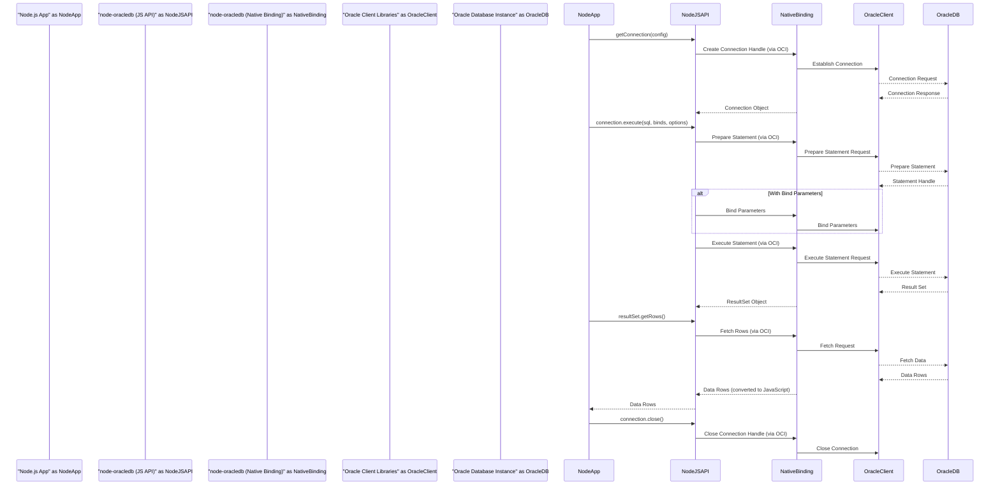

# Project Design Document: node-oracledb

**Version:** 1.1
**Date:** October 26, 2023
**Author:** Gemini (AI Language Model)

## 1. Introduction

This document provides an enhanced architectural design for the `node-oracledb` project, a Node.js add-on facilitating connections and interactions between Node.js applications and Oracle Database. This detailed design serves as a crucial foundation for understanding the system's intricate components, data flow pathways, and potential security vulnerabilities, thereby enabling comprehensive threat modeling activities.

## 2. Goals and Objectives

The core objectives of the `node-oracledb` project are:

* **Native Node.js Integration:** To offer a high-performance and developer-friendly interface for Node.js applications to interact seamlessly with Oracle Database.
* **Comprehensive Database Operation Support:** To enable the execution of a wide range of SQL operations, including queries, data manipulation language (DML), and data definition language (DDL) statements, as well as stored procedures.
* **Efficient Connection Management:** To provide robust connection pooling and management mechanisms for optimal resource utilization and application performance.
* **Transparent Data Type Handling:** To automatically manage the conversion of data types between the JavaScript environment and the Oracle Database environment.
* **API Flexibility:** To offer both asynchronous and synchronous API styles to cater to diverse application requirements and programming paradigms.
* **Advanced Feature Accessibility:** To expose and support advanced Oracle Database functionalities, such as Large Objects (LOBs), REF CURSORs, and secure authentication via Oracle Wallet.

## 3. High-Level Architecture

`node-oracledb` acts as a critical intermediary, bridging the gap between a Node.js application and an Oracle Database instance. It achieves this by utilizing native C/C++ code that directly interfaces with the Oracle Client libraries.

* **"Node.js Application"**: The user's application code, written in JavaScript, that leverages the `node-oracledb` API to interact with the database.
* **"node-oracledb Add-on (JavaScript API)"**: This layer comprises the JavaScript components of the driver, exposing the public API that Node.js developers utilize. It handles tasks such as argument validation, callback management, and communication with the native binding.
* **"node-oracledb Native Binding (C/C++)"**: A compiled C/C++ module serving as the core interface with the Oracle Client Libraries. This layer manages low-level communication and data exchange with the database.
* **"Oracle Client Libraries"**: A set of libraries provided by Oracle Corporation, essential for establishing communication with the Oracle Database instance. These libraries handle network protocols (e.g., TCP/IP, IPC), authentication procedures, and data serialization/deserialization.
* **"Oracle Database Instance"**: The target Oracle Database server responsible for storing, processing, and managing the application's data.

## 4. Detailed Component Design

This section provides a more granular view of the key components within the `node-oracledb` project, detailing their specific responsibilities.

### 4.1. JavaScript API Layer

* **`oracledb` Module:** The primary entry point to the driver, offering core functionalities:
    * **`getConnection(config)`:**  Initiates a connection to the Oracle Database based on the provided configuration object. This includes connection string details, authentication credentials, and other connection-specific parameters.
    * **`createPool(poolAttributes)`:**  Creates and manages a pool of database connections, allowing for efficient reuse of connections and improved performance. Configuration options include minimum and maximum pool size, connection timeout, and more.
    * **`close(connection)`:**  Terminates an individual database connection, releasing associated resources.
    * **`getPool(poolName)`:**  Retrieves an existing connection pool by its designated name.
    * **Constants:** Defines various constants representing data types (e.g., `oracledb.STRING`, `oracledb.NUMBER`), fetch modes (e.g., `oracledb.FETCH_ARRAY`), and other operational options.
* **`Connection` Object:** Represents an active connection to the Oracle Database. It provides methods for executing database operations:
    * **`execute(sql, binds, options)`:** Executes SQL statements, including queries, INSERT, UPDATE, and DELETE operations. It supports bind parameters to prevent SQL injection vulnerabilities. Options can include fetchInfo for customizing result set structure.
    * **`executeMany(sql, bindArrays, options)`:** Executes the same SQL statement multiple times efficiently using an array of bind parameter sets. This is useful for batch operations.
    * **`commit()`:**  Persists all changes made within the current transaction to the database.
    * **`rollback()`:** Reverts all changes made within the current transaction, restoring the database to its previous state.
    * **`close()`:**  Closes the database connection associated with this object.
    * **`subscribe(options)`:** Registers for Oracle Database change notifications, allowing the application to react to data changes in real-time.
* **`ResultSet` Object:** Represents the result set returned by a query execution. It provides methods for accessing the retrieved data:
    * **`getRows(numRows)`:** Fetches a specified number of rows from the result set.
    * **`getRow()`:** Retrieves the next available row from the result set.
    * **`close()`:**  Releases resources associated with the result set.
* **`Lob` Object:** Represents a Large Object data type (either CLOB for character data or BLOB for binary data). It offers methods for reading and writing large amounts of data:
    * **`read(amount)`:** Reads a specified amount of data from the LOB.
    * **`write(data)`:** Writes data to the LOB.
    * **`close()`:** Closes the LOB object.
* **`Pool` Object:** Represents a connection pool, managing a collection of database connections.
    * **`getConnection()`:** Retrieves an available connection from the pool.
    * **`close(drainTime)`:** Closes all connections in the pool. The `drainTime` parameter allows for a graceful shutdown, waiting for existing connections to complete their operations.

### 4.2. Native Binding Layer (C/C++)

* **Node-API (N-API) Interface:**  Utilizes Node-API to establish a stable and version-independent Application Binary Interface (ABI) between the Node.js runtime and the native C/C++ code. This ensures compatibility across different Node.js versions.
* **Connection Handle Management:** Responsible for the creation, management, and destruction of connection handles provided by the Oracle Client Libraries (OCI connection handles). This includes handling connection pooling logic at the native level.
* **Statement Handling:**  Prepares, executes, and manages the lifecycle of SQL statements using the Oracle Call Interface (OCI). This involves interacting with OCI statement handles.
* **Data Type Conversion:**  Performs the crucial task of converting data between JavaScript data types (strings, numbers, buffers, etc.) and their corresponding Oracle Database data types (VARCHAR2, NUMBER, BLOB, etc.). This layer handles potential data loss or truncation issues during conversion.
* **Error Handling and Translation:**  Captures error codes and messages returned by the Oracle Client Libraries and translates them into meaningful JavaScript exceptions, providing developers with clear error information.
* **Asynchronous Operation Management:**  Leverages libuv's event loop integration to handle asynchronous database operations efficiently, preventing blocking of the Node.js event loop.
* **Large Object (LOB) Handling:** Implements specific logic for reading, writing, and managing Large Object data types, which require special handling due to their size.
* **Transaction Management:**  Handles the underlying OCI calls for committing and rolling back database transactions.
* **Security Feature Integration:**  Integrates with security features provided by the Oracle Client Libraries, such as Oracle Wallet for secure credential storage and secure network connections (e.g., using TLS/SSL).

### 4.3. Oracle Client Libraries

This represents an external dependency, a suite of libraries provided by Oracle. Key components include:

* **Oracle Call Interface (OCI):** The fundamental C API for interacting with the Oracle Database. `node-oracledb`'s native binding directly uses OCI functions.
* **Oracle Net Services:**  Handles all aspects of network communication between the client application (where `node-oracledb` resides) and the Oracle Database server. This includes connection establishment, data transmission, and network protocol management.
* **Security Libraries (Oracle Advanced Security):** Provides functionalities for securing communication and authentication, including encryption (e.g., TLS/SSL) and authentication mechanisms (e.g., Kerberos).

## 5. Data Flow

The following sequence diagram illustrates the data flow for executing a typical SQL query using `node-oracledb`:

* **Connection Establishment:** The "Node.js App" initiates a database connection by calling `getConnection()` on the "node-oracledb (JS API)". This triggers the native binding to use OCI to establish a connection through the "Oracle Client Libraries" to the "Oracle Database Instance".
* **Statement Execution:** The application calls `execute()` with an SQL statement and optional bind parameters. The "node-oracledb (JS API)" passes this request to the "node-oracledb (Native Binding)".
* **Statement Preparation:** The "node-oracledb (Native Binding)" utilizes OCI to prepare the SQL statement for execution on the "Oracle Database Instance".
* **Parameter Binding (Conditional):** If bind parameters are provided, the "node-oracledb (Native Binding)" uses OCI to securely bind these values to the prepared statement, preventing SQL injection.
* **Statement Execution:** The "node-oracledb (Native Binding)" executes the prepared statement via the "Oracle Client Libraries".
* **Result Set Handling:** The "Oracle Database Instance" returns a result set to the "Oracle Client Libraries". The "node-oracledb (Native Binding)" receives this and creates a `ResultSet` object in the JavaScript layer.
* **Data Fetching:** The "Node.js App" requests data from the result set by calling methods like `getRows()` on the `ResultSet` object. The "node-oracledb (JS API)" forwards this request to the "node-oracledb (Native Binding)".
* **Data Retrieval:** The "node-oracledb (Native Binding)" uses OCI to fetch data from the result set through the "Oracle Client Libraries".
* **Data Conversion:** The "node-oracledb (Native Binding)" converts the data from Oracle Database data types to corresponding JavaScript data types.
* **Data Return:** The converted data is returned to the "Node.js App".
* **Connection Closure:** When the application is finished, it closes the connection, which propagates through the layers to close the underlying Oracle Client connection.

## 6. Security Considerations (For Threat Modeling)

This section outlines key security considerations that will be crucial for subsequent threat modeling exercises.

* **Credential Management:**
    * **Connection String Exposure:**  Connection configurations often contain sensitive credentials (usernames, passwords). Threats include unauthorized access if these are stored insecurely (e.g., plain text in configuration files). Mitigation strategies include using environment variables, secure configuration management tools, or Oracle Wallet.
    * **Hardcoded Credentials:** Embedding credentials directly in the application code is a significant vulnerability.
* **SQL Injection:**
    * **Dynamic Query Construction:** Building SQL queries by concatenating user-provided input without proper sanitization or parameterization can lead to SQL injection attacks, allowing attackers to execute arbitrary SQL code.
    * **Insufficient Input Validation:** Lack of validation on user inputs before incorporating them into SQL queries increases the risk of injection. Mitigation involves using parameterized queries (bind variables) and robust input validation techniques.
* **Data-in-Transit Protection:**
    * **Unencrypted Communication:** Sensitive data transmitted between the Node.js application and the Oracle Database can be intercepted if not encrypted.
    * **Man-in-the-Middle Attacks:** Without encryption, attackers can eavesdrop on or manipulate data exchanged between the client and the server. Mitigation involves enforcing TLS/SSL encryption for database connections and potentially using Oracle Native Encryption.
* **Authentication and Authorization:**
    * **Weak Authentication Mechanisms:** Using default or easily guessable passwords for database users.
    * **Insufficient Authorization Controls:**  Granting excessive privileges to database users, allowing them to access or modify data they shouldn't. Mitigation involves strong password policies, principle of least privilege, and leveraging Oracle's authentication and authorization features.
* **Denial of Service (DoS):**
    * **Connection Exhaustion:** Attackers might attempt to exhaust available database connections by making excessive connection requests. Mitigation involves configuring appropriate connection pool limits and implementing connection timeout mechanisms.
    * **Resource Intensive Queries:**  Maliciously crafted queries can consume excessive database resources, leading to performance degradation or service disruption. Query timeouts and resource monitoring can help mitigate this.
* **Dependency Vulnerabilities:**
    * **Outdated Oracle Client Libraries:** Vulnerabilities in the underlying Oracle Client Libraries can be exploited. Regular patching and updates of the Oracle Client Libraries are crucial.
    * **Third-Party Dependencies:**  While `node-oracledb` primarily relies on Oracle's libraries, any other dependencies should also be regularly reviewed for vulnerabilities.
* **Code Injection (Beyond SQL):**
    * **Improper Handling of External Data:** If the application processes data retrieved from the database in a way that allows for code execution (e.g., using `eval()` on data), it can be vulnerable to code injection.
* **Logging and Auditing:**
    * **Insufficient Logging:** Lack of adequate logging makes it difficult to detect and respond to security incidents. Comprehensive logging of database interactions, including errors and security-related events, is essential.
    * **Insecure Log Storage:** Logs themselves need to be stored securely to prevent tampering or unauthorized access.
* **Error Handling:**
    * **Information Disclosure through Errors:**  Detailed error messages might reveal sensitive information about the database structure or application logic to potential attackers. Error handling should be implemented to prevent such information leakage.

## 7. Deployment Considerations

The deployment environment significantly impacts the security landscape of `node-oracledb` applications.

* **On-Premise Servers:**
    * **Security Perimeter:** Security relies on the organization's network security controls and physical security of the servers.
    * **Internal Network Threats:** Vulnerable to attacks originating from within the organization's network.
* **Cloud Environments (AWS, Azure, GCP):**
    * **Shared Responsibility Model:** Security is a shared responsibility between the cloud provider and the user. Properly configuring cloud security services (firewalls, network segmentation, IAM roles) is crucial.
    * **Cloud-Specific Threats:**  Consider threats specific to the cloud environment, such as misconfigured storage buckets or compromised API keys.
* **Containerized Environments (Docker, Kubernetes):**
    * **Container Security:**  Security of the container images and the container runtime environment is critical.
    * **Orchestration Security:**  Secure configuration of the container orchestration platform (e.g., Kubernetes) is essential to prevent unauthorized access and control.
* **Hybrid Environments:**  Combine on-premise and cloud deployments, requiring careful consideration of network connectivity and security across different environments.

## 8. Technologies Used

* **Node.js:** The JavaScript runtime environment that executes the application code.
* **JavaScript:** The primary programming language for the `node-oracledb` API layer.
* **C/C++:** The programming languages used for developing the high-performance native binding layer.
* **Node-API (N-API):**  The API used to build native Node.js addons, ensuring ABI stability.
* **Oracle Call Interface (OCI):** Oracle's native C API for interacting with Oracle Databases.
* **Oracle Client Libraries:**  A suite of libraries provided by Oracle, essential for database connectivity.
* **libuv:** The cross-platform asynchronous I/O library used by Node.js for non-blocking operations.

This enhanced design document provides a more detailed and comprehensive understanding of the `node-oracledb` project. This level of detail is essential for conducting a thorough and effective threat model, enabling the identification of potential security vulnerabilities and the design of appropriate mitigation strategies.