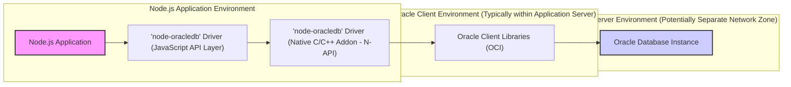

# Project Design Document: node-oracledb Driver (Improved)

**Project Name:** node-oracledb Driver

**Project Repository:** [https://github.com/oracle/node-oracledb](https://github.com/oracle/node-oracledb)

**Version:** 1.1

**Date:** 2023-10-27

**Author:** AI Cloud & Security Expert

## 1. Introduction

This document provides an enhanced and detailed design overview of the `node-oracledb` driver, a Node.js module facilitating connectivity and interaction between Node.js applications and Oracle Databases.  This document is designed to be a robust foundation for threat modeling, security analysis, and secure development practices for projects utilizing `node-oracledb`. It comprehensively outlines the architecture, components, data flow, technology stack, and critical security considerations of the driver and its ecosystem.

## 2. Project Overview

`node-oracledb` is a production-ready, open-source Node.js add-on engineered to enable high-performance and feature-rich access to Oracle Databases from Node.js applications.  Leveraging Oracle Call Interface (OCI) libraries, it provides a native interface for optimal performance and access to the full spectrum of Oracle Database capabilities. Key functionalities include:

*   **Robust Connection Management:** Connection pooling, session management, and connection lifecycle control for efficient resource utilization.
*   **Comprehensive Data Access:** Execution of SQL and PL/SQL statements, supporting complex queries and stored procedures.
*   **Advanced Data Type Support:** Handling of various Oracle data types including LOBs (Large Objects), JSON, XML, and spatial data.
*   **Transaction Management:** Full ACID transaction support for data integrity and consistency.
*   **Real-time Data Features:** Advanced Queuing for message-based communication and Database Change Notification for event-driven architectures.
*   **Performance Optimization:** Designed for high throughput and low latency, suitable for demanding enterprise applications.
*   **Security Integration:**  Supports Oracle Database security features and best practices.

The driver is meticulously crafted to meet the demands of enterprise-grade applications requiring secure, reliable, and high-performance interaction with Oracle Databases.

## 3. System Architecture

The following diagram illustrates the layered architecture of a system utilizing `node-oracledb`, emphasizing the separation of concerns and security boundaries:

**Detailed Component Description:**

*   **"Node.js Application":**  Represents the custom Node.js application code developed to fulfill specific business requirements. This layer is responsible for:
    *   Implementing business logic and application workflows.
    *   Handling user interactions and requests.
    *   Utilizing the `node-oracledb` driver API to interact with the database.
    *   Implementing application-level security controls and authorization.
*   **"'node-oracledb' Driver (JavaScript API Layer)":** This layer provides the user-facing JavaScript API of the `node-oracledb` module. Its responsibilities include:
    *   Exposing a user-friendly and asynchronous API for Node.js developers.
    *   Validating input parameters and sanitizing data before passing to the native layer.
    *   Managing asynchronous operations and promises.
    *   Performing JavaScript-specific data type conversions.
    *   Abstracting the complexity of the underlying native layer.
    *   Implementing basic security checks at the API level (e.g., input validation).
*   **"'node-oracledb' Driver (Native C/C++ Addon - N-API)":** This is the performance-critical native component of `node-oracledb`, implemented in C/C++ and utilizing Node.js N-API for interface stability. It acts as a bridge to the Oracle Client Libraries and is responsible for:
    *   Direct interaction with Oracle Client Libraries (OCI) for database operations.
    *   Efficient memory management for native resources.
    *   Handling performance-sensitive operations and data processing.
    *   Mapping Oracle data types to JavaScript data types and vice versa.
    *   Propagating errors and exceptions between layers.
    *   Implementing core security functionalities related to database interaction.
*   **"Oracle Client Libraries (OCI)":**  These are Oracle's official client-side libraries, providing the Oracle Call Interface (OCI) – a C API for interacting with Oracle Databases.  These libraries are crucial for:
    *   Establishing and managing network connections to the Oracle Database server.
    *   Handling authentication and authorization protocols.
    *   Executing SQL and PL/SQL statements on the database server.
    *   Serializing and deserializing data exchanged with the database.
    *   Managing transactions at the database level.
    *   Enforcing Oracle Database security policies at the client-server communication level.
*   **"Oracle Database Instance":** Represents the Oracle Database server instance, the core data management system. It is responsible for:
    *   Persistent storage and management of data.
    *   Processing and optimizing SQL and PL/SQL queries.
    *   Enforcing database-level security policies, access control, and auditing.
    *   Ensuring data integrity, consistency, and availability.
    *   Managing transactions and concurrency control.

## 4. Data Flow (SQL Query Execution Example)

This section details the data flow for a typical SQL query execution, highlighting security-relevant steps:

```mermaid
graph LR
    A["Node.js Application"] --> B["'node-oracledb' Driver (JS API) : connection.execute(sql, binds)"];
    B --> C["JS API Layer: Validate input, prepare request"];
    C --> D["Native C/C++ Addon: Call OCI functions"];
    D --> E["Oracle Client Libraries (OCI): OCIStmtPrepare2() with SQL"];
    E --> F["Oracle Database Instance: Parse and Prepare SQL"];
    F --> E["Oracle Client Libraries (OCI): Return statement handle"];
    E --> G["Oracle Client Libraries (OCI): OCIBindByPos() for each bind"];
    G --> F["Oracle Database Instance: Store bind parameters"];
    F --> G["Oracle Client Libraries (OCI): Acknowledge bind"];
    G --> H["Oracle Client Libraries (OCI): OCIStmtExecute()"];
    H --> F["Oracle Database Instance: Execute SQL, fetch results"];
    F --> H["Oracle Client Libraries (OCI): Return result set"];
    H --> I["Native C/C++ Addon: Fetch data, convert types"];
    I --> J["JS API Layer: Format results as JS objects"];
    J --> A["Node.js Application: Receive query results"];

    style A fill:#f9f,stroke:#333,stroke-width:1px
    style F fill:#ccf,stroke:#333,stroke-width:1px
```

**Detailed Data Flow Steps:**

1.  **"Node.js Application" initiates query:** The application calls `connection.execute(sql, binds)` in the JavaScript API layer, providing the SQL query string and bind parameters.
2.  **"JS API Layer: Validate input, prepare request":** The JavaScript API layer validates the input SQL and bind parameters for type correctness and potentially length limits. It prepares a request structure for the native layer. *Security Note: Input validation at this stage helps prevent basic injection attempts.*
3.  **"Native C/C++ Addon: Call OCI functions":** The request is passed to the native C/C++ addon. This layer translates the request into a series of OCI function calls.
4.  **"Oracle Client Libraries (OCI): OCIStmtPrepare2() with SQL":** The native addon calls `OCIStmtPrepare2()` from OCI, passing the SQL query string. *Security Note: OCI handles SQL parsing and preparation on the database server side.*
5.  **"Oracle Database Instance: Parse and Prepare SQL":** The Oracle Database instance receives the SQL query, parses it, and prepares an execution plan. *Security Note: Database performs syntax and semantic checks, and access control checks based on the connected user's privileges.*
6.  **"Oracle Client Libraries (OCI): Return statement handle":** OCI returns a statement handle to the native addon, representing the prepared SQL statement.
7.  **"Oracle Client Libraries (OCI): OCIBindByPos() for each bind":** For each bind parameter, the native addon calls `OCIBindByPos()` with the parameter value and data type. *Security Note:  Using `OCIBindByPos` (or `OCIBindByName`) ensures that bind parameters are treated as data, not as part of the SQL command, effectively preventing SQL injection.*
8.  **"Oracle Database Instance: Store bind parameters":** The database instance stores the bind parameter values associated with the prepared statement.
9.  **"Oracle Client Libraries (OCI): Acknowledge bind":** OCI acknowledges successful binding of parameters.
10. **"Oracle Client Libraries (OCI): OCIStmtExecute()":** The native addon calls `OCIStmtExecute()` to execute the prepared SQL statement.
11. **"Oracle Database Instance: Execute SQL, fetch results":** The database instance executes the SQL query using the prepared statement and bind parameters. It retrieves the result set if the query is a `SELECT` statement. *Security Note: Database enforces row-level security and data masking policies during query execution.*
12. **"Oracle Client Libraries (OCI): Return result set":** OCI transmits the result set back to the native addon.
13. **"Native C/C++ Addon: Fetch data, convert types":** The native addon fetches data from the OCI result set and converts Oracle data types to JavaScript-compatible types.
14. **"JS API Layer: Format results as JS objects":** The JavaScript API layer formats the data into JavaScript objects or arrays, as specified by the user's query.
15. **"Node.js Application: Receive query results":** The Node.js application receives the processed query results.

## 5. Technology Stack

*(Same as previous version, included for completeness)*

*   **Node.js Application:**
    *   JavaScript (ECMAScript)
    *   Node.js runtime environment
    *   `npm` or `yarn` package manager
*   **`node-oracledb` Driver (JavaScript Layer):**
    *   JavaScript
    *   Node.js Addons API (N-API) for interaction with the C/C++ layer
*   **`node-oracledb` Driver (C/C++ Layer - N-API):**
    *   C/C++
    *   Node.js N-API
    *   Oracle Instant Client SDK (headers and libraries)
*   **Oracle Client Libraries (OCI):**
    *   C
    *   Oracle Call Interface (OCI) API
    *   Oracle Net Services for network communication
*   **Oracle Database Instance:**
    *   SQL and PL/SQL languages
    *   Oracle Database Server software
    *   Operating System (Linux, Windows, etc.)
    *   Storage Subsystem

## 6. Security Considerations (Enhanced)

This section provides a more structured and detailed breakdown of security considerations, categorized for clarity and actionable guidance.

### 6.1. Confidentiality

*   **Data in Transit Encryption (CIA Triad):**
    *   **Threat:** Interception of sensitive data during transmission between the Node.js application and the Oracle Database.
    *   **Mitigation:** **Mandatory TLS/SSL encryption** for all database connections. Configure Oracle Net Services on both client and server to enforce encryption. Use strong cipher suites. Regularly review and update TLS/SSL configurations.
*   **Data at Rest Encryption (CIA Triad):**
    *   **Threat:** Unauthorized access to sensitive data stored in the Oracle Database.
    *   **Mitigation:** Implement **Oracle Transparent Data Encryption (TDE)** for encrypting data files at rest. Consider encrypting backups as well.
*   **Credential Management (Authentication & Confidentiality):**
    *   **Threat:** Exposure or compromise of database credentials (usernames, passwords).
    *   **Mitigation:** **Never hardcode credentials** in application code. Utilize secure credential management practices:
        *   **Environment Variables:** Store credentials as environment variables, ensuring proper access control to the environment.
        *   **Configuration Files (Securely Stored):** Use configuration files with restricted file system permissions.
        *   **Vault Solutions (e.g., HashiCorp Vault, Oracle Key Vault):** Integrate with dedicated vault solutions for secure storage and retrieval of credentials.
        *   **Operating System Keystore/Credential Manager:** Leverage OS-level credential management where appropriate.
    *   **Regularly rotate database passwords.** Enforce strong password policies.

### 6.2. Integrity

*   **SQL Injection Prevention (Integrity & Availability):**
    *   **Threat:** Manipulation of SQL queries by malicious input, leading to unauthorized data modification or disclosure.
    *   **Mitigation:** **Strictly enforce parameterized queries (bind parameters)** for all dynamic SQL.  **Never construct SQL queries by concatenating user input directly.**
    *   **Input Validation and Sanitization:** Implement robust input validation on the Node.js application side to filter out potentially malicious characters or patterns before they reach the database.
    *   **Principle of Least Privilege (Authorization & Integrity):** Grant database users only the minimum necessary privileges required for their application functions. Avoid using overly permissive database accounts.
*   **Data Validation (Integrity):**
    *   **Threat:** Insertion of invalid or corrupted data into the database.
    *   **Mitigation:** Implement data validation rules both on the application side (Node.js) and within the Oracle Database (e.g., constraints, triggers). Ensure data type and format validation.

### 6.3. Availability

*   **Denial of Service (DoS) Attacks (Availability):**
    *   **Threat:**  Attacks aimed at overwhelming the database or application, making it unavailable to legitimate users.
    *   **Mitigation:**
        *   **Connection Pooling Limits:** Configure connection pooling in `node-oracledb` with appropriate limits to prevent resource exhaustion on the database server.
        *   **Rate Limiting (Application Level):** Implement rate limiting in the Node.js application to restrict the number of requests from a single source within a given timeframe.
        *   **Database Firewall:** Utilize a database firewall to filter out malicious traffic and protect the database server.
        *   **Resource Monitoring and Alerting:** Implement monitoring of database and application server resources (CPU, memory, network) and set up alerts for unusual activity.
*   **Database and Application Failover/High Availability (Availability):**
    *   **Threat:** Single points of failure leading to application downtime.
    *   **Mitigation:** Implement Oracle Database High Availability solutions (e.g., Oracle RAC, Data Guard). Deploy Node.js applications in a redundant and load-balanced manner.

### 6.4. Authentication and Authorization

*   **Database Authentication (Authentication):**
    *   **Threat:** Unauthorized access to the database due to weak or compromised authentication mechanisms.
    *   **Mitigation:**
        *   **Strong Authentication Methods:** Utilize strong authentication methods beyond basic username/password, such as:
            *   **Oracle Wallet:** For secure storage of credentials and connection information.
            *   **External Authentication (Kerberos, LDAP):** Integrate with enterprise directory services for centralized authentication.
            *   **Database User Password Policies:** Enforce strong password complexity, expiration, and lockout policies within the Oracle Database.
        *   **Regularly audit database user accounts and privileges.** Remove or disable unnecessary accounts.
*   **Application-Level Authorization (Authorization):**
    *   **Threat:** Users performing actions or accessing data beyond their authorized permissions within the application.
    *   **Mitigation:** Implement robust authorization mechanisms within the Node.js application to control access to functionalities and data based on user roles and permissions. Integrate with an authorization framework (e.g., RBAC, ABAC).

### 6.5. Logging and Monitoring

*   **Security Logging (Auditing & Detection):**
    *   **Threat:** Lack of visibility into security-relevant events, hindering incident detection and response.
    *   **Mitigation:**
        *   **Enable comprehensive database auditing** in Oracle Database to log authentication attempts, authorization failures, SQL execution, and data modification events.
        *   **Implement application-level logging** to record user actions, API calls, and security-related events within the Node.js application.
        *   **Centralized Logging:** Aggregate logs from the application, `node-oracledb` driver (if possible), and Oracle Database into a centralized logging system (e.g., ELK stack, Splunk) for analysis and correlation.
        *   **Security Information and Event Management (SIEM):** Integrate with a SIEM system for real-time security monitoring, alerting, and incident response.
*   **Performance and Security Monitoring (Availability & Security):**
    *   **Threat:** Performance degradation or security incidents going unnoticed.
    *   **Mitigation:** Implement monitoring of key performance indicators (KPIs) for both the Node.js application and the Oracle Database (e.g., connection pool usage, query execution times, database resource utilization). Set up alerts for performance anomalies and potential security issues.

### 6.6. Dependency Management and Updates

*   **Vulnerability Management (All CIA Triad):**
    *   **Threat:** Exploitation of known vulnerabilities in dependencies (Oracle Client Libraries, Node.js modules).
    *   **Mitigation:**
        *   **Keep Oracle Client Libraries up-to-date:** Regularly apply security patches and updates released by Oracle for the Oracle Client Libraries. Subscribe to Oracle security alerts.
        *   **Node.js Dependency Scanning:** Use tools like `npm audit` or `yarn audit` to identify and address known vulnerabilities in Node.js dependencies (direct and indirect).
        *   **Automated Dependency Updates:** Implement automated processes for updating dependencies and applying security patches in a timely manner.

## 7. Deployment Model Security Implications

*(Expanded from previous version)*

The chosen deployment model significantly impacts the security posture of the `node-oracledb` application.

*   **On-Premise:**
    *   **Security Responsibility:** Organization has full responsibility for securing all layers, from infrastructure to application.
    *   **Network Security:** Requires careful network segmentation, firewall configuration, and physical security of data centers.
    *   **Patch Management:** Organization is responsible for patching OS, database, and application components.
*   **Cloud (IaaS/PaaS):**
    *   **Shared Responsibility Model:** Cloud provider manages infrastructure security, while the organization is responsible for securing the application, data, and configurations within the cloud environment.
    *   **Cloud Security Controls:** Leverage cloud-native security services (e.g., cloud firewalls, security groups, IAM, key management services).
    *   **Managed Database Services (e.g., Oracle Autonomous Database):** Cloud provider handles database patching and some security configurations, reducing organizational overhead but requiring understanding of the shared responsibility model.
*   **Hybrid Cloud:**
    *   **Increased Complexity:** Managing security across both on-premise and cloud environments introduces complexity.
    *   **Consistent Security Policies:**  Ensure consistent security policies and controls are applied across all environments.
    *   **Secure Hybrid Connectivity:** Securely connect on-premise and cloud environments (e.g., using VPN or dedicated network connections).
*   **Containerized Environments (Docker, Kubernetes):**
    *   **Container Security:** Secure container images by minimizing image size, scanning for vulnerabilities, and using trusted base images.
    *   **Orchestration Security (Kubernetes):** Secure Kubernetes clusters by implementing RBAC, network policies, and security best practices for container orchestration.
    *   **Secrets Management:** Securely manage database credentials and other secrets within containerized environments (e.g., using Kubernetes Secrets, Vault).

## 8. Threat Model Scope

This design document and subsequent threat modeling exercise should primarily focus on the following scope:

*   **Data Flow between Node.js Application and Oracle Database:** Analyzing the communication channels, data exchange formats, and potential vulnerabilities in this interaction.
*   **`node-oracledb` Driver Components:** Assessing the security of the JavaScript API layer and the native C/C++ addon, including potential vulnerabilities in code, dependencies, and configuration.
*   **Oracle Client Libraries (OCI):** Considering the security of the Oracle Client Libraries as a dependency, including vulnerability management and secure configuration.
*   **Authentication and Authorization mechanisms:** Evaluating the security of database authentication methods used by `node-oracledb` and application-level authorization controls.
*   **SQL Injection vulnerabilities:** Specifically analyzing the application's use of `node-oracledb` and its susceptibility to SQL injection attacks.

**Out of Scope (for this document and initial threat model):**

*   **Oracle Database Server Security (in detail):** While database security is crucial, this document assumes a baseline level of Oracle Database security. Detailed database server hardening and configuration are generally considered separate security domains. However, interaction points and dependencies on database security features are within scope.
*   **Node.js Application Business Logic (beyond database interaction):** Security vulnerabilities within the application's business logic that are not directly related to database interaction are generally out of scope for *this specific threat model focused on `node-oracledb`*.
*   **Operating System and Infrastructure Security (in detail):**  Similar to the database server, the underlying OS and infrastructure security are assumed to be reasonably secure. However, dependencies and interactions with OS-level security features (e.g., credential storage) are relevant.

## 9. Assumptions and Constraints

*(Same as previous version, included for completeness)*

*   **Assumptions:**
    *   Oracle Database is assumed to be properly configured and secured according to Oracle's best practices.
    *   The underlying operating system and infrastructure hosting the Node.js application and Oracle Database are assumed to be reasonably secure.
    *   Developers using `node-oracledb` are expected to have a basic understanding of secure coding practices and Oracle Database security principles.
*   **Constraints:**
    *   Performance requirements might influence the choice of connection pooling, query optimization, and data retrieval strategies.
    *   Compliance requirements (e.g., GDPR, HIPAA, PCI DSS) might impose specific security controls and data handling procedures on applications using `node-oracledb`.
    *   The specific version of Oracle Database and Oracle Client Libraries supported by `node-oracledb` might impose compatibility constraints. Refer to the `node-oracledb` documentation for supported versions.

## 10. Future Considerations

*(Enhanced from previous version)*

*   **Advanced Security Feature Integration:**
    *   **Oracle Advanced Security Features:** Explore deeper integration with Oracle Advanced Security features like Data Redaction, Data Masking, and Virtual Private Database (VPD) within `node-oracledb` applications.
    *   **Oracle Key Vault Integration:** Enhance integration with Oracle Key Vault for streamlined and centralized credential management for `node-oracledb` connections.
    *   **Hardware Security Modules (HSMs):** Investigate support for HSMs for cryptographic operations and key storage related to database connections and data encryption.
*   **Security Automation and Orchestration:**
    *   **Security as Code:** Implement security configurations and policies as code (e.g., using Infrastructure as Code tools) for consistent and repeatable security deployments.
    *   **Automated Security Testing:** Integrate automated security testing (e.g., SAST, DAST) into the CI/CD pipeline for applications using `node-oracledb`.
    *   **Security Orchestration, Automation, and Response (SOAR):** Explore SOAR solutions to automate security incident response workflows related to `node-oracledb` applications and database interactions.
*   **Zero Trust Security Principles:**
    *   **Micro-segmentation:** Implement network micro-segmentation to restrict network access to the Node.js application and Oracle Database to only necessary communication paths.
    *   **Mutual TLS (mTLS):** Investigate and implement mutual TLS authentication for database connections to enhance authentication and authorization.
    *   **Continuous Verification:** Implement continuous verification of user and application identities and authorization levels throughout the application lifecycle.
*   **Regular Security Audits and Penetration Testing:** Conduct periodic security audits and penetration testing specifically targeting applications using `node-oracledb` to proactively identify and remediate vulnerabilities. Engage external security experts for independent assessments.
*   **Community Security Engagement:** Actively participate in the `node-oracledb` community and security forums to stay informed about security best practices, vulnerabilities, and updates related to the driver and its ecosystem. Contribute security findings and improvements back to the community where appropriate.

This improved design document provides a more comprehensive and security-focused overview of the `node-oracledb` driver. It serves as a more robust foundation for threat modeling, security assessments, and the development of secure Node.js applications interacting with Oracle Databases. The enhanced security considerations and future directions aim to guide developers and security teams in building and maintaining secure and resilient systems.