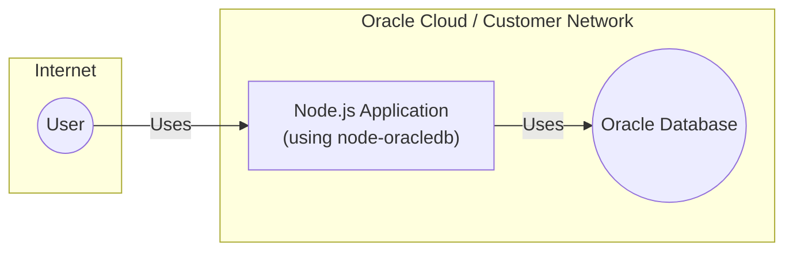
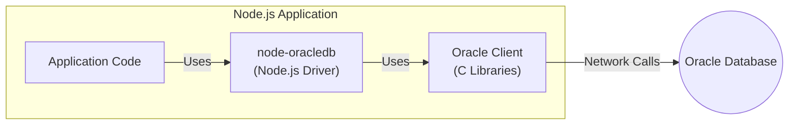
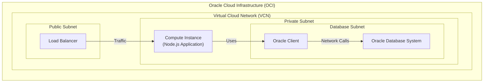
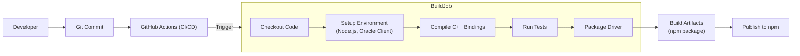

# Project Design Document: node-oracledb

This document outlines the design and security considerations for the `node-oracledb` project, a Node.js driver for Oracle Database.

## BUSINESS POSTURE

_Priorities and Goals:_

*   Provide a high-performance, reliable, and secure interface for Node.js applications to interact with Oracle Database.
*   Support a wide range of Oracle Database features and versions.
*   Maintain compatibility with Node.js LTS releases and, where feasible, current releases.
*   Offer an easy-to-use API for developers.
*   Ensure the driver is well-documented and supported.
*   Enable seamless integration with existing Node.js ecosystems and tools.

_Business Risks:_

*   Data breaches: Unauthorized access to sensitive data stored in Oracle databases due to vulnerabilities in the driver or its dependencies.
*   Data corruption: Accidental or malicious modification of data due to bugs or exploits in the driver.
*   Denial of service: Attacks that prevent legitimate users from accessing the database through the driver.
*   Reputational damage: Security incidents or performance issues could damage the reputation of the project and Oracle.
*   Compliance violations: Failure to meet regulatory requirements related to data security and privacy.
*   Supply chain attacks: Compromise of the driver through malicious third-party dependencies or build processes.

## SECURITY POSTURE

_Existing Security Controls:_

*   security control: Secure coding practices: The project follows secure coding guidelines to minimize vulnerabilities. (Described in CONTRIBUTING.md and source code comments).
*   security control: Dependency management: The project carefully manages its dependencies to reduce the risk of supply chain attacks. (Described in package.json and related files).
*   security control: Regular security audits: The project undergoes periodic security reviews and penetration testing. (Not explicitly documented in the repository, but assumed based on Oracle's security practices).
*   security control: Authentication: The driver supports various Oracle Database authentication mechanisms, including username/password, Oracle Wallet, and external authentication. (Described in documentation and examples).
*   security control: Encryption: The driver supports network encryption (TLS) to protect data in transit. (Described in documentation and examples).
*   security control: Input validation: The driver performs input validation to prevent SQL injection and other injection attacks. (Implemented in the C++ binding layer).
*   security control: Continuous Integration (CI): Automated builds and tests are run on every commit to detect regressions and potential issues. (Implemented using GitHub Actions).

_Accepted Risks:_

*   accepted risk: The driver relies on the security of the underlying Oracle Client libraries and the Oracle Database itself.
*   accepted risk: Users are responsible for securely managing their database credentials and configuring their database instances appropriately.
*   accepted risk: While efforts are made to support older Node.js and Oracle Database versions, security vulnerabilities may exist in those older versions that are beyond the control of the driver.

_Recommended Security Controls:_

*   Implement Static Application Security Testing (SAST) in the CI pipeline to automatically scan for potential vulnerabilities in the code.
*   Implement Dynamic Application Security Testing (DAST) to test the running driver for vulnerabilities.
*   Implement Software Composition Analysis (SCA) to identify and manage vulnerabilities in third-party dependencies.
*   Provide detailed security documentation, including best practices for secure configuration and usage.
*   Establish a clear vulnerability disclosure and response process.

_Security Requirements:_

*   Authentication:
    *   Support multiple authentication mechanisms, including username/password, Oracle Wallet, and external authentication.
    *   Securely handle and store credentials.
    *   Protect against brute-force attacks.
*   Authorization:
    *   Enforce database-level access controls.
    *   Prevent unauthorized access to data and database operations.
*   Input Validation:
    *   Validate all user-supplied input to prevent SQL injection and other injection attacks.
    *   Use parameterized queries to avoid SQL injection vulnerabilities.
*   Cryptography:
    *   Use strong encryption algorithms and protocols (e.g., TLS) to protect data in transit.
    *   Support encryption of data at rest if required by the application.
    *   Securely manage cryptographic keys.

## DESIGN

### C4 CONTEXT

_Context Diagram Elements:_

*   Element:
    *   Name: User
    *   Type: Person
    *   Description: A user of the Node.js application that interacts with the Oracle Database.
    *   Responsibilities: Interacts with the Node.js application.
    *   Security controls: Authentication and authorization mechanisms within the Node.js application.

*   Element:
    *   Name: Node.js Application (using node-oracledb)
    *   Type: Software System
    *   Description: A Node.js application that uses the node-oracledb driver to connect to and interact with an Oracle Database.
    *   Responsibilities: Provides application logic and interacts with the Oracle Database.
    *   Security controls: Application-level security controls, input validation, authentication, authorization.

*   Element:
    *   Name: Oracle Database
    *   Type: Software System
    *   Description: An Oracle Database instance.
    *   Responsibilities: Stores and manages data.
    *   Security controls: Database-level security controls, access controls, encryption, auditing.

### C4 CONTAINER

_Container Diagram Elements:_

*   Element:
    *   Name: Application Code
    *   Type: Container (Code)
    *   Description: The application's business logic.
    *   Responsibilities: Implements the application's functionality.
    *   Security controls: Application-specific security controls.

*   Element:
    *   Name: node-oracledb (Node.js Driver)
    *   Type: Container (Library)
    *   Description: The Node.js driver for Oracle Database.
    *   Responsibilities: Provides a JavaScript API for interacting with Oracle Database. Handles connection pooling, query execution, data conversion, and error handling.
    *   Security controls: Input validation, parameterized queries, secure connection management.

*   Element:
    *   Name: Oracle Client (C Libraries)
    *   Type: Container (Library)
    *   Description: The Oracle Client libraries (e.g., OCI).
    *   Responsibilities: Provides low-level communication with the Oracle Database.
    *   Security controls: Network encryption (TLS), authentication protocols.

*   Element:
    *   Name: Oracle Database
    *   Type: Container (Database)
    *   Description: An Oracle Database instance.
    *   Responsibilities: Stores and manages data.
    *   Security controls: Database-level security controls, access controls, encryption, auditing.

### DEPLOYMENT

_Possible Deployment Solutions:_

1.  On-premises: Node.js application and Oracle Database deployed on servers within a customer's data center.
2.  Oracle Cloud Infrastructure (OCI): Node.js application and Oracle Database deployed on OCI compute instances or using OCI database services.
3.  Hybrid Cloud: Node.js application deployed on-premises or in a different cloud provider, connecting to an Oracle Database in OCI.
4.  Other Cloud Providers (AWS, Azure, GCP): Node.js application and potentially Oracle Database (if supported) deployed on other cloud providers.

_Detailed Deployment (OCI Example):_

_Deployment Diagram Elements:_

*   Element:
    *   Name: Load Balancer
    *   Type: Infrastructure Node
    *   Description: Distributes incoming traffic across multiple compute instances.
    *   Responsibilities: Load balancing, health checks.
    *   Security controls: SSL termination, DDoS protection.

*   Element:
    *   Name: Compute Instance (Node.js Application)
    *   Type: Infrastructure Node
    *   Description: A virtual machine running the Node.js application.
    *   Responsibilities: Executes the application code.
    *   Security controls: Operating system security, firewall rules, intrusion detection.

*   Element:
    *   Name: Oracle Client
    *   Type: Software
    *   Description: Oracle Client libraries installed on the compute instance.
    *   Responsibilities: Facilitates communication with the Oracle Database.
    *   Security controls: Network encryption (TLS).

*   Element:
    *   Name: Oracle Database System
    *   Type: Infrastructure Node
    *   Description: An Oracle Database instance running on OCI.
    *   Responsibilities: Stores and manages data.
    *   Security controls: Database security features, network security groups, encryption.

### BUILD

The `node-oracledb` build process involves compiling C++ code (the binding layer) and packaging it with the JavaScript code.  GitHub Actions is used for CI/CD.

_Build Process Security Controls:_

*   security control: Version Control: All code changes are tracked in a Git repository (GitHub).
*   security control: Automated Builds: GitHub Actions automates the build process on every commit.
*   security control: Dependency Management: Dependencies are managed using npm and declared in `package.json`.
*   security control: Testing: Automated tests are run as part of the build process to ensure code quality and prevent regressions.  This includes unit tests and integration tests.
*   security control: (Recommended) Static Analysis: Incorporate SAST tools (e.g., SonarQube, ESLint with security plugins) into the GitHub Actions workflow to scan for potential vulnerabilities.
*   security control: (Recommended) Software Composition Analysis: Use SCA tools (e.g., npm audit, Snyk) to identify and manage vulnerabilities in third-party dependencies.

## RISK ASSESSMENT

_Critical Business Processes:_

*   Accessing and managing data stored in Oracle Databases.
*   Providing a reliable and performant connection between Node.js applications and Oracle Databases.

_Data Sensitivity:_

*   The sensitivity of the data depends on the specific application and the data stored in the Oracle Database. It can range from non-sensitive to highly sensitive (e.g., PII, financial data, healthcare data). The `node-oracledb` driver itself does not inherently handle sensitive data differently; it relies on the application and database configuration for data protection.

## QUESTIONS & ASSUMPTIONS

_Questions:_

*   What specific security certifications or compliance requirements (e.g., PCI DSS, HIPAA) must the driver adhere to?
*   Are there any specific Oracle Database security features (e.g., Oracle Advanced Security, Database Vault) that the driver needs to support explicitly?
*   What is the expected threat model for applications using this driver?
*   What level of security auditing and penetration testing is performed on the driver and its dependencies?
*   Is there a formal vulnerability disclosure program for the project?

_Assumptions:_

*   _BUSINESS POSTURE:_ It is assumed that Oracle prioritizes the security of its products and services, including `node-oracledb`.
*   _SECURITY POSTURE:_ It is assumed that the underlying Oracle Client libraries and Oracle Database are properly secured and configured.
*   _DESIGN:_ It is assumed that the Node.js application using the driver will also implement appropriate security controls.
*   _DEPLOYMENT:_ It is assumed that the deployment environment (whether on-premises or in the cloud) is secured according to best practices.
*   _BUILD:_ It is assumed that the build process is secure and that dependencies are regularly reviewed for vulnerabilities.