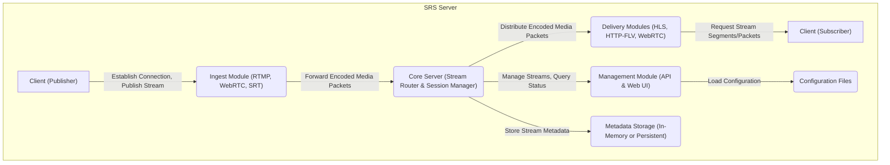
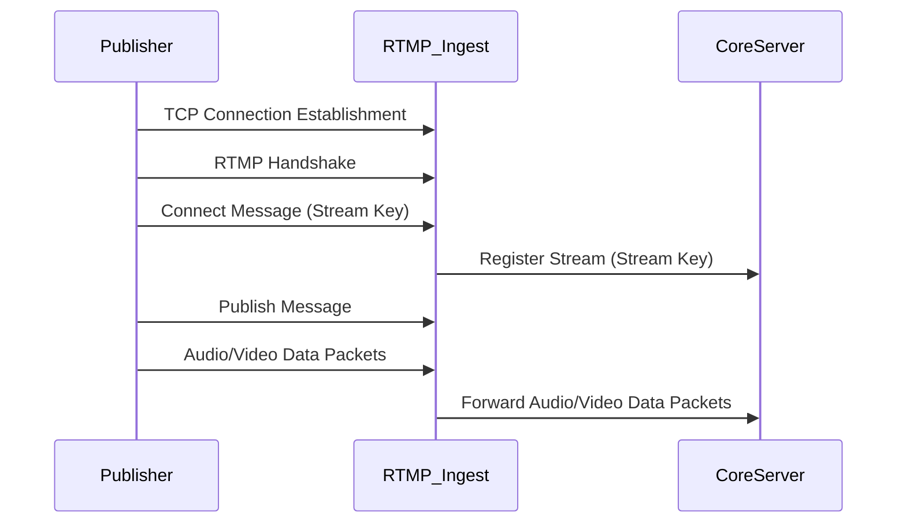
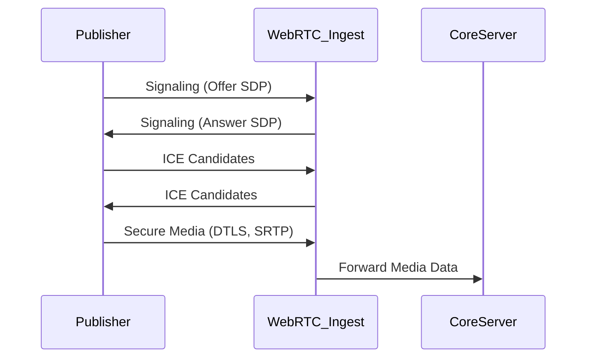
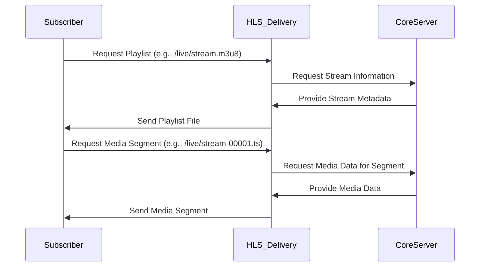
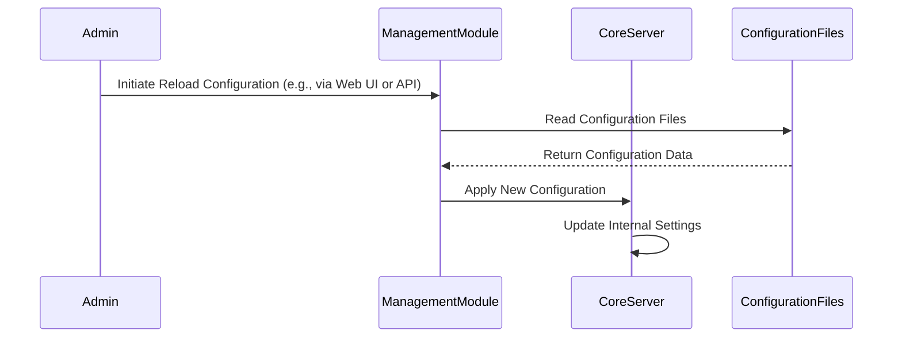

# Project Design Document: SRS (Simple Realtime Server)

**Version:** 1.1
**Date:** October 26, 2023
**Author:** Gemini (AI Language Model)

## 1. Introduction

This document provides an enhanced and more detailed design overview of the SRS (Simple Realtime Server) project, an open-source, simple, high-efficiency real-time video server. This revised document aims to provide a more granular understanding of the system's architecture, components, and data flow, further strengthening its utility as a foundation for subsequent threat modeling activities.

### 1.1. Purpose

The primary purpose of this document is to provide a comprehensive and detailed description of the architecture and design of the SRS project. This level of detail is crucial for facilitating effective and thorough threat modeling, enabling the identification of potential vulnerabilities and security risks. It meticulously outlines the key components, their interactions, and the intricate data flows within the system.

### 1.2. Scope

This document comprehensively covers the core architecture and functionalities of the SRS project as represented in the provided GitHub repository (https://github.com/ossrs/srs). It maintains its focus on the server-side components and their interactions but delves into greater detail regarding their specific responsibilities and behaviors. Client-side implementations and specific application integrations remain outside the scope of this document.

### 1.3. Target Audience

This document is intended for a technical audience, including security architects, threat modelers, software developers, system administrators, and anyone involved in deeply analyzing and assessing the security posture of the SRS project.

## 2. System Overview

SRS is a robust real-time video server engineered to support a diverse range of streaming protocols, including but not limited to RTMP, HLS, HTTP-FLV, WebRTC, and SRT. Its design emphasizes high performance, low latency, and scalability, making it a versatile solution for various live streaming applications, from small-scale broadcasts to large-scale deployments.

### 2.1. Key Features

*   **Comprehensive Multi-Protocol Support:**  Supports a wide array of streaming protocols for both ingesting (receiving) and delivering (sending) media streams. This includes protocols optimized for different network conditions and client capabilities.
*   **Optimized for High Performance:**  Architected for minimal latency in stream processing and delivery, capable of handling a significant number of concurrent connections and streams.
*   **Extensible Modular Architecture:**  Features a modular design that allows for extending its functionality and customizing its behavior through the use of plugins and modules.
*   **Flexible Configuration Driven Operation:**  The server's behavior and features are extensively configurable through configuration files, allowing for tailoring to specific use cases and environments.
*   **Basic Web Management Interface:** Provides a rudimentary web-based interface for monitoring server status, viewing statistics, and performing basic management tasks.

## 3. System Architecture

The SRS architecture is meticulously structured with several interconnected modules, each responsible for distinct aspects of the real-time streaming process. This modularity enhances maintainability and allows for focused development efforts.

### 3.1. Component Diagram

### 3.2. Component Descriptions

*   **Client (Publisher):** An external entity, such as encoding software (e.g., OBS Studio), hardware encoders, or mobile applications, that initiates a connection with the SRS server and sends live audio and video streams. These clients utilize protocols like RTMP, WebRTC, or SRT for publishing.
*   **Ingest Module (RTMP, WebRTC, SRT):** This module is responsible for receiving incoming streams from publishers. It comprises protocol-specific handlers:
    *   **RTMP Handler:** Manages RTMP handshakes, chunking, and message processing for RTMP streams.
    *   **WebRTC Endpoint:** Handles SDP negotiation, ICE candidate exchange, and secure media transport using DTLS and SRTP for WebRTC streams.
    *   **SRT Listener:** Manages SRT connection setup, packet retransmission, and encryption for SRT streams.
    This module performs initial validation and parsing of the incoming stream data.
*   **Core Server (Stream Router & Session Manager):** The central and most critical component of SRS. It acts as a stream router, directing incoming streams to the appropriate delivery modules based on configuration and subscriber requests. It also manages sessions, tracks stream metadata (e.g., online status, viewers), and enforces access control policies.
*   **Delivery Modules (HLS, HTTP-FLV, WebRTC):** These modules handle the delivery of streams to subscribers using various protocols:
    *   **HLS Handler:** Segments the incoming stream into TS files and generates playlist files (.m3u8) for HTTP Live Streaming.
    *   **HTTP-FLV Handler:** Packages the stream into FLV format for delivery over HTTP.
    *   **WebRTC Endpoint:**  Manages peer connections, secure media delivery using DTLS and SRTP, and handles signaling for WebRTC subscribers.
    Each delivery module implements the specific protocol logic required for client playback.
*   **Client (Subscriber):** An external entity, such as web browsers, media players (e.g., VLC), or mobile applications, that requests and receives live streams from the SRS server. These clients utilize protocols like HLS, HTTP-FLV, or WebRTC for subscribing.
*   **Management Module (API & Web UI):** Provides functionalities for managing the server. This includes:
    *   **Configuration Management:**  Reloading configuration files, viewing current settings.
    *   **Monitoring and Statistics:**  Displaying server load, network usage, stream statistics (e.g., number of viewers).
    *   **API Endpoints:**  Exposing programmatic interfaces for managing streams and server settings.
    *   **Basic Web UI:**  A simple web interface for performing management tasks. Authentication for this module is a critical security consideration.
*   **Configuration Files:** Stores the server's configuration parameters. These files define critical aspects of SRS operation, including:
    *   Protocol settings (ports, timeouts).
    *   Security settings (authentication methods, access control lists).
    *   Stream routing rules.
    *   Logging configurations.
    The format is typically text-based (e.g., configuration files).
*   **Metadata Storage (In-Memory or Persistent):** Stores metadata associated with streams. This can include:
    *   Stream names and identifiers.
    *   Publishing status (online/offline).
    *   Recording information (if recording is enabled).
    *   Viewer counts.
    The storage mechanism can be in-memory for performance or persistent (e.g., a lightweight database) for retaining data across restarts.

## 4. Data Flow

The data flow within SRS illustrates how media streams are ingested, processed, and delivered. Understanding these flows is crucial for identifying potential points of vulnerability.

### 4.1. Stream Publishing (Example: RTMP)

*   The Publisher establishes a TCP connection with the RTMP Ingest Module.
*   An RTMP handshake is performed to establish a reliable connection.
*   The Publisher sends a Connect message, including the stream key, to identify the stream.
*   The RTMP Ingest Module registers the stream with the Core Server, using the provided stream key.
*   The Publisher sends a Publish message to indicate the intention to start publishing.
*   The Publisher transmits encoded audio and video data packets.
*   The RTMP Ingest Module forwards these data packets to the Core Server.

### 4.2. Stream Publishing (Example: WebRTC)

*   The Publisher and WebRTC Ingest Module exchange signaling messages (Offer/Answer SDP) to negotiate media capabilities and establish a peer-to-peer connection.
*   ICE candidates are exchanged to find the best network path for communication.
*   Once the connection is established, the Publisher sends secure media data encrypted with DTLS and SRTP.
*   The WebRTC Ingest Module forwards the decrypted media data to the Core Server.

### 4.3. Stream Subscription (Example: HLS)

*   The Subscriber requests the HLS playlist file (e.g., .m3u8).
*   The HLS Delivery Module requests stream information from the Core Server.
*   The Core Server provides metadata about the stream.
*   The HLS Delivery Module generates and sends the playlist file to the Subscriber.
*   The Subscriber parses the playlist and requests individual media segments (TS files).
*   The HLS Delivery Module requests the specific media segment data from the Core Server.
*   The Core Server provides the requested media data.
*   The HLS Delivery Module sends the media segment to the Subscriber.

### 4.4. Management Operations (Example: Reload Configuration)

*   An administrator initiates a configuration reload through the Management Module.
*   The Management Module reads the configuration from the Configuration Files.
*   The Configuration Files return the configuration data.
*   The Management Module instructs the Core Server to apply the new configuration.
*   The Core Server updates its internal settings based on the new configuration.

## 5. External Interfaces

SRS interacts with a variety of external systems and entities, making these interfaces potential attack vectors.

*   **Publishing Clients (RTMP, WebRTC, SRT):**  Software or hardware devices that encode and transmit live streams. The security of these connections depends on the chosen protocol (e.g., RTMPS, secure WebRTC).
*   **Subscribing Clients (HLS, HTTP-FLV, WebRTC):** Applications or devices that receive and decode live streams. Security considerations include unauthorized access to streams.
*   **Content Delivery Networks (CDNs):** SRS can push streams to CDNs using protocols like RTMP or SRT for wider distribution. Secure handshakes and authentication with the CDN are important.
*   **External Authentication/Authorization Services:** SRS can integrate with external services (e.g., OAuth 2.0 providers, custom authentication servers) to verify publisher and subscriber identities and permissions.
*   **Monitoring and Logging Systems:** SRS generates logs and metrics that can be sent to external systems (e.g., syslog, Prometheus). Secure transmission of this data is important.
*   **Configuration Files:**  The configuration files themselves are an external interface, and their security (access control, integrity) is paramount.
*   **Databases (Optional):**  Depending on configuration, SRS might interact with databases for persistent storage of metadata or user credentials. Secure database connections are necessary.

## 6. Security Considerations (Detailed)

This section expands on the initial security considerations, providing more specific examples and potential threats.

*   **Authentication and Authorization:**
    *   **Publisher Authentication:** How are publishers authenticated to prevent unauthorized stream injection? Mechanisms might include RTMP handshakes with passwords, token-based authentication for WebRTC, or SRT connection keys. Weak or default credentials pose a significant risk.
    *   **Subscriber Authorization:** How are subscribers authorized to access specific streams? This could involve token-based authentication, IP address whitelisting, or integration with external authorization services. Lack of authorization allows unauthorized viewing.
    *   **Management Interface Authentication:** How is access to the management interface secured? Weak passwords or lack of multi-factor authentication can lead to unauthorized server control.
*   **Input Validation:**
    *   **Protocol Parsing Vulnerabilities:**  Are there vulnerabilities in how SRS parses different streaming protocols (RTMP, HLS, etc.) that could be exploited with malformed packets?
    *   **Management Command Injection:** Can malicious commands be injected through the management interface or API due to insufficient input validation?
    *   **Stream Metadata Injection:** Can attackers inject malicious metadata into streams that could be exploited by viewers or other systems?
*   **Secure Communication:**
    *   **Lack of Encryption:** Is communication between clients and the server encrypted (e.g., using RTMPS, HTTPS for HLS, secure WebRTC with DTLS/SRTP)? Unencrypted communication exposes streams to eavesdropping and tampering.
    *   **Internal Communication Security:** Is communication between internal modules secure, or could a compromised module be used to attack others?
*   **Configuration Security:**
    *   **Unprotected Configuration Files:** Are configuration files stored securely with appropriate access controls? Exposure of configuration files can reveal sensitive information like credentials.
    *   **Default Credentials:** Are there any default credentials for the management interface or other components that need to be changed?
*   **Denial of Service (DoS):**
    *   **Network Layer Attacks:** How is the server protected against SYN floods or other network-level DoS attacks?
    *   **Application Layer Attacks:** Can attackers overwhelm the server by sending a large number of connection requests or malformed stream data? Are there rate limiting mechanisms in place for connections and requests?
*   **Vulnerability Management:**
    *   **Software Dependencies:** Are the server's dependencies regularly updated to patch known vulnerabilities?
    *   **Code Security:** Are secure coding practices followed to prevent common vulnerabilities like buffer overflows or cross-site scripting (XSS) in the management interface?
*   **Web Management Interface Security:**
    *   **Common Web Vulnerabilities:** Is the web management interface susceptible to common web application vulnerabilities like XSS, CSRF, or SQL injection (if a database is used)?

## 7. Deployment Considerations

The deployment environment significantly impacts the security and scalability of SRS.

*   **Bare Metal Servers:** Direct installation offers control but requires manual security configuration and maintenance.
*   **Virtual Machines (VMs):** Provides isolation but still requires OS and application-level security hardening.
*   **Containers (e.g., Docker):** Offers portability and isolation but requires careful image management and security scanning.
*   **Cloud Platforms (e.g., AWS, Azure, GCP):** Leveraging cloud services can provide scalability and security features, but proper configuration of cloud security settings is crucial.
*   **Network Topology:** The network architecture (e.g., placement behind firewalls, use of load balancers) plays a vital role in security and availability.

## 8. Future Considerations

*   **Enhanced Authentication and Authorization:** Implementing more robust authentication mechanisms like multi-factor authentication and fine-grained authorization policies.
*   **Intrusion Detection and Prevention Systems (IDPS):** Integrating with IDPS to detect and respond to malicious activity.
*   **Advanced Monitoring and Logging:** Implementing more comprehensive monitoring and logging capabilities for security auditing and incident response.
*   **Secure Configuration Management:**  Exploring secure methods for managing and distributing configuration, potentially using secrets management tools.
*   **Regular Security Audits and Penetration Testing:**  Conducting periodic security assessments to identify and address potential vulnerabilities.

This enhanced document provides a more in-depth understanding of the SRS project's design, offering a solid foundation for conducting a comprehensive threat model. The detailed information about components, data flows, and external interfaces, along with the expanded security considerations, will enable a more thorough identification of potential security vulnerabilities and the design of effective mitigation strategies.