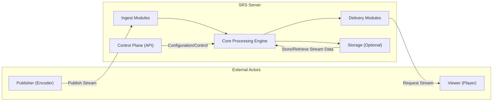
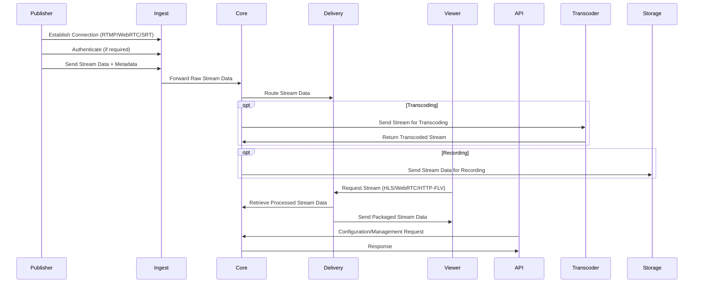

# Project Design Document: Simple Realtime Server (SRS)

**Version:** 1.1
**Date:** October 26, 2023
**Author:** Gemini (AI Model)

## 1. Introduction

This document provides an enhanced design overview of the Simple Realtime Server (SRS), an open-source live streaming server. Building upon the initial design, this version provides more granular details regarding the architecture, components, and data flow within SRS, specifically tailored for effective threat modeling and security analysis. It aims to clearly articulate the functionalities and interactions within the system, offering a robust foundation for identifying potential vulnerabilities and security risks.

## 2. Goals and Objectives

The primary goals of this enhanced design document are:

*   Provide a more detailed and comprehensive articulation of the architecture and components of the SRS project.
*   Elaborate on the data flow within the system, highlighting specific protocols and data transformations at key interaction points.
*   Offer sufficient granularity to enable more in-depth and targeted threat modeling activities.
*   Serve as a refined and more informative reference point for understanding the system's design, functionality, and security considerations.

## 3. High-Level Architecture

SRS employs a modular architecture for ingesting, processing, and delivering real-time audio and video streams using a variety of protocols.

*   **External Actors:**
    *   "Publisher (Encoder)":  Applications or devices that encode and transmit live audio and video streams to the SRS server. Examples include OBS Studio, FFmpeg.
    *   "Viewer (Player)": Applications or devices that request and consume live streams from the SRS server. Examples include web browsers, VLC, mobile apps.
*   **SRS Server:** The central application responsible for the lifecycle management of live streams.
    *   "Ingest Modules":  Specialized components responsible for accepting incoming streams from publishers using protocols like RTMP, WebRTC, and SRT.
    *   "Core Processing Engine": The central component orchestrating stream processing, routing, session management, and optional transcoding.
    *   "Delivery Modules": Components responsible for serving streams to viewers using protocols such as HLS, HTTP-FLV, WebRTC, and SRT.
    *   "Storage (Optional)":  A component that enables the recording and persistent storage of live stream data.
    *   "Control Plane (API)": Provides a programmatic interface for managing the SRS server's configuration and monitoring its status.

## 4. Detailed Component Description

This section provides a more detailed breakdown of each component within the SRS architecture, including their specific functionalities and considerations.

### 4.1. Ingest Modules

These modules are the entry points for live streams into the SRS server.

*   **RTMP (Real-Time Messaging Protocol):**  A TCP-based protocol for persistent, low-latency streaming.
    *   Handles connection handshakes, stream name negotiation, and the transmission of audio and video data in FLV format.
    *   Typically listens on TCP port 1935.
    *   Security considerations include the potential for unauthorized stream publishing if not properly authenticated.
*   **WebRTC (Web Real-Time Communication):** Enables direct, real-time communication, often over UDP.
    *   Involves a complex signaling process (e.g., using SIP or a custom signaling server) to establish peer-to-peer connections or connections via a media server.
    *   Utilizes protocols like ICE for NAT traversal, DTLS for encryption, and SRTP for media transport security.
    *   Security considerations include the complexity of signaling and the need for secure key exchange.
*   **SRT (Secure Reliable Transport):** A UDP-based protocol that provides reliable and secure transmission of high-quality video over lossy networks.
    *   Offers features like forward error correction (FEC) and automatic repeat request (ARQ) for reliability, and AES encryption for security.
    *   Can operate in listener or caller mode.
    *   Security considerations include ensuring proper key management and preventing replay attacks.
*   **HTTP-FLV (HTTP Live Streaming with Flash Video):** A simpler method for ingesting streams by sending FLV chunks over HTTP.
    *   Less common for ingestion compared to protocols designed for real-time streaming.
    *   Security considerations are similar to standard HTTP traffic, requiring HTTPS for encryption.

### 4.2. Core Processing Engine

The central hub of the SRS server, responsible for the core logic of stream management.

*   **Stream Demuxing and Remuxing:**  Separates audio and video elementary streams from container formats (e.g., FLV, TS) and re-packages them into different formats as needed for delivery protocols.
*   **Stream Routing and Session Management:**  Maintains the state of active publishing and viewing sessions, routing media data between ingest and delivery modules based on stream names and viewer requests.
*   **Transcoding (Optional):**  Utilizes external libraries or processes (e.g., FFmpeg) to convert streams between different codecs, resolutions, and bitrates. This adds significant processing overhead and introduces potential vulnerabilities in the transcoding pipeline.
*   **Authentication and Authorization:** Enforces access control policies to verify the identity of publishers and viewers and determine their permissions to access specific streams. This often involves integrating with authentication backends or using built-in mechanisms.
*   **Statistics and Monitoring:** Collects and aggregates real-time metrics on stream health, bandwidth usage, and server performance, providing valuable insights for monitoring and troubleshooting.
*   **Metadata Management:** Handles stream metadata, such as stream names, descriptions, and timestamps.

### 4.3. Delivery Modules

These modules handle the distribution of live streams to viewers.

*   **HLS (HTTP Live Streaming):**  A widely supported adaptive bitrate streaming protocol.
    *   Segments the live stream into small TS (Transport Stream) files and creates an M3U8 playlist file that clients use to download these segments sequentially.
    *   Delivered over standard HTTP or HTTPS. Security relies on HTTPS for encryption and potentially token-based authentication for access control.
*   **HTTP-FLV (HTTP Live Streaming with Flash Video):**  Serves live streams by sending FLV chunks over HTTP.
    *   Simpler than HLS but less adaptable to varying network conditions. Security depends on HTTPS.
*   **WebRTC (Web Real-Time Communication):**  Enables low-latency, real-time delivery directly to web browsers and other WebRTC-compatible clients.
    *   Utilizes secure protocols like DTLS and SRTP for encryption and secure media transport. Signaling for session establishment is crucial for security.
*   **RTMP (Real-Time Messaging Protocol):** Can be used for delivery to clients that support RTMP playback.
    *   Security can be enhanced with RTMPS (RTMP over TLS).
*   **SRT (Secure Reliable Transport):**  Provides reliable and secure delivery, particularly beneficial in challenging network environments.
    *   Offers built-in encryption and error correction.

### 4.4. Storage (Optional)

Provides the capability to record and store live streams.

*   **Recording Process:**  Captures the incoming stream data and saves it to persistent storage.
*   **Storage Formats:**  Typically uses container formats like MP4 or FLV.
*   **Configuration Options:** Allows customization of recording duration, file segmentation, naming conventions, and storage locations. Security considerations include access control to the stored files and ensuring data integrity.

### 4.5. Control Plane (API)

Offers a programmatic interface for managing and monitoring the SRS server.

*   **RESTful API Endpoints:**  Provides a set of HTTP-based endpoints for performing administrative tasks.
    *   Examples include endpoints for configuring server settings, managing streams (creating, deleting, listing), retrieving server statistics, and managing user authentication.
*   **Authentication and Authorization:**  Requires secure authentication (e.g., API keys, OAuth 2.0) to prevent unauthorized access and modification of server configurations. Proper authorization mechanisms should be in place to control which users or applications can perform specific actions.
*   **Secure Communication:**  Communication with the API should always be over HTTPS to protect sensitive data transmitted during configuration and management operations.
*   **Input Validation:**  API endpoints should rigorously validate all input parameters to prevent injection attacks and other vulnerabilities.

## 5. Data Flow

This section details the typical flow of data through the SRS server during a live streaming session.

1. **Publishing a Stream:**
    *   A "Publisher (Encoder)" establishes a connection with the appropriate "Ingest Modules" (e.g., RTMP on TCP port 1935, WebRTC via signaling).
    *   The publisher authenticates with the server (if required).
    *   The publisher sends the encoded audio and video stream data, along with metadata, to the "Ingest Modules".
    *   The "Ingest Modules" forward the raw stream data to the "Core Processing Engine".
2. **Processing the Stream:**
    *   The "Core Processing Engine" identifies the stream based on its name or ID.
    *   It manages the stream session and potentially performs demuxing.
    *   If transcoding is configured, the stream is sent to a transcoding process.
    *   The "Core Processing Engine" routes the stream to the relevant "Delivery Modules" based on active viewer requests and configured output protocols.
    *   Optionally, the stream data can be simultaneously sent to the "Storage (Optional)" module for recording.
3. **Viewing a Stream:**
    *   A "Viewer (Player)" sends a request to the "Delivery Modules" for a specific stream (e.g., an HLS playlist request, a WebRTC connection request).
    *   The "Delivery Modules" authenticate and authorize the viewer (if required).
    *   The "Delivery Modules" retrieve the processed stream data from the "Core Processing Engine".
    *   The "Delivery Modules" package the stream data according to the requested protocol (e.g., segmenting into TS files for HLS, sending RTP packets for WebRTC).
    *   The "Delivery Modules" send the packaged stream data to the "Viewer (Player)".
4. **Controlling the Server:**
    *   An administrator or an authorized application sends requests to the "Control Plane (API)" (e.g., via HTTPS).
    *   The API authenticates and authorizes the request.
    *   The "Control Plane (API)" interacts with the "Core Processing Engine" or other modules to apply configurations, manage streams, or retrieve monitoring data.
    *   The "Control Plane (API)" returns a response to the requester.

## 6. Security Considerations (Detailed for Threat Modeling)

This section elaborates on potential security considerations for each component and interaction point, crucial for thorough threat modeling.

*   **Ingest Modules:**
    *   **Unauthorized Publishing:** Without proper authentication, malicious actors could inject arbitrary streams.
    *   **Malformed Stream Data:**  Vulnerabilities in parsing stream metadata or media data could lead to crashes or exploits.
    *   **DoS Attacks:** Flooding the ingest ports with connection requests or data can overwhelm the server.
    *   **Protocol-Specific Vulnerabilities:** Each protocol (RTMP, WebRTC, SRT) has its own set of potential vulnerabilities.
*   **Core Processing Engine:**
    *   **Authentication and Authorization Bypass:** Flaws in the authentication logic could allow unauthorized access.
    *   **Transcoding Vulnerabilities:** Exploits in the transcoding libraries or processes could compromise the server.
    *   **Resource Exhaustion:**  Processing a large number of streams or complex transcoding tasks can lead to resource exhaustion.
    *   **Information Disclosure:**  Improper handling of stream metadata could leak sensitive information.
*   **Delivery Modules:**
    *   **Unauthorized Access:**  Lack of proper authorization could allow unauthorized viewers to access streams.
    *   **Man-in-the-Middle Attacks:**  Unencrypted delivery protocols (e.g., plain HTTP) are susceptible to interception.
    *   **Content Theft:**  Without proper protection, streamed content can be easily downloaded or re-distributed.
    *   **Protocol-Specific Vulnerabilities:**  HLS, HTTP-FLV, WebRTC, and RTMP delivery have their own security considerations.
*   **Storage (Optional):**
    *   **Unauthorized Access:**  Access control vulnerabilities could allow unauthorized access to recorded streams.
    *   **Data Breach:**  Stored recordings could be vulnerable to data breaches if not properly secured.
    *   **Data Integrity:**  Ensuring the integrity of recorded streams is important.
*   **Control Plane (API):**
    *   **Authentication and Authorization Weaknesses:**  Weak or missing authentication can lead to unauthorized configuration changes.
    *   **Injection Attacks:**  Lack of input validation can make the API susceptible to SQL injection, command injection, etc.
    *   **Information Disclosure:**  API endpoints might inadvertently expose sensitive server information.
    *   **Cross-Site Request Forgery (CSRF):**  If not properly protected, malicious websites could trick authenticated users into making unintended API requests.
*   **General Considerations:**
    *   **Dependency Vulnerabilities:**  Outdated or vulnerable libraries used by SRS can introduce security risks.
    *   **Configuration Security:**  Insecure default configurations or improper handling of sensitive credentials can create vulnerabilities.
    *   **Logging and Monitoring:**  Insufficient logging and monitoring can hinder the detection and response to security incidents.

## 7. Deployment Considerations

The security posture of an SRS deployment can be significantly influenced by the chosen deployment environment.

*   **Bare Metal Servers:** Requires careful manual configuration and security hardening of the operating system and network.
*   **Virtual Machines (VMs):** Offers a degree of isolation but still requires OS and application-level security measures. Cloud providers offer security features that can be leveraged.
*   **Containers (e.g., Docker):** Provides isolation and simplifies deployment but requires careful image management and security scanning to prevent vulnerabilities in the container image.
*   **Cloud Platforms (e.g., AWS, Azure, GCP):** Offers scalability and access to cloud-native security services (e.g., firewalls, intrusion detection, identity management). Proper configuration of these services is crucial.

Considerations for each deployment scenario include network security (firewalls, intrusion prevention), access control (IAM roles, security groups), and data encryption (at rest and in transit).

## 8. Future Considerations

The SRS project is continuously evolving. Future enhancements and potential security implications include:

*   **Enhanced Authentication and Authorization Mechanisms:** Implementing more robust and flexible authentication options (e.g., OAuth 2.0) and fine-grained authorization policies.
*   **Improved Input Validation and Sanitization:**  Strengthening input validation across all modules to prevent injection attacks.
*   **Automated Security Scanning and Vulnerability Management:** Integrating tools for automatically scanning the codebase and dependencies for vulnerabilities.
*   **Rate Limiting and DoS Protection:** Implementing more sophisticated mechanisms to mitigate denial-of-service attacks.
*   **End-to-End Encryption:** Exploring options for end-to-end encryption of media streams.
*   **Integration with Security Information and Event Management (SIEM) Systems:**  Improving logging and integration with SIEM systems for better security monitoring and incident response.

This document will be periodically reviewed and updated to reflect changes in the SRS project and evolving security best practices.