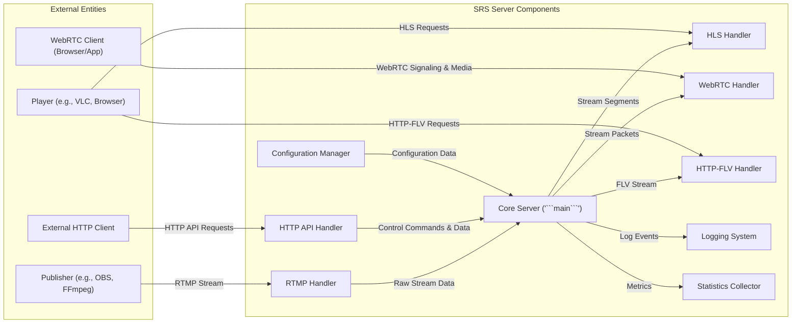
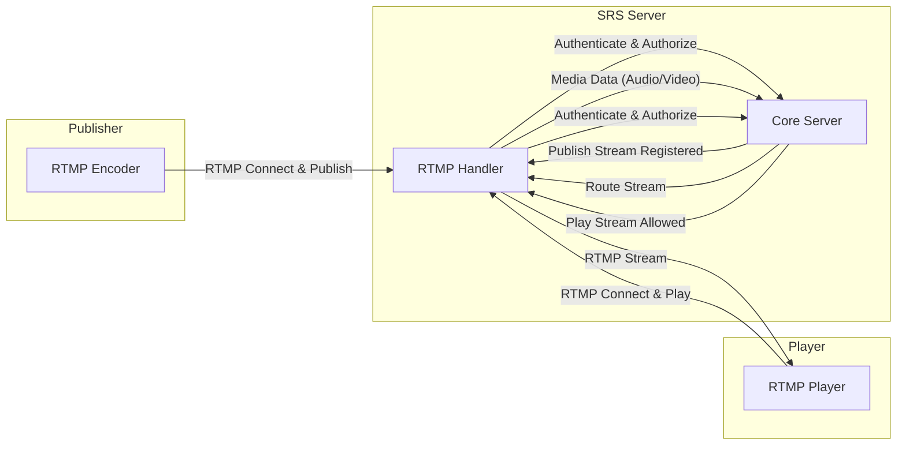
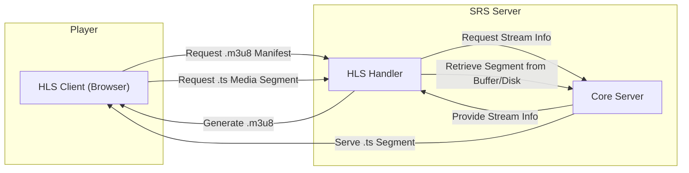
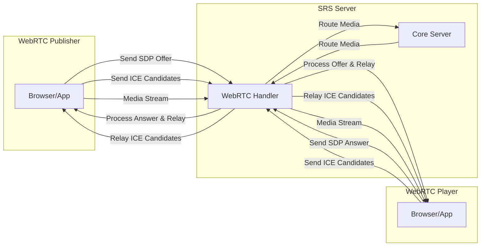
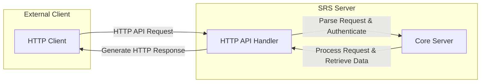

# Project Design Document: SRS (Simple Realtime Server)

**Version:** 1.1
**Date:** October 26, 2023
**Prepared By:** Gemini (AI Architecture Expert)

## 1. Introduction

This document provides an enhanced and more detailed design overview of the Simple Realtime Server (SRS), an open-source live streaming cluster. This iteration builds upon the previous version, aiming for greater clarity and depth in articulating the system's architecture, components, and interactions. This detailed design is crucial for effective threat modeling activities. The design is based on the information available in the provided GitHub repository: [https://github.com/ossrs/srs](https://github.com/ossrs/srs).

## 2. Goals

*   Provide a comprehensive and refined architectural overview of the SRS project.
*   Clearly define the responsibilities and functionalities of each key component.
*   Thoroughly describe the data flow within the system for various streaming protocols, including signaling.
*   Elaborate on the interactions and dependencies between different components.
*   Serve as a robust and detailed foundation for identifying potential security vulnerabilities during subsequent threat modeling.

## 3. System Overview

SRS is a high-performance real-time streaming server designed for low-latency live video and audio delivery. It supports a wide range of protocols, including RTMP, HLS, WebRTC, and HTTP-FLV, making it versatile for various streaming applications. The core functionality involves the efficient ingestion, processing, and delivery of live media streams.

### 3.1. High-Level Architecture



### 3.2. Key Features

*   **Multi-Protocol Ingestion and Delivery:** Supports RTMP, HLS, WebRTC, and HTTP-FLV for both publishing and playback.
*   **Low-Latency Live Streaming:** Optimized for minimal delay in live video and audio transmission.
*   **Stream Forwarding and Relay:**  Capabilities to forward streams to other SRS instances or compatible servers.
*   **Basic Transcoding:** Offers limited transcoding functionalities for adapting streams to different formats or bitrates.
*   **Comprehensive HTTP API:** Provides a RESTful interface for server management, monitoring, and stream control.
*   **Flexible Configuration:**  Configurable through a well-defined configuration file (`srs.conf`).
*   **Detailed Logging and Monitoring:**  Offers robust logging and real-time statistics on server performance and stream activity.
*   **WebRTC Integration:** Enables peer-to-peer real-time communication directly within web browsers.

## 4. Detailed Design

### 4.1. Components

*   **Core Server ('```main```'):**
    *   **Responsibility:** The central control unit of SRS. It manages the lifecycle of streams, client sessions, and the overall server operation. It handles stream routing between different handlers and enforces server-level configurations.
    *   **Inputs:** Incoming connections from protocol handlers, configuration settings from the Configuration Manager, API requests from the HTTP API Handler.
    *   **Outputs:** Stream data to protocol handlers, commands to other components, log messages to the Logging System, metrics to the Statistics Collector.
    *   **Dependencies:** Configuration Manager, Logging System, Statistics Collector, all protocol handlers.

*   **RTMP Handler:**
    *   **Responsibility:** Manages RTMP client connections for both publishing (encoders) and subscribing (players). It handles the RTMP handshake, message parsing, and stream multiplexing/demultiplexing.
    *   **Inputs:** RTMP control messages and media packets from publishers and players.
    *   **Outputs:** Raw audio/video stream data to the Core Server, RTMP messages to players.
    *   **Dependencies:** Core Server.

*   **HLS Handler:**
    *   **Responsibility:**  Generates and serves HLS manifests (.m3u8 playlists) and media segments (.ts files) to clients. It segments the live stream into smaller chunks for HTTP-based delivery.
    *   **Inputs:** Raw stream data from the Core Server.
    *   **Outputs:** HLS manifests and media segments served over HTTP.
    *   **Dependencies:** Core Server, HTTP server functionality within SRS.

*   **WebRTC Handler:**
    *   **Responsibility:**  Handles WebRTC signaling and media negotiation using protocols like SDP (Session Description Protocol) and ICE (Interactive Connectivity Establishment). It facilitates real-time peer-to-peer communication between browsers or applications.
    *   **Inputs:** SDP offers and answers, ICE candidates from WebRTC clients.
    *   **Outputs:** SDP offers and answers, ICE candidates to WebRTC clients, media streams to/from the Core Server.
    *   **Dependencies:** Core Server, potentially external STUN/TURN servers (configured within SRS).

*   **HTTP-FLV Handler:**
    *   **Responsibility:** Serves live streams over HTTP using the FLV (Flash Video) container format. This provides a simpler HTTP-based streaming option compared to HLS.
    *   **Inputs:** Raw stream data from the Core Server.
    *   **Outputs:** FLV formatted stream data served over HTTP.
    *   **Dependencies:** Core Server, HTTP server functionality within SRS.

*   **HTTP API Handler:**
    *   **Responsibility:**  Provides a RESTful HTTP interface for external systems to interact with SRS. This includes functionalities for retrieving server status, managing streams (e.g., kicking clients), and querying statistics.
    *   **Inputs:** HTTP requests (GET, POST, PUT, DELETE) to specific API endpoints.
    *   **Outputs:** HTTP responses (typically in JSON format) containing requested data or status information.
    *   **Dependencies:** Core Server (to execute commands and retrieve data).

*   **Configuration Manager:**
    *   **Responsibility:** Loads, parses, and manages the server's configuration settings, typically from the `srs.conf` file. It provides configuration parameters to other components.
    *   **Inputs:** The `srs.conf` configuration file.
    *   **Outputs:** Configuration parameters to various components within SRS.
    *   **Dependencies:** File system access.

*   **Logging System:**
    *   **Responsibility:**  Handles the logging of server events, errors, warnings, and informational messages. It typically writes logs to files or standard output.
    *   **Inputs:** Log messages from various components within SRS.
    *   **Outputs:** Log entries written to configured log destinations.
    *   **Dependencies:** File system access (for file-based logging).

*   **Statistics Collector:**
    *   **Responsibility:** Collects and aggregates real-time statistics about server performance (e.g., CPU usage, network traffic), stream activity (e.g., number of viewers, bitrate), and client connections.
    *   **Inputs:** Metrics and events from various components within SRS.
    *   **Outputs:** Statistical data accessible via the HTTP API or potentially other monitoring interfaces.
    *   **Dependencies:** Core Server, protocol handlers.

### 4.2. Data Flow Diagrams

#### 4.2.1. RTMP Publish and Play with Core Server Interaction



#### 4.2.2. HLS Playback Sequence



#### 4.2.3. WebRTC Offer/Answer and Media Flow



#### 4.2.4. HTTP API Request Flow



### 4.3. Component Interactions

*   **Client Connection Handling:** When a client connects, the appropriate protocol handler takes over, managing the initial handshake and protocol-specific communication.
*   **Stream Registration and Routing:** Protocol handlers register new published streams with the Core Server. The Core Server then manages the routing of this stream data to other interested handlers or subscribers.
*   **Configuration Retrieval:** Components retrieve their configuration parameters from the Configuration Manager during initialization or when configuration changes occur.
*   **API Command Execution:** The HTTP API Handler translates API requests into commands that are executed by the Core Server, which then orchestrates the necessary actions.
*   **Logging and Monitoring Data Flow:** Components generate log messages and metrics, which are then sent to the Logging System and Statistics Collector, respectively.

## 5. Security Considerations (Detailed)

This section expands on the initial security considerations, providing more specific potential threats and areas of concern for threat modeling.

*   **Authentication and Authorization:**
    *   **Threats:** Unauthorized publishing of streams, unauthorized viewing of private streams, account hijacking.
    *   **Considerations:** How are publishers authenticated (e.g., username/password, tokens)? How is authorization enforced to control who can publish or subscribe to specific streams? Are there mechanisms to prevent replay attacks on authentication credentials?
*   **Input Validation:**
    *   **Threats:** Buffer overflows, command injection, cross-site scripting (if web interfaces are involved).
    *   **Considerations:** How rigorously does each handler validate incoming data (e.g., RTMP commands, SDP messages, HTTP API requests)? Are there proper checks for data types, lengths, and formats?
*   **Secure Communication:**
    *   **Threats:** Man-in-the-middle attacks, eavesdropping on sensitive data.
    *   **Considerations:** Is communication between clients and the server encrypted using protocols like RTMPS (RTMP over TLS), HTTPS for HLS and HTTP-FLV, and DTLS for WebRTC? Are secure ciphers used? How are TLS certificates managed?
*   **Denial of Service (DoS):**
    *   **Threats:** Server overload, resource exhaustion.
    *   **Considerations:** How does SRS handle a large number of concurrent connections or malicious traffic? Are there rate limiting mechanisms in place for different protocols and the API? How are resources like memory and network bandwidth managed under stress?
*   **Configuration Security:**
    *   **Threats:** Exposure of sensitive credentials (e.g., API keys, database passwords), unauthorized modification of server settings.
    *   **Considerations:** How is the `srs.conf` file protected? Are there options for encrypting sensitive data within the configuration? Are there access controls on the configuration file?
*   **WebRTC Security:**
    *   **Threats:** ICE candidate leaks, SDP manipulation, unauthorized access to media streams.
    *   **Considerations:** How are ICE candidates securely exchanged and validated? Is signaling traffic encrypted? Are there mechanisms to prevent unauthorized peers from joining WebRTC sessions?
*   **HTTP API Security:**
    *   **Threats:** Unauthorized access to administrative functions, data breaches through API endpoints.
    *   **Considerations:** Is the HTTP API protected by authentication and authorization? Are there measures to prevent common web application vulnerabilities like SQL injection or cross-site request forgery (CSRF)?
*   **Logging Security:**
    *   **Threats:** Information leakage through overly verbose logs, tampering with log files.
    *   **Considerations:** What information is logged? Are sensitive data redacted from logs? Are log files protected from unauthorized access and modification?

## 6. Deployment Considerations

Secure deployment of SRS requires careful consideration of the environment and potential threats.

*   **Network Segmentation:** Deploy SRS within a segmented network to limit the impact of a potential breach.
*   **Firewall Configuration:** Configure firewalls to allow only necessary traffic to and from the SRS server, restricting access to specific ports for each protocol.
*   **Access Control Lists (ACLs):** Implement ACLs to control which clients or networks can connect to the SRS server.
*   **Secure Configuration Management:** Store and manage the `srs.conf` file securely, limiting access and potentially encrypting sensitive information.
*   **Regular Security Updates:** Keep the SRS software and the underlying operating system updated with the latest security patches.
*   **Monitoring and Alerting:** Implement monitoring systems to detect suspicious activity and alert administrators to potential security incidents.
*   **Principle of Least Privilege:** Run the SRS process with the minimum necessary privileges to reduce the impact of a compromise.

## 7. Future Considerations

*   **Advanced Authentication and Authorization Mechanisms:** Implementing more sophisticated authentication methods like OAuth 2.0 and fine-grained authorization policies.
*   **Enhanced Transcoding Capabilities:** Integrating with more powerful transcoding libraries for better format adaptation and bitrate control.
*   **Clustering and High Availability:** Designing for horizontal scalability and redundancy to ensure continuous service availability.
*   **Integration with Content Delivery Networks (CDNs):**  Improving integration with CDNs for efficient distribution of streams to a large audience.
*   **Improved Monitoring and Observability:**  Adding more detailed metrics and tracing capabilities for better insights into server performance and potential issues.

This enhanced design document provides a more detailed and comprehensive understanding of the SRS architecture, crucial for conducting thorough threat modeling and implementing robust security measures.