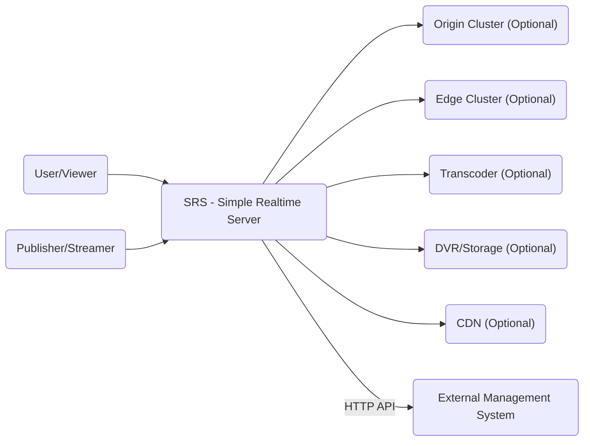
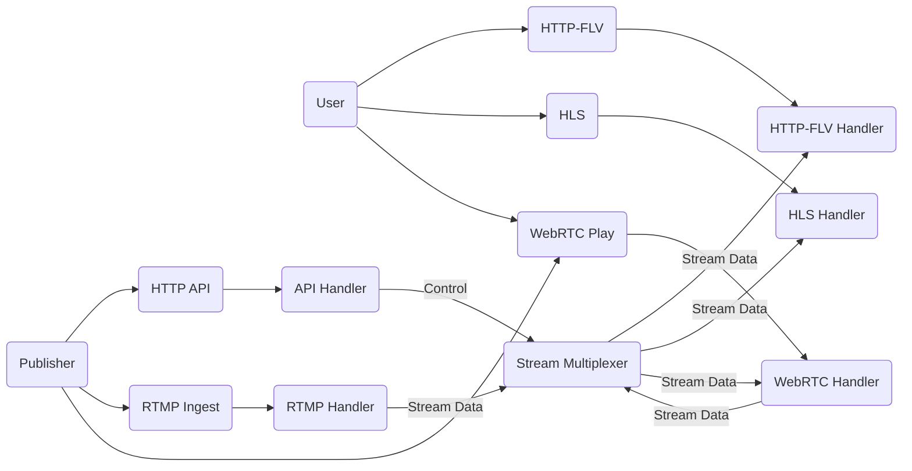
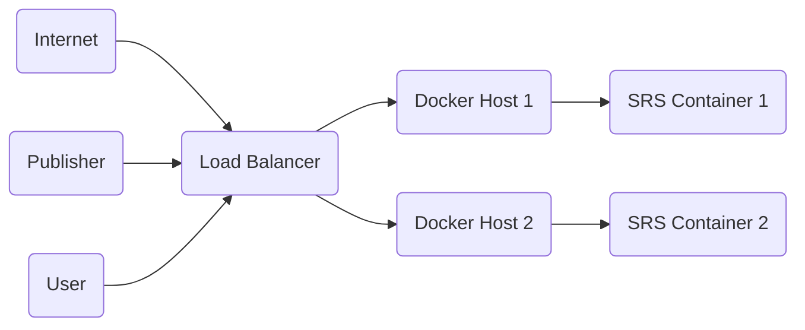
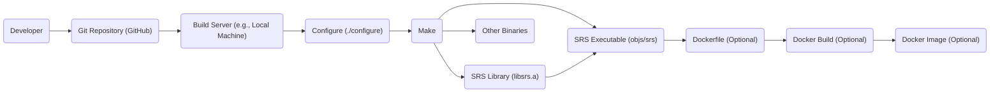

Okay, let's create a design document for the SRS project (Simple Realtime Server) based on the provided GitHub repository.

# BUSINESS POSTURE

SRS is an open-source, real-time media server.  Its primary business goals appear to be:

*   Provide a simple, efficient, and stable platform for live streaming and WebRTC.
*   Foster a community-driven project with wide adoption and contribution.
*   Offer a free alternative to commercial streaming solutions.
*   Support a variety of streaming protocols and formats.
*   Maintain high performance and low latency.

Business priorities:

*   Ease of use and deployment.
*   Performance and scalability.
*   Community engagement and support.
*   Feature completeness (supporting common streaming needs).
*   Stability and reliability.

Most important business risks:

*   Security vulnerabilities that could lead to server compromise or denial of service.
*   Performance bottlenecks that limit scalability or cause latency issues.
*   Lack of adoption or community support, hindering long-term viability.
*   Inability to keep up with evolving streaming standards and technologies.
*   Legal issues related to codec licensing or content distribution.

# SECURITY POSTURE

Existing security controls (based on reviewing the repository and documentation):

*   security control: Basic access control mechanisms (e.g., publishing authentication). Implemented in configuration files and server logic.
*   security control: Support for HTTPS/SSL/TLS for secure communication. Implemented using OpenSSL or other libraries. Described in documentation.
*   security control: Some input validation to prevent common injection attacks. Implemented in server code.
*   security control: Regular updates and bug fixes to address reported vulnerabilities. Implemented through the development process and release cycle.
*   security control: Configuration options to limit resource usage (e.g., number of connections). Implemented in configuration files.

Accepted risks:

*   accepted risk: The project relies heavily on third-party libraries (e.g., libsrt, OpenSSL), inheriting any vulnerabilities they may have.
*   accepted risk: The default configuration may not be secure for all deployments, requiring users to understand and configure security settings appropriately.
*   accepted risk: Advanced security features like DDoS mitigation may not be built-in, requiring external solutions.
*   accepted risk: The focus on simplicity may lead to trade-offs in security features compared to more complex, enterprise-grade solutions.

Recommended security controls:

*   Implement a comprehensive security auditing process, including regular penetration testing and code reviews.
*   Integrate with security scanning tools (SAST, DAST) in the CI/CD pipeline.
*   Provide detailed security documentation and best practices for users.
*   Implement more robust authentication and authorization mechanisms, potentially integrating with external identity providers.
*   Consider adding built-in DDoS protection mechanisms.
*   Implement sandboxing or containerization to isolate different components and limit the impact of vulnerabilities.
*   Provide mechanisms for secure key management and rotation.

Security Requirements:

*   Authentication:
    *   Support secure authentication for publishing streams (e.g., username/password, token-based authentication).
    *   Optionally integrate with external authentication providers (e.g., OAuth, LDAP).
    *   Protect against brute-force attacks.
*   Authorization:
    *   Implement role-based access control (RBAC) to restrict access to specific features and resources.
    *   Allow fine-grained control over stream publishing and consumption.
*   Input Validation:
    *   Validate all input from clients and external sources to prevent injection attacks (e.g., RTMP injection, command injection).
    *   Sanitize data before processing or storing it.
*   Cryptography:
    *   Use strong encryption algorithms and protocols (e.g., TLS 1.3) for secure communication.
    *   Securely manage cryptographic keys.
    *   Provide options for end-to-end encryption where applicable.

# DESIGN

## C4 CONTEXT

Element Description:

*   Element:
    *   Name: User/Viewer
    *   Type: Person
    *   Description: A person who watches the live stream or on-demand video.
    *   Responsibilities: Connects to SRS or CDN to receive media streams.
    *   Security controls: May require authentication depending on the SRS configuration.

*   Element:
    *   Name: Publisher/Streamer
    *   Type: Person
    *   Description: A person or system that sends the live stream to SRS.
    *   Responsibilities: Encodes and transmits media data to SRS.
    *   Security controls: Requires authentication to publish streams.

*   Element:
    *   Name: SRS - Simple Realtime Server
    *   Type: Software System
    *   Description: The core media server that receives, processes, and distributes streams.
    *   Responsibilities: Ingesting streams, transcoding (optional), delivering streams to viewers, recording (optional).
    *   Security controls: Authentication, authorization, input validation, TLS encryption.

*   Element:
    *   Name: Origin Cluster (Optional)
    *   Type: Software System
    *   Description: A cluster of SRS servers for high availability and scalability.
    *   Responsibilities: Redundantly ingest and process streams.
    *   Security controls: Same as SRS, plus inter-server communication security.

*   Element:
    *   Name: Edge Cluster (Optional)
    *   Type: Software System
    *   Description: A cluster of SRS servers located closer to viewers for reduced latency.
    *   Responsibilities: Distribute streams to viewers.
    *   Security controls: Same as SRS.

*   Element:
    *   Name: Transcoder (Optional)
    *   Type: Software System
    *   Description: A system that converts streams to different formats or bitrates.
    *   Responsibilities: Transcoding streams.
    *   Security controls: Input validation, secure communication with SRS.

*   Element:
    *   Name: DVR/Storage (Optional)
    *   Type: Software System
    *   Description: A system that records streams for later playback.
    *   Responsibilities: Storing and retrieving recorded streams.
    *   Security controls: Access control, data encryption at rest (optional).

*   Element:
    *   Name: CDN (Optional)
    *   Type: Software System
    *   Description: A content delivery network for distributing streams globally.
    *   Responsibilities: Caching and delivering streams to viewers.
    *   Security controls: CDN's own security mechanisms.

*   Element:
    *   Name: External Management System
    *   Type: Software System
    *   Description: External system to manage SRS, e.g. configuration, monitoring, etc.
    *   Responsibilities: Manage SRS configuration, monitor health, collect statistics.
    *   Security controls: Authentication, authorization, input validation, TLS encryption.

## C4 CONTAINER

Element Description:

*   Element:
    *   Name: Publisher
    *   Type: Person
    *   Description: A person or system that sends the live stream to SRS.
    *   Responsibilities: Encodes and transmits media data to SRS.
    *   Security controls: Requires authentication to publish streams.

*   Element:
    *   Name: User
    *   Type: Person
    *   Description: A person who watches the live stream.
    *   Responsibilities: Connects to SRS to receive media streams.
    *   Security controls: May require authentication depending on SRS configuration.

*   Element:
    *   Name: HTTP API
    *   Type: API
    *   Description: Provides an HTTP interface for managing and monitoring SRS.
    *   Responsibilities: Handling API requests, authentication, authorization.
    *   Security controls: Authentication, authorization, input validation, TLS encryption.

*   Element:
    *   Name: RTMP Ingest
    *   Type: API
    *   Description: Endpoint for receiving RTMP streams.
    *   Responsibilities: Handling RTMP connections, receiving stream data.
    *   Security controls: Authentication, input validation.

*   Element:
    *   Name: WebRTC Ingest
    *   Type: API
    *   Description: Endpoint for receiving WebRTC streams.
    *   Responsibilities: Handling WebRTC connections, receiving stream data.
    *   Security controls: Authentication, DTLS encryption, input validation.

*   Element:
    *   Name: HTTP-FLV
    *   Type: API
    *   Description: Endpoint for delivering streams via HTTP-FLV.
    *   Responsibilities: Serving FLV streams to clients.
    *   Security controls: TLS encryption (optional).

*   Element:
    *   Name: HLS
    *   Type: API
    *   Description: Endpoint for delivering streams via HLS.
    *   Responsibilities: Generating HLS playlists and segments.
    *   Security controls: TLS encryption (optional).

*   Element:
    *   Name: WebRTC Play
    *   Type: API
    *   Description: Endpoint for delivering streams via WebRTC.
    *   Responsibilities: Handling WebRTC connections, sending stream data.
    *   Security controls: DTLS encryption.

*   Element:
    *   Name: RTMP Handler
    *   Type: Component
    *   Description: Processes incoming RTMP streams.
    *   Responsibilities: Demultiplexing RTMP data, handling RTMP control messages.
    *   Security controls: Input validation.

*   Element:
    *   Name: WebRTC Handler
    *   Type: Component
    *   Description: Processes incoming and outgoing WebRTC streams.
    *   Responsibilities: Handling WebRTC signaling and media data.
    *   Security controls: Input validation, DTLS encryption.

*   Element:
    *   Name: API Handler
    *   Type: Component
    *   Description: Processes HTTP API requests.
    *   Responsibilities: Routing API requests, handling authentication and authorization.
    *   Security controls: Authentication, authorization, input validation.

*   Element:
    *   Name: HTTP-FLV Handler
    *   Type: Component
    *   Description: Serves HTTP-FLV streams.
    *   Responsibilities: Sending FLV data to clients.
    *   Security controls: None specific.

*   Element:
    *   Name: HLS Handler
    *   Type: Component
    *   Description: Generates HLS playlists and segments.
    *   Responsibilities: Creating and updating HLS manifests and segments.
    *   Security controls: None specific.

*   Element:
    *   Name: Stream Multiplexer
    *   Type: Component
    *   Description: Routes and manages stream data.
    *   Responsibilities: Receiving stream data from ingest handlers, forwarding to output handlers.
    *   Security controls: None specific.

## DEPLOYMENT

Possible deployment solutions:

1.  Single server deployment: Simplest deployment, suitable for small-scale use cases.
2.  Origin-Edge cluster deployment: Improves scalability and reduces latency.
3.  Docker container deployment: Simplifies deployment and management.
4.  Kubernetes deployment: Provides high availability, scalability, and automated management.
5.  Cloud provider deployment (e.g., AWS, Azure, GCP): Leverages cloud infrastructure for scalability and reliability.

Chosen solution (for detailed description): Docker container deployment.

Element Description:

*   Element:
    *   Name: Internet
    *   Type: Infrastructure
    *   Description: The global network.
    *   Responsibilities: Routing traffic to the load balancer.
    *   Security controls: Network firewalls, DDoS protection (external).

*   Element:
    *   Name: Load Balancer
    *   Type: Infrastructure
    *   Description: Distributes traffic across multiple Docker hosts.
    *   Responsibilities: Load balancing, health checks.
    *   Security controls: TLS termination, DDoS protection (optional).

*   Element:
    *   Name: Docker Host 1
    *   Type: Infrastructure
    *   Description: A server running Docker.
    *   Responsibilities: Hosting SRS containers.
    *   Security controls: Host-level security (firewall, OS hardening).

*   Element:
    *   Name: Docker Host 2
    *   Type: Infrastructure
    *   Description: A server running Docker.
    *   Responsibilities: Hosting SRS containers.
    *   Security controls: Host-level security (firewall, OS hardening).

*   Element:
    *   Name: SRS Container 1
    *   Type: Container
    *   Description: A Docker container running an instance of SRS.
    *   Responsibilities: Running SRS.
    *   Security controls: Container isolation, limited privileges.

*   Element:
    *   Name: SRS Container 2
    *   Type: Container
    *   Description: A Docker container running an instance of SRS.
    *   Responsibilities: Running SRS.
    *   Security controls: Container isolation, limited privileges.

*  Element:
    *   Name: Publisher
    *   Type: Person
    *   Description: A person or system that sends the live stream to SRS.
    *   Responsibilities: Encodes and transmits media data to SRS.
    *   Security controls: Requires authentication to publish streams.

*   Element:
    *   Name: User
    *   Type: Person
    *   Description: A person who watches the live stream.
    *   Responsibilities: Connects to SRS to receive media streams.
    *   Security controls: May require authentication depending on SRS configuration.

## BUILD

SRS uses a combination of shell scripts and Makefiles for its build process.  It does not appear to use a dedicated CI/CD system like Jenkins or GitHub Actions *within the main repository itself*.  However, users of SRS might deploy it using such systems.

Build Process Description:

1.  Developer commits code to the Git repository on GitHub.
2.  A build server (which could be a developer's local machine or a separate build environment) checks out the code.
3.  The `./configure` script is executed to prepare the build environment and detect dependencies.
4.  `make` is executed to compile the source code.
5.  The build process produces the SRS library (`libsrs.a`), the main SRS executable (`objs/srs`), and potentially other binaries.
6.  Optionally, a Dockerfile can be used to build a Docker image containing the SRS executable.
7.  The Docker image can then be pushed to a container registry.

Security Controls in Build Process:

*   The `configure` script checks for the presence of required dependencies, reducing the risk of using vulnerable or outdated libraries.
*   The build process itself is relatively simple, minimizing the attack surface.
*   If a Dockerfile is used, it should be reviewed for security best practices (e.g., using minimal base images, avoiding unnecessary packages, running as a non-root user).
*   *Recommended*: Integrate static analysis tools (SAST) into the build process (e.g., by adding targets to the Makefile or using a CI/CD system).  Examples include linters, security-focused code analyzers, and dependency vulnerability scanners.
*   *Recommended*: Implement Software Bill of Materials (SBOM) generation during the build to track dependencies and their versions.
*   *Recommended*: Sign the built binaries and Docker images to ensure their integrity.

# RISK ASSESSMENT

Critical Business Processes:

*   Live stream ingest and delivery.
*   User authentication and authorization (if enabled).
*   Server management and configuration.

Data to Protect:

*   Live stream data (in transit and potentially at rest if recording is enabled): Sensitivity depends on the content of the streams.  Could range from public broadcasts to confidential internal communications.
*   User credentials (if authentication is enabled): Highly sensitive.  Compromise could lead to unauthorized access and control of the server.
*   Server configuration: Moderately sensitive.  Could reveal information about the server's setup and potential vulnerabilities.
*   Logs: Sensitivity varies.  May contain IP addresses, user agent strings, and other potentially sensitive information.

# QUESTIONS & ASSUMPTIONS

Questions:

*   What are the specific compliance requirements (if any) for deployments of SRS (e.g., GDPR, HIPAA)?
*   What are the expected traffic patterns and load requirements?
*   Are there any existing security policies or guidelines that should be followed?
*   What level of logging and auditing is required?
*   What is the process for handling security vulnerabilities reported by users or researchers?
*   What are the plans for future development and feature additions?
*   Is there a budget for security tools or services?

Assumptions:

*   BUSINESS POSTURE: The primary goal is to provide a free, open-source, and easy-to-use streaming server.  Cost is a major consideration.
*   SECURITY POSTURE: Security is important, but it may be balanced against ease of use and performance.  Users are expected to have some technical knowledge and take responsibility for securing their deployments.
*   DESIGN: The design should be modular and extensible to allow for future growth and community contributions. The deployment will use Docker containers for ease of deployment and management. We assume that external load balancer will handle TLS termination.