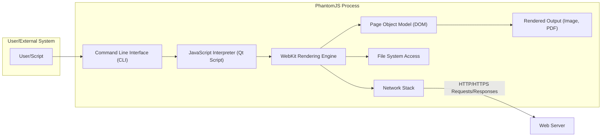
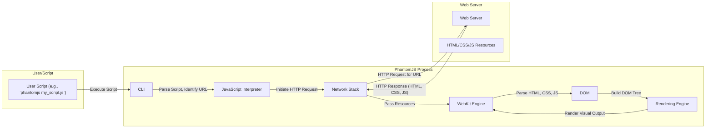
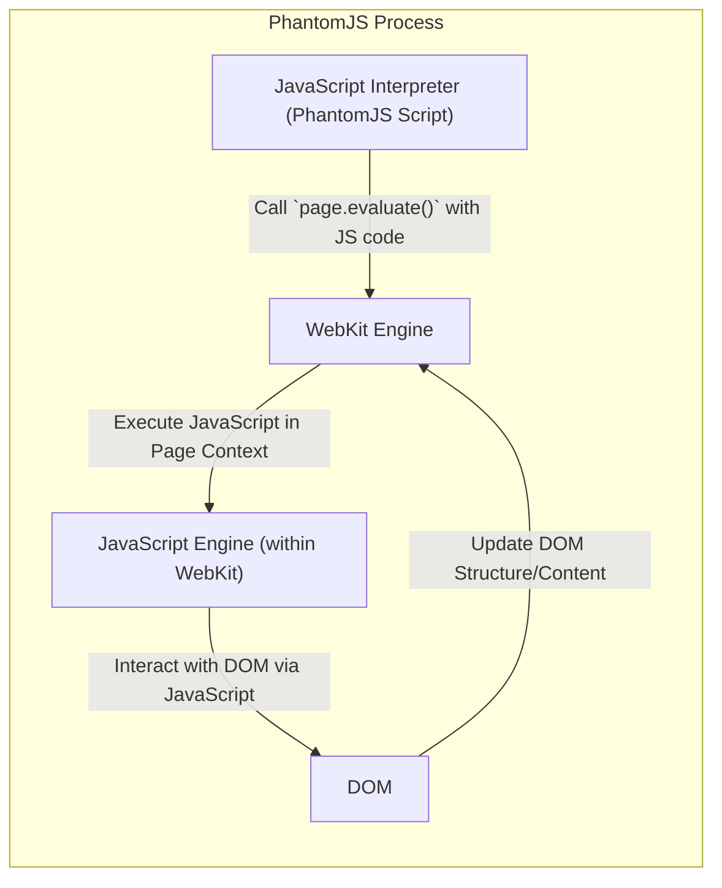
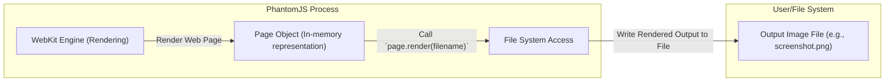

# Project Design Document: PhantomJS

**Version:** 1.1
**Date:** October 26, 2023
**Author:** AI Software Architect

## 1. Introduction

This document provides an enhanced and detailed design overview of the PhantomJS project, a headless WebKit browser scriptable with JavaScript. This document serves as a robust foundation for subsequent threat modeling activities. It meticulously outlines the key components, data flows, and interactions within the system, providing a deeper understanding of its architecture.

## 2. Goals and Objectives

The primary goal of this document remains to provide a comprehensive architectural understanding of PhantomJS to facilitate effective threat modeling. Specific objectives are:

*   Clearly identifying and describing the functionality of each key component.
*   Precisely mapping data flow within the system for various use cases.
*   Thoroughly understanding external interfaces and their interactions with PhantomJS.
*   Presenting a clear, concise, and visually informative representation of the system's architecture.

## 3. Architectural Overview

PhantomJS operates as a headless web browser, meaning it lacks a graphical user interface. It leverages the WebKit rendering engine to interpret and process web content and exposes a JavaScript API for programmatic control. This allows users to automate web interactions, capture screenshots, generate PDFs, and perform other tasks without a visible browser window.

## 4. Key Components

*   **Command Line Interface (CLI):** The initial point of contact for users and external systems. It parses command-line arguments, allowing users to specify scripts to execute, URLs to load, and various configuration options.
*   **JavaScript Interpreter (Qt Script):**  PhantomJS utilizes Qt Script, an ECMAScript-based scripting language, to execute user-provided JavaScript code. This interpreter provides access to PhantomJS's internal API, enabling control over the browser's behavior and access to web page content.
*   **WebKit Rendering Engine:** The core of PhantomJS, responsible for interpreting and rendering web content (HTML, CSS, SVG). It handles the layout of web pages, executes client-side JavaScript within the page context, and manages the Document Object Model (DOM).
*   **Network Stack:** Manages all network-related operations, including resolving domain names (DNS), establishing connections (TCP/IP, SSL/TLS), sending HTTP/HTTPS requests, and handling responses. It also manages cookies, caching, and authentication.
*   **File System Access:** Provides controlled access to the local file system. This allows PhantomJS to load user scripts, read configuration files, save rendered output (images, PDFs), and potentially interact with other local files as directed by the user script.
*   **Page Object Model (DOM):** A tree-like representation of the loaded web page's structure. The DOM allows JavaScript code (both within the page and the controlling PhantomJS script) to access and manipulate the content, structure, and style of the web page.
*   **Rendered Output (Image, PDF):** The final output generated by PhantomJS. It can capture the visual representation of a web page as an image file (PNG, JPEG, GIF, etc.) or generate a PDF document of the page content.

## 5. Data Flow

The following details the typical data flow within PhantomJS for several common use cases:

### 5.1. Loading and Rendering a Web Page

*   The user initiates PhantomJS execution, providing a script file as input.
*   The CLI parses the command and passes control to the JavaScript interpreter.
*   The script instructs PhantomJS to open a specific URL using the `page.open()` function.
*   The JavaScript interpreter triggers the Network Stack to send an HTTP/HTTPS request to the target web server.
*   The web server responds with the requested web resources (HTML, CSS, JavaScript).
*   The Network Stack delivers these resources to the WebKit Engine.
*   The WebKit Engine parses the HTML, CSS, and JavaScript, constructing the DOM.
*   The rendering engine within WebKit uses the DOM and CSS to generate the visual representation of the page.

### 5.2. Executing JavaScript within a Page

*   The PhantomJS script utilizes the `page.evaluate()` function to execute JavaScript code within the context of the loaded web page.
*   This JavaScript code is passed to the JavaScript engine embedded within the WebKit Engine.
*   The in-page JavaScript can interact with the DOM, modify elements, trigger events, and access browser APIs.
*   Changes made by the in-page JavaScript update the DOM, which can then trigger re-rendering by the WebKit Engine.

### 5.3. Capturing a Screenshot

*   The WebKit Engine renders the current state of the web page.
*   The PhantomJS script calls the `page.render()` function, specifying the desired output filename and format.
*   The Page Object provides the rendered output to the File System Access component.
*   The File System Access component writes the image data to the specified file on the local file system.

## 6. External Interfaces

PhantomJS interacts with the external environment through several key interfaces:

*   **Command Line Arguments:**  The primary mechanism for configuring PhantomJS execution. Users can specify the script to run, URLs to process, output file paths, viewport size, user agent string, and other settings.
*   **File System:**  Used for reading user-provided scripts, configuration files, and potentially other local resources. It's also used for writing output, including screenshots, PDFs, and log files.
*   **Network (HTTP/HTTPS):**  Essential for fetching web resources from remote servers. This includes downloading HTML, CSS, JavaScript, images, and other assets required to render web pages.
*   **Standard Input/Output (stdin/stdout/stderr):**  Provides basic communication channels. PhantomJS can output logging information, error messages, or even data extracted from web pages to stdout or stderr. It can also potentially receive input via stdin, although this is less common.

## 7. Security Considerations (Detailed)

This section expands on potential security concerns, providing more specific examples of potential threats.

*   **Script Execution Vulnerabilities:**
    *   **Malicious User Scripts:**  If PhantomJS is used in an environment where users can provide arbitrary scripts, malicious scripts could exploit vulnerabilities in the PhantomJS API or the underlying Qt Script engine to gain unauthorized access to the file system, execute arbitrary commands, or leak sensitive information.
    *   **Code Injection:**  If user-provided data is not properly sanitized and is used to construct JavaScript code executed by `page.evaluate()`, it could lead to code injection vulnerabilities, allowing attackers to execute arbitrary JavaScript within the context of the web page.
*   **Network Security Risks:**
    *   **Man-in-the-Middle (MITM) Attacks:** If PhantomJS is used to access websites over insecure HTTP connections, attackers could intercept network traffic and potentially steal sensitive information or inject malicious content. Even with HTTPS, improper certificate validation could expose PhantomJS to MITM attacks.
    *   **Cross-Site Scripting (XSS):** While PhantomJS itself doesn't directly suffer from XSS, if it's used to process or render untrusted web content, vulnerabilities in the WebKit rendering engine could be exploited, potentially leading to information disclosure or other malicious actions.
    *   **Server-Side Request Forgery (SSRF):** If a PhantomJS script takes a URL as input from an untrusted source and then makes a request to that URL, an attacker could potentially use PhantomJS to access internal resources or services that are not publicly accessible.
*   **File System Access Control Issues:**
    *   **Path Traversal:** If user-provided input is used to construct file paths without proper validation, attackers could potentially read or write files outside of the intended directories.
    *   **Information Disclosure:**  If PhantomJS is configured to save sensitive information (e.g., cookies, authentication tokens) to the file system without proper protection, this data could be exposed.
*   **WebKit Vulnerabilities:**  As PhantomJS relies on the WebKit rendering engine, any security vulnerabilities present in the specific version of WebKit used by PhantomJS could be exploited. Given that PhantomJS is no longer maintained, these vulnerabilities will likely remain unpatched.
*   **Dependency Vulnerabilities:**  PhantomJS depends on other libraries and components (e.g., Qt). Vulnerabilities in these dependencies could also pose security risks.
*   **Command Injection:** If user-provided input is incorporated into system commands executed by PhantomJS (though less common in typical usage), insufficient sanitization could lead to command injection vulnerabilities.

## 8. Deployment Considerations

PhantomJS is typically deployed as a standalone executable and can be integrated into various workflows. Security considerations vary depending on the deployment scenario:

*   **Local Development Environment:**  Lower risk, but still susceptible to vulnerabilities if running untrusted scripts or accessing malicious websites.
*   **CI/CD Pipelines:**  Requires careful management of scripts and dependencies to prevent the introduction of malicious code or exploitation of vulnerabilities. Secure handling of credentials and sensitive data is crucial.
*   **Server-Side Web Scraping/Automation:**  Higher risk due to potential exposure to untrusted web content and the need to handle sensitive data. Proper isolation, input validation, and secure configuration are essential.
*   **Containerized Environments (e.g., Docker):**  Provides a degree of isolation but requires careful configuration of container images and resource limits to mitigate potential risks.

## 9. Future Considerations

The fact that PhantomJS is no longer actively maintained is a critical security concern. **This means that any newly discovered vulnerabilities will not be patched, leaving systems relying on PhantomJS increasingly vulnerable over time.** Organizations using PhantomJS should:

*   **Thoroughly assess the risks associated with using an unmaintained project.**
*   **Implement robust security measures to mitigate potential vulnerabilities.**
*   **Actively explore and migrate to actively maintained alternatives** such as Puppeteer or Playwright, which offer similar functionality with ongoing security updates and support.
*   **Consider virtual patching or other compensating controls** if immediate migration is not feasible.

This enhanced design document provides a more in-depth understanding of the PhantomJS architecture, crucial for conducting a comprehensive threat modeling exercise and making informed decisions about its continued use. The detailed information on components, data flow, and security considerations will aid in identifying potential attack vectors and developing appropriate mitigation strategies, especially given the project's maintenance status.