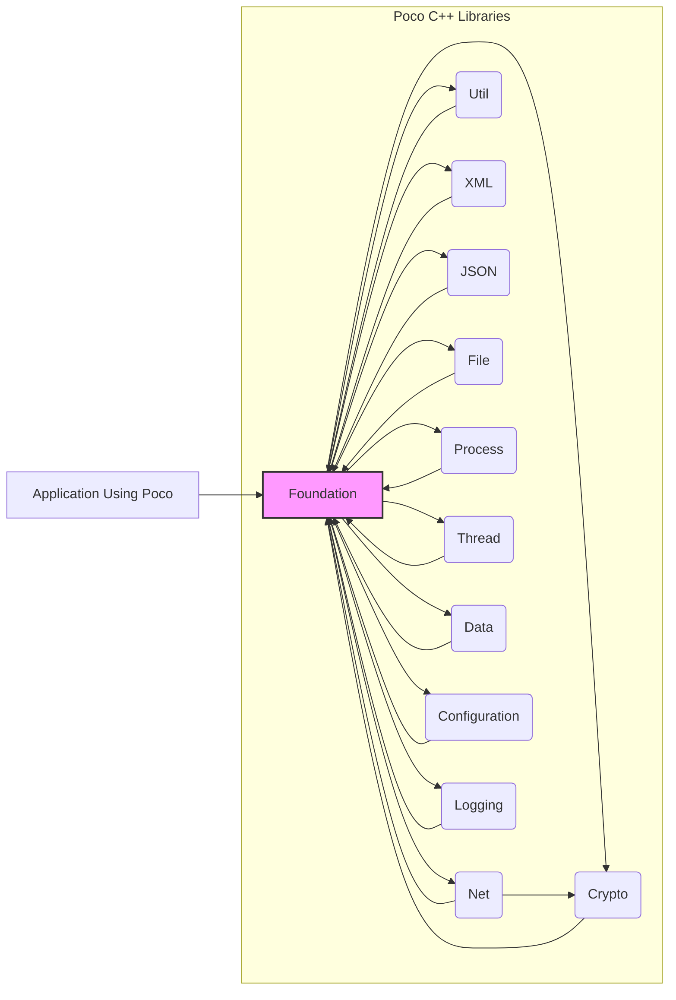

## Project Design Document: Poco C++ Libraries (Improved)

**1. Project Overview**

The Poco C++ Libraries are a comprehensive suite of open-source, cross-platform C++ class libraries designed to simplify the development of network-centric and portable applications. They offer a rich set of functionalities encompassing networking protocols, data parsing and manipulation, cryptographic services, file system operations, inter-process communication, and more. This document provides an enhanced architectural overview of the Poco libraries, specifically tailored to facilitate thorough threat modeling and security analysis.

**2. Goals and Objectives**

*   To provide a more detailed and refined architectural description of the Poco library ecosystem.
*   To clearly delineate the responsibilities and interactions of key components and namespaces within the libraries.
*   To explicitly highlight potential security-relevant aspects and attack surfaces within the library's design.
*   To serve as a robust and informative foundation for subsequent threat modeling exercises, enabling the identification of potential vulnerabilities and mitigation strategies.

**3. Target Audience**

*   Security architects and engineers responsible for assessing the security of systems utilizing the Poco libraries.
*   Software developers who are actively using or planning to use the Poco libraries in their applications and need to understand potential security implications.
*   Threat modeling specialists tasked with identifying and analyzing potential threats against applications built with Poco.
*   Individuals seeking a deeper understanding of the internal architecture and security considerations of the Poco C++ Libraries.

**4. Scope**

This document focuses on the significant architectural elements of the core Poco libraries that are most relevant for security analysis. It provides a more granular view of key namespaces, modules, and their interdependencies. The scope includes:

*   Detailed descriptions of core namespaces and their primary functionalities.
*   Identification of critical classes and interfaces within these modules that handle sensitive data or perform security-sensitive operations.
*   Elaboration on data flow scenarios, including the types of data being exchanged and potential transformation points.
*   A more explicit discussion of external dependencies and their potential security implications.

This document still does *not* cover:

*   Extremely fine-grained implementation details of individual classes or methods.
*   Specific application-level security configurations or usage patterns (these are the responsibility of the application developer).
*   The intricacies of the build system or the development workflow.
*   An exhaustive list of every single class or function within the entirety of the Poco library collection.

**5. System Architecture**

The Poco libraries are logically structured into a hierarchy of namespaces, each encapsulating a specific domain of functionality. The following diagram illustrates the high-level architecture and key namespaces, with more detail provided in the descriptions below:



**Key Components and Namespaces (Detailed):**

*   **Foundation:** This namespace forms the bedrock of the Poco libraries, providing essential cross-platform abstractions and utility classes. It handles fundamental data types, string manipulation, date and time operations, and smart pointers.
    *   Key classes: `"String"`, `"DateTime"`, `"Timespan"`, `"Any"`, `"SharedPtr"`, `"DynamicAny"`, `"UUID"`.
    *   Security Relevance: While seemingly basic, vulnerabilities here could have widespread impact. Improper string handling could lead to buffer overflows. Incorrect time handling might affect security protocols.
*   **Net:** This namespace is dedicated to networking functionalities, offering a comprehensive set of classes for socket programming, implementing various network protocols (HTTP, FTP, SMTP, etc.), and handling network addresses.
    *   Key classes: `"Socket"`, `"ServerSocket"`, `"HTTPClientSession"`, `"HTTPServer"`, `"HTTPRequest"`, `"HTTPResponse"`, `"MailMessage"`, `"TCPServer"`, `"UDPSocket"`.
    *   Security Relevance: This is a major attack surface. Vulnerabilities here could allow for remote code execution, data interception, or denial-of-service attacks. Secure socket options, proper handling of network input, and adherence to protocol specifications are critical.
*   **Util:** This namespace provides utility classes for application development, including command-line argument parsing, configuration file management, and service management.
    *   Key classes: `"OptionSet"`, `"PropertyFileConfiguration"`, `"XMLConfiguration"`, `"AbstractConfiguration"`, `"Application"`, `"ServerApplication"`.
    *   Security Relevance: Improper parsing of command-line arguments or configuration files could lead to injection vulnerabilities. Storing sensitive information in configuration files requires careful consideration.
*   **XML:** This namespace offers functionalities for parsing, manipulating, and generating XML documents. It supports both DOM and SAX parsing models.
    *   Key classes: `"XMLParser"`, `"DOMParser"`, `"SAXParser"`, `"XMLWriter"`, `"Document"`, `"Element"`, `"Attribute"`.
    *   Security Relevance: XML processing is prone to vulnerabilities like XML External Entity (XXE) attacks and denial-of-service through maliciously crafted XML. Proper parser configuration and input validation are essential.
*   **JSON:** This namespace provides support for working with JSON data, including parsing, serialization, and manipulation of JSON objects and arrays.
    *   Key classes: `"JSONParser"`, `"JSONValue"`, `"JSONObject"`, `"JSONArray"`, `"JSONWriter"`.
    *   Security Relevance: Similar to XML, improper JSON parsing can lead to vulnerabilities. Care must be taken when deserializing untrusted JSON data.
*   **Crypto:** This namespace offers cryptographic functionalities, including hashing algorithms, symmetric and asymmetric encryption, digital signatures, and secure random number generation.
    *   Key classes: `"DigestEngine"`, `"Cipher"`, `"RSAKey"`, `"PrivateKeyFactory"`, `"PublicKeyFactory"`, `"RandomEngine"`, `"MessageDigest"`, `"HMACEngine"`.
    *   Security Relevance: This namespace is critical for security. Improper use of cryptographic algorithms, weak key management, or reliance on outdated protocols can severely compromise security.
*   **File:** This namespace deals with file system operations, providing classes for file and directory manipulation, input and output streams, and file locking.
    *   Key classes: `"File"`, `"DirectoryIterator"`, `"FileInputStream"`, `"FileOutputStream"`, `"FileStream"`, `"Path"`.
    *   Security Relevance: Improper handling of file paths can lead to path traversal vulnerabilities. Incorrect file permissions can result in unauthorized access.
*   **Process:** This namespace offers functionalities for creating and managing processes, including inter-process communication mechanisms like pipes.
    *   Key classes: `"Process"`, `"ProcessRunner"`, `"Pipe"`, `"ProcessHandle"`.
    *   Security Relevance: Executing external processes without proper sanitization of arguments can lead to command injection vulnerabilities.
*   **Thread:** This namespace provides threading primitives and synchronization mechanisms for concurrent programming, enabling the development of multi-threaded applications.
    *   Key classes: `"Thread"`, `"Mutex"`, `"Semaphore"`, `"Event"`, `"Runnable"`, `"ThreadPool"`.
    *   Security Relevance: Concurrency issues like race conditions and deadlocks can lead to unexpected behavior and potential security vulnerabilities.
*   **Data:** This namespace offers abstract data access layers and database connectivity, providing interfaces for interacting with various database systems.
    *   Key classes: `"SessionFactory"`, `"Session"`, `"Statement"`, `"RecordSet"`.
    *   Security Relevance: SQL injection vulnerabilities can arise if database queries are not properly parameterized. Secure connection management is also important.
*   **Configuration:** This namespace provides mechanisms for loading and managing application configuration settings from various sources (e.g., property files, XML files).
    *   Key classes: `"AbstractConfiguration"`, `"PropertiesConfiguration"`, `"XMLConfigurationView"`.
    *   Security Relevance: Sensitive information stored in configuration files should be protected. Improper access control to configuration files can be a vulnerability.
*   **Logging:** This namespace offers a flexible logging framework for recording application events, errors, and debugging information.
    *   Key classes: `"Logger"`, `"Appender"`, `"FormattingChannel"`, `"SplitterChannel"`.
    *   Security Relevance: Logging sensitive information can expose it to unauthorized parties. Log injection vulnerabilities can also be a concern.

**6. Data Flow (Detailed)**

Data flows through the Poco libraries in diverse ways, depending on the specific functionalities being utilized. Here are more detailed scenarios illustrating data flow and potential security considerations:

*   **Secure Network Communication (HTTPS):**
    *   Application initiates an HTTPS request using `"HTTPSClientSession"` (in `"Net"`).
    *   `"HTTPSClientSession"` utilizes `"SSLManager"` and `"Context"` (in `"Net"` and potentially `"Crypto"`) to establish a secure TLS/SSL connection.
    *   Cryptographic handshakes and encryption/decryption operations are performed using classes from the `"Crypto"` namespace.
    *   HTTP request data is encrypted before being sent over the `"Socket"`.
    *   The remote server decrypts the data, processes the request, and sends an encrypted response.
    *   `"HTTPSClientSession"` receives the encrypted response, decrypts it, and makes the data available to the application.

    ```mermaid
    graph LR
        A["Application"] --> B("HTTPSClientSession (Net)");
        B --> C("SSLManager/Context (Net/Crypto)");
        C --> D("Socket (Net)");
        D -- "Encrypted Network Traffic" --> E("Remote Server");
        E -- "Encrypted Network Traffic" --> D;
        D --> C;
        C --> B;
        B --> F["Application"];
        style B fill:#ccf,stroke:#333,stroke-width:1px
        style C fill:#ccf,stroke:#333,stroke-width:1px
        style D fill:#ccf,stroke:#333,stroke-width:1px
    ```

*   **Parsing Untrusted XML Data:**
    *   Application receives XML data from an external source (e.g., network, file).
    *   The data is passed to `"XMLParser"` or `"DOMParser"` (in `"XML"`).
    *   The parser processes the XML, potentially resolving external entities or including external files if not configured securely.
    *   The parsed XML structure is represented as a DOM tree or triggers SAX events.
    *   The application accesses and processes the parsed data.

    ```mermaid
    graph LR
        A["Application"] --> B("Untrusted XML Data");
        B --> C("XMLParser/DOMParser (XML)");
        C --> D("Internal XML Representation");
        D --> E["Application"];
        style C fill:#ccf,stroke:#333,stroke-width:1px
    ```

*   **Handling User-Provided Configuration:**
    *   Application uses `"ConfigurationReader"` (or specific configuration classes in `"Configuration"`) to load settings from a file or other source.
    *   The configuration data might contain sensitive information like database credentials or API keys.
    *   The application uses these configuration settings to control its behavior and access resources.

    ```mermaid
    graph LR
        A["Application"] --> B("Configuration File/Source");
        B --> C("ConfigurationReader (Configuration)");
        C --> D("Configuration Settings");
        D --> E["Application"];
        style C fill:#ccf,stroke:#333,stroke-width:1px
    ```

**7. Key Technologies and Dependencies**

*   **Core Language:** C++ (primarily C++11 and later standards).
*   **Standard Library:**  Heavily relies on the C++ Standard Library for core functionalities.
*   **Operating System APIs:**  Interacts directly with OS-specific APIs for networking, threading, file system access, and process management to achieve cross-platform compatibility.
*   **Third-party Libraries (Conditional):** Some modules have optional dependencies on external libraries, such as:
    *   **OpenSSL:** Used by the `"Crypto"` and `"Net"` namespaces for cryptographic operations and secure communication protocols (TLS/SSL).
    *   **expat:**  Used by the `"XML"` namespace for XML parsing.
    *   **Various database client libraries:** Used by the `"Data"` namespace for database connectivity (e.g., MySQL Connector/C, ODBC).
    *   Security Relevance: The security of these third-party dependencies directly impacts the security of Poco. Vulnerabilities in these libraries can be exploited through Poco. Proper dependency management and keeping these libraries up-to-date are crucial.

**8. Deployment Model**

Poco libraries are typically deployed as:

*   **Dynamically Linked Libraries (DLLs or Shared Objects):** This is the most common deployment model, where applications link against the Poco libraries at runtime. This allows for smaller application executables and easier updates to the Poco libraries.
*   **Statically Linked Libraries:** In this model, the Poco library code is directly incorporated into the application executable. This results in larger executables but eliminates runtime dependencies on the Poco libraries.
*   Security Relevance: The deployment model can influence security. Dynamically linked libraries require careful management to ensure the correct and secure versions are loaded.

**9. Security Considerations (Detailed)**

Expanding on the initial considerations, here are more specific security concerns related to the Poco architecture:

*   **Input Validation Vulnerabilities (CWE-20):**
    *   **Net:**  Failure to properly validate network input (e.g., HTTP headers, request parameters) can lead to buffer overflows, cross-site scripting (XSS) through reflected data, or injection attacks.
    *   **XML:**  Insufficient validation of XML data can result in XML External Entity (XXE) attacks (CWE-611), where the parser includes malicious external content, or denial-of-service attacks through entity expansion.
    *   **JSON:**  Improper handling of JSON data can lead to deserialization vulnerabilities (CWE-502) if untrusted data is directly deserialized into objects.
    *   **Util:**  Lack of validation in command-line argument parsing can lead to command injection (CWE-78).
*   **Network Security Weaknesses (CWE-319, CWE-311):**
    *   **Net:**  Using unencrypted protocols (HTTP instead of HTTPS) exposes data to interception (CWE-319). Improper configuration of TLS/SSL can lead to man-in-the-middle attacks (CWE-300). Vulnerabilities in socket handling can lead to denial-of-service.
*   **Cryptographic Flaws (CWE-310, CWE-327):**
    *   **Crypto:**  Using weak or outdated cryptographic algorithms (CWE-327), improper key generation or storage (CWE-310), or incorrect implementation of cryptographic protocols can severely compromise data confidentiality and integrity.
*   **File System Vulnerabilities (CWE-22, CWE-73):**
    *   **File:**  Insufficient validation of file paths can lead to path traversal vulnerabilities (CWE-22), allowing access to unauthorized files. Improper handling of temporary files can create security risks (CWE-377).
*   **Process Execution Risks (CWE-78):**
    *   **Process:**  Constructing commands to execute external processes without proper sanitization of user-provided input can lead to command injection vulnerabilities (CWE-78).
*   **Concurrency Issues (CWE-362):**
    *   **Thread:**  Race conditions (CWE-362) and other concurrency bugs in multi-threaded applications using Poco can lead to unpredictable behavior and potential security vulnerabilities.
*   **Database Security Flaws (CWE-89):**
    *   **Data:**  Failure to properly sanitize user input when constructing database queries can lead to SQL injection vulnerabilities (CWE-89).
*   **Configuration Management Issues (CWE-312, CWE-532):**
    *   **Configuration:**  Storing sensitive information in plain text in configuration files (CWE-312) or allowing unauthorized access to configuration files can expose credentials and other sensitive data. Logging sensitive configuration data (CWE-532) is also a risk.
*   **Logging Security Concerns (CWE-117):**
    *   **Logging:**  Improperly sanitizing data before logging can lead to log injection vulnerabilities (CWE-117), where attackers can inject malicious content into log files. Logging sensitive information can expose it.

**10. Future Considerations**

*   Develop more detailed sequence diagrams for specific security-critical use cases (e.g., user authentication, secure data transfer).
*   Conduct a thorough analysis of error handling and exception management within the libraries from a security perspective (e.g., information leakage through error messages).
*   Investigate the availability and effectiveness of built-in security features and best practices recommended by the Poco project (e.g., secure coding guidelines, security-related configuration options).
*   Perform static and dynamic code analysis to identify potential vulnerabilities within the Poco library codebase itself.
*   Regularly review and update this design document to reflect changes in the Poco architecture and emerging security threats.

This improved design document provides a more comprehensive and detailed understanding of the Poco C++ Libraries' architecture, specifically focusing on aspects relevant to security. It serves as a valuable resource for threat modeling and security analysis, enabling a more thorough assessment of potential vulnerabilities and the development of appropriate mitigation strategies.
