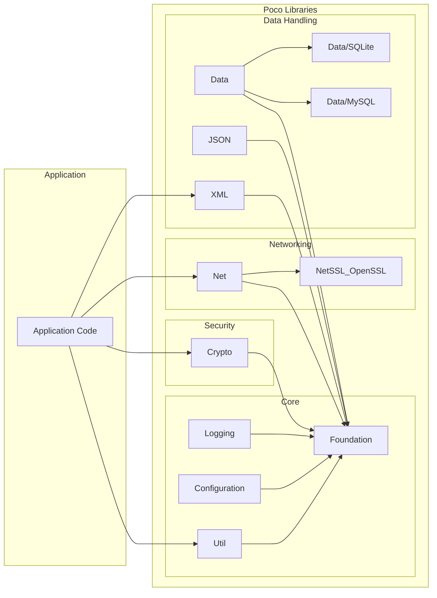
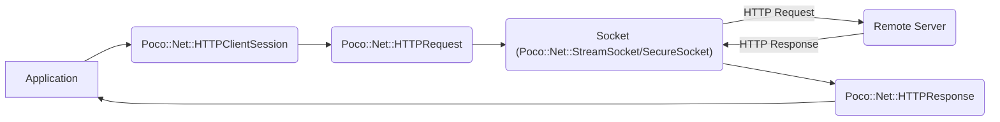
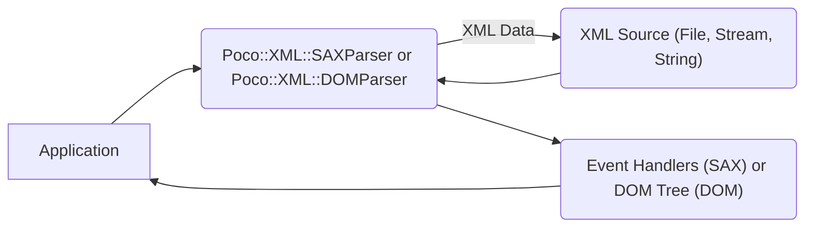

## Project Design Document: Poco C++ Libraries

**Project Repository:** [https://github.com/pocoproject/poco](https://github.com/pocoproject/poco)

**1. Introduction**

This document outlines the design of the Poco C++ Libraries, a collection of open-source C++ class libraries that simplify and accelerate the development of network-centric, portable applications. This document serves as a foundation for future threat modeling activities.

**2. Goals**

*   Provide a comprehensive overview of the Poco C++ Libraries' architecture and key components.
*   Identify potential entry points and data flow within the libraries.
*   Highlight security-relevant aspects of the design.
*   Serve as a basis for subsequent threat modeling exercises.

**3. Architectural Overview**

The Poco C++ Libraries are designed as a set of modular components, each providing specific functionalities. This modularity allows developers to select and integrate only the necessary parts, reducing dependencies and the overall footprint of their applications.

*   **Core Library:** Provides fundamental building blocks, including:
    *   Basic utilities (strings, dates/times, logging).
    *   Platform abstraction (threads, processes, file system access).
    *   Configuration management.
    *   Error handling and exception management.
*   **Net Library:** Offers networking capabilities:
    *   Sockets (TCP, UDP).
    *   HTTP client and server implementations.
    *   SMTP client.
    *   DNS resolution.
    *   SSL/TLS support.
*   **XML Library:** Provides XML processing functionality:
    *   DOM and SAX parsers.
    *   XPath support.
    *   XML Schema validation.
*   **JSON Library:** Enables JSON processing:
    *   JSON parsing and serialization.
    *   DOM-like representation of JSON documents.
*   **Util Library:** Contains utility classes for application development:
    *   Command-line argument parsing.
    *   Configuration file handling.
    *   Service framework.
*   **Data Library:** Offers database access functionalities:
    *   Abstract database access layer (ADO-like).
    *   Connectors for various database systems (e.g., MySQL, SQLite, PostgreSQL).
*   **Crypto Library:** Provides cryptographic functionalities:
    *   Hashing algorithms (e.g., SHA-256, MD5).
    *   Symmetric and asymmetric encryption algorithms.
    *   Digital signatures.
    *   Random number generation.
*   **Foundation Library:**  Contains the most fundamental classes and interfaces upon which other libraries are built.

**4. Key Components and Interactions**

*   **Application Code:** The user-developed application that utilizes the Poco C++ Libraries.
*   **Foundation Library:** Provides core functionalities used by other Poco libraries.
*   **Util Library:** Offers utilities for application development, often used directly by the application.
*   **Configuration Library:** Manages application configuration settings.
*   **Logging Library:** Handles application logging.
*   **Net Library:** Provides core networking functionalities, potentially relying on NetSSL for secure connections.
*   **NetSSL Library (e.g., OpenSSL):** Implements SSL/TLS protocols for secure network communication.
*   **XML Library:** Enables parsing and manipulation of XML data.
*   **JSON Library:** Facilitates parsing and generation of JSON data.
*   **Data Library:** Provides an abstraction layer for database access.
*   **Data Connectors (e.g., SQLite, MySQL):** Implement database-specific communication.
*   **Crypto Library:** Offers cryptographic functionalities for security-sensitive operations.

**5. Data Flow Diagrams**

**5.1. HTTP Request Flow:**

*   The application initiates an HTTP request.
*   `Poco::Net::HTTPClientSession` manages the connection to the server.
*   `Poco::Net::HTTPRequest` encapsulates the HTTP request details.
*   The request is sent through a socket (potentially a secure socket for HTTPS).
*   The remote server processes the request and sends back an HTTP response.
*   `Poco::Net::HTTPResponse` parses the response.
*   The application receives the response.

**5.2. XML Parsing Flow:**

*   The application uses either a SAX parser or a DOM parser to process XML data.
*   The XML data originates from a source (file, stream, or string).
*   The parser reads the XML data.
*   For SAX, the parser generates events that are handled by application-defined event handlers.
*   For DOM, the parser builds an in-memory tree representation of the XML document.
*   The application interacts with the parsed XML data.

**6. Entry Points and Trust Boundaries**

*   **Network Interfaces (Net Library):**
    *   Accepting incoming connections (e.g., `ServerSocket`).
    *   Establishing outgoing connections (e.g., `SocketConnector`).
    *   Receiving and sending data over sockets.
    *   Handling HTTP requests (server-side).
    *   Making HTTP requests (client-side).
*   **File System Access (Foundation Library):**
    *   Reading and writing files.
    *   Accessing directory structures.
    *   Handling file paths.
*   **Configuration Loading (Util/Configuration Libraries):**
    *   Reading configuration files (various formats).
    *   Parsing configuration data.
*   **Data Input (XML, JSON, Data Libraries):**
    *   Parsing XML and JSON data from various sources.
    *   Executing database queries with potentially user-provided input.
*   **Cryptographic Operations (Crypto Library):**
    *   Taking input for encryption, decryption, hashing, and signing operations.

**Trust Boundaries:**

*   Between the application code and the Poco libraries. The application trusts the libraries to function correctly and securely.
*   Between the application and external systems accessed through the network (e.g., remote servers, databases). Data received from external sources should be treated as untrusted.
*   When using cryptographic functions, the boundary exists between the application's sensitive data and the cryptographic algorithms. Proper key management and usage are crucial.

**7. Security Considerations**

*   **Input Validation:**  The Poco libraries often handle external input (e.g., network data, file contents, configuration files). Proper input validation within the libraries is crucial to prevent vulnerabilities like buffer overflows, format string bugs, and injection attacks.
*   **Secure Defaults:** The libraries should have secure default configurations. For example, secure protocols (HTTPS) should be preferred over insecure ones (HTTP) where applicable.
*   **Memory Safety:** As a C++ library, memory management is critical. The libraries should be designed to avoid memory leaks, dangling pointers, and buffer overflows.
*   **Cryptographic Best Practices:** When using the Crypto library, developers need to adhere to cryptographic best practices. The library should provide secure implementations of cryptographic algorithms and guidance on their proper usage.
*   **Error Handling:** Robust error handling is essential to prevent unexpected behavior and potential security vulnerabilities. Error messages should not reveal sensitive information.
*   **Denial of Service (DoS):**  The libraries should be resilient to DoS attacks, such as resource exhaustion through excessive network requests or large input data.
*   **Dependency Management:** The security of the Poco libraries also depends on the security of their dependencies (e.g., OpenSSL). Keeping dependencies up-to-date is crucial.
*   **Secure Socket Layer (SSL/TLS):** When using network communication, especially for sensitive data, the use of SSL/TLS through the `NetSSL` library is paramount. Proper certificate validation and secure protocol negotiation are important considerations.
*   **Database Security:** When using the Data library, developers need to be aware of potential SQL injection vulnerabilities if user-provided input is not properly sanitized before being used in database queries. The Poco Data library provides mechanisms for parameterized queries to mitigate this risk.

**8. Future Considerations**

*   Detailed analysis of specific modules for potential vulnerabilities.
*   Threat modeling workshops focusing on different use cases of the libraries.
*   Security testing (e.g., fuzzing, static analysis) of the codebase.
*   Review of third-party dependencies for known vulnerabilities.

This document provides a high-level overview of the Poco C++ Libraries' design for threat modeling purposes. Further detailed analysis of specific components and their interactions will be necessary for a comprehensive security assessment.
