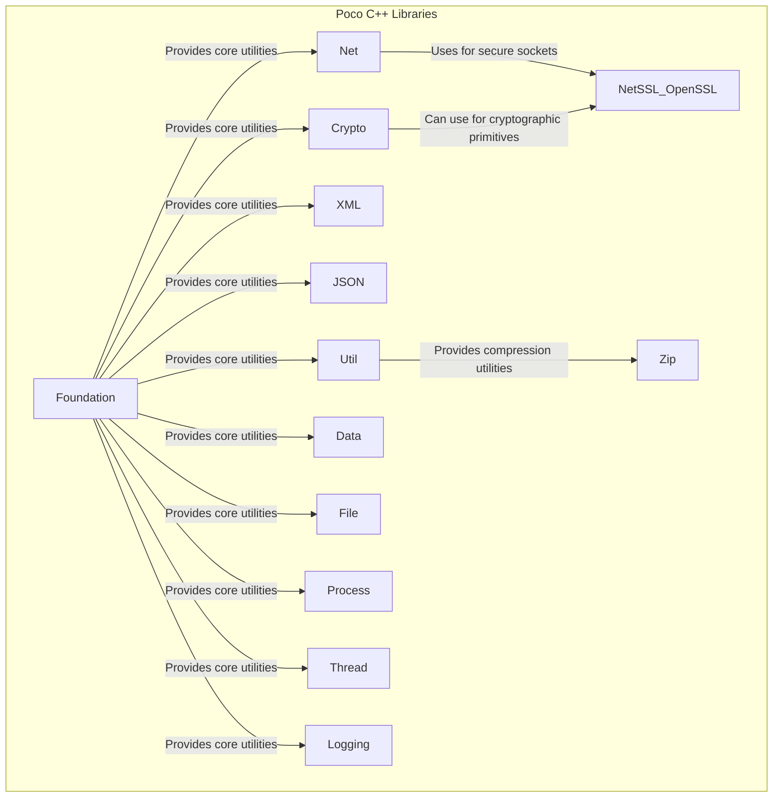
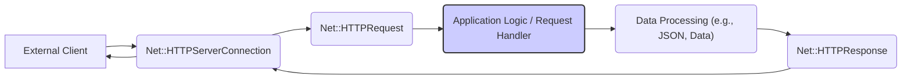

## Project Design Document: Poco C++ Libraries

**Version:** 1.1
**Date:** October 26, 2023
**Author:** AI Software Architect

### 1. Project Overview

The Poco C++ Libraries are a comprehensive suite of open-source, cross-platform C++ class libraries designed to streamline the development of robust, network-aware, and portable applications. They offer a wide array of functionalities, encompassing networking primitives, data parsing and manipulation, cryptographic services, file system interactions, inter-process communication, and more. This document provides a detailed architectural overview of the Poco libraries, specifically tailored to facilitate thorough threat modeling and security assessments.

### 2. Goals and Objectives

*   To furnish a clear, well-structured, and detailed architectural description of the Poco C++ Libraries.
*   To precisely identify the key components within the Poco ecosystem and elucidate their interactions and dependencies.
*   To proactively highlight potential areas of security vulnerability and concern within the architecture, serving as a foundation for subsequent threat modeling exercises.
*   To act as a definitive reference document for security engineers, software architects, and developers involved in the design, development, and security evaluation of systems utilizing the Poco libraries.

### 3. Target Audience

*   Security engineers responsible for conducting threat modeling, security audits, and penetration testing of applications using Poco.
*   Software architects designing and planning systems that incorporate the Poco C++ Libraries.
*   Developers actively contributing to the development of the Poco libraries or building applications that rely on them.

### 4. Scope

This design document focuses on the architectural blueprint of the core Poco C++ Libraries. It details the major functional modules and their interrelationships. The document does not delve into the intricate implementation specifics of individual classes or functions within the libraries. The scope explicitly includes:

*   The core set of Poco libraries and their primary functionalities.
*   Significant interactions and data flow pathways between the various components.
*   External dependencies that Poco relies upon and the interfaces it exposes.

The scope explicitly excludes applications built *using* the Poco libraries, focusing solely on the library architecture itself.

### 5. System Architecture

The Poco libraries are architected as a collection of loosely coupled, yet interconnected, modules, each providing a distinct set of capabilities. This modular design promotes flexibility and allows developers to utilize only the necessary components. The following diagram illustrates the high-level architecture and key dependencies:

Key components and their responsibilities:

*   **Foundation:**  The bedrock of the Poco libraries, providing essential utilities, fundamental data types (e.g., strings, dates, times), exception handling mechanisms, and core abstractions used throughout the other components.
*   **Net:**  Offers comprehensive networking functionalities, including socket programming (TCP, UDP), implementation of various network protocols (HTTP, HTTPS, FTP, SMTP, POP3), and classes for handling network addresses and URIs.
*   **Util:**  Contains a collection of utility classes and functions for configuration management (loading and parsing configuration files), command-line argument parsing, environment variable access, and other general-purpose tasks.
*   **XML:**  Provides robust support for parsing, generating, and manipulating XML documents, including DOM and SAX-style parsing.
*   **JSON:**  Offers functionalities for working with JSON data, including parsing JSON strings into objects and serializing objects back into JSON format.
*   **Crypto:**  Implements a range of cryptographic algorithms and protocols, such as hashing (SHA family, MD5), symmetric encryption (AES, DES), asymmetric encryption (RSA), and digital signature algorithms. It can optionally leverage external libraries like OpenSSL.
*   **Data:**  Provides abstractions for database access, offering a unified interface to interact with different database systems. This includes connection management, statement execution, and result set handling.
*   **File:**  Offers classes for interacting with the file system, including file and directory manipulation, file I/O operations (reading and writing), and file attribute management.
*   **Process:**  Enables the creation and management of operating system processes, allowing applications to launch external programs and interact with them.
*   **Thread:**  Provides threading primitives and synchronization mechanisms (mutexes, semaphores, events) for developing concurrent applications.
*   **Logging:**  Offers a flexible and configurable logging framework for recording application events, errors, and debugging information. It supports various output destinations (files, console, network).
*   **NetSSL_OpenSSL:** (Optional) Provides secure socket implementations using the OpenSSL library, enabling TLS/SSL encryption for network communication.
*   **Zip:** (Optional) Offers functionalities for creating and extracting ZIP archives.

### 6. Data Flow

Data flow within an application utilizing the Poco libraries is highly dependent on the specific functionalities being employed. However, several common data flow patterns can be identified:

*   **Network Ingress/Egress:** When using the `Net` component, data flows from external sources (e.g., remote servers, clients) through network sockets into the application. Conversely, data is sent from the application back to external destinations via sockets. This often involves encoding and decoding data according to specific network protocols (e.g., HTTP request/response bodies).
*   **Data Parsing and Serialization:** The `XML` and `JSON` components handle the flow of data from raw formats (e.g., XML or JSON strings received over the network or read from a file) into structured in-memory representations. The reverse process involves serializing in-memory data structures back into XML or JSON formats for storage or transmission.
*   **File System Interaction:** The `File` component manages the flow of data between the application and the file system. This includes reading data from files into memory and writing data from memory to files.
*   **Cryptographic Processing:** The `Crypto` component processes data for various cryptographic operations. Input data is transformed based on the chosen algorithm (e.g., encryption, hashing), and the resulting output (ciphertext, hash) is generated. Decryption reverses this process.
*   **Database Interaction:** When using the `Data` component, data flows between the application and the database. This involves sending SQL queries to the database and receiving result sets in return.

A more detailed data flow diagram for a web server application using Poco's HTTP server capabilities could look like this:

### 7. Key Technologies and Dependencies

*   **Primary Programming Language:** C++ (primarily targeting C++11 and later standards).
*   **Core Library Dependency:**  Relies extensively on the C++ Standard Library for fundamental functionalities.
*   **Operating System Interface:**  Utilizes platform-specific operating system APIs for core functionalities such as networking, threading, file system access, and process management.
*   **Optional External Dependencies:** Certain components can optionally depend on external libraries to extend their capabilities:
    *   **OpenSSL:**  Used by the `NetSSL_OpenSSL` component to provide secure socket layer (SSL/TLS) functionality for encrypted network communication. Also potentially used by the `Crypto` component for advanced cryptographic algorithms.
    *   **Various Database Client Libraries:** The `Data` component relies on specific client libraries (e.g., libpq for PostgreSQL, libmysqlclient for MySQL) to interact with different database systems.
    *   **zlib:** Potentially used by the `Zip` component for compression and decompression.

### 8. Security Considerations

This section outlines potential security considerations inherent in the architecture of the Poco C++ Libraries. These points serve as crucial inputs for subsequent, more granular threat modeling activities.

*   **Input Validation and Sanitization:** Components that process external data (e.g., `Net` receiving network requests, `XML` and `JSON` parsing untrusted data, `Data` handling user-provided queries) are prime targets for injection attacks (e.g., SQL injection, XML External Entity (XXE) attacks, command injection). Robust input validation and sanitization are paramount.
*   **Memory Safety:** As a C++ library, memory management is a critical security concern. Improper handling of memory (e.g., buffer overflows, use-after-free errors, dangling pointers) can lead to exploitable vulnerabilities.
*   **Network Communication Security:** The `Net` component, responsible for network interactions, presents several security considerations:
    *   **TLS/SSL Configuration:** Incorrect or weak TLS/SSL configuration (e.g., using outdated protocols or weak ciphers) in `NetSSL_OpenSSL` can compromise the confidentiality and integrity of network communication. Vulnerabilities in the underlying OpenSSL library itself are also a concern.
    *   **Protocol Implementation Vulnerabilities:**  Bugs or weaknesses in the implementation of network protocols (HTTP, FTP, SMTP, etc.) within the `Net` component could be exploited.
    *   **Denial of Service (DoS):** Applications using the `Net` component need to be designed to withstand DoS attacks targeting network resources.
*   **Cryptographic Security:** The security of the `Crypto` component hinges on the correct implementation and secure usage of cryptographic algorithms:
    *   **Algorithm Choice and Strength:** Using weak or outdated cryptographic algorithms can render data vulnerable.
    *   **Key Management:** Secure generation, storage, and handling of cryptographic keys are essential.
    *   **Side-Channel Attacks:** Implementations must be resistant to side-channel attacks that could leak sensitive information.
*   **Concurrency and Thread Safety:** The `Thread` component introduces complexities related to concurrent access to shared resources. Race conditions, deadlocks, and other concurrency-related bugs can lead to security vulnerabilities.
*   **File System Security:** The `File` component's interactions with the file system require careful consideration:
    *   **Path Traversal:** Improper handling of file paths can allow attackers to access or modify files outside of intended directories.
    *   **Permissions and Access Control:** Ensuring appropriate file permissions and access controls is crucial.
*   **Dependency Vulnerabilities:**  If Poco relies on external libraries (especially security-sensitive ones like OpenSSL), vulnerabilities in those dependencies can directly impact the security of applications using Poco. Regular updates and vulnerability scanning of dependencies are necessary.
*   **Logging Security:** While essential for debugging, the `Logging` component can inadvertently log sensitive information. Proper configuration to avoid logging sensitive data and secure storage of log files are important.
*   **Configuration Security:** The `Util` component handles configuration. Insecure default configurations or allowing modification of configuration by untrusted sources can introduce vulnerabilities.
*   **Process Execution Security:** The `Process` component allows launching external programs. Improper sanitization of input passed to external processes can lead to command injection vulnerabilities.

### 9. Deployment Model

The Poco libraries can be deployed in several ways, each with its own security implications:

*   **Statically Linked Libraries:** The Poco library code is compiled directly into the application's executable. This can simplify deployment but increases the executable size. Security updates require recompiling and redeploying the entire application.
*   **Dynamically Linked Libraries (Shared Libraries):** The Poco libraries are deployed as separate shared library files that are loaded at runtime. This reduces the size of the application executable and allows for easier updates to the Poco libraries without recompiling the application. However, it introduces dependencies on the correct version of the shared libraries being present on the target system, and potential for DLL hijacking or loading malicious versions of the library.
*   **Package Managers (e.g., vcpkg, Conan):**  Using package managers simplifies the management of Poco and its dependencies. Security updates can be managed through the package manager, but it's crucial to ensure the package manager itself is secure and sources packages from trusted repositories.

The chosen deployment model impacts the attack surface and the mechanisms for applying security updates.

### 10. Future Considerations

*   **Regular Security Audits and Penetration Testing:**  Periodic security assessments by independent experts are crucial for identifying potential vulnerabilities that may not be apparent during development.
*   **Static and Dynamic Code Analysis:**  Employing static and dynamic analysis tools can help automatically detect potential security flaws and vulnerabilities in the codebase.
*   **Adherence to Secure Development Practices:**  Following secure coding guidelines and incorporating security considerations throughout the software development lifecycle is essential.
*   **Proactive Vulnerability Management:**  Establishing a process for tracking, evaluating, and patching known vulnerabilities in Poco and its dependencies is vital.
*   **Community Engagement:**  Encouraging security researchers and the wider community to report potential vulnerabilities through a responsible disclosure process.

This document provides a comprehensive architectural overview of the Poco C++ Libraries, specifically designed to facilitate thorough threat modeling. The identified security considerations serve as a critical foundation for understanding the potential attack surface and vulnerabilities within systems utilizing these libraries.