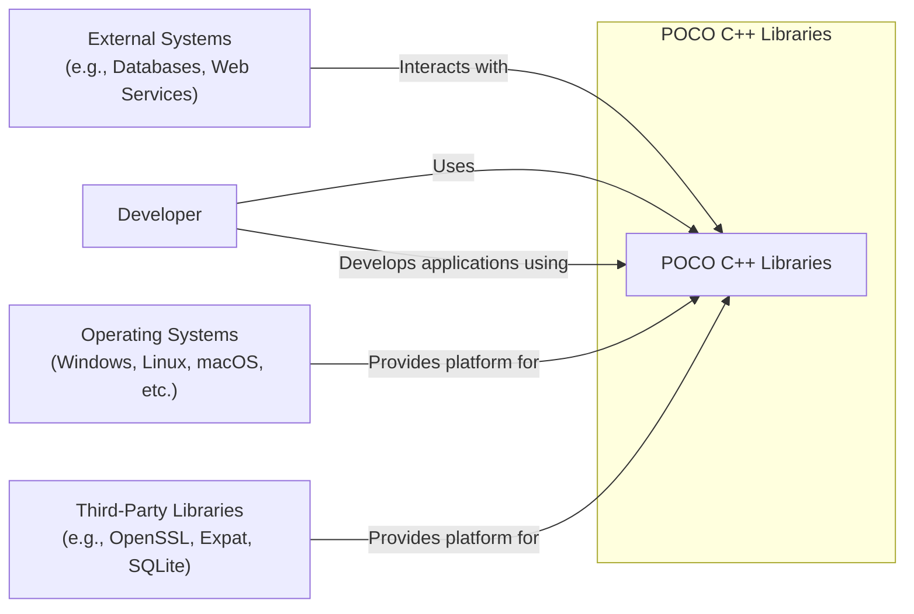
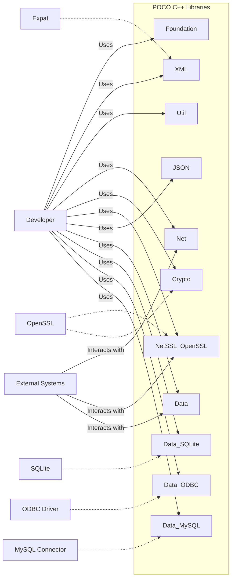
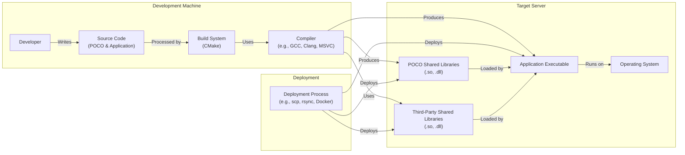
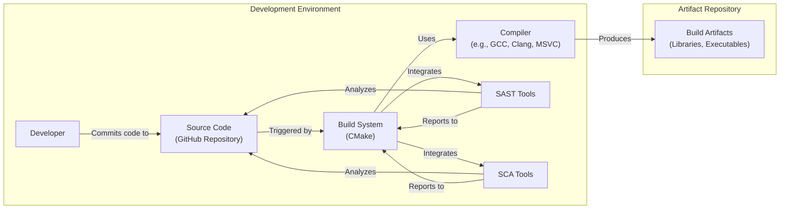

Okay, let's create a design document for the POCO C++ Libraries project.

# BUSINESS POSTURE

Business Priorities and Goals:

*   Provide a comprehensive set of reusable, high-performance C++ libraries.
*   Offer a consistent and intuitive API across different platforms.
*   Reduce development time and effort for C++ developers.
*   Enable the creation of network-centric, portable applications.
*   Maintain a high level of code quality and stability.
*   Foster an active open-source community.

Most Important Business Risks:

*   Security vulnerabilities in the libraries could be exploited in applications built upon them, leading to widespread security breaches.
*   Lack of compatibility with newer C++ standards or operating systems could limit adoption.
*   Performance bottlenecks in the libraries could negatively impact the performance of applications.
*   Insufficient documentation or community support could hinder developer adoption.
*   Competition from other C++ libraries could reduce POCO's market share.
*   Legal issues related to licensing or intellectual property could arise.

# SECURITY POSTURE

Existing Security Controls:

*   security control: Secure coding practices are encouraged within the project, although the extent of formal enforcement is unclear from the repository alone. This would need further investigation.
*   security control: Regular updates and releases address bug fixes and potential security vulnerabilities (as seen in the release history).
*   security control: Use of CMake for build configuration, allowing for some control over compiler flags and security options (CMakeLists.txt files).
*   security control: Some libraries, like Crypto and NetSSL\_OpenSSL, inherently provide security features (cryptography, secure communication).
*   security control: Community involvement in identifying and reporting issues (GitHub Issues).

Accepted Risks:

*   accepted risk: Reliance on third-party libraries (e.g., OpenSSL) introduces a dependency on their security posture.
*   accepted risk: The project's wide range of features and platform support increases the attack surface.
*   accepted risk: The open-source nature of the project means that vulnerabilities, if found, are publicly visible.

Recommended Security Controls:

*   Implement Static Application Security Testing (SAST) into the build process.
*   Implement Dynamic Application Security Testing (DAST) for network-facing components.
*   Conduct regular security audits and penetration testing.
*   Establish a clear vulnerability disclosure and response process.
*   Provide security-focused documentation and best practices for developers using the libraries.
*   Consider Software Composition Analysis (SCA) to manage vulnerabilities in third-party dependencies.
*   Implement fuzz testing to identify unexpected input handling issues.

Security Requirements:

*   Authentication:
    *   The libraries themselves may not directly handle user authentication in many cases, but components like NetSSL\_OpenSSL facilitate secure communication where authentication is managed by protocols like TLS.
    *   Where authentication is relevant (e.g., HTTP servers), standard mechanisms like Basic, Digest, or OAuth should be supported.

*   Authorization:
    *   The libraries should provide mechanisms for implementing authorization checks where appropriate (e.g., access control lists, role-based access control). This is likely to be application-specific, but the libraries should facilitate it.

*   Input Validation:
    *   All input received from external sources (network, files, user input) must be validated to prevent injection attacks, buffer overflows, and other common vulnerabilities. This is crucial for libraries like Net, Util, and XML.
    *   Specific validation requirements will depend on the data type and context.

*   Cryptography:
    *   The Crypto library should use strong, well-vetted cryptographic algorithms and key management practices.
    *   Avoid using deprecated or weak algorithms.
    *   Provide secure random number generation.
    *   Ensure proper handling of cryptographic keys and secrets.

# DESIGN

## C4 CONTEXT

C4 Context Element List:

*   Element:
    *   Name: POCO C++ Libraries
    *   Type: System
    *   Description: A collection of open-source C++ class libraries for building network-centric, portable applications.
    *   Responsibilities: Providing reusable components for networking, data handling, cryptography, XML processing, and more.
    *   Security controls: Secure coding practices, regular updates, use of security-focused libraries (Crypto, NetSSL\_OpenSSL).

*   Element:
    *   Name: Developer
    *   Type: Person
    *   Description: A software developer who uses the POCO C++ Libraries to build applications.
    *   Responsibilities: Writing application code, integrating POCO libraries, ensuring application security.
    *   Security controls: Following secure coding practices, performing security testing, staying informed about POCO security updates.

*   Element:
    *   Name: External Systems
    *   Type: System
    *   Description: External systems that interact with applications built using POCO (e.g., databases, web services).
    *   Responsibilities: Providing data or services to POCO-based applications.
    *   Security controls: Implementing appropriate security measures for their specific functionality (e.g., database security, API authentication).

*   Element:
    *   Name: Operating Systems
    *   Type: System
    *   Description: The underlying operating systems on which POCO-based applications run.
    *   Responsibilities: Providing the execution environment for applications.
    *   Security controls: OS-level security features (e.g., user accounts, file permissions, firewalls).

*   Element:
    *   Name: Third-Party Libraries
    *   Type: System
    *   Description: External libraries that POCO depends on (e.g., OpenSSL, Expat, SQLite).
    *   Responsibilities: Providing specific functionality used by POCO.
    *   Security controls: Relying on the security posture of the third-party library providers.

## C4 CONTAINER

C4 Container Element List:

*   Element:
    *   Name: Foundation
    *   Type: Library
    *   Description: Core utilities and basic building blocks.
    *   Responsibilities: Providing fundamental classes and functions (e.g., strings, collections, threading).
    *   Security controls: Input validation, secure memory management.

*   Element:
    *   Name: XML
    *   Type: Library
    *   Description: Support for XML processing.
    *   Responsibilities: Parsing, manipulating, and generating XML documents.
    *   Security controls: Protection against XML External Entity (XXE) attacks, input validation.

*   Element:
    *   Name: Util
    *   Type: Library
    *   Description: Application-level utilities.
    *   Responsibilities: Configuration file handling, command-line parsing, logging.
    *   Security controls: Secure configuration handling, input validation.

*   Element:
    *   Name: Net
    *   Type: Library
    *   Description: Networking functionality.
    *   Responsibilities: Providing classes for sockets, HTTP, FTP, etc.
    *   Security controls: Input validation, secure socket handling, protection against common network attacks.

*   Element:
    *   Name: Crypto
    *   Type: Library
    *   Description: Cryptographic algorithms and utilities.
    *   Responsibilities: Providing encryption, hashing, digital signatures, etc.
    *   Security controls: Using strong cryptographic algorithms, secure key management.

*   Element:
    *   Name: NetSSL\_OpenSSL
    *   Type: Library
    *   Description: Secure networking using OpenSSL.
    *   Responsibilities: Providing TLS/SSL support for network communication.
    *   Security controls: Secure TLS/SSL configuration, certificate validation.

*   Element:
    *   Name: JSON
    *   Type: Library
    *   Description: Support for JSON processing.
    *   Responsibilities: Parsing, manipulating and generating JSON documents.
    *   Security controls: Input validation.

*   Element:
    *   Name: Data
    *   Type: Library
    *   Description: Unified data access layer.
    *   Responsibilities: Abstracting database access.
    *   Security controls: Parameterized queries to prevent SQL injection, secure connection management.

*   Element:
    *   Name: Data\_SQLite
    *   Type: Library
    *   Description: SQLite database connector.
    *   Responsibilities: Providing access to SQLite databases.
    *   Security controls: Parameterized queries, secure file permissions for database files.

*   Element:
    *   Name: Data\_ODBC
    *   Type: Library
    *   Description: ODBC database connector.
    *   Responsibilities: Providing access to databases via ODBC.
    *   Security controls: Parameterized queries, secure connection management.

*   Element:
    *   Name: Data\_MySQL
    *   Type: Library
    *   Description: MySQL database connector.
    *   Responsibilities: Providing access to MySQL databases.
    *   Security controls: Parameterized queries, secure connection management.

*   Element:
    *   Name: OpenSSL
    *   Type: External Library
    *   Description: Third-party library for cryptography and SSL/TLS.
    *   Responsibilities: Providing cryptographic functions and secure communication.
    *   Security controls: Relies on OpenSSL's security posture; regular updates are crucial.

*   Element:
    *   Name: Expat
    *   Type: External Library
    *   Description: Third-party library for XML parsing.
    *   Responsibilities: Parsing XML documents.
    *   Security controls: Relies on Expat's security posture.

*   Element:
    *   Name: SQLite
    *   Type: External Library
    *   Description: Third-party library for embedded SQL database.
    *   Responsibilities: Providing embedded SQL database engine.
    *   Security controls: Relies on SQLite's security posture.

*   Element:
    *   Name: ODBC Driver
    *   Type: External Library
    *   Description: Third-party library for ODBC database connectivity.
    *   Responsibilities: Providing ODBC database connectivity.
    *   Security controls: Relies on the security posture of the specific ODBC driver.

*   Element:
    *   Name: MySQL Connector
    *   Type: External Library
    *   Description: Third-party library for MySQL database connectivity.
    *   Responsibilities: Providing MySQL database connectivity.
    *   Security controls: Relies on the security posture of the MySQL Connector.

## DEPLOYMENT

Possible Deployment Solutions:

1.  Static Linking: POCO libraries are compiled directly into the application executable.
2.  Dynamic Linking: POCO libraries are compiled as separate shared libraries (DLLs on Windows, .so files on Linux/macOS) that are loaded at runtime.
3.  System-Wide Installation: POCO libraries are installed in a system-wide location (e.g., /usr/lib on Linux) and can be used by multiple applications.
4.  Local Installation: POCO libraries are installed in a project-specific directory and are used only by that project.

Chosen Solution (Dynamic Linking - Local Installation):

This approach offers a good balance between flexibility, ease of updates, and avoiding conflicts with other applications.

Deployment Element List:

*   Element:
    *   Name: Developer
    *   Type: Person
    *   Description: The developer responsible for building and deploying the application.
    *   Responsibilities: Writing code, configuring the build system, deploying the application.
    *   Security controls: Following secure coding and deployment practices.

*   Element:
    *   Name: Source Code
    *   Type: Artifact
    *   Description: The source code of the application and the POCO libraries.
    *   Responsibilities: Containing the application logic and the POCO library code.
    *   Security controls: Secure coding practices, code reviews, version control.

*   Element:
    *   Name: Build System (CMake)
    *   Type: Tool
    *   Description: The build system used to compile the code.
    *   Responsibilities: Managing the build process, configuring compiler options.
    *   Security controls: Using secure compiler flags, enabling security features.

*   Element:
    *   Name: Compiler
    *   Type: Tool
    *   Description: The compiler used to translate the source code into executable code.
    *   Responsibilities: Compiling the code, linking libraries.
    *   Security controls: Using a secure and up-to-date compiler.

*   Element:
    *   Name: Application Executable
    *   Type: Artifact
    *   Description: The compiled application executable.
    *   Responsibilities: Running the application logic.
    *   Security controls: Depends on the security of the application code and the linked libraries.

*   Element:
    *   Name: POCO Shared Libraries
    *   Type: Artifact
    *   Description: The compiled POCO libraries as shared libraries.
    *   Responsibilities: Providing the functionality of the POCO libraries.
    *   Security controls: Depends on the security of the POCO library code.

*   Element:
    *   Name: Third-Party Shared Libraries
    *   Type: Artifact
    *   Description: The compiled third-party libraries as shared libraries.
    *   Responsibilities: Providing the functionality of the third-party libraries.
    *   Security controls: Depends on the security of the third-party library code.

*   Element:
    *   Name: Operating System
    *   Type: System
    *   Description: The target operating system.
    *   Responsibilities: Providing the runtime environment for the application.
    *   Security controls: OS-level security features.

*   Element:
    *   Name: Deployment Process
    *   Type: Process
    *   Description: The method used to transfer the application and libraries to the target server.
    *   Responsibilities: Copying files, configuring the environment.
    *   Security controls: Secure transfer protocols (e.g., SCP, SFTP), secure configuration management.

## BUILD

Build Process Description:

1.  Developer commits code changes to the GitHub repository.
2.  A build system (CMake) is used to configure and manage the build process.  This could be triggered manually or by a CI system (not explicitly defined in the repository, but highly recommended).
3.  CMake configures the build environment, including compiler flags and library dependencies.
4.  The compiler (e.g., GCC, Clang, MSVC) compiles the source code.
5.  *Recommended:* SAST tools are integrated into the build process to analyze the source code for potential security vulnerabilities.
6.  *Recommended:* SCA tools are integrated to analyze dependencies for known vulnerabilities.
7.  The compiler produces build artifacts (libraries, executables).
8.  Build artifacts are stored in an artifact repository (location not specified in the repository, but could be a local directory, a network share, or a dedicated artifact repository like Artifactory).

Security Controls in Build Process:

*   security control: Use of CMake allows for some control over compiler flags and security options.
*   security control: *Recommended:* Integration of SAST tools.
*   security control: *Recommended:* Integration of SCA tools.
*   security control: *Recommended:* Use of a CI/CD system (e.g., GitHub Actions, Jenkins) to automate the build process and enforce security checks.
*   security control: *Recommended:* Code signing of build artifacts to ensure integrity.

# RISK ASSESSMENT

Critical Business Processes:

*   Providing reliable and secure C++ libraries for application development.
*   Maintaining the reputation and trustworthiness of the POCO project.
*   Supporting the developer community using POCO.

Data to Protect:

*   Source code (sensitivity: medium - publicly available, but integrity is crucial).
*   Documentation (sensitivity: low - publicly available).
*   Issue tracker data (sensitivity: low to medium - may contain vulnerability reports).
*   Contributor information (sensitivity: low - publicly available).
*   *Potentially:* User data if POCO libraries are used in applications that handle sensitive data (sensitivity: high - depends on the application). This is *not* data stored directly by POCO, but POCO's security impacts this.

# QUESTIONS & ASSUMPTIONS

Questions:

*   What is the current level of formal security review and testing within the POCO project?
*   Are there any existing CI/CD pipelines used for building and testing the libraries?
*   What is the process for reporting and addressing security vulnerabilities?
*   What are the specific target platforms and compilers officially supported?
*   Are there any plans to adopt newer C++ standards (C++20, C++23)?
*   Is there a specific artifact repository used for storing build artifacts?
*   What is the long-term strategy for managing dependencies on third-party libraries?

Assumptions:

*   BUSINESS POSTURE: The POCO project prioritizes providing high-quality, reliable libraries, but may have limited resources for dedicated security efforts.
*   SECURITY POSTURE: Secure coding practices are encouraged but not rigorously enforced. There is reliance on community contributions for security improvements.
*   DESIGN: The design is modular and well-structured, facilitating maintainability and security updates. The use of third-party libraries is a known risk factor. The deployment process is assumed to be manual or semi-automated, without a dedicated CI/CD pipeline in place (although this is highly recommended).