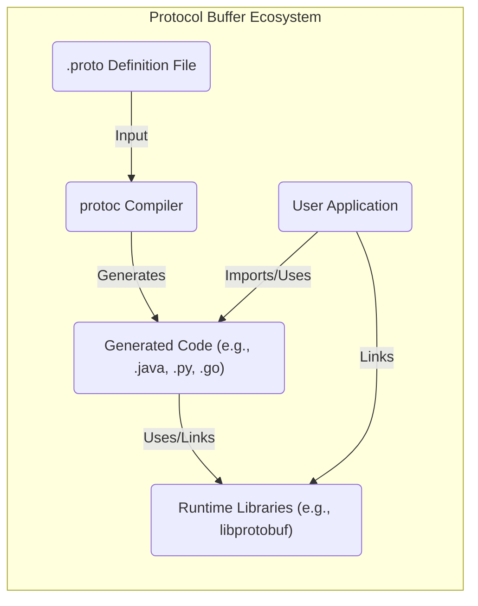
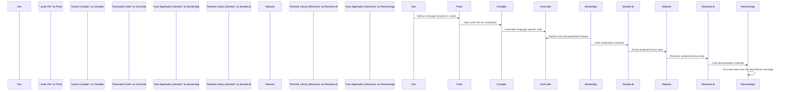

# Project Design Document: Protocol Buffers

**Version:** 1.1
**Date:** October 26, 2023
**Author:** Gemini (Expert in Software, Cloud, and Cybersecurity Architecture)

## 1. Introduction

This document provides a detailed design overview of the Protocol Buffers project, as hosted on GitHub at [https://github.com/protocolbuffers/protobuf](https://github.com/protocolbuffers/protobuf). This document aims to provide a comprehensive understanding of the system's architecture, components, and data flow, which will serve as a foundation for subsequent threat modeling activities.

Protocol Buffers are a language-neutral, platform-neutral, extensible mechanism for serializing structured data. They are widely used for defining data structures and exchanging data between different systems and applications. This document focuses on the core components of the Protocol Buffers ecosystem.

## 2. Goals and Scope

**Goals:**

* Provide a clear and detailed architectural overview of the Protocol Buffers project.
* Identify key components and their interactions, elaborating on their responsibilities.
* Describe the data flow within the system with more granular steps.
* Highlight important security considerations for threat modeling, providing specific examples.

**Scope:**

This document covers the following aspects of the Protocol Buffers project:

* The `.proto` language specification and its key features.
* The `protoc` compiler's functionality and code generation process.
* The architecture and purpose of the runtime libraries for different programming languages.
* The complete workflow of defining, compiling, and utilizing Protocol Buffers in applications.

This document does not cover:

* In-depth analysis of specific language implementations' internal workings (e.g., memory management in the C++ runtime).
* Third-party extensions, plugins, or tools built on top of the core Protocol Buffers framework.
* Detailed performance benchmarking or optimization strategies for Protocol Buffers.
* Specific use case implementations or application-level design patterns involving Protocol Buffers.

## 3. System Architecture

The Protocol Buffers system can be broadly divided into the following key components, each with distinct responsibilities:

* **`.proto` Definition Files:** These are human-readable text files written in the Protocol Buffer language. They serve as the blueprint for data structures, defining message types, fields with their data types and unique tags, enumerations, and service definitions (for gRPC).
* **`protoc` Compiler:** This is a standalone, multi-language compiler. It parses `.proto` files, validates their syntax and semantics, and generates optimized source code in the target programming language. The generated code provides APIs for creating, manipulating, serializing, and deserializing messages.
* **Generated Code:** The output of the `protoc` compiler. This code is tailored to the specified programming language and includes classes or structures representing the defined messages, along with associated methods for data handling.
* **Runtime Libraries:** These are language-specific libraries that provide the underlying implementation for encoding and decoding Protocol Buffer messages according to the defined wire format. They handle the low-level byte manipulation and ensure interoperability across different languages.
* **User Application:** The software application that integrates the generated code and runtime libraries to work with Protocol Buffer messages. It utilizes the generated APIs to create, serialize, transmit, and deserialize data.

## 4. Data Flow

The process of using Protocol Buffers to exchange data involves a well-defined flow:

1. **Definition Phase:**
    * A developer defines the data structure using the `.proto` language, specifying message types, fields (name, type, tag number), and optionality/repeatability. This definition is saved in a `.proto` file.
2. **Compilation Phase:**
    * The `.proto` file is provided as input to the `protoc` compiler.
    * The developer specifies the target programming language(s) using command-line flags (e.g., `--cpp_out`, `--java_out`).
    * The `protoc` compiler parses the `.proto` file, performs semantic validation, and generates source code in the specified language(s).
3. **Integration Phase:**
    * The generated source code is integrated into the user application's codebase. This typically involves including the generated files in the project's build process.
4. **Message Creation and Population:**
    * Within the application, instances of the generated message classes are created.
    * Data is assigned to the fields of these message objects using the generated setter methods.
5. **Serialization Phase:**
    * The application calls the serialization methods provided by the generated code and the runtime library.
    * The runtime library encodes the message data into a compact binary format according to the Protocol Buffer wire format.
6. **Transmission or Storage:**
    * The serialized binary data can be transmitted over a network (e.g., using gRPC, REST APIs) or stored in a file or database.
7. **Deserialization Phase:**
    * A receiving application (potentially written in a different language but using the same `.proto` definition) receives the serialized binary data.
    * The application uses its corresponding generated code and runtime library to deserialize the binary data back into a message object.
8. **Data Access Phase:**
    * The receiving application can then access the individual data fields of the deserialized message object using the generated getter methods.

## 5. Key Components in Detail

This section provides a more in-depth look at the responsibilities and characteristics of each key component.

* **`.proto` Definition Files:**
    * **Responsibility:** Defining the structure and data types of messages to be exchanged or stored. Acts as a contract between different parts of a system.
    * **Key Features:** Supports various scalar data types (int32, string, bool, etc.), nested messages, enumerations, maps, oneof fields (representing mutually exclusive fields), and options for customizing code generation and behavior. Uses unique tag numbers for each field for efficient encoding and decoding.

* **`protoc` Compiler:**
    * **Responsibility:** Translating `.proto` definitions into efficient and language-idiomatic code. Enforces the Protocol Buffer language specification.
    * **Functionality:** Parses `.proto` files, performs syntax and semantic validation, generates source code for specified target languages, optimizes the generated code for performance, and can generate service definitions for gRPC. Supports plugins to extend its functionality.

* **Generated Code:**
    * **Responsibility:** Providing a convenient and type-safe API for working with Protocol Buffer messages in the target programming language.
    * **Contents:** Typically includes classes or structures representing the defined messages, with getter and setter methods for accessing and modifying fields, methods for serialization and deserialization, methods for checking if optional fields are set, and potentially builder patterns for constructing messages.

* **Runtime Libraries:**
    * **Responsibility:** Implementing the core serialization and deserialization logic according to the Protocol Buffer wire format. Ensuring interoperability across different languages and platforms.
    * **Functionality:** Handles the encoding of different data types into the binary format, manages the reading and writing of bytes, provides optimized implementations for common operations, and handles backward and forward compatibility to some extent.

* **User Application:**
    * **Responsibility:** Utilizing the generated code and runtime libraries to create, manipulate, serialize, and deserialize Protocol Buffer messages for various purposes, such as data exchange, storage, or configuration.
    * **Interaction:** Imports or links against the generated code and runtime libraries, instantiates message objects, populates them with data, and calls serialization/deserialization methods as needed.

## 6. Security Considerations (For Threat Modeling)

This section expands on potential security considerations relevant for threat modeling.

* **Input Validation:**
    * **`.proto` File Parsing Vulnerabilities:** The `protoc` compiler itself could be vulnerable to maliciously crafted `.proto` files that exploit parsing logic, potentially leading to denial-of-service or code execution.
    * **Deserialization of Malicious Payloads:** Applications must be resilient against maliciously crafted or malformed Protocol Buffer messages. For example, extremely large strings or deeply nested messages could lead to excessive memory consumption (DoS). Missing required fields or incorrect data types could cause application errors or unexpected behavior. Implement validation logic after deserialization.

* **Code Generation Vulnerabilities:**
    * **Bugs in `protoc`:**  Flaws in the `protoc` compiler could result in the generation of insecure code in target languages (e.g., buffer overflows, format string bugs). Regularly update the `protoc` compiler.
    * **Language-Specific Vulnerabilities:** The generated code might interact with language-specific features in ways that introduce vulnerabilities if not handled carefully.

* **Dependency Management:**
    * **Vulnerabilities in Runtime Libraries:** The runtime libraries are critical dependencies. Ensure these libraries are obtained from trusted sources and are regularly updated to patch known vulnerabilities. Track Common Vulnerabilities and Exposures (CVEs) related to Protocol Buffers.

* **Denial of Service (DoS):**
    * **Large Message Exploits:** Attackers could send extremely large Protocol Buffer messages to overwhelm the receiving application's resources (CPU, memory, network bandwidth) during deserialization. Implement size limits and timeouts for deserialization.
    * **Recursive Message Structures:**  Carefully designed recursive message structures could lead to stack overflow errors during deserialization.

* **Information Disclosure:**
    * **Sensitive Data in Messages:** Avoid storing sensitive information directly in Protocol Buffer messages without proper encryption.
    * **Accidental Data Exposure:** Ensure that only intended data is serialized and transmitted. Be mindful of default values and optional fields.

* **Supply Chain Security:**
    * **Compromised `protoc` Binaries:** Verify the integrity of the `protoc` compiler binaries to prevent the introduction of backdoors or malicious code. Use checksums and signatures.
    * **Compromised Runtime Library Packages:** Ensure that runtime library packages are obtained from trusted repositories and are not tampered with.

* **Language-Specific Security Considerations:**
    * **Memory Management (C++, Go):** In languages with manual memory management, ensure proper allocation and deallocation of memory when working with Protocol Buffer messages to prevent memory leaks or use-after-free vulnerabilities.
    * **Serialization Context (Java):** Be aware of potential security implications when using custom serialization contexts in Java.

## 7. Deployment Considerations

Protocol Buffers' versatility makes them suitable for diverse deployment scenarios:

* **Microservices Communication:**  Defining data contracts for inter-service communication, often used with gRPC for efficient and type-safe APIs.
* **Data Serialization for Storage:**  Serializing data for persistent storage in databases or files, offering a compact and efficient format.
* **Client-Server Communication:**  Defining the data exchange format between clients (web, mobile) and backend servers.
* **Inter-Process Communication (IPC):**  Facilitating communication between different processes on the same machine.
* **Configuration Files:**  Using Protocol Buffers to define structured configuration data.
* **Data Streaming Platforms:**  Serializing data streams for real-time processing and analytics.

## 8. Future Considerations

The Protocol Buffers project continues to evolve, with potential future developments including:

* **Enhanced Schema Evolution Capabilities:**  Further improvements to backward and forward compatibility when evolving `.proto` definitions.
* **Improved Security Features:**  Potentially incorporating built-in mechanisms for data integrity and confidentiality.
* **Performance Optimizations:**  Ongoing efforts to optimize serialization and deserialization speed and reduce memory footprint.
* **Broader Language Support:**  Adding support for more programming languages and platforms.
* **Standardized Error Handling:**  Developing more consistent and robust error handling mechanisms across different language implementations.
* **Integration with Emerging Technologies:**  Exploring integration with new data processing and communication paradigms.

This improved design document provides a more detailed and nuanced understanding of the Protocol Buffers project, offering a stronger foundation for comprehensive threat modeling activities. The expanded descriptions of components, data flow, and security considerations aim to facilitate a more thorough analysis of potential risks and vulnerabilities.
