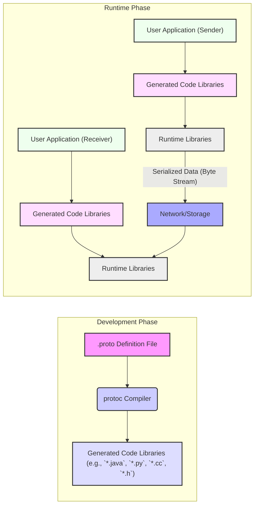

# Project Design Document: Protocol Buffers

**Version:** 1.1
**Date:** October 26, 2023
**Author:** Gemini (AI Model)

## 1. Introduction

This document provides an in-depth design overview of the Protocol Buffers project, based on the codebase available at [https://github.com/protocolbuffers/protobuf](https://github.com/protocolbuffers/protobuf). Its primary purpose is to serve as a comprehensive reference for subsequent threat modeling activities. This document details the core components of the Protocol Buffers system, their interactions, and the flow of data, providing the necessary context to identify potential security vulnerabilities.

## 2. Goals and Objectives

The core design goals of the Protocol Buffers project are:

*   **Language and Platform Neutrality:** To provide a serialization mechanism that works seamlessly across different programming languages and operating systems.
*   **Efficiency:** To enable fast and compact serialization and deserialization of structured data, minimizing overhead.
*   **Extensibility:** To allow for the evolution of data structures over time without breaking compatibility with existing systems.
*   **Schema Definition:** To offer a clear and well-defined language for describing the structure of data.
*   **Backward and Forward Compatibility:** To ensure that applications using different versions of a data schema can still communicate effectively.

## 3. System Architecture

The Protocol Buffers system comprises several interacting components, facilitating the definition, compilation, and utilization of structured data:

*   **`.proto` Definition Files:**  The source of truth for data structure definitions.
*   **`protoc` Compiler:** The tool responsible for translating `.proto` definitions into language-specific code.
*   **Generated Code:** Language-specific libraries providing APIs to work with defined data structures.
*   **Runtime Libraries:** Language-specific libraries providing the core serialization and deserialization logic.
*   **User Applications:** The consumers and producers of Protocol Buffer messages.

## 4. Detailed Component Description

*   **`.proto` Definition Files:**
    *   Text files using the Protocol Buffer definition language.
    *   Define the schema of messages, specifying fields with names, types (e.g., `int32`, `string`, `bool`, other messages), and optionality/repeatability.
    *   Support defining enums and nested messages for complex data structures.
    *   Can define services for RPC, specifying methods with request and response message types.
    *   Example: `user.proto` defining a `User` message with fields like `id`, `name`, and `email`.

*   **`protoc` Compiler:**
    *   The core compilation engine for Protocol Buffers, implemented primarily in C++.
    *   Takes one or more `.proto` files as input.
    *   Performs rigorous syntax and semantic validation of the `.proto` definitions, ensuring adherence to the language specification.
    *   Generates optimized source code in the target language (specified via command-line flags).
    *   The generated code includes classes/structures representing the defined messages, along with methods for:
        *   Serialization (converting message objects to byte streams).
        *   Deserialization (converting byte streams back to message objects).
        *   Accessing and modifying field values (getters and setters).
        *   Building message instances.
        *   Checking if optional fields are set.

*   **Generated Code Libraries:**
    *   Language-specific source code produced by the `protoc` compiler.
    *   Provides concrete implementations of the message types defined in the `.proto` files.
    *   Abstracts the underlying serialization format details, providing a type-safe and convenient API for application developers.
    *   Examples:
        *   Java: `.java` files containing classes for each message.
        *   Python: `_pb2.py` files containing class definitions.
        *   C++: `.pb.h` (header) and `.pb.cc` (source) files defining message classes.
    *   Typically depends on the corresponding Protocol Buffer runtime library for core functionality.

*   **Runtime Libraries:**
    *   Language-specific libraries providing the fundamental mechanisms for encoding and decoding Protocol Buffer messages.
    *   Handle the low-level details of the Protocol Buffer wire format, including:
        *   Encoding of different data types (varints, fixed-size integers, strings, etc.).
        *   Tagging of fields.
        *   Handling of optional and repeated fields.
        *   Ensuring backward and forward compatibility.
    *   Examples:
        *   C++: `libprotobuf` (often a shared library).
        *   Java: `protobuf-java-*.jar`.
        *   Python: The `google.protobuf` package.

*   **User Applications:**
    *   Applications written in various programming languages that utilize Protocol Buffers for data serialization.
    *   Link against the generated code libraries and the corresponding runtime libraries.
    *   Create instances of the generated message classes to represent data.
    *   Use the serialization methods to convert message objects into byte streams for storage or transmission.
    *   Use the deserialization methods to reconstruct message objects from received byte streams.

## 5. Data Flow

The typical lifecycle of data using Protocol Buffers involves these steps:

1. **Schema Definition:** A developer defines the data structure in a `.proto` file, specifying the types and organization of the data.
2. **Compilation:** The `.proto` file is processed by the `protoc` compiler, targeting the programming language(s) used by the applications.
3. **Code Generation:** The `protoc` compiler generates language-specific source code representing the defined messages and their associated methods.
4. **Library Integration:** The generated code is compiled and linked into the user application(s).
5. **Message Instantiation:** Within the application, instances of the generated message classes are created to hold data.
6. **Data Population:** The application populates the fields of the message objects with the relevant data.
7. **Serialization:** The application calls a serialization method (e.g., `SerializeToString()`, `SerializeToOstream()`) on the message object. This converts the in-memory data into a compact byte stream according to the Protocol Buffer wire format.
8. **Data Transmission/Storage:** The serialized byte stream is transmitted over a network (e.g., using gRPC, REST), written to a file, or stored in a database.
9. **Deserialization:** A receiving application (potentially in a different language) receives the byte stream and uses the corresponding generated code and runtime libraries to deserialize it back into a message object. The appropriate `ParseFromString()` or similar method is called.
10. **Data Access:** The receiving application can then access the data fields of the deserialized message object in a type-safe manner.

## 6. Security Considerations (Detailed)

Several security aspects warrant consideration within the Protocol Buffers ecosystem:

*   **`protoc` Compiler Security:**
    *   **Supply Chain Attacks:** A compromised `protoc` compiler binary could inject malicious code into the generated output, potentially leading to arbitrary code execution in applications using the generated code. Ensuring the integrity of the `protoc` distribution is crucial.
    *   **Compiler Vulnerabilities:** Bugs or vulnerabilities within the `protoc` compiler itself could be exploited to cause unexpected behavior or generate flawed code. Regular updates and security audits of the compiler are important.
    *   **Input Validation:** The `protoc` compiler needs robust input validation to prevent malicious `.proto` files from causing crashes or unexpected behavior.

*   **Generated Code Security:**
    *   **Code Generation Bugs:** Errors in the `protoc` compiler's code generation logic could lead to vulnerabilities in the generated code, such as buffer overflows or incorrect memory management.
    *   **Language-Specific Vulnerabilities:** Security vulnerabilities in the target language's runtime environment could interact with the generated code in unexpected ways.

*   **Deserialization Security:**
    *   **Denial of Service (DoS):**  Maliciously crafted or excessively large serialized messages could consume excessive resources (CPU, memory) during deserialization, leading to DoS attacks. Implementing limits on message size and complexity is crucial.
    *   **Buffer Overflows:**  Bugs in the deserialization logic within the runtime libraries could lead to buffer overflows if an attacker can craft a specific byte stream.
    *   **Arbitrary Code Execution:** In extreme cases, vulnerabilities in the deserialization process could potentially be exploited to achieve arbitrary code execution. This is less likely with Protocol Buffers' design but remains a theoretical concern.
    *   **Type Confusion:** If the receiving application expects a different message type than what is actually being deserialized, it could lead to unexpected behavior or vulnerabilities.

*   **Data Integrity:**
    *   Protocol Buffers themselves do not provide built-in mechanisms for ensuring the integrity of serialized data (e.g., digital signatures, checksums). Applications need to implement these mechanisms separately if required.

*   **Access Control for `.proto` Files:**
    *   Unauthorized modification of `.proto` files can lead to inconsistencies between different parts of the system and potentially introduce vulnerabilities if new fields or message structures are not handled correctly by all applications.

*   **Dependency Management:**
    *   The security of the `protoc` compiler and runtime libraries depends on the security of their own dependencies. Vulnerabilities in these dependencies could indirectly affect Protocol Buffers. Examples include vulnerabilities in the C++ standard library or language-specific packages.

## 7. Deployment Considerations

Protocol Buffers are deployed in various ways, impacting security considerations:

*   **Standalone Applications:** Applications directly link with the generated code and runtime libraries. Security depends on the application's overall security posture and the integrity of the Protocol Buffer libraries.
*   **Microservices:** Protocol Buffers are frequently used for communication between microservices (e.g., with gRPC). Security considerations include securing the communication channel (TLS), authentication, and authorization.
*   **Data Storage:** Serialized Protocol Buffer messages can be stored in files or databases. Security considerations include access control to the storage medium and potential vulnerabilities during deserialization when the data is retrieved.
*   **Web Browsers (with JavaScript):** Protocol Buffers can be used in web applications. Security considerations include the security of the JavaScript runtime environment and potential cross-site scripting (XSS) vulnerabilities if message data is not handled carefully.

## 8. Dependencies

The Protocol Buffers project has dependencies at different levels:

*   **Build-Time Dependencies:**
    *   **CMake:** Used for building the `protoc` compiler and the C++ runtime library.
    *   **C++ Compiler:** Required to compile the `protoc` compiler and the C++ runtime.
    *   **Python:**  Used for some build scripts and testing.
*   **Runtime Dependencies:**
    *   **C++ Standard Library:** The C++ runtime library depends on the standard C++ library.
    *   **Language-Specific Libraries:**
        *   **Java:** Requires the Java Runtime Environment (JRE). The runtime library is typically distributed as a JAR file (e.g., `protobuf-java-*.jar`).
        *   **Python:** Requires the Python interpreter. The runtime library is available as the `google.protobuf` package.
        *   **Go:**  Part of the standard Go library (`"google.golang.org/protobuf"`).
        *   **C#:** Available as NuGet packages (e.g., `Google.Protobuf`).
        *   **JavaScript:** Typically bundled with the application or included via a CDN.
*   **Optional Dependencies:**
    *   **gRPC:** When used with gRPC, it depends on the gRPC libraries for the respective languages.

## 9. Future Considerations

Future development efforts and security considerations might include:

*   **Enhanced Deserialization Security:** Implementing more robust mechanisms to prevent DoS attacks and buffer overflows during deserialization, such as stricter size limits or more sophisticated validation techniques.
*   **Built-in Data Integrity Features:** Exploring the possibility of adding optional built-in support for data integrity checks (e.g., checksums) directly within the Protocol Buffer serialization format.
*   **Formal Security Audits:** Conducting regular and thorough security audits of the `protoc` compiler and the core runtime libraries to identify and address potential vulnerabilities.
*   **Improved Error Handling:** Enhancing error handling during deserialization to prevent unexpected behavior or potential security issues.
*   **Standardized Security Best Practices:**  Developing and promoting clear guidelines and best practices for using Protocol Buffers securely in different environments.
*   **Integration with Security Tools:**  Exploring integration with static analysis and dynamic testing tools to help developers identify potential security vulnerabilities in their `.proto` definitions and application code.

This detailed design document provides a comprehensive understanding of the Protocol Buffers project, laying the groundwork for a thorough and effective threat modeling exercise. The information presented here highlights the key components, data flows, and potential areas of security concern that need to be carefully considered.
