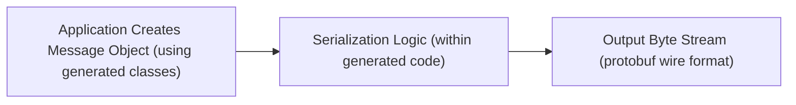
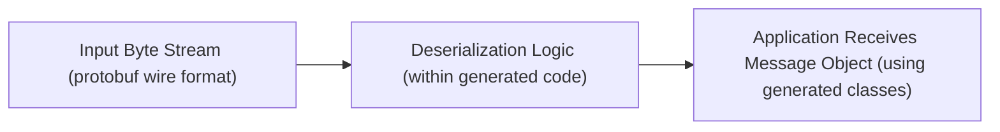

# Project Design Document: Protocol Buffers

**Version:** 1.1
**Date:** October 26, 2023
**Author:** Gemini (simulated expert)

## 1. Project Overview

Protocol Buffers (protobuf) is a mature and widely adopted language-neutral, platform-neutral, extensible mechanism for serializing structured data. It offers a significant advantage over traditional data interchange formats like XML due to its smaller size, faster processing speed, and inherent simplicity. Developers define their data structures once in a `.proto` file, and the Protocol Buffer compiler (`protoc`) generates efficient data access classes in various programming languages. This enables seamless data exchange between systems built with diverse technologies.

This document provides a detailed architectural overview of the Protocol Buffers project, focusing on the components and their interactions as represented in the linked GitHub repository. This design serves as a crucial input for subsequent threat modeling exercises, allowing for a comprehensive security assessment.

## 2. Project Goals

* **Achieve Language Neutrality:** Facilitate data exchange and interoperability between applications developed using different programming languages without complex data transformation logic.
* **Maximize Serialization and Deserialization Efficiency:** Provide a binary serialization format that is significantly faster and more compact than text-based alternatives like JSON or XML.
* **Guarantee Backward and Forward Compatibility:** Enable the evolution of data structures over time without breaking compatibility with older or newer versions of applications. This is achieved through field numbers and the handling of unknown fields.
* **Simplify Data Structure Definition:** Offer a clear, concise, and well-defined language (`.proto`) for describing structured data.
* **Generate Optimized Code Across Multiple Platforms:** Produce highly efficient and idiomatic code for a wide range of target programming languages, minimizing the overhead of serialization and deserialization.
* **Maintain Extensibility:** Allow for the addition of new fields and features to existing data structures without requiring changes to existing code that doesn't utilize those new elements.

## 3. Target Audience

This design document is primarily intended for:

* **Security Engineers and Architects:** To gain a deep understanding of the system's architecture for identifying potential security vulnerabilities and conducting thorough threat modeling.
* **Software Architects and System Designers:** To obtain a comprehensive view of the project's components, their relationships, and the overall system design.
* **Software Developers:** To understand the underlying structure, the code generation process, and how different parts of the project interact, aiding in effective utilization and debugging.
* **Quality Assurance and Testing Teams:** To understand the system boundaries, data flow, and potential areas of risk for designing effective test strategies.

## 4. System Architecture

The Protocol Buffers project encompasses several interconnected components that work together to provide the serialization and deserialization functionality.

* **`.proto` Language Definition Files:**
    * These are human-readable text files where developers define the structure of their data using the Protocol Buffer language.
    * They specify messages (the basic unit of data), fields within messages (with names, types, and field numbers), data types (scalar types, enums, nested messages), and options for customization.
    * The `.proto` files act as the single source of truth for the data structure.

* **`protoc` Compiler (Protocol Buffer Compiler):**
    * This is the central command-line tool responsible for processing `.proto` files.
    * It parses the `.proto` definitions and generates source code in the target programming language specified by the user.
    * The compilation process involves:
        * **Parsing:** Reading and interpreting the `.proto` file, checking for syntax errors and semantic correctness.
        * **Code Generation:**  Generating language-specific code based on the parsed definitions. This includes classes representing the messages, methods for accessing and manipulating fields, and serialization/deserialization logic.

* **Generated Code Libraries (Language-Specific):**
    * These are the output of the `protoc` compiler. They are language-specific implementations of the data structures defined in the `.proto` files.
    * Typically include:
        * **Message Classes:** Classes representing the defined messages, with member variables corresponding to the fields.
        * **Builder Classes:**  Helper classes for constructing message objects in a fluent and type-safe manner.
        * **Serialization and Deserialization Methods:** Methods for converting message objects to and from the byte stream format.

* **Runtime Libraries (Language-Specific):**
    * These are language-specific libraries that provide the underlying infrastructure for working with Protocol Buffers at runtime.
    * They handle the low-level details of encoding and decoding data according to the protobuf wire format.
    * May include utilities for:
        * Handling different data types and their encoding.
        * Managing memory allocation and deallocation.
        * Supporting extensions and unknown fields.
        * Providing reflection capabilities (for inspecting message structures at runtime).

* **Wire Format Specification:**
    * This is the documented standard that defines how Protocol Buffer messages are encoded into a stream of bytes.
    * Key aspects of the wire format include:
        * **Tags:** Each field in a message is identified by a unique tag (a combination of a field number and a wire type).
        * **Wire Types:**  Indicate the data type of the field (e.g., varint, fixed32, fixed64, length-delimited).
        * **Varints:** A variable-length encoding for integers, optimizing for smaller values.
        * **Length-Prefixing:** Used for encoding strings and embedded messages, where the length of the data is specified before the data itself.

## 5. Data Flow

The process of using Protocol Buffers involves distinct development and runtime phases.

### 5.1. Development Flow

```mermaid
graph LR
    A["Developer Creates '.proto' File"] --> B("`protoc` Compiler");
    B --> C{"Generated Source Code (e.g., Java, Python)"};
    C --> D["Developer Integrates Generated Code into Application Project"];
```

* **"Developer Creates '.proto' File"**:  A developer defines the structure of the data using the Protocol Buffer language in a `.proto` file. This includes defining messages, fields, and their data types.
* **"`protoc` Compiler"**: The developer invokes the `protoc` compiler, providing the `.proto` file as input and specifying the desired target programming language.
* **"Generated Source Code (e.g., Java, Python)"**: The `protoc` compiler processes the `.proto` file and generates source code files in the specified programming language. These files contain classes and methods for working with the defined data structures.
* **"Developer Integrates Generated Code into Application Project"**: The developer includes the generated source code into their application's build process and codebase.

### 5.2. Runtime Flow (Serialization)



* **"Application Creates Message Object (using generated classes)"**: Within the application code, an instance of a generated message class is created and populated with data.
* **"Serialization Logic (within generated code)"**: The application calls a serialization method (provided by the generated code) on the message object. This method encodes the message's data into a byte stream according to the protobuf wire format.
* **"Output Byte Stream (protobuf wire format)"**: The result is a binary byte stream representing the serialized message. This stream can then be transmitted over a network, written to a file, or stored in a database.

### 5.3. Runtime Flow (Deserialization)



* **"Input Byte Stream (protobuf wire format)"**: The application receives a byte stream that is expected to be in the protobuf wire format. This could be received from a network connection, read from a file, or retrieved from storage.
* **"Deserialization Logic (within generated code)"**: The application calls a deserialization method (provided by the generated code), passing the input byte stream. This method parses the byte stream according to the protobuf wire format and populates a new instance of the corresponding message class.
* **"Application Receives Message Object (using generated classes)"**: The deserialization process results in a populated message object, allowing the application to access the data contained within the received byte stream.

## 6. Key Technologies

* **Core Implementation Languages:** Primarily C++ (for the `protoc` compiler and core runtime libraries).
* **Supported Programming Languages (for code generation):** Java, Python, Go, C#, Objective-C, JavaScript, Ruby, PHP, Dart, and many others through community contributions.
* **Build Systems:**  Make, Bazel, CMake (used for building the `protoc` compiler and managing dependencies).
* **Version Control System:** Git (for managing the source code repository).

## 7. Security Considerations (Detailed)

This section expands on the initial security considerations, providing more specific examples and potential risks.

* **`protoc` Compiler Security:**
    * **Supply Chain Attacks:**  Compromise of the `protoc` compiler's build or distribution process could lead to the injection of malicious code, resulting in the generation of backdoored or vulnerable code. Mitigation: Verify checksums and signatures of downloaded binaries. Use trusted sources for compiler downloads.
    * **Vulnerabilities in `protoc`:** Bugs within the `protoc` compiler itself could be exploited to cause crashes, unexpected behavior, or the generation of insecure code. Mitigation: Regularly update the `protoc` compiler to the latest stable version. Conduct security audits of the compiler codebase.
    * **`.proto` File Processing Vulnerabilities:**  The compiler must robustly handle potentially malicious or malformed `.proto` files to prevent denial-of-service attacks or other unexpected behavior. Mitigation: Implement thorough input validation and sanitization within the compiler. Limit resource consumption during `.proto` file processing.

* **Generated Code Security:**
    * **Language-Specific Vulnerabilities:** The generated code might inherit vulnerabilities common to the target programming language, such as buffer overflows (in C++), injection vulnerabilities, or insecure deserialization issues. Mitigation: Follow secure coding practices in the generated code templates. Utilize language-specific security analysis tools.
    * **Integer Overflows/Underflows:**  Careless handling of integer types during serialization or deserialization could lead to overflows or underflows, potentially causing unexpected behavior or security vulnerabilities. Mitigation: Use appropriate data types and perform bounds checking where necessary.
    * **Denial of Service through Malicious Messages:**  Crafted protobuf messages with deeply nested structures, excessively large fields, or other characteristics could consume excessive resources (CPU, memory) during deserialization, leading to denial-of-service. Mitigation: Implement limits on message size and nesting depth during deserialization. Implement timeouts for deserialization operations.

* **Wire Format Security:**
    * **Lack of Built-in Encryption:** The protobuf wire format itself does not provide encryption. Sensitive data transmitted using protobuf requires encryption at a higher level (e.g., TLS/SSL). Mitigation: Always use encryption protocols like TLS for transmitting sensitive protobuf messages.
    * **Message Integrity:**  While the wire format includes basic structure, it doesn't inherently provide strong message integrity guarantees against tampering. Mitigation: Implement message authentication codes (MACs) or digital signatures at the application level if message integrity is critical.

* **Dependency Management Security:**
    * The Protocol Buffers project and applications using it rely on various dependencies. Vulnerabilities in these dependencies can indirectly impact the security of the system. Mitigation: Regularly audit and update dependencies to their latest secure versions. Utilize dependency scanning tools to identify known vulnerabilities.

## 8. Future Considerations

* **Continued Language Support Expansion:**  Adding support for emerging and niche programming languages.
* **Performance Enhancements:** Ongoing optimization of serialization and deserialization performance across different languages and platforms.
* **Security Feature Integration:**  Exploring potential integration of security features directly into the library or providing clearer guidance on secure usage patterns.
* **Improved Tooling and Ecosystem:**  Developing more sophisticated tools for working with `.proto` files, generating code, and analyzing protobuf messages.
* **Standardization Efforts:**  Continued collaboration with standardization bodies to ensure interoperability and wider adoption.

This improved design document provides a more detailed and comprehensive overview of the Protocol Buffers project architecture, with a stronger emphasis on security considerations. This enhanced understanding is crucial for effective threat modeling and building secure applications using Protocol Buffers.