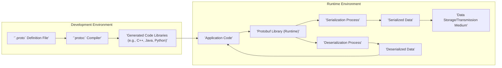

## Project Design Document: Protocol Buffers (protobuf) for Threat Modeling

**Project Name:** Protocol Buffers (protobuf)

**Project Repository:** [https://github.com/protocolbuffers/protobuf](https://github.com/protocolbuffers/protobuf)

**Document Version:** 1.1

**Date:** 2023-10-27

**Author:** AI Software Architect

**1. Introduction**

This document provides a detailed design overview of the Protocol Buffers (protobuf) project, specifically tailored for threat modeling and security analysis. It aims to clearly articulate the system's architecture, key components, data flow, and trust boundaries. This document will serve as a crucial input for subsequent threat modeling exercises, enabling the identification of potential security threats, vulnerabilities, and attack vectors within the protobuf ecosystem and its usage in applications.

**1.1. Project Overview**

Protocol Buffers (protobuf) is a powerful and widely adopted serialization mechanism developed by Google. It offers a language-neutral, platform-neutral, and extensible way to serialize structured data.  Protobuf excels in scenarios requiring efficient data exchange, such as inter-service communication, data storage, and data streaming. The core workflow involves defining data schemas using the Protocol Buffer Language (in `.proto` files), compiling these schemas with the `protoc` compiler to generate language-specific code, and then utilizing the generated libraries within applications for serialization and deserialization operations. This design promotes interoperability, performance, and schema evolution.

**1.2. Document Goals**

This document aims to:

*   Provide a clear and comprehensive architectural overview of the protobuf system.
*   Identify key components and their interactions within the protobuf ecosystem.
*   Map the data flow through the system, from schema definition to data usage.
*   Define critical trust boundaries to pinpoint areas of potential security concern.
*   Outline high-level security considerations relevant to protobuf and its applications.
*   Serve as a foundation for conducting thorough threat modeling and risk assessment.

**1.3. Target Audience**

This document is intended for:

*   Security architects and engineers responsible for threat modeling and security assessments of systems using protobuf.
*   Software developers using protobuf who need to understand its security implications.
*   DevOps and infrastructure teams deploying and managing applications that rely on protobuf.
*   Anyone seeking a detailed understanding of the protobuf architecture from a security perspective.

**2. System Architecture**

The following diagram illustrates the high-level architecture of the protobuf system, encompassing both development and runtime phases.

**3. Component Description**

This section provides a detailed description of each component within the protobuf architecture, emphasizing its functionality and security relevance.

*   **'`.proto` Definition File'**:
    *   **Description:**  A plain text file written in the Protocol Buffer Language (protobuf IDL). It defines the structure of messages, services, and enumerations. It specifies data types, field names, tags, and optionality/requiredness.  This file acts as the single source of truth for data schema.
    *   **Security Relevance:**  The `.proto` file dictates the structure of data exchanged. Malicious modification of this file could lead to data corruption, unexpected application behavior, or vulnerabilities if the generated code is compromised. Secure storage and version control of `.proto` files are crucial.

*   **'`protoc` Compiler'**:
    *   **Description:** The Protocol Buffer Compiler (`protoc`) is a command-line tool that takes `.proto` files as input and generates source code in various target programming languages (C++, Java, Python, Go, C#, etc.). It parses the `.proto` definition and produces optimized code for message serialization, deserialization, and data access.  `protoc` also handles schema validation and option processing.
    *   **Security Relevance:** The `protoc` compiler is a critical component in the security chain. A compromised `protoc` compiler could inject malicious code into the generated libraries, leading to severe vulnerabilities in applications using these libraries.  Using official, verified `protoc` binaries from trusted sources and secure build pipelines is essential.  Vulnerabilities in the compiler itself could also exist, requiring regular updates.

*   **'Generated Code Libraries (e.g., C++, Java, Python)'**:
    *   **Description:** These are language-specific libraries generated by `protoc`. They provide APIs (classes, functions, methods) that developers use in their applications to work with protobuf messages.  These libraries encapsulate the serialization and deserialization logic, making it easy for developers to integrate protobuf into their projects.
    *   **Security Relevance:** These generated libraries become a direct dependency of applications.  If the `protoc` compiler is compromised or if vulnerabilities exist in the generated code templates, these vulnerabilities will be inherited by all applications using these libraries.  Regularly regenerating these libraries with updated and trusted `protoc` versions is a good practice.

*   **'Application Code'**:
    *   **Description:** This is the custom code written by developers that utilizes the generated protobuf libraries.  Application code creates protobuf message objects, populates them with data, and uses the generated library functions for serialization and deserialization to exchange data with other systems or store data.
    *   **Security Relevance:** Application code is responsible for handling deserialized data.  Even with protobuf's type safety, applications must perform input validation on deserialized data to prevent logic flaws, injection attacks, or other application-level vulnerabilities.  Improper handling of errors during deserialization can also lead to vulnerabilities.

*   **'Protobuf Library (Runtime)'**:
    *   **Description:** This refers to the runtime library that is linked with the application code. It provides the core serialization and deserialization algorithms and data structures.  This library might be part of the generated code itself or a separate runtime dependency (e.g., `libprotobuf.so` in C++).
    *   **Security Relevance:**  Vulnerabilities in the protobuf runtime library itself (e.g., buffer overflows, integer overflows, logic errors in deserialization) can directly lead to application vulnerabilities.  Keeping the runtime library updated to the latest secure version is crucial.

*   **'Serialization Process'**:
    *   **Description:** The process of transforming in-memory protobuf message objects into a compact binary byte stream.  Serialization is typically efficient and fast, optimized for network transmission and storage.
    *   **Security Relevance:** While serialization itself is generally not a direct source of vulnerabilities, the efficiency and compactness of serialized data can be relevant to DoS considerations (e.g., very large messages).

*   **'Deserialization Process'**:
    *   **Description:** The reverse of serialization, converting a serialized byte stream back into in-memory protobuf message objects.  This is a critical process from a security perspective.
    *   **Security Relevance:** Deserialization is a major attack surface.  Vulnerabilities in the deserialization logic are common and can be exploited by crafting malicious serialized data.  These vulnerabilities can include buffer overflows, memory corruption, DoS, and even remote code execution.  Robust and secure deserialization implementations are paramount.

*   **'Serialized Data'**:
    *   **Description:** The binary byte stream resulting from serialization.  This data is typically transmitted over networks, stored in files, or passed between processes.
    *   **Security Relevance:**  Serialized data in transit or storage is vulnerable to interception and modification if not properly protected (e.g., encrypted).  Integrity checks (e.g., signatures, checksums) may be needed to ensure data hasn't been tampered with.

*   **'Deserialized Data'**:
    *   **Description:** The in-memory protobuf message objects reconstructed after deserialization.
    *   **Security Relevance:** The integrity and validity of deserialized data are crucial for application security.  Applications must validate deserialized data to ensure it conforms to expected formats and values, preventing logic errors and potential exploits.

*   **'Data Storage/Transmission Medium'**:
    *   **Description:** The channel or medium used to transport or store serialized protobuf data. Examples include TCP sockets, HTTP connections, message queues (e.g., Kafka, RabbitMQ), filesystems, databases, shared memory, etc.
    *   **Security Relevance:** The security of the data storage/transmission medium directly impacts the confidentiality, integrity, and availability of protobuf data.  Appropriate security measures (e.g., TLS/SSL for network transport, access controls for storage) must be implemented based on the sensitivity of the data and the threat model.

**4. Data Flow Diagram**

The following diagram illustrates the data flow within a protobuf-based system, emphasizing the lifecycle of data and the transformations it undergoes.

```mermaid
graph LR
    A["'Developer defines data structure in `.proto` file'"] --> B["'`protoc` compilation generates code'"];
    B --> C["'Generated source code libraries'"];
    C --> D["'Developer integrates libraries into application'"];
    D --> E["'Application creates protobuf message objects'"];
    E --> F["'Serialization using protobuf library'"];
    F --> G["'Serialized data stream'"];
    G --> H["'Data transmission/storage'"];
    H --> I["'Serialized data stream received/retrieved'"];
    I --> J["'Deserialization using protobuf library'"];
    J --> K["'Application accesses deserialized protobuf message objects'"];
    K --> D;
```

**5. Trust Boundaries and Threat Scenarios**

This section details the trust boundaries identified earlier and elaborates on potential threat scenarios associated with each boundary.

*   **Boundary 1: `.proto` Definition File Origin**:
    *   **Description:** Trust in the source and integrity of the `.proto` definition file.
    *   **Threat Scenario:**  A malicious actor gains unauthorized access to the repository or system where `.proto` files are stored and modifies a `.proto` file to introduce new fields, change data types, or alter message structures in a way that benefits the attacker or disrupts application functionality.
    *   **Impact:**  Compromised `.proto` files can lead to the generation of code that introduces vulnerabilities, data corruption, or unexpected application behavior.
    *   **Mitigation:** Implement strict access controls for `.proto` file repositories, use version control with integrity checks (e.g., Git with signed commits), and establish code review processes for `.proto` file changes.

*   **Boundary 2: `protoc` Compiler Execution Environment**:
    *   **Description:** Trust in the integrity of the `protoc` compiler binary and the environment where it is executed.
    *   **Threat Scenario:** An attacker compromises the build environment or supply chain and replaces the legitimate `protoc` compiler with a backdoored version. This malicious compiler could inject vulnerabilities into the generated code during compilation.
    *   **Impact:**  Applications built using libraries generated by a compromised `protoc` compiler will inherit the injected vulnerabilities, potentially leading to remote code execution, data breaches, or other severe security issues.
    *   **Mitigation:**  Use official `protoc` binaries from trusted sources (e.g., official protobuf releases). Verify the integrity of downloaded binaries using checksums or digital signatures. Employ secure build pipelines and environments with access controls and integrity monitoring. Consider using containerized build environments for isolation.

*   **Boundary 3: Generated Code Libraries as Dependencies**:
    *   **Description:** Trust in the security and integrity of the generated code libraries used as application dependencies.
    *   **Threat Scenario:**  Even if the `.proto` file and `protoc` compiler are initially secure, vulnerabilities might be discovered in the generated code templates or the protobuf runtime library itself over time.  Applications using outdated generated libraries could be vulnerable to known exploits.
    *   **Impact:** Applications using vulnerable generated libraries become susceptible to attacks targeting those vulnerabilities.
    *   **Mitigation:** Regularly update the `protoc` compiler and regenerate code libraries to incorporate security patches and improvements. Implement dependency management practices to track and update protobuf library dependencies. Subscribe to security advisories related to protobuf.

*   **Boundary 4: Application Code and Protobuf Library Interaction**:
    *   **Description:** Trust in the secure interaction between application code and the protobuf library during serialization and deserialization.
    *   **Threat Scenario:**  Application code might incorrectly use the protobuf library APIs, leading to vulnerabilities. For example, failing to handle deserialization errors properly or not validating deserialized data before using it in application logic.
    *   **Impact:**  Application-level vulnerabilities such as injection attacks, logic flaws, or denial-of-service can arise from improper interaction with the protobuf library.
    *   **Mitigation:**  Follow secure coding practices when using protobuf libraries. Implement robust error handling for deserialization operations. Perform thorough input validation on deserialized data to ensure it conforms to expected formats and values before using it in application logic. Conduct security code reviews and static analysis to identify potential vulnerabilities in application code interacting with protobuf.

*   **Boundary 5: Serialized Data in Transit/Storage**:
    *   **Description:** Trust in the confidentiality and integrity of serialized data as it is transmitted or stored.
    *   **Threat Scenario:**  Serialized data transmitted over an insecure network (e.g., unencrypted HTTP) can be intercepted and read by attackers, compromising confidential information.  Stored serialized data in an insecure location can be accessed or modified without authorization.
    *   **Impact:**  Loss of data confidentiality, data integrity compromise, and potential unauthorized access to sensitive information.
    *   **Mitigation:**  Use encryption (e.g., TLS/SSL) for network transmission of serialized data. Encrypt serialized data at rest if stored persistently. Implement access controls and authentication mechanisms for data storage and transmission channels. Consider using message signing or MACs to ensure data integrity during transit and storage.

*   **Boundary 6: Deserialization Process**:
    *   **Description:** Trust in the robustness and security of the deserialization process to handle potentially malicious or malformed serialized data.
    *   **Threat Scenario:**  An attacker crafts a malicious serialized protobuf message designed to exploit vulnerabilities in the deserialization logic. This could lead to buffer overflows, memory corruption, denial-of-service, or even remote code execution on the receiving system.
    *   **Impact:**  Severe security vulnerabilities, including system compromise, denial of service, and data breaches.
    *   **Mitigation:**  Use the latest stable and patched versions of the protobuf library. Implement input validation and sanitization on deserialized data, even if protobuf provides type safety.  Consider using techniques like fuzzing to test the robustness of deserialization against malformed inputs. Implement resource limits to prevent denial-of-service attacks from excessively large or complex messages. Employ security monitoring and intrusion detection systems to detect and respond to potential deserialization attacks.

**6. Security Considerations and Mitigation Strategies**

This section expands on the high-level security considerations and provides more specific mitigation strategies.

*   **Deserialization Vulnerabilities (Buffer Overflows, Memory Corruption, RCE):**
    *   **Description:**  Protobuf deserialization, like any deserialization process, is susceptible to vulnerabilities if not implemented carefully.  Malformed or excessively large messages can trigger buffer overflows, memory corruption, or even remote code execution (RCE) if vulnerabilities exist in the parsing logic.
    *   **Mitigation:**
        *   **Use Latest Protobuf Version:** Regularly update to the latest stable version of the protobuf library, as security patches are often released to address deserialization vulnerabilities.
        *   **Input Validation & Sanitization:** While protobuf provides type checking, implement additional validation on deserialized data at the application level to enforce business logic constraints and prevent unexpected data from being processed.
        *   **Resource Limits:** Enforce limits on message size, nesting depth, and complexity to prevent denial-of-service attacks caused by processing excessively large or deeply nested messages. Configure protobuf parsing options to limit resource consumption during deserialization.
        *   **Fuzzing:** Employ fuzzing techniques to test the robustness of deserialization against a wide range of malformed and malicious inputs. This can help identify potential vulnerabilities before they are exploited in production.
        *   **Memory Safety:** In languages like C/C++, utilize memory-safe coding practices and consider using memory safety tools to detect and prevent buffer overflows and memory corruption issues.

*   **Denial of Service (DoS):**
    *   **Description:**  Attackers can send specially crafted protobuf messages designed to consume excessive resources (CPU, memory, network bandwidth) during deserialization, leading to denial of service.
    *   **Mitigation:**
        *   **Message Size Limits:** Implement strict limits on the maximum size of protobuf messages that can be processed. Reject messages exceeding these limits.
        *   **Rate Limiting:** Implement rate limiting on message processing to prevent a flood of malicious messages from overwhelming the system.
        *   **Resource Monitoring:** Monitor system resources (CPU, memory, network) to detect and respond to potential DoS attacks.
        *   **Connection Limits:** Limit the number of concurrent connections or requests to prevent resource exhaustion.

*   **Code Generation Security:**
    *   **Description:**  A compromised `protoc` compiler or vulnerabilities in the code generation process can lead to the generation of insecure code.
    *   **Mitigation:**
        *   **Trusted `protoc` Source:** Only use official `protoc` binaries from trusted sources and verify their integrity.
        *   **Secure Build Pipeline:** Implement a secure build pipeline for generating and managing protobuf libraries, ensuring the integrity of the build environment and tools.
        *   **Regular Updates:** Keep the `protoc` compiler updated to the latest version to benefit from security patches and improvements in the code generation process.

*   **Dependency Management:**
    *   **Description:**  Protobuf libraries often have dependencies on other libraries. Vulnerabilities in these dependencies can indirectly affect protobuf security.
    *   **Mitigation:**
        *   **Dependency Scanning:** Regularly scan protobuf library dependencies for known vulnerabilities using vulnerability scanning tools.
        *   **Dependency Updates:** Keep protobuf library dependencies updated to the latest secure versions.
        *   **Software Composition Analysis (SCA):** Employ SCA tools to manage and monitor dependencies and identify potential security risks.

*   **Confidentiality and Integrity of Serialized Data:**
    *   **Description:**  Serialized protobuf data may contain sensitive information.  If not properly protected, this data can be intercepted or tampered with during transit or storage.
    *   **Mitigation:**
        *   **Encryption in Transit (TLS/SSL):** Use TLS/SSL to encrypt network communication channels when transmitting serialized protobuf data over networks.
        *   **Encryption at Rest:** Encrypt serialized protobuf data when stored persistently, especially if it contains sensitive information.
        *   **Message Signing/MACs:** Use digital signatures or Message Authentication Codes (MACs) to ensure the integrity of serialized data and detect tampering.

**7. Conclusion**

This enhanced design document provides a more in-depth analysis of the Protocol Buffers project architecture, focusing on security considerations relevant for threat modeling. By detailing components, data flow, trust boundaries, and specific threat scenarios, this document serves as a robust foundation for conducting comprehensive threat modeling exercises.  It highlights critical areas requiring security attention and provides actionable mitigation strategies to enhance the security posture of applications utilizing protobuf.  Further threat modeling activities should leverage this document to systematically identify, analyze, and mitigate potential security risks within specific protobuf-based systems and deployments.