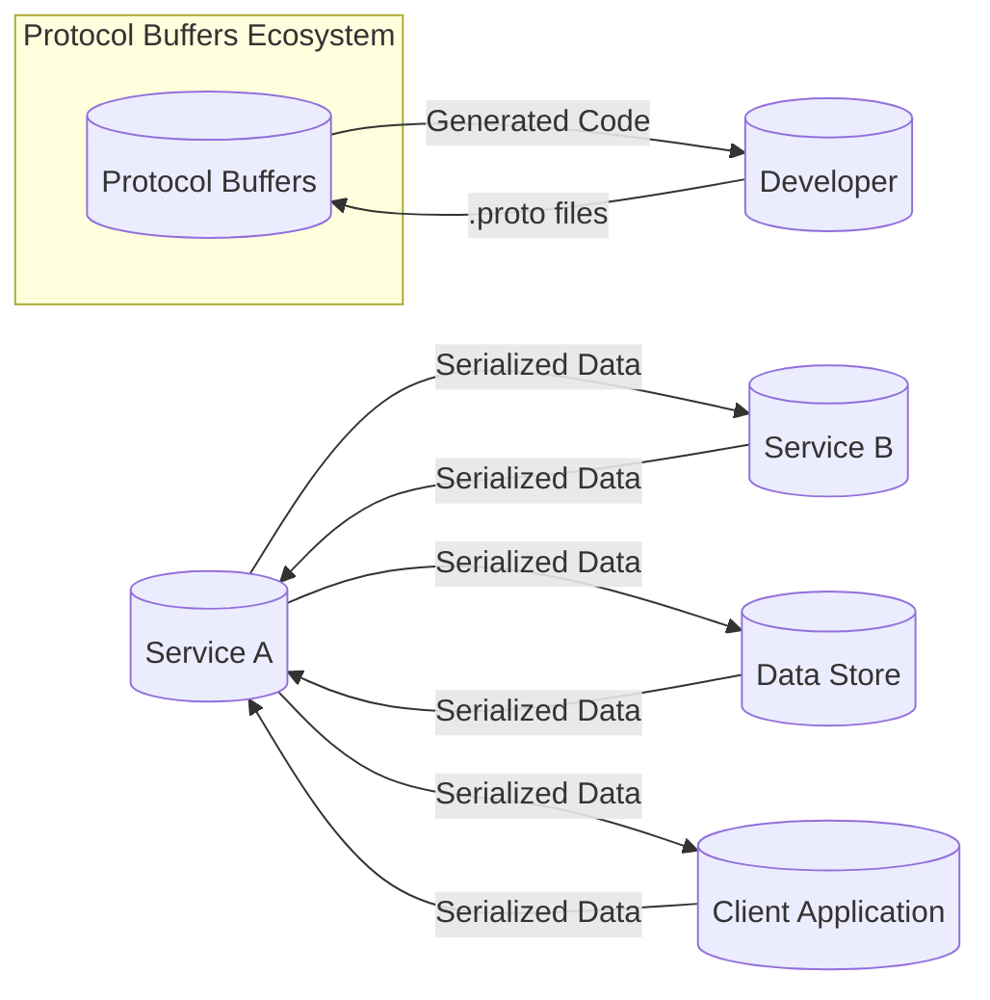
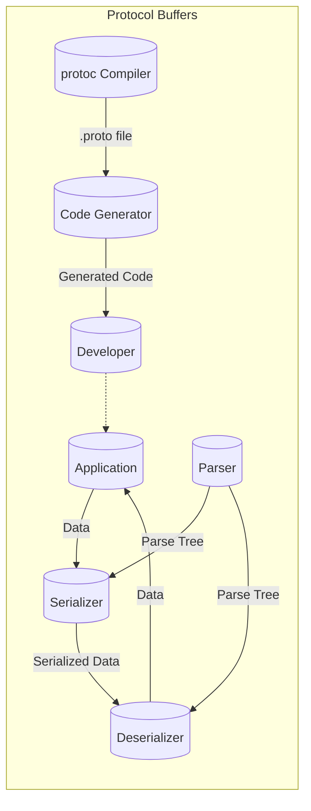
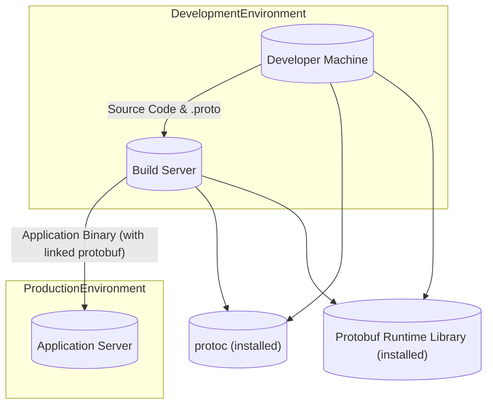
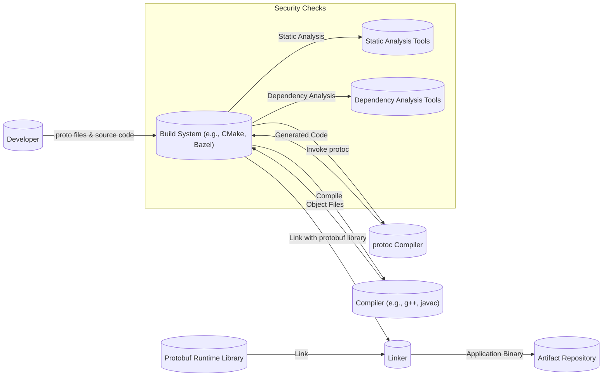

Okay, let's create a design document for the Google Protocol Buffers project, keeping in mind its purpose and potential security considerations.

# BUSINESS POSTURE

Protocol Buffers (protobuf) is a method of serializing structured data. It is used in a vast number of scenarios, from inter-service communication in microservices architectures to data storage.  The business priorities and goals driving protobuf's development and maintenance are:

*   Efficiency:  Provide a fast and compact binary serialization format, minimizing bandwidth usage and processing overhead compared to text-based formats like XML or JSON.
*   Interoperability:  Enable communication between services written in different programming languages (C++, Java, Python, Go, etc.).  This is crucial for heterogeneous systems.
*   Maintainability:  Allow schemas to evolve over time with backward and forward compatibility, preventing breaking changes when services are updated.
*   Simplicity: Offer a clear and concise way to define data structures, making it easy for developers to understand and use.
*   Reliability: Ensure data integrity and consistency during serialization and deserialization.
*   Extensibility: Support custom options and extensions to adapt to specific use cases.
*   Open Source: Foster a community-driven development model, encouraging contributions and widespread adoption.

Based on these priorities, the most important business risks are:

*   Data Corruption:  Any flaw in the serialization/deserialization process could lead to data corruption, potentially causing application failures or incorrect behavior.
*   Compatibility Breaks:  Changes to the protobuf library or code generator that break backward or forward compatibility could disrupt existing systems and require significant refactoring.
*   Performance Degradation:  Introduced inefficiencies could negatively impact the performance of applications relying on protobuf, especially in high-throughput scenarios.
*   Security Vulnerabilities:  Exploitable vulnerabilities in the library could allow attackers to inject malicious data, cause denial-of-service, or potentially gain unauthorized access to systems.
*   Lack of Adoption: If the project fails to maintain its simplicity, reliability, or performance advantages, developers might switch to alternative serialization methods.

# SECURITY POSTURE

The Protocol Buffers project has several existing security controls and accepted risks:

*   security control: Fuzzing: Extensive fuzzing is used to test the robustness of the parser and identify potential vulnerabilities (e.g., buffer overflows, denial-of-service). This is described in the SECURITY.md and Fuzzing.md files in the repository.
*   security control: Code Reviews: All code changes undergo thorough code reviews to identify potential security flaws and ensure code quality. This is part of the standard development workflow.
*   security control: Static Analysis: Static analysis tools are likely used (though not explicitly mentioned in the top-level documentation) to detect potential bugs and vulnerabilities before runtime.
*   security control: Security Policy: A security policy (SECURITY.md) is in place, providing instructions for reporting vulnerabilities.
*   accepted risk: Limited Input Validation: Protobuf itself primarily focuses on parsing binary data according to a predefined schema. It does *not* inherently perform extensive input validation beyond the schema's constraints (e.g., type checking).  Application developers are responsible for validating the *semantic* correctness of the data. This is an accepted risk because protobuf is a serialization library, not a validation framework.
*   accepted risk: Denial of Service (DoS): While fuzzing helps mitigate DoS vulnerabilities, it's inherently difficult to completely eliminate all potential DoS vectors in a complex parser.  Some risk of resource exhaustion remains, particularly with untrusted input.
*   accepted risk: No Built-in Encryption: Protobuf does not provide built-in encryption.  Data is transmitted in plain binary format.  Encryption, if needed, must be handled at a higher layer (e.g., using TLS for network communication or encrypting the serialized data itself).

Recommended Security Controls (High Priority):

*   security control: Integrate with Security Linters: Integrate security-focused linters (e.g., Bandit for Python, FindSecBugs for Java) into the build process to catch common security issues.
*   security control: Supply Chain Security: Implement measures to ensure the integrity of dependencies and prevent supply chain attacks (e.g., using signed releases, dependency verification).
*   security control: Regular Security Audits: Conduct periodic security audits by external experts to identify potential vulnerabilities that might be missed by internal testing.

Security Requirements:

*   Authentication: Not directly applicable to the protobuf library itself. Authentication should be handled at the application or transport layer.
*   Authorization: Not directly applicable to the protobuf library itself. Authorization should be handled at the application layer, using the deserialized data.
*   Input Validation:
    *   The protobuf parser *must* correctly enforce the schema definition (data types, required fields, etc.).
    *   The parser *should* be resilient to malformed input, handling errors gracefully without crashing or exposing vulnerabilities.
    *   Application developers *must* implement additional input validation to ensure the semantic correctness of the data.
*   Cryptography:
    *   Protobuf itself does *not* require cryptographic functions.
    *   If encryption is needed, it *must* be implemented at a higher layer, using appropriate cryptographic libraries and protocols.
*   Data Integrity:
    *   The serialization and deserialization process *must* ensure data integrity, preventing accidental modification or corruption.

# DESIGN

## C4 CONTEXT

C4 Context Element Descriptions:

*   Element:
    *   Name: Developer
    *   Type: Person
    *   Description: A software developer who uses Protocol Buffers to define data schemas and generate code.
    *   Responsibilities: Defines .proto files, integrates generated code into applications, implements input validation and business logic.
    *   Security controls: Code reviews, secure coding practices, static analysis.
*   Element:
    *   Name: Protocol Buffers
    *   Type: Software System
    *   Description: The core Protocol Buffers library and code generator.
    *   Responsibilities: Parses .proto files, generates code for various languages, serializes and deserializes data.
    *   Security controls: Fuzzing, code reviews, static analysis, security policy.
*   Element:
    *   Name: Service A
    *   Type: Software System
    *   Description: A service that uses Protocol Buffers for communication or data storage.
    *   Responsibilities: Processes requests, interacts with other services and data stores, uses generated protobuf code.
    *   Security controls: Input validation, authentication, authorization, encryption (if needed).
*   Element:
    *   Name: Service B
    *   Type: Software System
    *   Description: Another service that communicates with Service A using Protocol Buffers.
    *   Responsibilities: Similar to Service A.
    *   Security controls: Input validation, authentication, authorization, encryption (if needed).
*   Element:
    *   Name: Data Store
    *   Type: Software System
    *   Description: A database or file system that stores data serialized using Protocol Buffers.
    *   Responsibilities: Stores and retrieves protobuf data.
    *   Security controls: Access control, encryption at rest (if needed).
*   Element:
    *   Name: Client Application
    *   Type: Software System
    *   Description: Client that communicates with Service A using Protocol Buffers.
    *   Responsibilities: Similar to Service A.
    *   Security controls: Input validation, authentication, authorization, encryption (if needed).

## C4 CONTAINER

In the case of Protocol Buffers, the container diagram is essentially an extension of the context diagram, as the core "container" is the protobuf library itself.

C4 Container Element Descriptions:

*   Element:
    *   Name: protoc Compiler
    *   Type: Tool
    *   Description: The command-line tool that processes .proto files.
    *   Responsibilities: Parses .proto files, invokes code generators.
    *   Security controls: Input validation (of .proto files), code reviews.
*   Element:
    *   Name: Code Generator
    *   Type: Component
    *   Description: Generates code for a specific language (e.g., C++, Java, Python).
    *   Responsibilities: Creates language-specific classes and methods for serialization and deserialization.
    *   Security controls: Code reviews, static analysis.
*   Element:
    *   Name: Parser
    *   Type: Component
    *   Description: Parses the binary protobuf data.
    *   Responsibilities: Reads binary data, validates against the schema, creates an in-memory representation.
    *   Security controls: Fuzzing, code reviews, robust error handling.
*   Element:
    *   Name: Serializer
    *   Type: Component
    *   Description: Converts data objects into the binary protobuf format.
    *   Responsibilities: Writes data according to the schema.
    *   Security controls: Code reviews.
*   Element:
    *   Name: Deserializer
    *   Type: Component
    *   Description: Converts the binary protobuf format back into data objects.
    *   Responsibilities: Reads binary data, reconstructs data objects.
    *   Security controls: Code reviews.
*   Element:
    *   Name: Application
    *   Type: Component
    *   Description: Application code that uses generated protobuf classes.
    *   Responsibilities: Uses generated code, implements business logic.
    *   Security controls: Input validation, authentication, authorization, encryption (if needed).

## DEPLOYMENT

Protocol Buffers, as a library and code generator, has multiple deployment scenarios:

1.  **Library Integration:** The protobuf runtime library is typically linked directly into the application (statically or dynamically). This is the most common scenario.
2.  **Code Generator as a Build Tool:** The `protoc` compiler is used as part of the build process to generate code. It can be installed on developer machines and build servers.
3.  **Protobuf as a Service (Less Common):**  While not a primary use case, it's conceivable to have a service that provides protobuf serialization/deserialization as an API, though this adds network overhead.

We'll focus on the most common scenario: **Library Integration and Code Generator as a Build Tool.**

Deployment Element Descriptions:

*   Element:
    *   Name: Developer Machine
    *   Type: Workstation
    *   Description: The developer's computer where code is written and .proto files are created.
    *   Responsibilities: Code development, running tests, using the `protoc` compiler.
    *   Security controls: Standard workstation security measures.
*   Element:
    *   Name: Build Server
    *   Type: Server
    *   Description: A server that builds the application, including generating protobuf code.
    *   Responsibilities: Compiling code, running tests, generating binaries.
    *   Security controls: Access control, secure build environment, dependency management.
*   Element:
    *   Name: Application Server
    *   Type: Server
    *   Description: The server where the application is deployed.
    *   Responsibilities: Running the application, handling requests.
    *   Security controls: Standard server security measures (firewall, intrusion detection, etc.).
*   Element:
    *   Name: protoc (installed)
    *   Type: Software
    *   Description: Installation of protoc compiler.
    *   Responsibilities: Compiling proto files.
    *   Security controls: Access control, signed binaries.
*   Element:
    *   Name: Protobuf Runtime Library (installed)
    *   Type: Software
    *   Description: Installation of protobuf runtime library.
    *   Responsibilities: Providing runtime for protobuf.
    *   Security controls: Access control, signed binaries.

## BUILD

The build process for applications using Protocol Buffers typically involves the following steps:

1.  **Developer writes .proto files:** Defines the data structures.
2.  **Developer writes application code:**  Implements the application logic, using the generated protobuf code.
3.  **Build system invokes `protoc`:** The build system (e.g., Make, CMake, Bazel) runs the `protoc` compiler with the appropriate code generator (e.g., `--cpp_out`, `--java_out`).
4.  **Code generation:** `protoc` generates source code files (e.g., `.pb.cc`, `.pb.h` for C++) in the specified output directory.
5.  **Compilation:** The generated code is compiled along with the application code.
6.  **Linking:** The compiled code is linked with the protobuf runtime library.
7.  **Artifact creation:** The final application binary (or library) is created.

Security Controls in the Build Process:

*   security control: Static Analysis: Integrate static analysis tools (e.g., linters, security scanners) into the build process to identify potential vulnerabilities in both the application code and the generated protobuf code.
*   security control: Dependency Analysis: Use dependency analysis tools to identify and manage dependencies, ensuring that only trusted and up-to-date libraries are used. This helps mitigate supply chain risks.
*   security control: Secure Build Environment: Ensure that the build server itself is secure, with appropriate access controls and security hardening.
*   security control: Code Signing: Sign the generated binaries to ensure their integrity and authenticity.
*   security control: Reproducible Builds: Aim for reproducible builds, where the same source code and build environment always produce the same binary output. This helps verify that the build process has not been tampered with.

# RISK ASSESSMENT

*   Critical Business Processes:
    *   Inter-service communication: Many applications rely on protobuf for communication between different services. Failure of protobuf serialization/deserialization can disrupt these communications.
    *   Data storage and retrieval: If protobuf is used for data persistence, data corruption or incompatibility issues can lead to data loss or application failure.
    *   Client-server communication: Similar to inter-service communication, but specifically for communication between clients and servers.

*   Data Sensitivity:
    *   The sensitivity of the data handled by protobuf depends entirely on the *application*. Protobuf itself is just a serialization mechanism.
    *   Data can range from non-sensitive (e.g., configuration settings) to highly sensitive (e.g., personally identifiable information, financial data, medical records).
    *   The application using protobuf is responsible for protecting the data appropriately, regardless of its sensitivity. Protobuf does not provide inherent confidentiality.

# QUESTIONS & ASSUMPTIONS

*   Questions:
    *   What specific static analysis tools are currently used in the protobuf project?
    *   Are there any plans to integrate more advanced security features directly into the protobuf library (e.g., built-in encryption or input sanitization)?
    *   What is the process for handling security vulnerabilities discovered in dependencies of the protobuf library?
    *   What are the specific performance targets for protobuf serialization and deserialization?
    *   Are there any plans to support hardware-accelerated serialization/deserialization?

*   Assumptions:
    *   BUSINESS POSTURE: We assume that the primary goal of the protobuf project is to provide a fast, efficient, and reliable serialization mechanism, prioritizing performance and interoperability.
    *   SECURITY POSTURE: We assume that the protobuf project follows secure coding practices and takes security seriously, but relies on external mechanisms (e.g., application-level validation, encryption) for many security aspects.
    *   DESIGN: We assume that the core design of protobuf is relatively stable and that major changes are unlikely. We also assume that the library integration model is the most common deployment scenario. We assume that build process is automated.