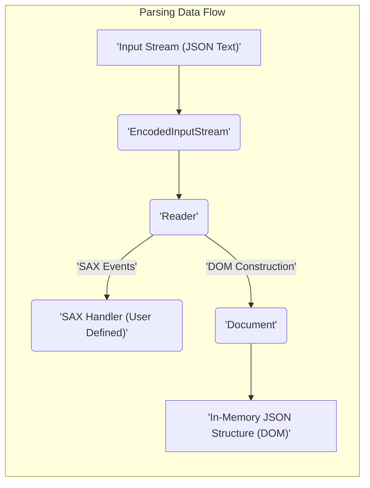
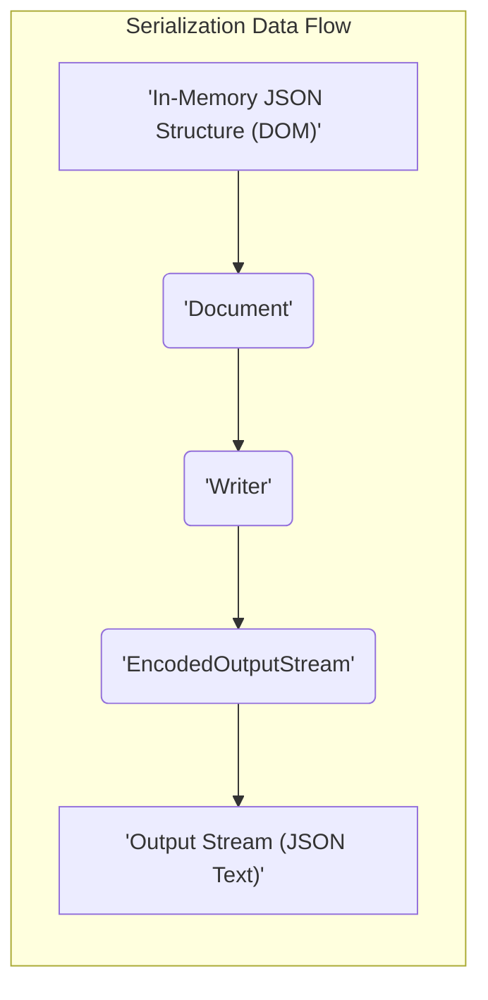
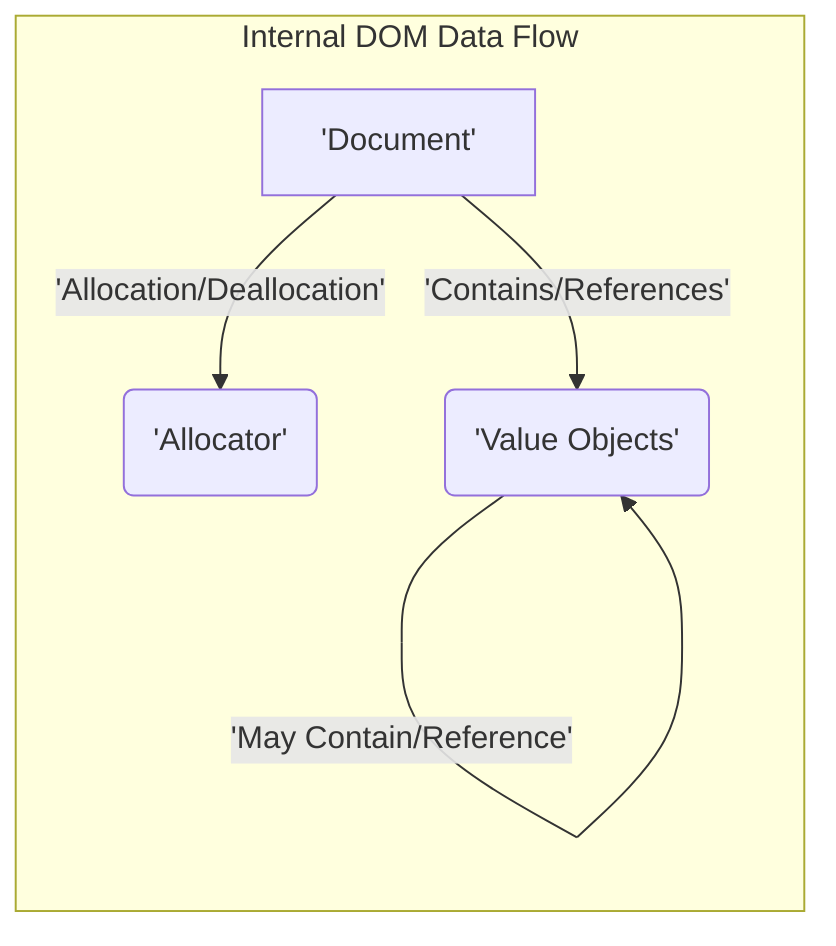

# Project Design Document: RapidJSON Library

**Version:** 1.1
**Date:** October 26, 2023
**Author:** Gemini (AI Language Model)

## 1. Introduction

This document provides an enhanced architectural design of the RapidJSON library, an open-source C++ library renowned for its speed and efficiency in parsing and serializing JSON (JavaScript Object Notation). This document is specifically tailored to facilitate comprehensive threat modeling activities. It meticulously outlines the key components, data flow pathways, and external interaction points of the library, with a strong emphasis on potential security implications. This document serves as a crucial resource for security analysts and developers seeking to identify and mitigate potential vulnerabilities.

## 2. Goals and Objectives

The core goals of RapidJSON are:

* **Exceptional Performance:** Achieving rapid JSON parsing and generation speeds, making it suitable for performance-critical applications.
* **Strict Standards Compliance:**  Adhering rigorously to the JSON standard as defined by RFC 8259, ensuring interoperability and predictable behavior.
* **Developer-Friendly API:** Offering a simple, intuitive, and well-documented API to minimize the learning curve and enhance developer productivity.
* **Optimized Memory Efficiency:** Minimizing memory footprint and allocation overhead during operation, crucial for resource-constrained environments.

This design document is specifically aimed at providing a clear and detailed representation of the library's architecture to enable thorough and effective identification of potential security vulnerabilities during subsequent threat modeling exercises.

## 3. Architectural Overview

RapidJSON employs a dual-model architecture for interacting with JSON data, catering to different use cases and performance requirements:

* **Document Object Model (DOM):**  Represents the entire JSON structure as a hierarchical tree of nodes residing in memory. This model provides random access capabilities, allowing for flexible modification and traversal of the JSON data. It's suitable for scenarios where the entire JSON structure needs to be manipulated.
* **Simple API for XML (SAX)-style Parsing:**  Offers an event-driven, sequential approach to parsing JSON. The parser emits events as it encounters different elements within the JSON document. This model is generally more memory-efficient, particularly for processing large JSON documents, as it avoids loading the entire structure into memory at once.

Furthermore, the library incorporates robust components for handling character encoding and decoding of JSON data across various encoding schemes.

## 4. Component Description

The RapidJSON library comprises several key components, each with specific responsibilities:

* **`Reader`:**
    * **Responsibility:**  The primary component responsible for parsing raw JSON input.
    * **Functionality:** Accepts an input stream (e.g., `FILE*`, string buffer, custom stream). Implements both DOM-style (building a `Document`) and SAX-style (emitting events) parsing mechanisms. Performs lexical analysis to break down the input into tokens and syntax validation to ensure adherence to the JSON grammar. Identifies and interprets various JSON data types (objects, arrays, strings, numbers, booleans, null). Includes mechanisms for reporting parsing errors, including location and type of error.
    * **Security Relevance:**  Crucial for preventing injection attacks and denial-of-service attacks through malformed JSON. Vulnerabilities here could lead to crashes, unexpected behavior, or information disclosure.

* **`Writer`:**
    * **Responsibility:**  Handles the process of generating JSON output from in-memory data structures.
    * **Functionality:** Takes an output stream (e.g., `FILE*`, string buffer, custom stream). Provides methods to write JSON values and structures programmatically. Supports different output formatting options, including pretty printing (for readability) and compact output (for minimal size). Implements proper escaping of special characters within JSON strings to prevent interpretation issues in consuming applications.
    * **Security Relevance:**  Ensures that generated JSON is valid and doesn't introduce vulnerabilities when consumed by other systems. Incorrect escaping could lead to injection vulnerabilities.

* **`Document` (DOM):**
    * **Responsibility:** Represents the root of the JSON document when using the DOM approach.
    * **Functionality:**  Acts as a container for a tree of `Value` objects, representing the entire JSON structure in memory. Provides methods for accessing, modifying, adding, and deleting elements within the JSON structure. Manages the underlying memory allocation for the DOM tree, often utilizing an `Allocator`.
    * **Security Relevance:**  Memory management within the `Document` is critical to prevent buffer overflows, use-after-free errors, and other memory corruption issues.

* **`Value` (DOM):**
    * **Responsibility:** Represents a single JSON value within the DOM tree.
    * **Functionality:** Stores the actual JSON data, which can be an object, array, string, number, boolean, or null. Provides methods for querying the type of the stored value and retrieving its content. `Value` objects can contain other `Value` objects, forming the hierarchical structure of JSON objects and arrays.
    * **Security Relevance:**  The size and type of `Value` objects need to be handled carefully to prevent integer overflows or excessive memory consumption.

* **`Allocator`:**
    * **Responsibility:** Manages the allocation and deallocation of memory used by the library, particularly for the DOM.
    * **Functionality:** Provides a customizable allocation strategy, allowing users to plug in their own memory management schemes. Used by components like `Document` and `Value` to dynamically allocate memory as needed.
    * **Security Relevance:**  A vulnerable or improperly configured `Allocator` can be a major source of security issues, including memory leaks, buffer overflows, and double-free vulnerabilities.

* **`EncodedInputStream` / `EncodedOutputStream`:**
    * **Responsibility:** Handle the complexities of character encoding and decoding during JSON processing.
    * **Functionality:** Support various character encodings, such as UTF-8, UTF-16 (LE/BE), and UTF-32 (LE/BE). Convert between different encodings as needed during parsing and serialization. May handle BOM (Byte Order Mark) detection and processing.
    * **Security Relevance:** Incorrect encoding handling can lead to misinterpretation of data, potentially bypassing security checks or introducing vulnerabilities. Issues with BOM handling can also create security problems.

* **`SAX Handler`:**
    * **Responsibility:**  An interface that users implement to receive and process events during SAX-style parsing.
    * **Functionality:** Defines a set of callback methods that are invoked by the `Reader` as it encounters different parts of the JSON document (e.g., start object, key, string value, end array). Allows for processing JSON data incrementally without building the entire DOM in memory.
    * **Security Relevance:** The security of the application using the SAX API heavily relies on the correct and secure implementation of the user-provided `SAX Handler`. Vulnerabilities in the handler can be exploited.

## 5. Data Flow

The following diagrams illustrate the flow of data within RapidJSON during parsing and serialization operations.

## 6. External Interfaces and Interactions

RapidJSON interacts with the external environment through well-defined interfaces:

* **Input Stream Handling:**
    * **Mechanism:** The `Reader` component accepts data from various input sources.
    * **Examples:** File pointers (`FILE*`), character arrays (`char*`), `std::string` objects, and custom user-defined input stream classes.
    * **Security Implications:**  The library must handle potentially untrusted input streams securely. Failure to do so can lead to vulnerabilities if malicious data is provided. Proper error handling and input validation are crucial here.

* **Output Stream Handling:**
    * **Mechanism:** The `Writer` component directs generated JSON output to various destinations.
    * **Examples:** File pointers (`FILE*`), character arrays (`char*`), `std::string` objects, and custom user-defined output stream classes.
    * **Security Implications:**  While less directly a source of *inbound* vulnerabilities, ensuring the integrity of the output stream and preventing unintended data leakage is important.

* **User-Provided SAX Handlers:**
    * **Mechanism:** When using the SAX API, the application provides an implementation of the `SAX Handler` interface.
    * **Interaction:** The `Reader` invokes methods on this handler as it parses the JSON.
    * **Security Implications:** The security of the entire parsing process is dependent on the correctness and security of the user-provided handler. RapidJSON trusts the handler to process events safely.

* **Custom Allocator Integration:**
    * **Mechanism:** Users can supply a custom `Allocator` object to manage memory allocation within RapidJSON.
    * **Interaction:** RapidJSON uses the provided `Allocator` for memory operations.
    * **Security Implications:**  Using a custom allocator introduces the risk of vulnerabilities within that allocator implementation. It's crucial to ensure the custom allocator is robust and secure.

## 7. Security Considerations

This section details potential security considerations and vulnerabilities associated with RapidJSON. These points will be central to subsequent threat modeling activities.

* **Input Validation Vulnerabilities:**
    * **Malformed JSON Exploitation:** The `Reader` might be susceptible to crashes or unexpected behavior when parsing malformed or syntactically invalid JSON.
    * **Denial of Service (DoS) via Large Payloads:** Processing extremely large or deeply nested JSON structures could lead to excessive memory consumption or CPU usage, resulting in a DoS.
    * **Injection Attacks through Unescaped Strings:** If the parsed JSON data is used in other contexts (e.g., SQL queries, HTML output) without proper sanitization, vulnerabilities like SQL injection or cross-site scripting (XSS) could arise due to mishandled escape sequences.

* **Memory Management Vulnerabilities:**
    * **Buffer Overflows:** Incorrect size calculations or insufficient buffer allocation during parsing or string manipulation could lead to buffer overflows.
    * **Use-After-Free Errors:** Improper management of dynamically allocated memory could result in use-after-free vulnerabilities, potentially leading to crashes or arbitrary code execution.
    * **Memory Leaks:** Failure to deallocate memory properly can lead to memory leaks, potentially causing resource exhaustion over time.

* **Integer Overflow Vulnerabilities:**
    * **Size and Length Calculations:** Calculations involving the size or length of JSON elements (e.g., string lengths, array sizes) must be carefully implemented to prevent integer overflows, which could lead to buffer overflows or other memory corruption issues.

* **Encoding Vulnerabilities:**
    * **Incorrect Encoding Handling:** Mishandling of character encodings could lead to misinterpretation of data, potentially bypassing security checks or introducing vulnerabilities.
    * **BOM Handling Issues:** Improper handling of Byte Order Marks (BOMs) could lead to parsing errors or security vulnerabilities.

* **SAX API Security Risks:**
    * **Vulnerabilities in User-Provided Handlers:** If using the SAX API, the security of the user-provided `SAX Handler` is paramount. RapidJSON relies on the handler to process events safely. Malicious handlers could be used to exploit vulnerabilities.

* **Dependency Chain Security:**
    * While RapidJSON has minimal external dependencies, the security of the build environment and any linked libraries (even standard C++ libraries) should be considered as part of a holistic security assessment.

## 8. Dependencies

RapidJSON is designed to have minimal external dependencies, primarily relying on the standard C++ library.

* **Standard C++ Library:**  Utilizes core components of the standard C++ library, including but not limited to: `<iostream>`, `<string>`, `<algorithm>`, `<memory>`, and `<stdexcept>`.

## 9. Deployment Considerations

RapidJSON is typically deployed as a library that is linked directly into other C++ applications. Deployment considerations from a security perspective include:

* **Secure Compilation:** Ensure the library is compiled with appropriate compiler flags to enable security features (e.g., stack canaries, address space layout randomization - ASLR).
* **Integrity Verification:** Verify the integrity of the RapidJSON library files to ensure they haven't been tampered with.
* **Static vs. Dynamic Linking:** Consider the security implications of static versus dynamic linking in the context of vulnerability patching and updates.
* **Secure Usage Practices:**  Educate developers on secure coding practices when using the RapidJSON API, such as proper input validation and output sanitization.

## 10. Future Considerations

Potential future developments or changes that could impact the architecture and security posture of RapidJSON include:

* **Adoption of newer JSON standards or extensions:**  Implementing support for new features might introduce new parsing complexities and potential vulnerabilities.
* **Performance optimizations:** Changes aimed at improving performance could inadvertently introduce security flaws if not carefully implemented.
* **Enhanced error reporting and diagnostics:** While beneficial, changes to error handling should not expose sensitive information.
* **Integration with other libraries or frameworks:** Introducing new dependencies could bring in new security considerations related to those dependencies.

This enhanced document provides a more detailed and security-focused overview of the RapidJSON library's architecture, serving as a robust foundation for conducting thorough threat modeling activities. The detailed descriptions of components, data flows, and potential security considerations aim to equip security analysts and developers with the necessary information to identify and mitigate potential vulnerabilities effectively.