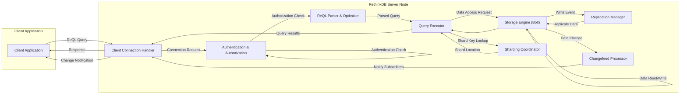

# RethinkDB Project Design Document for Threat Modeling

**Version:** 1.1
**Date:** October 26, 2023
**Author:** AI Software Architect

## 1. Project Overview

RethinkDB is an open-source, distributed document database engineered for building real-time web and mobile applications. Its core innovation lies in its "push" architecture, enabling applications to subscribe to query results and receive updates in real-time as data changes, eliminating the need for constant polling. This design document details the architectural elements and data pathways within RethinkDB, serving as a basis for comprehensive threat modeling activities.

## 2. Goals and Objectives

*   To furnish a clear and detailed exposition of the RethinkDB system architecture.
*   To pinpoint the essential components and their interdependencies.
*   To delineate the movement of data throughout the system during various operations.
*   To emphasize potential security vulnerabilities and attack surfaces for subsequent threat analysis.
*   To act as a foundational document for security evaluations and the development of mitigation strategies.

## 3. Target Audience

*   Security Engineers responsible for assessing and securing RethinkDB deployments.
*   Software Developers building applications on top of RethinkDB.
*   System Administrators managing and maintaining RethinkDB infrastructure.
*   Threat Modeling Teams tasked with identifying and analyzing potential security risks.

## 4. System Architecture

RethinkDB employs a distributed architecture characterized by several interacting components.

*   **RethinkDB Server (rethinkdb process):** This is the central database process, responsible for:
    *   Managing client connections and sessions.
    *   Parsing, optimizing, and executing ReQL queries.
    *   Coordinating data access and modifications.
    *   Overseeing the storage engine operations.
    *   Managing cluster membership and communication.
    *   Handling data sharding and replication.
*   **Client Drivers:** These are language-specific libraries that provide an interface for applications to communicate with the RethinkDB server. Examples include drivers for Python, JavaScript (Node.js and browser), Java, Ruby, and Go.
*   **Storage Engine (Bolt):** The underlying persistent storage mechanism. Key features include:
    *   Transaction support (ACID properties).
    *   Concurrency control using Multi-Version Concurrency Control (MVCC).
    *   B-tree based indexing for efficient data retrieval.
    *   Write-Ahead Logging (WAL) for durability.
*   **Query Language (ReQL):** RethinkDB's embedded domain-specific language for querying and manipulating JSON documents. ReQL expressions are constructed within the host programming language.
*   **Administration Interface (Web UI):** A web-based interface accessible through a browser, providing tools for:
    *   Cluster management (adding/removing servers).
    *   Database and table management.
    *   User and permission management.
    *   Query execution and data browsing.
    *   Performance monitoring and logging.
*   **Cluster:** A group of interconnected RethinkDB server instances working together to provide high availability and scalability.
*   **Data Sharding:** Automatic distribution of data across multiple servers in a cluster based on a configurable sharding strategy.
*   **Replication:** Maintaining multiple copies of data across different servers for fault tolerance and data redundancy.

## 5. Data Flow

The following diagram illustrates the typical data flow within RethinkDB for both read and write operations, including the real-time change notification mechanism.

**Data Flow Description:**

*   **Client Request:** A client application initiates an operation by sending a ReQL query to the RethinkDB server.
*   **Connection Handling:** The `Client Connection Handler` accepts the incoming connection and manages the communication channel.
*   **Authentication & Authorization:** The system verifies the client's identity and confirms their permissions to perform the requested operation on the specified data.
*   **ReQL Parsing & Optimization:** The `ReQL Parser & Optimizer` analyzes the query, validates its syntax, and generates an efficient execution plan.
*   **Query Execution:** The `Query Executor` carries out the execution plan, interacting with the `Storage Engine` to retrieve or modify data. It may also consult the `Sharding Coordinator` to locate data across different shards.
*   **Storage Engine Interaction:** The `Storage Engine (Bolt)` performs the actual read and write operations on disk, ensuring data integrity and durability.
*   **Replication Management:** The `Replication Manager` propagates data modifications to replica nodes to maintain consistency and fault tolerance.
*   **Sharding Coordination:** The `Sharding Coordinator` determines the location of data based on the sharding key and directs queries to the appropriate shards.
*   **Result Delivery:** The `Query Executor` returns the results of the query to the `Client Connection Handler`, which then sends the response back to the client application.
*   **Changefeed Processing:** For queries using the `changes()` command, the `Changefeed Processor` monitors data modifications affecting the query results.
*   **Real-time Notifications:** When relevant data changes occur, the `Changefeed Processor` notifies subscribed clients through the `Client Connection Handler`.

## 6. Key Components

*   **Client Connection Handler:**
    *   Accepts and manages incoming TCP connections from client applications.
    *   Handles the initial handshake and protocol negotiation.
    *   Maintains session state and tracks connected clients.
    *   Enforces connection limits and potential rate limiting mechanisms.
    *   May be susceptible to connection flooding or denial-of-service attacks.

*   **Authentication & Authorization:**
    *   Verifies the identity of connecting clients using configured authentication methods (e.g., username/password, potentially external authentication).
    *   Enforces access control policies based on user roles and permissions.
    *   Controls access to databases, tables, and specific data manipulation operations.
    *   Vulnerable to brute-force attacks, credential stuffing, and authorization bypass if not properly implemented and secured.

*   **ReQL Parser & Optimizer:**
    *   Parses incoming ReQL queries into an internal abstract syntax tree (AST).
    *   Validates the syntax and semantics of the query.
    *   Optimizes the query execution plan to minimize resource usage and latency.
    *   Potential vulnerability to ReQL injection if user-provided data is not properly sanitized before being incorporated into ReQL queries.

*   **Query Executor:**
    *   Executes the optimized query plan by interacting with other components.
    *   Coordinates data retrieval and modification operations.
    *   Manages transactions and concurrency control.
    *   Responsible for enforcing data integrity constraints.
    *   May be vulnerable to resource exhaustion if poorly optimized or malicious queries are executed.

*   **Storage Engine (Bolt):**
    *   Provides persistent storage for RethinkDB data.
    *   Implements ACID properties for transactions.
    *   Uses B-trees for efficient indexing and data retrieval.
    *   Employs Multi-Version Concurrency Control (MVCC) to handle concurrent access.
    *   Writes data to a Write-Ahead Log (WAL) for durability.
    *   Potential vulnerabilities include data corruption due to software bugs or hardware failures, and unauthorized access to the underlying data files if not properly secured at the operating system level.

*   **Replication Manager:**
    *   Ensures data consistency and availability by replicating data across multiple server nodes.
    *   Handles the propagation of write operations from primary to secondary replicas.
    *   Manages leader election and failover in case of primary node failures.
    *   Implements consensus algorithms (e.g., Raft) to maintain consistency across the cluster.
    *   Vulnerable to network partitions and inconsistencies if the consensus algorithm is not robustly implemented.

*   **Sharding Coordinator:**
    *   Distributes data across multiple shards based on a defined sharding strategy.
    *   Determines the location of data for query routing.
    *   Manages shard rebalancing and data migration when nodes are added or removed.
    *   Potential vulnerabilities include data loss or inconsistency if shard assignments are not managed correctly.

*   **Changefeed Processor:**
    *   Monitors data modifications that match the criteria of active `changes()` queries.
    *   Efficiently identifies and propagates changes to subscribed clients.
    *   May introduce performance overhead if a large number of clients subscribe to changefeeds on frequently updated data.

*   **Administration Interface (Web UI):**
    *   Provides a graphical interface for managing and monitoring the RethinkDB cluster.
    *   Allows administrative tasks such as user management, database creation, and cluster configuration.
    *   A significant attack surface if not properly secured, susceptible to vulnerabilities like cross-site scripting (XSS), cross-site request forgery (CSRF), and authentication bypass.

## 7. Security Considerations (Detailed)

This section expands on potential security concerns, providing more specific examples.

*   **Authentication and Authorization:**
    *   **Threat:** Use of default or weak passwords for administrative or user accounts.
    *   **Threat:** Vulnerabilities in the authentication mechanism allowing bypass or impersonation.
    *   **Threat:** Insufficiently granular role-based access control, leading to privilege escalation.
    *   **Threat:** Insecure storage of user credentials.
    *   **Threat:** Vulnerabilities in integration with external authentication providers (e.g., LDAP, OAuth).

*   **Data Confidentiality:**
    *   **Threat:** Lack of encryption for data at rest on disk, making it vulnerable to physical access or data breaches.
    *   **Threat:** Lack of encryption for data in transit between clients and the server, and between nodes within the cluster, exposing data to eavesdropping.
    *   **Threat:** Sensitive information being logged or exposed in error messages.
    *   **Threat:** Insecure handling of temporary files potentially containing sensitive data.

*   **Data Integrity:**
    *   **Threat:** SQL (ReQL) injection vulnerabilities allowing attackers to manipulate or delete data.
    *   **Threat:** Unauthorized modification of data due to insufficient access controls.
    *   **Threat:** Data corruption due to software bugs or malicious actions.
    *   **Threat:** Inconsistencies between replicas due to failures in the replication mechanism.

*   **Availability:**
    *   **Threat:** Denial-of-service (DoS) attacks targeting the server's connection handling or query processing capabilities.
    *   **Threat:** Resource exhaustion attacks by sending computationally expensive queries.
    *   **Threat:** Exploitation of vulnerabilities leading to server crashes or instability.
    *   **Threat:** Failures in the replication or sharding mechanisms leading to data unavailability.

*   **Injection Attacks:**
    *   **Threat:** ReQL injection vulnerabilities where unsanitized user input is incorporated into ReQL queries, allowing attackers to execute arbitrary database commands.

*   **Administration Interface Security:**
    *   **Threat:** Unauthorized access to the administrative interface due to weak credentials or lack of multi-factor authentication.
    *   **Threat:** Cross-site scripting (XSS) vulnerabilities allowing attackers to inject malicious scripts into the interface.
    *   **Threat:** Cross-site request forgery (CSRF) vulnerabilities allowing attackers to perform actions on behalf of authenticated administrators.
    *   **Threat:** Exposure of the administrative interface to the public internet.

*   **Supply Chain Security:**
    *   **Threat:** Vulnerabilities in third-party libraries or dependencies used by RethinkDB.

*   **Network Security:**
    *   **Threat:** Unencrypted communication channels allowing for eavesdropping and man-in-the-middle attacks.
    *   **Threat:** Inadequate firewall rules allowing unauthorized access to RethinkDB ports.

## 8. Deployment Considerations

*   **Network Segmentation:** Isolate the RethinkDB cluster within a private network segment.
*   **Firewall Configuration:** Implement strict firewall rules to restrict access to RethinkDB ports (default: 28015 for client connections, 29015 for cluster connections, 8080 for the admin UI).
*   **Secure Communication:** Enforce the use of TLS/SSL encryption for all client-server and inter-node communication. Consider using client certificates for mutual authentication.
*   **Access Control:** Implement strong authentication mechanisms and enforce the principle of least privilege for user accounts.
*   **Admin Interface Security:** Restrict access to the administrative interface to authorized personnel and secure it with strong passwords and potentially multi-factor authentication. Consider disabling the admin interface in production environments if not strictly necessary or placing it behind a VPN or bastion host.
*   **Operating System Security:** Harden the underlying operating system by applying security patches, disabling unnecessary services, and configuring appropriate file system permissions.
*   **Regular Security Audits:** Conduct regular security assessments and penetration testing to identify and address potential vulnerabilities.
*   **Monitoring and Logging:** Implement comprehensive logging and monitoring to detect suspicious activity and potential security breaches.

## 9. Technologies Used

*   **Core Language:** C++
*   **Administration Interface:** JavaScript (likely utilizing frameworks like Backbone.js, though specific details may vary by version)
*   **Query Language:** ReQL (embedded within host languages)
*   **Storage Engine:** Bolt (custom-built)
*   **Communication Protocol:** TCP (with optional TLS/SSL)
*   **Consensus Algorithm (for clustering):** Likely Raft or a similar algorithm.

This improved document provides a more detailed and security-focused overview of the RethinkDB architecture, intended to facilitate a more thorough and effective threat modeling process.