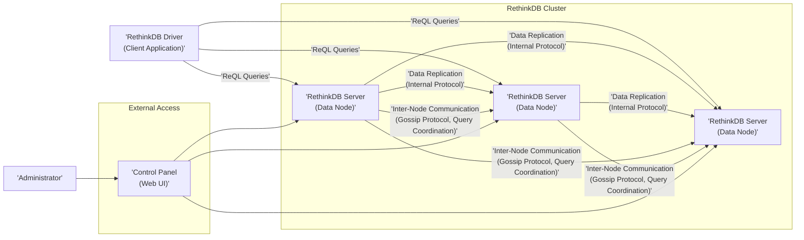
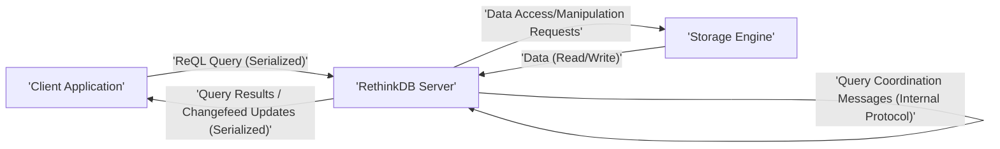

## Project Design Document: RethinkDB for Threat Modeling (Improved)

**1. Project Overview**

This document provides an enhanced architectural overview of RethinkDB, an open-source, distributed document database distinguished by its powerful query language (ReQL) and real-time push capabilities via changefeeds. This document is specifically tailored to serve as a robust foundation for subsequent threat modeling activities. It meticulously outlines the core components, intricate data flows, and critical interactions within the RethinkDB system, with a strong emphasis on highlighting areas pertinent to security considerations.

**2. Goals and Objectives**

* **Primary Goal:** To furnish a comprehensive, accurate, and sufficiently detailed architectural description of RethinkDB to facilitate effective and insightful threat modeling.
* **Objectives:**
    * Clearly and unambiguously identify all major architectural components of the RethinkDB system.
    * Thoroughly describe the interactions, communication protocols, and data flows between these components.
    * Explicitly outline key security-relevant aspects of the architecture, including potential vulnerabilities and security mechanisms.
    * Provide clear and informative visual representations of the system architecture and crucial data flows using Mermaid diagrams.
    * Serve as a definitive reference point for security assessments, vulnerability analysis, and the development of mitigation strategies.

**3. Target Audience**

This document is primarily intended for:

* Security Engineers and Architects responsible for conducting threat modeling exercises and performing security assessments of RethinkDB deployments.
* Software Developers actively working on or integrating applications with RethinkDB.
* Infrastructure and Operations teams responsible for managing and maintaining RethinkDB infrastructure in various environments.

**4. System Architecture**

RethinkDB employs a distributed architecture characterized by several interconnected components working in concert.

* **RethinkDB Server (Data Node):** The fundamental building block responsible for the storage and management of data. Each server instance actively participates in the cluster, holding a subset of the total data. These servers handle query processing, data replication, and inter-node communication.
* **RethinkDB Driver (Client Library):**  A collection of libraries available in a wide array of programming languages (e.g., Python, JavaScript, Java, Go) that provide the necessary APIs for client applications to interact seamlessly with the RethinkDB cluster. Drivers handle connection management, query serialization, and result deserialization.
* **ReQL (RethinkDB Query Language):** A powerful, composable, and data-centric query language used by clients to express data manipulation and retrieval operations. ReQL queries are constructed on the client-side and executed on the server-side. The language's structure allows for complex data transformations and real-time subscriptions.
* **Storage Engine:** The underlying mechanism responsible for the persistent storage of data on disk. RethinkDB utilizes a custom, high-performance storage engine optimized for its specific data model and operational requirements. This engine handles data indexing, transaction management, and disk I/O.
* **Clustering and Sharding:**  Essential mechanisms for achieving horizontal scalability and fault tolerance. Clustering allows multiple RethinkDB server instances to operate as a single logical database. Sharding partitions data across these servers, distributing the workload and increasing overall capacity.
* **Replication:** A critical feature ensuring data durability and high availability. RethinkDB automatically replicates data across multiple servers within the cluster. This provides redundancy and allows the system to tolerate node failures without data loss.
* **Control Panel (Web UI):** A web-based administrative interface providing tools for monitoring the health and performance of the RethinkDB cluster, managing server configurations, inspecting data, and performing administrative tasks. Access to this panel requires authentication.

**5. Data Flow**

The following details the typical data flow pathways within a RethinkDB system:

* **Client Request Initiation:**
    * A client application, utilizing a specific RethinkDB driver, constructs a ReQL query representing the desired data operation.
    * The driver establishes a connection with one of the RethinkDB servers within the cluster (often determined by load balancing or connection pooling strategies).
    * The driver serializes the ReQL query and transmits it to the chosen server.
* **Query Reception and Processing:**
    * The receiving RethinkDB server parses and analyzes the incoming ReQL query.
    * The server determines the scope of the query and identifies the specific data shards and servers involved in fulfilling the request.
    * For queries involving data distributed across multiple shards, the receiving server acts as a coordinator, delegating sub-queries to the relevant servers.
    * Individual servers access their local storage engine to retrieve or modify the necessary data.
* **Data Access and Manipulation within the Storage Engine:**
    * Servers interact with the underlying storage engine to perform data read, write, update, and delete operations.
    * The storage engine manages data indexing, ensuring efficient data retrieval.
    * Transaction management ensures data consistency and atomicity of operations.
* **Real-time Feed (Changefeed) Handling:**
    * If a client has established a subscription to a changefeed for specific data, the relevant server monitors changes occurring to that data.
    * Upon detection of a change, the server pushes the update (representing the old and new versions of the document) to the subscribed client through the established connection.
* **Response Generation and Transmission:**
    * The server(s) involved in the query execution collect the results of their operations.
    * The coordinating server (if applicable) aggregates the results received from other servers.
    * The server serializes the query results and transmits them back to the client application through the driver.
* **Inter-Server Communication for Data Management:**
    * RethinkDB servers constantly communicate with each other for critical tasks such as data replication to maintain redundancy and fault tolerance.
    * Servers exchange information related to shard management, ensuring proper data distribution and load balancing across the cluster.
    * Inter-node communication also facilitates query coordination and distributed transaction management.

**6. Security Considerations (Detailed)**

This section provides a more in-depth exploration of key security considerations within the RethinkDB ecosystem. These aspects are crucial for effective threat modeling.

* **Authentication and Authorization:**
    * **Authentication Mechanisms:** RethinkDB supports user authentication using username/password credentials. The strength of these mechanisms depends on password complexity requirements and the absence of common vulnerabilities like default credentials.
    * **Authorization Controls:** Permissions can be configured at the database and table level, allowing granular control over data access. However, overly permissive configurations can lead to unauthorized data access or modification.
    * **Considerations for Threat Modeling:**
        * Evaluate the robustness of the password hashing algorithm used.
        * Assess the risk of brute-force attacks on authentication endpoints.
        * Analyze the potential for privilege escalation due to misconfigured permissions.
        * Examine the security of the initial setup and default user configurations.
* **Data Encryption:**
    * **At Rest:** RethinkDB does not offer built-in encryption at rest. Organizations must implement encryption at the underlying storage layer (e.g., using LUKS, dm-crypt, or cloud provider encryption services). Failure to do so exposes data to unauthorized access if the storage media is compromised.
    * **In Transit:** Communication between clients and servers, and between servers within the cluster, can be secured using TLS/SSL. Proper configuration and enforcement of TLS are essential to prevent eavesdropping and man-in-the-middle attacks.
    * **Considerations for Threat Modeling:**
        * Verify the proper configuration and enforcement of TLS/SSL for all network communication.
        * Assess the strength of the cipher suites used for encryption.
        * Evaluate the key management practices for TLS certificates.
        * Analyze the potential impact of not implementing encryption at rest.
* **Input Validation:**
    * ReQL queries, being the primary interface for data interaction, are a potential attack vector. Robust input validation on the server-side is crucial to prevent injection attacks (similar to SQL injection).
    * **Considerations for Threat Modeling:**
        * Analyze how RethinkDB handles potentially malicious or malformed ReQL queries.
        * Investigate potential vulnerabilities related to ReQL command injection.
        * Assess the effectiveness of any built-in input sanitization mechanisms.
* **Network Security:**
    * Controlling network access to the RethinkDB cluster is paramount. Firewalls and access control lists should be configured to restrict access to authorized clients and servers.
    * **Considerations for Threat Modeling:**
        * Identify the default ports used by RethinkDB and assess the risk of unauthorized access to these ports.
        * Evaluate the security of any exposed services (e.g., the web UI).
        * Analyze the network architecture and identify potential points of unauthorized entry.
* **Access Control to the Control Panel:**
    * The web-based control panel provides powerful administrative capabilities. Secure authentication and authorization are critical to prevent unauthorized administrative actions.
    * **Considerations for Threat Modeling:**
        * Evaluate the authentication mechanisms used for the control panel.
        * Assess the risk of unauthorized access to administrative functions.
        * Analyze the potential impact of a compromised administrator account.
* **Data Replication Security:**
    * The replication process involves transferring sensitive data between servers. This communication must be secured to prevent data interception.
    * **Considerations for Threat Modeling:**
        * Verify that replication traffic is encrypted (typically through the same TLS configuration used for client-server communication).
        * Assess the authentication mechanisms used between servers for replication.
* **Denial of Service (DoS) Attacks:**
    * RethinkDB, like any network service, is susceptible to DoS attacks that can overwhelm the system and make it unavailable.
    * **Considerations for Threat Modeling:**
        * Analyze potential DoS attack vectors, such as resource exhaustion through excessive queries or connections.
        * Evaluate the effectiveness of any built-in rate limiting or resource management mechanisms.
* **Software Vulnerabilities:**
    * As with any software, RethinkDB may contain undiscovered vulnerabilities that could be exploited by attackers.
    * **Considerations for Threat Modeling:**
        * Emphasize the importance of keeping the RethinkDB software up-to-date with the latest security patches.
        * Consider the use of vulnerability scanning tools to identify potential weaknesses.

**7. Dependencies**

RethinkDB relies on a set of underlying technologies and libraries for its operation:

* **Operating System:**  Designed to run on various Linux distributions (e.g., Ubuntu, CentOS), macOS, and Windows. Specific OS configurations can impact security.
* **C++ Standard Library:** The core of RethinkDB is implemented in C++, leveraging the standard library for fundamental functionalities.
* **Boost C++ Libraries:** A collection of peer-reviewed C++ libraries providing support for tasks like networking, threading, and data structures. Specific Boost library versions can have security implications.
* **Protocol Buffers (protobuf):** Used for serializing structured data, particularly for inter-node communication and data exchange. Vulnerabilities in protobuf implementations could affect RethinkDB.
* **OpenSSL or LibreSSL:** Provides cryptographic functions, including TLS/SSL implementation. The security of RethinkDB's encrypted communication directly depends on the security of these libraries.
* **jemalloc:** A general-purpose memory allocator often used to improve performance. Security vulnerabilities in memory allocators are a concern.
* **Other System Libraries:** Dependencies on specific system libraries (e.g., `libc`, `pthreads`) may vary depending on the operating system and can introduce potential vulnerabilities.

**8. Deployment Considerations**

The security posture of a RethinkDB deployment can be significantly influenced by the chosen deployment model:

* **Single Instance:** Suitable for development or small-scale, non-critical deployments. Security relies heavily on the host operating system's security.
* **Clustered Deployment:** Essential for production environments requiring high availability and scalability. Security considerations are more complex, involving securing inter-node communication and managing access across multiple servers. Network segmentation and proper firewall rules are crucial.
* **Containerized Deployment (Docker, Kubernetes):** Offers advantages in terms of isolation and reproducibility but introduces new security considerations related to container image security, orchestration platform security, and network policies within the container environment.
* **Cloud-Based Deployment (AWS, Azure, GCP):** Leverages the security features provided by the cloud platform. It's crucial to properly configure security groups, access control policies, and encryption options offered by the cloud provider.

**9. Conclusion**

This enhanced design document provides a comprehensive and detailed understanding of the RethinkDB architecture, its constituent components, and the intricate data flows within the system. It places a strong emphasis on outlining key security considerations, offering a deeper dive into potential vulnerabilities and security mechanisms. This information is crucial for security professionals to effectively conduct thorough threat modeling exercises, enabling the identification of potential risks and the development of appropriate mitigation strategies to ensure a secure and resilient RethinkDB deployment. This document serves as a vital resource for proactively addressing security concerns and building robust defenses around RethinkDB deployments.
