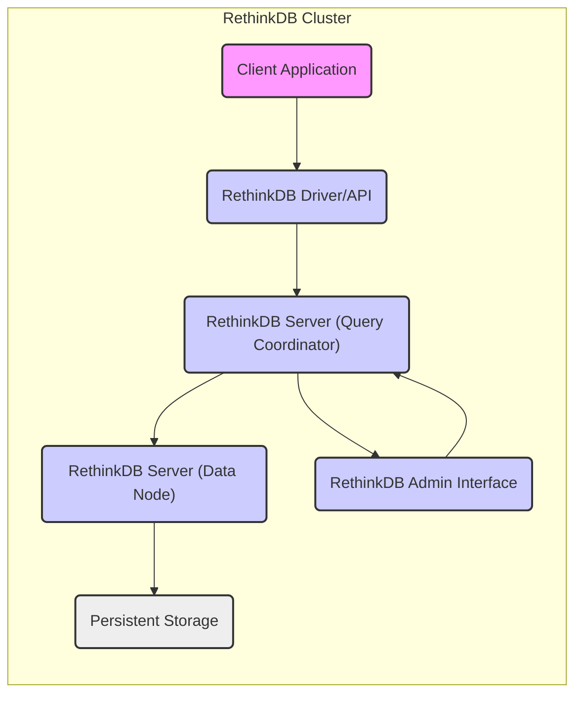
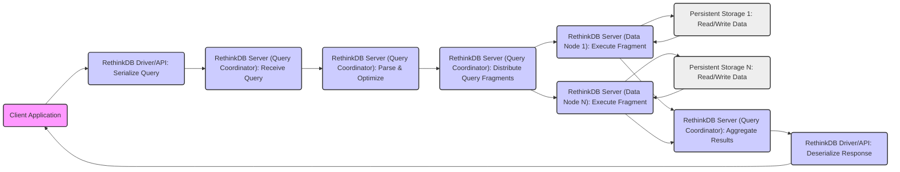
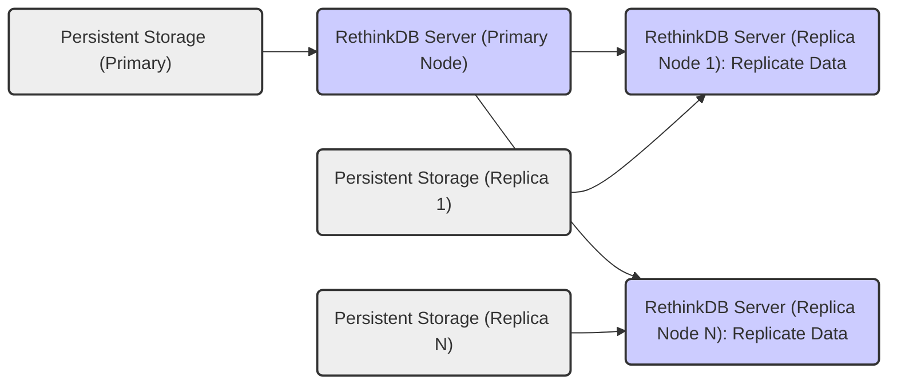
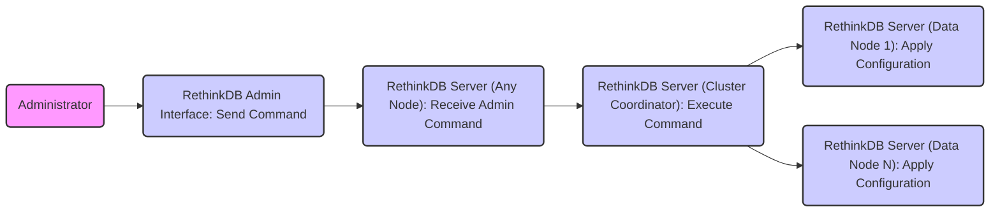

# Project Design Document: RethinkDB for Threat Modeling

**Version:** 1.1
**Date:** October 26, 2023
**Author:** AI Software Architect

## 1. Introduction

This document provides a detailed architectural overview of RethinkDB, an open-source, distributed document database, specifically tailored for use in threat modeling exercises. It outlines the key components, data flows, and interactions within the system to facilitate the identification of potential security vulnerabilities and attack vectors. This document is based on the information available in the official RethinkDB GitHub repository: [https://github.com/rethinkdb/rethinkdb](https://github.com/rethinkdb/rethinkdb).

## 2. Goals and Objectives

The primary goal of this document is to provide a comprehensive architectural understanding of RethinkDB to enable effective threat modeling. Specific objectives include:

*   Identifying the core components of the RethinkDB system and their security responsibilities.
*   Mapping the data flow between these components, highlighting potential interception or manipulation points.
*   Understanding the communication protocols used and their inherent security characteristics.
*   Outlining the key functionalities and responsibilities of each component, with a focus on security implications.
*   Providing a foundation for identifying potential security weaknesses, attack surfaces, and threat actors.

## 3. System Architecture Overview

RethinkDB follows a distributed architecture with a cluster of interconnected servers. Clients interact with the cluster to perform database operations.

## 4. Key Components

This section details the major components of the RethinkDB system, emphasizing their security roles and potential vulnerabilities.

*   **Client Application:**
    *   Represents any application or service that interacts with the RethinkDB database.
    *   Security Responsibility: Authenticating to the database (if required), handling sensitive data securely, and preventing injection vulnerabilities in queries.
    *   Potential Vulnerabilities: SQL/NoSQL injection, insecure storage of credentials, compromised application leading to database access.

*   **RethinkDB Driver/API:**
    *   Provides a language-specific interface for client applications to interact with the RethinkDB server.
    *   Security Responsibility: Securely establishing connections, serializing and deserializing data, and potentially handling authentication credentials.
    *   Potential Vulnerabilities: Vulnerabilities in the driver code itself (e.g., buffer overflows, insecure parsing), insecure handling of connection strings or credentials.

*   **RethinkDB Server:**
    *   The core component of the RethinkDB cluster.
    *   Security Responsibility: Enforcing authentication and authorization, managing data access, ensuring data integrity, and protecting against denial-of-service attacks.
    *   Potential Vulnerabilities: Unpatched server vulnerabilities, misconfigurations in access control, denial-of-service vulnerabilities, insecure inter-node communication.

*   **Query Coordinator:**
    *   A role within the RethinkDB server responsible for receiving client queries.
    *   Security Responsibility: Validating and sanitizing queries to prevent injection attacks, enforcing access control policies, and securely distributing query execution.
    *   Potential Vulnerabilities: Query injection vulnerabilities if input is not properly sanitized, privilege escalation if authorization checks are flawed.

*   **Data Node:**
    *   A role within the RethinkDB server responsible for storing and managing a subset of the database.
    *   Security Responsibility: Securely storing data, enforcing access control for local data access, and participating in secure data replication.
    *   Potential Vulnerabilities: Unauthorized access to local storage if not properly secured, vulnerabilities in data replication protocols.

*   **Persistent Storage:**
    *   The underlying storage mechanism used by RethinkDB to persist data.
    *   Security Responsibility: Protecting data at rest through encryption and access controls.
    *   Potential Vulnerabilities: Data breaches due to unencrypted storage, unauthorized access to storage volumes.

*   **RethinkDB Admin Interface:**
    *   A web-based interface for managing and monitoring the RethinkDB cluster.
    *   Security Responsibility: Securely authenticating administrators, authorizing administrative actions, and protecting against unauthorized access to management functions.
    *   Potential Vulnerabilities: Weak authentication mechanisms, lack of authorization checks, cross-site scripting (XSS), cross-site request forgery (CSRF), exposure of sensitive information.

## 5. Data Flow

This section describes the typical data flow within the RethinkDB system for common operations, highlighting potential security concerns at each stage.

### 5.1. Client Query Execution

*   **Client Application to Driver:** Potential for interception or manipulation of the query if the connection is not secure.
*   **Driver to Query Coordinator:**  Vulnerable to network attacks if the connection is not encrypted. Malicious drivers could send crafted queries.
*   **Query Coordinator Processing:**  Risk of query injection if parsing and optimization do not properly sanitize input.
*   **Query Coordinator to Data Nodes:**  Interception or manipulation of query fragments during distribution.
*   **Data Nodes to Persistent Storage:**  Unauthorized access to storage or data manipulation if storage is not properly secured.
*   **Data Nodes back to Query Coordinator:**  Tampering with results during aggregation.
*   **Query Coordinator to Driver:**  Interception of sensitive data in the response.
*   **Driver to Client Application:**  Insecure transmission or storage of the response within the client application.

### 5.2. Data Replication

*   **Primary to Replica Nodes:**  Replication traffic is a potential target for interception and manipulation, leading to data inconsistencies or exposure. Secure protocols should be used for replication.

### 5.3. Administrative Operations

*   **Administrator to Admin Interface:**  Credentials and commands transmitted over this channel must be protected (HTTPS is crucial).
*   **Admin Interface to Server:**  Authentication and authorization are critical to prevent unauthorized administrative actions.
*   **Cluster Coordinator to Data Nodes:**  Secure communication is needed to ensure configuration changes are applied correctly and are not tampered with.

## 6. Communication Protocols

Understanding the communication protocols used by RethinkDB is crucial for identifying potential network-based attacks and assessing the effectiveness of security controls.

*   **Client-to-Server Communication:**
    *   Protocol: Custom binary protocol over TCP.
    *   Security Considerations: The security of this communication depends on whether encryption (like TLS/SSL) is implemented and configured. Without encryption, data in transit is vulnerable to eavesdropping and manipulation. Authentication mechanisms used within this protocol need to be robust.

*   **Inter-Server Communication (within the cluster):**
    *   Protocol: Custom binary protocol over TCP.
    *   Security Considerations: Similar to client-to-server communication, encryption is vital to protect data exchanged between nodes during replication, query distribution, and cluster management. Authentication and authorization between nodes are also necessary to prevent rogue nodes from joining the cluster or interfering with operations.

*   **Admin Interface Communication:**
    *   Protocol: HTTP/HTTPS.
    *   Security Considerations: HTTPS must be enforced to protect administrative credentials and commands transmitted over the network. Proper configuration of TLS/SSL is essential to prevent man-in-the-middle attacks.

## 7. Security Considerations

This section expands on the initial security considerations, categorizing them for clarity.

*   **Authentication and Authorization:**
    *   Considerations: Strength of password policies, multi-factor authentication for administrative access, granular role-based access control, secure storage of credentials.
    *   Threats: Brute-force attacks, credential stuffing, privilege escalation, unauthorized access to data or administrative functions.

*   **Network Security:**
    *   Considerations: Use of TLS/SSL for all network communication, network segmentation to isolate the database cluster, firewall rules to restrict access, intrusion detection/prevention systems.
    *   Threats: Man-in-the-middle attacks, eavesdropping, data breaches, unauthorized access to the cluster.

*   **Data Security:**
    *   Considerations: Encryption at rest for persistent storage, encryption in transit for all network communication, data masking or anonymization for non-production environments, regular data backups and secure storage of backups.
    *   Threats: Data breaches, unauthorized data modification, loss of sensitive data.

*   **Application Security:**
    *   Considerations: Input validation and sanitization to prevent injection attacks, secure coding practices in client applications and drivers, regular security audits and penetration testing.
    *   Threats: SQL/NoSQL injection, cross-site scripting (XSS) via the admin interface, denial-of-service attacks.

*   **Operational Security:**
    *   Considerations: Secure deployment practices, regular security patching of the RethinkDB server and underlying operating system, monitoring and logging of security events, incident response plan.
    *   Threats: Exploitation of known vulnerabilities, misconfigurations leading to security breaches, undetected security incidents.

## 8. Deployment Considerations

The deployment environment significantly impacts the security posture of RethinkDB.

*   **Single Server Deployment:**
    *   Security Implications: Represents a single point of failure and a concentrated attack surface. All security controls must be focused on this single instance.
    *   Considerations: Robust host-level security, strong firewall rules, and careful monitoring are crucial.

*   **Clustered Deployment:**
    *   Security Implications: Increases complexity but provides redundancy. Secure inter-node communication is paramount.
    *   Considerations:  Secure network configuration between nodes, mutual authentication between nodes, and consistent security policies across the cluster.

*   **Cloud Deployment:**
    *   Security Implications: Leverages cloud provider security features but introduces a shared responsibility model.
    *   Considerations:  Proper configuration of cloud security services (e.g., network security groups, encryption services, IAM roles), understanding the cloud provider's security responsibilities, and ensuring compliance with relevant regulations.

## 9. Future Considerations

*   Detailed analysis of the custom binary protocols used for client-server and inter-server communication to identify potential vulnerabilities.
*   Investigation into the specific authentication and authorization mechanisms implemented in RethinkDB and their robustness.
*   Evaluation of the security of the RethinkDB Admin Interface against common web application vulnerabilities.
*   Assessment of the impact of different deployment configurations on the overall security posture.
*   Exploration of potential integrations with security information and event management (SIEM) systems for enhanced monitoring and threat detection.

This document provides a more detailed architectural understanding of the RethinkDB system for threat modeling purposes. The information presented here should be used as a foundation for a comprehensive security analysis, including identifying specific threats, vulnerabilities, and potential mitigations.