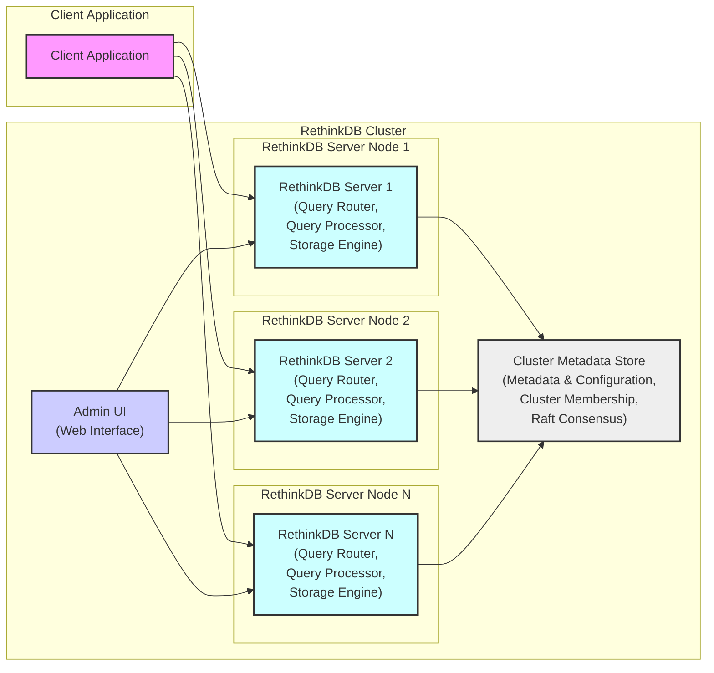

# RethinkDB Project Design Document for Threat Modeling (Improved)

## 1. Project Overview

**Project Name:** RethinkDB

**Project Repository:** [https://github.com/rethinkdb/rethinkdb](https://github.com/rethinkdb/rethinkdb)

**Project Description:** RethinkDB is an open-source, distributed document database architected for real-time applications. Its core innovation lies in its push-based architecture, enabling applications to subscribe to query results and receive updates in real-time as data changes, eliminating the need for constant polling. RethinkDB is designed for horizontal scalability, high availability through replication and automatic failover, and developer-friendliness with a schema-less JSON document model and a powerful, expressive query language, ReQL.

**Key Features:**

*   **Real-time Push Notifications (Change Data Capture - CDC):**  Applications receive near-instantaneous updates for query results, facilitating reactive and collaborative applications.
*   **Scalability and High Availability:**  Cluster-based architecture with automatic sharding and replication ensures horizontal scalability and fault tolerance. Data is distributed across multiple nodes, and replicas provide redundancy.
*   **Flexible Document Model (JSON):** Stores data as JSON documents, offering schema flexibility and ease of use for developers working with modern data formats.
*   **Powerful Query Language (ReQL):** A rich, composable, and chainable query language embedded within various programming languages, allowing for complex data manipulations and queries directly within application code.
*   **User-Friendly Administration:** Web-based administration console provides a graphical interface for cluster management, monitoring, query execution, and database administration tasks.
*   **ACID Transactions:** Supports Atomicity, Consistency, Isolation, and Durability (ACID) properties for transactional operations, ensuring data integrity even in complex scenarios.
*   **Automatic Failover and Recovery:**  In case of node failures, the cluster automatically detects and recovers, ensuring continuous operation and data availability.

**Target Use Cases:**

*   **Real-time Web Applications:** Chat applications, live dashboards, collaborative editing tools, social media feeds, and real-time analytics platforms.
*   **Gaming Backends:** Real-time game state management, player synchronization, and leaderboard updates.
*   **Internet of Things (IoT) Data Processing:** Ingesting, processing, and reacting to real-time data streams from IoT devices.
*   **Operational Intelligence and Monitoring:** Real-time monitoring of systems, applications, and infrastructure with immediate alerts and visualizations.
*   **Mobile Application Backends:** Providing real-time data synchronization and updates for mobile clients.

## 2. System Architecture

### 2.1. High-Level Architecture Diagram

### 2.2. Component Description

1.  **Client Application:**
    *   Represents any application (web, mobile, desktop, server-side) that interacts with the RethinkDB cluster.
    *   Utilizes official RethinkDB client drivers available for various programming languages (Python, JavaScript, Java, Ruby, Go, C#, etc.). These drivers handle connection management, query serialization, and result deserialization.
    *   Initiates connections to the RethinkDB cluster, sends ReQL queries over TCP, and receives query results and real-time change notifications.

2.  **RethinkDB Server Node:**
    *   A fundamental building block of a RethinkDB cluster. Each server node is a single process instance.
    *   Multiple server nodes are deployed to form a distributed cluster, providing scalability and high availability.
    *   Each server node encompasses the following key functionalities:
        *   **Query Router:**  Accepts client connections and incoming ReQL queries. Routes queries to the appropriate Query Processor within the cluster, potentially based on data sharding and query type.
        *   **Query Processor:** Parses, validates, optimizes, and executes ReQL queries. Interacts with the Storage Engine to retrieve and manipulate data. Manages real-time query subscriptions and pushes change notifications to subscribed clients. Coordinates distributed queries across multiple nodes if necessary.
        *   **Storage Engine:** Responsible for persistent data storage and retrieval on local disk. Manages data indexing (likely B-trees or similar structures), caching (in-memory for performance), and transaction management. Handles data replication to other nodes in the replica set for fault tolerance.  Historically used a custom built storage engine, but details of current implementation should be verified in the codebase.

3.  **Cluster Metadata Store:**
    *   A critical component responsible for maintaining the consistent state and configuration of the entire RethinkDB cluster.
    *   Stores essential metadata including:
        *   **Cluster Topology:**  Information about all server nodes in the cluster, their roles (e.g., server, voting member), current status (online, offline), and network addresses.
        *   **Database and Table Definitions:** Schema information, table configurations (sharding, replication settings), and index definitions.
        *   **Sharding and Replication Configuration:**  Mapping of data shards to server nodes and replica sets.
        *   **Query Subscriptions:**  Information about active real-time query subscriptions and their associated clients.
        *   **Access Control Lists (ACLs):** User accounts, permissions, and roles for authentication and authorization.
    *   Implements a distributed consensus algorithm (likely Raft or a variant) to ensure consistency and fault tolerance of the metadata store across the cluster. This ensures that all nodes have a consistent view of the cluster state.

4.  **Admin UI:**
    *   A web-based graphical user interface (GUI) for administering and monitoring the RethinkDB cluster.
    *   Provides functionalities for:
        *   **Cluster Setup and Configuration:**  Initializing new clusters, adding/removing nodes, configuring cluster-wide settings.
        *   **Database and Table Management:** Creating, deleting, and modifying databases and tables. Managing indexes and configuring sharding/replication.
        *   **Query Execution and Data Browsing:**  Executing ad-hoc ReQL queries, browsing data within tables, and inspecting database contents.
        *   **Performance Monitoring and Diagnostics:**  Monitoring cluster performance metrics (CPU usage, memory usage, disk I/O, query latency), viewing logs, and diagnosing potential issues.
        *   **User and Permission Management:**  Creating and managing user accounts, assigning roles and permissions for access control.

## 3. Data Flow

### 3.1. Write Operation (e.g., `insert`, `update`, `delete`)

1.  **Client Application initiates a write operation by sending a ReQL query to a RethinkDB server node.** The client driver typically performs initial connection routing, potentially using a load-balancing mechanism or connecting to a known server address.
2.  **The receiving server node's Query Router component accepts the connection and the ReQL query.**
3.  **The Query Processor parses and validates the ReQL query syntax and semantics.** It checks for authorization to perform the requested operation on the target database and table.
4.  **The Query Processor determines the target shard(s) and replica set(s) responsible for the data being written.** This is based on the table's sharding key and configuration, and metadata from the Cluster Metadata Store.
5.  **The Query Processor routes the write operation to the *primary replica* of the target shard.**  RethinkDB uses a primary-replica model for replication within each shard.
6.  **On the primary replica node, the Storage Engine receives the write request.**
    *   **Transaction Start:**  Initiates an ACID transaction to ensure data consistency.
    *   **Write to Local Storage:**  Applies the write operation to the local storage engine (in-memory cache and persistent storage on disk). This might involve updating indexes and data structures.
    *   **Write-Ahead Logging (WAL):**  Logs the write operation to a write-ahead log for durability and crash recovery.
7.  **Replication to Secondary Replicas:** The primary replica's Storage Engine asynchronously replicates the write operation (or WAL entries) to all secondary replicas within the same replica set.
8.  **Secondary Replicas Apply Write:** Each secondary replica's Storage Engine receives the replicated write operation and applies it to its local storage, also within a transaction.
9.  **Acknowledgement and Commit:** Once the write operation is successfully applied to a quorum of replicas (including the primary, and typically a majority), the primary replica considers the write committed.
10. **Response to Client:** The primary replica's Query Processor sends a success acknowledgement back to the Client Application, confirming the write operation. The transaction is committed.

### 3.2. Read Operation (e.g., `get`, `filter`, `table scan`)

1.  **Client Application sends a read query to a RethinkDB server node.**
2.  **The receiving server node's Query Router accepts the connection and the ReQL query.**
3.  **The Query Processor parses and validates the ReQL query.** It checks for authorization to read the requested data.
4.  **The Query Processor determines the target shard(s) and replica set(s) containing the data.**
5.  **Query Routing and Execution:** The Query Processor can route the read query to a suitable replica. For read scalability, RethinkDB can serve read queries from *secondary replicas* as well as the primary. The choice might depend on factors like read consistency requirements and load balancing strategies.
6.  **Data Retrieval from Storage Engine:** The selected replica's Storage Engine retrieves the requested data from its local storage (potentially from in-memory cache or disk).
7.  **Data Processing:** The Storage Engine returns the raw data to the Query Processor. The Query Processor performs any necessary data processing steps as specified in the ReQL query (e.g., filtering, sorting, aggregations, transformations).
8.  **Response to Client:** The Query Processor serializes the query results and sends them back to the Client Application.

### 3.3. Real-time Feed (Change Data Capture - CDC)

1.  **Client Application subscribes to a real-time feed by executing a ReQL query with the `changes()` command.** This query specifies the data to be monitored for changes (e.g., changes to a specific table or a filtered subset of data).
2.  **Subscription Registration:** The Query Processor on the server node receiving the subscription request registers the subscription. This involves storing the query, the client connection information, and the data being monitored.
3.  **Change Detection:** As write operations (insert, update, delete) occur within the cluster that affect the data being monitored by active subscriptions:
    *   The Storage Engine, during write operations, detects data modifications.
    *   The Query Processor is notified of these changes.
4.  **Change Notification and Push:**
    *   The Query Processor identifies all active real-time subscriptions that are affected by the data change.
    *   For each affected subscription, the Query Processor constructs a change notification message. This message typically includes a diff (the changes made to the document) or the full updated document, depending on the subscription configuration.
    *   **The Query Processor pushes the change notification message to the subscribed Client Application over the persistent, long-lived TCP connection established during subscription.** This push is immediate and asynchronous.
5.  **Client Receives Real-time Updates:** The Client Application's RethinkDB driver receives the pushed change notifications and delivers them to the application logic for processing and reaction.

## 4. Technology Stack (Inferred and Subject to Verification)

*   **Core Server ( `rethinkdb` process):**
    *   **Programming Language:** Primarily C++ for performance, system-level access, and memory management in core components like the storage engine and networking. Potentially some parts in other languages (e.g., Lua for scripting in older versions, needs verification).
    *   **Storage Engine:**  Historically a custom-built storage engine optimized for document databases and real-time operations.  Internal details need to be verified from the codebase.  Possibility of incorporating or evolving towards components like RocksDB or similar embedded key-value stores for persistence.
    *   **Networking:** Asynchronous, event-driven networking using libraries like `libuv` or `Boost.Asio` for handling concurrent client connections and inter-node communication efficiently.
    *   **Concurrency and Parallelism:**  Multi-threading and asynchronous programming techniques for handling concurrent queries, replication, and background tasks.
    *   **Inter-Process Communication (IPC):** Mechanisms for communication between different components within a server node, if applicable.
*   **Client Drivers (Language-Specific Libraries):**
    *   **Programming Languages:**  Python, JavaScript (Node.js), Java, Ruby, Go, C#, and potentially others.
    *   **Communication Protocol:**  Proprietary binary protocol over TCP/IP, designed for efficient serialization/deserialization of ReQL queries and results, and optimized for real-time push notifications. Protocol details are likely documented or can be reverse-engineered from driver code.
*   **Admin UI (Web Interface):**
    *   **Frontend:** JavaScript, HTML, CSS. Likely utilizes a modern JavaScript framework/library (React, Angular, Vue.js, or similar) for building a dynamic and interactive user interface.
    *   **Backend (for Admin UI):**  Potentially integrated within the RethinkDB server process itself, or a separate lightweight backend service. Likely uses similar technologies as the core server for communication and data access.
*   **Cluster Coordination and Metadata Management:**
    *   **Consensus Algorithm:**  Raft consensus algorithm (or a similar distributed consensus protocol) is highly probable for ensuring consistency and fault tolerance of the Cluster Metadata Store. Raft is a common choice for distributed systems requiring strong consistency.
    *   **Distributed Data Structures:**  Used for managing cluster membership, leader election, configuration data, and other metadata in a distributed and fault-tolerant manner.

**License:** Apache License 2.0 (Open Source License) - Verify from the repository's `LICENSE` file.

**Note:** This technology stack is inferred based on common practices in database systems, publicly available information about RethinkDB, and general knowledge of similar projects.  **A definitive and accurate technology stack must be verified by direct examination of the RethinkDB project repository source code, build system, and official documentation.**

## 5. Security Considerations for Threat Modeling

This section outlines key security considerations to be explored during threat modeling. These are categorized for clarity and to ensure comprehensive coverage.

### 5.1. Confidentiality

*   **Data Encryption at Rest:**
    *   Is data stored on disk encrypted? If so, what encryption algorithm and key management mechanisms are used?
    *   Threat: Unauthorized access to physical storage media or database files could lead to data breaches if data is not encrypted at rest.
*   **Data Encryption in Transit:**
    *   Is communication between clients and RethinkDB servers encrypted? (e.g., using TLS/SSL).
    *   Is communication between server nodes within the cluster encrypted?
    *   Threat: Network eavesdropping could expose sensitive data if communication channels are not encrypted. Man-in-the-middle attacks could intercept or modify data in transit.
*   **Access Control and Authorization:**
    *   How are user accounts and roles managed?
    *   Is access control enforced at the database, table, or document level?
    *   Are there mechanisms to restrict access based on IP address or other network criteria?
    *   Threat: Unauthorized users or compromised accounts could gain access to sensitive data if access control is weak or misconfigured. Privilege escalation could allow users to access data beyond their intended permissions.

### 5.2. Integrity

*   **Input Validation and Query Sanitization:**
    *   How are ReQL queries validated and sanitized to prevent injection attacks (e.g., ReQL injection, similar to SQL injection)?
    *   Are there mechanisms to prevent malicious or malformed queries from corrupting data?
    *   Threat: Query injection vulnerabilities could allow attackers to bypass security controls, modify data, or execute arbitrary code on the server.
*   **Data Integrity during Replication and Storage:**
    *   Are there mechanisms to ensure data integrity during replication between nodes? (e.g., checksums, data validation).
    *   Are there protections against data corruption due to hardware failures or software bugs in the storage engine?
    *   Threat: Data corruption during replication or storage could lead to inconsistent or unreliable data.
*   **Transaction Management (ACID Properties):**
    *   Are ACID transaction properties correctly implemented and enforced to maintain data consistency in the face of concurrent operations and failures?
    *   Threat:  Violations of ACID properties could lead to data inconsistencies, data loss, or application errors.

### 5.3. Availability

*   **Denial of Service (DoS) Protection:**
    *   Are there rate limiting mechanisms to prevent excessive requests from clients or malicious actors?
    *   Are there resource management controls to limit resource consumption (CPU, memory, disk I/O, connections) by individual queries or clients?
    *   Threat: DoS attacks could overwhelm the RethinkDB cluster, making it unavailable to legitimate users. Resource exhaustion could lead to performance degradation or system crashes.
*   **Fault Tolerance and High Availability:**
    *   How robust is the cluster against node failures? (Automatic failover, replication, data recovery).
    *   Are there single points of failure in the architecture?
    *   Threat: Node failures or infrastructure outages could lead to service disruptions and data unavailability if the system is not designed for high availability.
*   **Backup and Recovery:**
    *   Are there mechanisms for backing up and restoring RethinkDB data?
    *   What is the recovery process in case of data loss or system failures?
    *   Threat: Lack of proper backup and recovery procedures could lead to permanent data loss in case of catastrophic failures.

### 5.4. Authentication and Authorization

*   **Authentication Mechanisms:**
    *   What authentication methods are supported for client connections and Admin UI access? (Username/password, API keys, certificate-based authentication, etc.)
    *   Are authentication credentials securely stored and managed?
    *   Threat: Weak authentication mechanisms or compromised credentials could allow unauthorized access to the system. Brute-force attacks or credential stuffing could be successful if authentication is not robust.
*   **Authorization Enforcement:**
    *   How is authorization enforced after successful authentication? (Role-Based Access Control - RBAC, Access Control Lists - ACLs).
    *   Are permissions correctly configured and enforced to prevent unauthorized actions?
    *   Threat:  Insufficient or misconfigured authorization could allow authenticated users to perform actions beyond their intended privileges.

### 5.5. Admin UI Security

*   **Admin UI Authentication and Authorization:**
    *   How is access to the Admin UI secured? (Separate authentication, multi-factor authentication).
    *   Are there specific roles and permissions for Admin UI users?
    *   Threat: Unauthorized access to the Admin UI could allow attackers to perform administrative actions, compromise the entire cluster, or access sensitive data.
*   **Web Application Vulnerabilities:**
    *   Is the Admin UI protected against common web application vulnerabilities (Cross-Site Scripting - XSS, Cross-Site Request Forgery - CSRF, SQL Injection in Admin UI queries, etc.)?
    *   Threat: Web application vulnerabilities in the Admin UI could be exploited to gain unauthorized access, execute malicious scripts, or compromise user sessions.

### 5.6. Vulnerability Management and Security Updates

*   **Security Patching and Updates:**
    *   What is the process for identifying, patching, and releasing security updates for RethinkDB?
    *   How are users notified of security vulnerabilities and updates?
    *   Threat: Unpatched vulnerabilities could be exploited by attackers. Delayed or ineffective security updates increase the risk of exploitation.
*   **Dependency Management:**
    *   How are third-party dependencies managed and updated?
    *   Are dependencies regularly scanned for known vulnerabilities?
    *   Threat: Vulnerabilities in third-party dependencies could indirectly affect RethinkDB security.

This improved design document provides a more detailed and structured foundation for conducting a comprehensive threat model of RethinkDB. The next step is to use this document as input for a structured threat modeling exercise (e.g., using STRIDE, PASTA, or other methodologies) to identify specific threats, vulnerabilities, and risks, and to define appropriate security controls and mitigations for each identified threat.