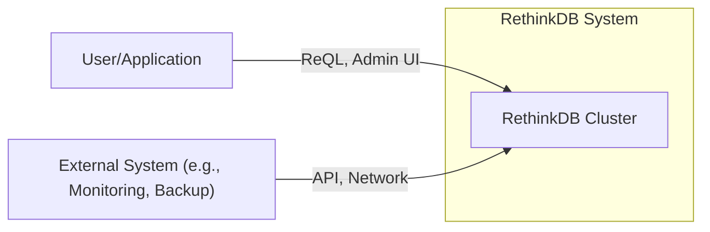
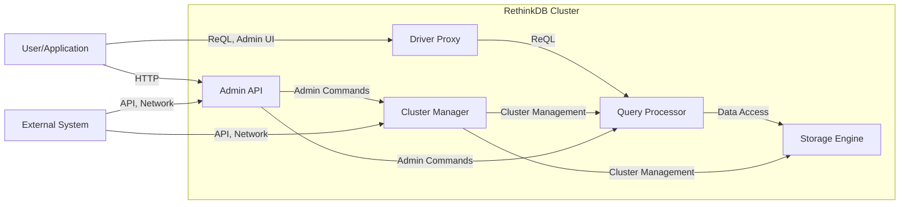
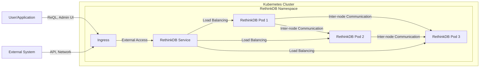
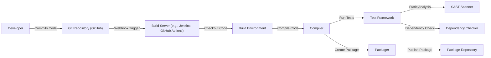

# BUSINESS POSTURE

RethinkDB is an open-source, distributed NoSQL database designed for real-time applications. The business priorities and goals appear to be centered around:

*   Providing a database solution that simplifies the development of real-time applications.
*   Offering a scalable and fault-tolerant database that can handle large amounts of data and high throughput.
*   Building a strong open-source community around the project.
*   Offering a developer-friendly query language (ReQL).
*   Providing ease of use and administration.

Based on these priorities, the most important business risks that need to be addressed are:

*   Data breaches or unauthorized access to sensitive data stored in RethinkDB instances.
*   Denial-of-service attacks that could disrupt the availability of applications relying on RethinkDB.
*   Data loss due to hardware failures, software bugs, or operational errors.
*   Vulnerabilities in the software that could be exploited by attackers.
*   Inability to scale the database to meet growing application demands.
*   Lack of sufficient security features to meet compliance requirements (e.g., GDPR, HIPAA).

# SECURITY POSTURE

The following security controls and accepted risks are inferred from the provided GitHub repository and general knowledge of database systems. It's important to note that a thorough security review would require deeper analysis of the codebase and operational practices.

*   security control: Access control mechanisms (users and permissions). Described in documentation.
*   security control: Network security features (firewall rules, potentially TLS/SSL for client-server and inter-node communication). Partially described in documentation.
*   security control: Data encryption at rest (not explicitly mentioned, likely an area for improvement).
*   security control: Auditing capabilities (logging of administrative actions and data access). Partially described in documentation.
*   security control: Regular security updates and patching process. Implemented as part of the open-source development model.
*   security control: Input validation to prevent injection attacks (ReQL is designed to mitigate this, but specific implementation details need verification).
*   accepted risk: Reliance on the security of the underlying operating system and infrastructure.
*   accepted risk: Potential for vulnerabilities in third-party dependencies.
*   accepted risk: Limited built-in protection against sophisticated attacks (e.g., advanced persistent threats).

Recommended security controls (high priority):

*   Implement data encryption at rest.
*   Enhance auditing capabilities to include detailed data access logging.
*   Provide comprehensive security documentation and best practices guides.
*   Conduct regular security audits and penetration testing.
*   Implement a robust vulnerability management program.
*   Consider integration with external security tools (e.g., SIEM, IDS/IPS).

Security Requirements:

*   Authentication:
    *   Strong password policies for user accounts.
    *   Support for multi-factor authentication (MFA).
    *   Secure storage of user credentials (e.g., using hashing and salting).
    *   Integration with existing authentication systems (e.g., LDAP, Active Directory) - potentially through plugins or extensions.
*   Authorization:
    *   Fine-grained access control to databases, tables, and individual documents.
    *   Role-based access control (RBAC) to simplify user management.
    *   Ability to restrict access based on IP address or network.
*   Input Validation:
    *   Strict validation of all user inputs to prevent injection attacks.
    *   Parameterized queries to avoid ReQL injection vulnerabilities.
    *   Regular expression validation for string inputs.
*   Cryptography:
    *   Use of strong, industry-standard cryptographic algorithms for encryption (e.g., AES-256).
    *   Secure key management practices.
    *   TLS/SSL for all network communication (client-server and inter-node).
    *   Hashing of sensitive data (e.g., passwords) before storage.

# DESIGN

## C4 CONTEXT

Element Descriptions:

*   User/Application:
    *   Name: User/Application
    *   Type: External Entity (User or Application)
    *   Description: Represents a user interacting with the RethinkDB cluster through the Admin UI or an application using the RethinkDB client driver.
    *   Responsibilities: Sending queries, receiving data, managing the database (for administrative users).
    *   Security controls: Authentication, authorization, input validation (at the application level).

*   RethinkDB Cluster:
    *   Name: RethinkDB Cluster
    *   Type: System
    *   Description: The core RethinkDB system, consisting of one or more RethinkDB server instances.
    *   Responsibilities: Storing data, processing queries, managing cluster membership, ensuring data consistency and durability.
    *   Security controls: Access control, network security, auditing (partial), input validation (ReQL).

*   External System (e.g., Monitoring, Backup):
    *   Name: External System
    *   Type: External System
    *   Description: Represents external systems that interact with the RethinkDB cluster for monitoring, backup, or other administrative purposes.
    *   Responsibilities: Monitoring cluster health, performing backups, restoring data.
    *   Security controls: Authentication, authorization, secure communication channels (e.g., TLS/SSL).

## C4 CONTAINER

Element Descriptions:

*   Driver Proxy:
    *   Name: Driver Proxy
    *   Type: Container
    *   Description: Handles incoming client connections and forwards ReQL queries to the Query Processor.
    *   Responsibilities: Connection management, initial request parsing, routing.
    *   Security controls: Network security (firewall, TLS/SSL), initial input validation.

*   Query Processor:
    *   Name: Query Processor
    *   Type: Container
    *   Description: Parses, optimizes, and executes ReQL queries.
    *   Responsibilities: Query parsing, optimization, execution planning, data retrieval.
    *   Security controls: ReQL injection prevention, access control enforcement.

*   Storage Engine:
    *   Name: Storage Engine
    *   Type: Container
    *   Description: Manages data storage, retrieval, and persistence.
    *   Responsibilities: Data storage, indexing, data consistency, durability.
    *   Security controls: Data encryption at rest (recommended), access control enforcement.

*   Cluster Manager:
    *   Name: Cluster Manager
    *   Type: Container
    *   Description: Manages cluster membership, data distribution, and fault tolerance.
    *   Responsibilities: Node discovery, data sharding, replication, failover.
    *   Security controls: Secure inter-node communication (TLS/SSL), access control.

*   Admin API:
    *   Name: Admin API
    *   Type: Container
    *   Description: Provides an interface for administrative tasks, such as cluster configuration and monitoring.
    *   Responsibilities: Handling administrative requests, providing cluster status information.
    *   Security controls: Authentication, authorization, auditing.

## DEPLOYMENT

Possible deployment solutions:

1.  Manual deployment on virtual machines or bare-metal servers.
2.  Deployment using container orchestration platforms like Kubernetes or Docker Swarm.
3.  Deployment on cloud provider-specific managed database services (if available).

Chosen solution: Deployment using Kubernetes.

Element Descriptions:

*   Kubernetes Cluster:
    *   Name: Kubernetes Cluster
    *   Type: Deployment Environment
    *   Description: The Kubernetes cluster where RethinkDB is deployed.
    *   Responsibilities: Resource management, scheduling, networking.
    *   Security controls: Kubernetes RBAC, network policies, pod security policies.

*   RethinkDB Namespace:
    *   Name: RethinkDB Namespace
    *   Type: Logical Grouping
    *   Description: A Kubernetes namespace dedicated to RethinkDB resources.
    *   Responsibilities: Isolating RethinkDB resources from other applications.
    *   Security controls: Namespace-level access control.

*   RethinkDB Pod (1, 2, 3):
    *   Name: RethinkDB Pod
    *   Type: Pod
    *   Description: A Kubernetes pod running a RethinkDB server instance. Multiple pods provide redundancy and scalability.
    *   Responsibilities: Running a RethinkDB server instance.
    *   Security controls: Container security best practices, resource limits.

*   RethinkDB Service:
    *   Name: RethinkDB Service
    *   Type: Service
    *   Description: A Kubernetes service that provides a stable endpoint for accessing the RethinkDB cluster.
    *   Responsibilities: Load balancing traffic across RethinkDB pods.
    *   Security controls: Network policies.

*   Ingress:
    *   Name: Ingress
    *   Type: Ingress
    *   Description: A Kubernetes ingress controller that manages external access to the RethinkDB service.
    *   Responsibilities: Routing external traffic to the RethinkDB service.
    *   Security controls: TLS/SSL termination, access control (e.g., IP whitelisting).

## BUILD

The RethinkDB build process involves compiling the source code from the GitHub repository and creating distributable packages.  While the repository doesn't explicitly define a CI/CD pipeline, a typical build process would involve the following steps and security controls:

*   Developer:
    *   Commits code changes to the Git repository.
*   Git Repository (GitHub):
    *   Hosts the source code and triggers the build process via webhooks.
    *   security control: Branch protection rules to enforce code reviews and prevent unauthorized merges.
    *   security control: Git commit signing to verify the authenticity of commits.
*   Build Server (e.g., Jenkins, GitHub Actions):
    *   Automates the build process.
    *   security control: Secure configuration of the build server to prevent unauthorized access.
    *   security control: Use of build secrets management to protect sensitive information (e.g., API keys, passwords).
*   Build Environment:
    *   Provides the necessary tools and dependencies for building the software.
    *   security control: Use of isolated build environments (e.g., containers) to prevent contamination.
*   Compiler:
    *   Compiles the source code into executable binaries.
*   Test Framework:
    *   Runs unit tests, integration tests, and other tests to ensure code quality.
*   SAST Scanner:
    *   Performs static analysis of the source code to identify potential security vulnerabilities.
    *   security control: Integration of SAST tools (e.g., SonarQube, Coverity) into the build pipeline.
*   Dependency Checker:
    *   Analyzes project dependencies for known vulnerabilities.
    *   security control: Use of dependency checking tools (e.g., OWASP Dependency-Check, Snyk) to identify and mitigate vulnerable dependencies.
*   Packager:
    *   Creates distributable packages (e.g., .deb, .rpm, Docker images).
*   Package Repository:
    *   Stores the built packages for distribution.
    *   security control: Secure configuration of the package repository to prevent unauthorized access and tampering.

# RISK ASSESSMENT

*   Critical Business Processes:
    *   Real-time data delivery to applications.
    *   Data storage and retrieval for applications.
    *   Database administration and management.

*   Data Sensitivity:
    *   The sensitivity of the data stored in RethinkDB depends on the specific applications using it. It could range from non-sensitive data to highly sensitive personal data, financial data, or health information.
    *   RethinkDB itself stores metadata about the database structure, user accounts, and potentially logs, which could be considered sensitive.

# QUESTIONS & ASSUMPTIONS

*   Questions:
    *   What are the specific compliance requirements (e.g., GDPR, HIPAA) that apply to applications using RethinkDB?
    *   What is the expected scale and performance requirements for RethinkDB deployments?
    *   What are the existing security policies and procedures for managing RethinkDB instances?
    *   What level of detail is available regarding the internal implementation of security controls (e.g., ReQL injection prevention)?
    *   Are there any existing integrations with external security tools or services?
    *   What is the process for handling security vulnerabilities reported by external researchers?

*   Assumptions:
    *   BUSINESS POSTURE: The primary goal is to provide a reliable and performant real-time database, with security being a critical consideration but potentially balanced against development speed and ease of use.
    *   SECURITY POSTURE: The project follows basic security best practices, but there may be gaps in areas like data encryption at rest and comprehensive auditing.
    *   DESIGN: The deployment will be on a Kubernetes cluster, and the build process will involve standard security checks like SAST and dependency scanning. The provided diagrams are a reasonable representation of the system architecture, but further details may be needed for a complete threat model.