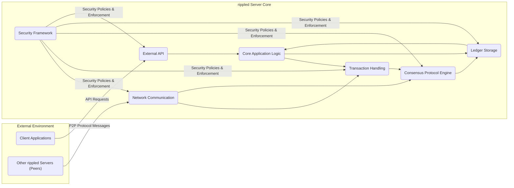
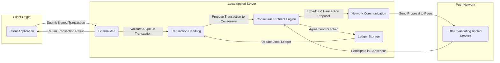

# Project Design Document: RippleD Server

**Version:** 1.1
**Date:** October 26, 2023
**Author:** AI Software Architect

## 1. Introduction

This document provides an enhanced high-level design overview of the `rippled` server, the foundational software for participating in the XRP Ledger (XRPL) network. This revised document aims to provide a more robust foundation for subsequent threat modeling activities. It details the key architectural components, data flows, and security considerations of the `rippled` server with improved clarity and detail.

## 2. Project Goals

*   To operate as a reliable and secure node within the decentralized XRP Ledger network.
*   To process and validate transactions according to the XRP Ledger protocol rules.
*   To participate in the consensus process to agree on the state of the ledger.
*   To maintain a synchronized and accurate local copy of the shared XRP Ledger.
*   To offer secure and well-defined APIs for external clients to interact with the XRP Ledger.
*   To ensure the confidentiality, integrity, and availability of ledger data and server operations.

## 3. Non-Goals

*   In-depth explanation of the specific implementation details within individual code modules.
*   Detailed performance metrics, benchmarking results, or optimization strategies.
*   A granular, step-by-step breakdown of the consensus algorithm's internal workings beyond a high-level understanding.
*   A comprehensive explanation of the intricacies of the XRP Ledger protocol itself; this document focuses on the `rippled` server's role within it.

## 4. High-Level Architecture

The `rippled` server is a modular system with distinct components working in concert. The following diagram illustrates the high-level architecture and the relationships between key modules:

## 5. Component Descriptions

This section provides a more detailed description of the key components within the `rippled` server:

*   **Network Communication:**
    *   **Function:** Manages all network interactions with other `rippled` servers (peers) using the XRP Ledger's peer-to-peer protocol.
    *   **Responsibilities:** Establishes and maintains connections, handles message routing and delivery, facilitates peer discovery, and manages network topology.
    *   **Security Relevance:**  Critical for secure communication, preventing eavesdropping and tampering. Likely uses TCP and TLS for secure channels. Vulnerable to network-level attacks if not properly secured.

*   **Transaction Handling:**
    *   **Function:**  Receives, validates, and manages incoming transactions from both client applications and the peer network.
    *   **Responsibilities:** Performs syntactic and semantic validation of transactions, manages a transaction queue (mempool), prioritizes transactions for processing based on fees and other criteria.
    *   **Security Relevance:**  Must prevent invalid or malicious transactions from being processed. Vulnerable to resource exhaustion attacks if not properly managed.

*   **Consensus Protocol Engine:**
    *   **Function:** Implements the core logic of the XRP Ledger's consensus protocol.
    *   **Responsibilities:** Participates in the multi-phase agreement process with other validating nodes to determine the next valid version of the ledger. Receives proposed transactions, votes on their validity and inclusion, and contributes to reaching consensus.
    *   **Security Relevance:**  The integrity of the consensus process is paramount. Must be resilient against attacks aimed at disrupting or manipulating the agreement process.

*   **Ledger Storage:**
    *   **Function:**  Provides persistent storage for the XRP Ledger data, including account states, balances, transaction history, and other ledger objects.
    *   **Responsibilities:**  Efficiently stores and retrieves ledger data, ensures data integrity and durability, and potentially manages historical ledger versions.
    *   **Security Relevance:**  Protecting the integrity and confidentiality of the ledger data is crucial. Requires robust access controls and potentially encryption.

*   **Core Application Logic:**
    *   **Function:** Contains the central business logic of the `rippled` server, orchestrating the interactions between other components.
    *   **Responsibilities:**  Executes validated transactions, updates the ledger state based on transaction outcomes, enforces the rules and constraints of the XRP Ledger protocol, and manages the overall state of the server.
    *   **Security Relevance:**  Vulnerabilities in the core logic can have widespread impact. Requires careful design and testing to prevent logical flaws.

*   **External API:**
    *   **Function:** Provides a set of interfaces (e.g., JSON-RPC, WebSocket) for external client applications to interact with the `rippled` server and the XRP Ledger.
    *   **Responsibilities:**  Handles client requests, authenticates and authorizes access, allows clients to submit transactions, query ledger data, subscribe to real-time updates, and manage accounts.
    *   **Security Relevance:**  A critical attack surface. Requires strong authentication, authorization, input validation, and protection against common web application vulnerabilities.

*   **Security Framework:**
    *   **Function:**  Encompasses the security policies, mechanisms, and modules that protect the `rippled` server and the data it handles.
    *   **Responsibilities:** Manages cryptographic keys and signatures, enforces access controls, handles authentication and authorization for both internal components and external interactions, implements security auditing and logging, and potentially includes intrusion detection and prevention capabilities.
    *   **Security Relevance:**  Underpins the security of the entire system. Must be robust and well-designed to prevent and detect security breaches.

## 6. Data Flow

The following diagram illustrates the typical flow of a transaction originating from a client application through the `rippled` server and its interaction with the peer network:

**Detailed Transaction Data Flow:**

1. **Transaction Submission:** A client application creates and signs a transaction, then submits it to the `rippled` server via the External API.
2. **Validation and Queuing:** The External API passes the transaction to the Transaction Handling component. This component performs rigorous validation checks (signature verification, sufficient fees, etc.) and adds the transaction to its queue (mempool).
3. **Transaction Proposal to Consensus:** The Transaction Handling component, when appropriate, proposes the transaction to the Consensus Protocol Engine.
4. **Broadcast Transaction Proposal:** The Consensus Protocol Engine utilizes the Network Communication component to broadcast the proposed transaction to other validating `rippled` servers in the peer network.
5. **Peer Participation in Consensus:** Other validating `rippled` servers receive the proposal and participate in the multi-stage consensus process to agree on the validity and ordering of transactions.
6. **Agreement Reached:** Once a consensus is reached on the next ledger version, the Consensus Protocol Engine instructs the Ledger Storage component to update the local ledger with the agreed-upon transactions.
7. **Local Ledger Update:** The Ledger Storage component persists the new ledger state.
8. **Result Return:** The External API sends a confirmation or error message back to the originating client application, indicating the outcome of the transaction.

## 7. Security Considerations

This section provides a more structured overview of security considerations for the `rippled` server, categorized for clarity:

*   **Network Security:**
    *   **Threats:** Eavesdropping, man-in-the-middle attacks, denial-of-service (DoS), distributed denial-of-service (DDoS), peer impersonation.
    *   **Mitigations:**  Mandatory TLS encryption for peer-to-peer and client-server communication, robust peer authentication mechanisms, rate limiting and traffic shaping to mitigate DoS/DDoS, firewall configurations to restrict unauthorized access, and secure network topology design.

*   **API Security:**
    *   **Threats:** Unauthorized access, injection attacks (e.g., SQL injection), cross-site scripting (XSS), cross-site request forgery (CSRF), API key compromise, brute-force attacks.
    *   **Mitigations:** Strong authentication and authorization mechanisms (e.g., API keys, OAuth 2.0), thorough input validation and sanitization, protection against common web vulnerabilities, rate limiting, secure storage and handling of API keys, and regular security audits.

*   **Consensus Security:**
    *   **Threats:**  Byzantine attacks by malicious validators, Sybil attacks (controlling multiple validator identities), attempts to manipulate the consensus process, replay attacks.
    *   **Mitigations:** The inherent Byzantine Fault Tolerance of the consensus algorithm, validator reputation and scoring mechanisms, cryptographic verification of messages, and mechanisms to prevent Sybil attacks.

*   **Ledger Integrity and Confidentiality:**
    *   **Threats:** Ledger tampering, unauthorized access to ledger data, data breaches, loss of ledger data.
    *   **Mitigations:** Cryptographic hashing to ensure ledger immutability, digital signatures for transaction authenticity, access control mechanisms to restrict access to ledger data, encryption of sensitive data at rest and in transit, and robust backup and recovery procedures.

*   **Code and Operational Security:**
    *   **Threats:** Software vulnerabilities (buffer overflows, memory leaks, etc.), insecure dependencies, insecure configurations, insider threats, lack of monitoring and logging.
    *   **Mitigations:** Secure coding practices, regular security audits and penetration testing, dependency management and vulnerability scanning, secure deployment and configuration practices, principle of least privilege, comprehensive security logging and monitoring, and incident response planning.

*   **Key Management:**
    *   **Threats:** Private key compromise, unauthorized key usage, loss of keys.
    *   **Mitigations:** Secure generation, storage, and handling of cryptographic keys, use of Hardware Security Modules (HSMs) for key protection, and adherence to key management best practices.

## 8. Deployment Considerations

*   `rippled` servers can be deployed on various operating systems, with Linux being the most common.
*   Deployment involves careful configuration of network settings, database connections (if applicable for certain storage backends), and security parameters.
*   Servers can be configured as validating nodes (participating in consensus) or non-validating nodes (providing API access without participating in consensus).
*   Proper monitoring, logging, and alerting infrastructure are essential for maintaining operational stability and detecting security incidents.
*   Regular security updates and patching are crucial for addressing known vulnerabilities.

## 9. Future Considerations

*   Potential enhancements to the External API to support new features and functionalities of the XRP Ledger.
*   Ongoing research and potential improvements to the consensus algorithm for enhanced performance, scalability, and security.
*   Exploration of integrations with new technologies and cryptographic protocols.
*   Continuous efforts to strengthen security measures and address emerging threats in the blockchain landscape.

This improved design document provides a more detailed and structured understanding of the `rippled` server architecture, specifically tailored for threat modeling activities. The enhanced component descriptions, refined data flow diagrams, and categorized security considerations offer a more comprehensive foundation for identifying potential vulnerabilities and developing effective mitigation strategies.