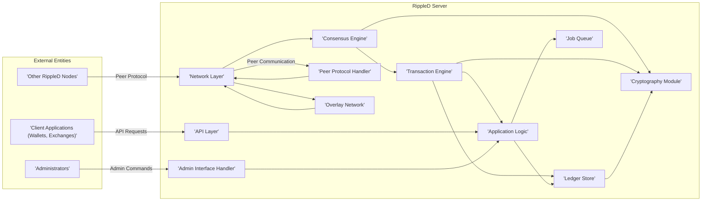
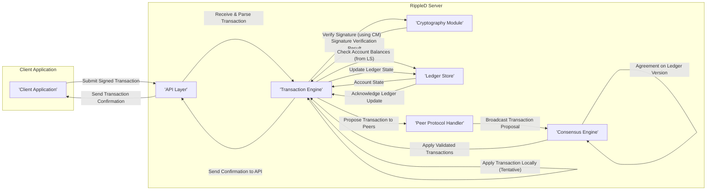
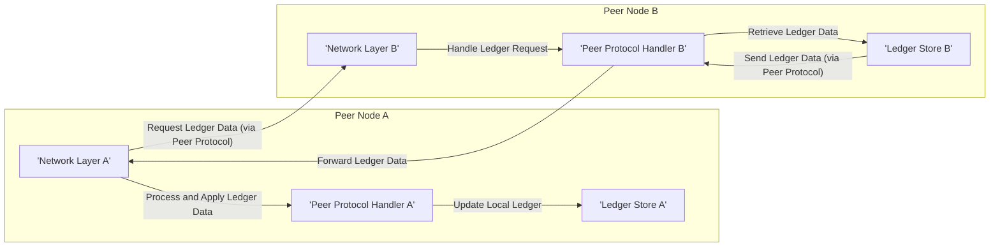

## Project Design Document: RippleD Server for Threat Modeling (Improved)

**1. Project Overview**

This document provides an enhanced architectural design overview of the `rippled` server, the core software implementation of the XRP Ledger protocol. This document is specifically tailored for threat modeling exercises, offering a more granular understanding of the system's components, data flows, and interactions. The information presented is based on the publicly available source code repository: [https://github.com/ripple/rippled](https://github.com/ripple/rippled).

**2. Goals**

* Deliver a refined and more detailed overview of the `rippled` server architecture, focusing on security-relevant aspects.
* Provide deeper insights into the functionality and responsibilities of each key component.
* Elaborate on major data flows within the system, including specific data elements.
* Clearly define external interfaces and their interaction patterns, emphasizing security boundaries.
* Serve as a robust and comprehensive foundation for identifying potential security threats, vulnerabilities, and attack vectors.

**3. Target Audience**

* Security engineers, architects, and analysts conducting threat modeling and security assessments.
* Developers working on the `rippled` server or integrating with the XRP Ledger.
* Auditors evaluating the security posture of the XRP Ledger and its implementations.

**4. Architectural Overview**

The `rippled` server operates as a peer in the decentralized XRP Ledger network. It validates transactions, participates in consensus, and maintains a local copy of the shared, public ledger. The architecture is modular, with distinct components handling specific functionalities.

**5. Detailed Component Description**

* **Network Layer:**
    * **Functionality:** Manages all low-level network communication, including establishing and maintaining TCP/IP connections with peers. It handles raw socket operations, connection management, and basic message framing.
    * **Responsibilities:**
        * Establishing outbound connections to known peers.
        * Accepting inbound connections from other peers.
        * Managing connection state (active, idle, disconnected).
        * Implementing basic network security measures (e.g., connection limits).
    * **Key Technologies:** Asio library for asynchronous network operations, TCP/IP sockets.
    * **Security Considerations:** Vulnerable to SYN flood attacks, connection exhaustion, and potentially exploitable bugs in the Asio library.

* **Consensus Engine:**
    * **Functionality:** Implements the core consensus protocol (likely a variant of Federated Byzantine Agreement) that allows the network to agree on the validity and ordering of transactions and the state of the ledger. This involves proposing, voting on, and validating ledger versions.
    * **Responsibilities:**
        * Participating in rounds of consensus voting.
        * Validating proposed ledger states based on protocol rules and cryptographic signatures.
        * Maintaining a view of the network's agreement progress.
        * Detecting and handling disagreements or Byzantine behavior.
    * **Key Technologies:** Custom implementation of the consensus algorithm, relying heavily on cryptographic primitives.
    * **Security Considerations:** Susceptible to attacks that aim to disrupt the consensus process, such as validator collusion, message manipulation, or timing attacks. The security of the cryptographic signatures used in voting is critical.

* **Transaction Engine:**
    * **Functionality:** Processes and validates incoming transactions before they are proposed for consensus. This includes syntax checks, signature verification, account balance checks, and protocol-specific validation rules.
    * **Responsibilities:**
        * Parsing and deserializing transaction data.
        * Verifying the cryptographic signatures of transactions.
        * Ensuring sufficient funds are available in the sender's account.
        * Applying transaction effects to a temporary ledger representation.
        * Enforcing transaction limits and protocol constraints.
    * **Key Technologies:** Cryptographic libraries for signature verification (e.g., EdDSA), data serialization libraries.
    * **Security Considerations:** Vulnerable to transaction malleability attacks, signature forgery if cryptographic implementations are flawed, and denial-of-service attacks through the submission of invalid or resource-intensive transactions.

* **Ledger Store:**
    * **Functionality:** Provides persistent storage for the XRP Ledger data, including account states, transaction history, and other ledger metadata. It offers efficient read and write operations and ensures data integrity.
    * **Responsibilities:**
        * Storing the current and historical states of the ledger.
        * Providing transactional guarantees for ledger updates.
        * Indexing ledger data for efficient querying.
        * Implementing mechanisms for data backup and recovery.
    * **Key Technologies:** Typically uses a high-performance key-value store like RocksDB or LevelDB.
    * **Security Considerations:**  Susceptible to data corruption or loss due to storage failures or malicious attacks. Access control to the underlying database files is crucial. Vulnerabilities in the database software itself could be exploited.

* **Application Logic:**
    * **Functionality:** Contains the core business logic of the `rippled` server, implementing the rules and state transitions defined by the XRP Ledger protocol. This includes logic for processing different transaction types, managing accounts, and enforcing ledger invariants.
    * **Responsibilities:**
        * Implementing the semantics of various transaction types (e.g., payments, offers).
        * Managing account balances and relationships.
        * Enforcing protocol-level constraints and rules.
        * Handling fee calculations and processing.
    * **Key Technologies:**  C++ implementation of the XRP Ledger protocol logic.
    * **Security Considerations:**  Vulnerabilities in the application logic could lead to incorrect state transitions, allowing for the creation of money out of thin air or other protocol violations.

* **API Layer:**
    * **Functionality:** Provides a programmatic interface (typically JSON-RPC over HTTP or WebSockets) for external applications to interact with the `rippled` server. This allows clients to submit transactions, query ledger state, and subscribe to real-time updates.
    * **Responsibilities:**
        * Receiving and parsing API requests.
        * Authenticating and authorizing client requests.
        * Validating API request parameters.
        * Executing requests against the underlying ledger.
        * Formatting and returning API responses.
        * Implementing rate limiting and access controls to prevent abuse.
    * **Key Technologies:** JSON-RPC protocol, HTTP/WebSocket servers, potentially authentication and authorization frameworks.
    * **Security Considerations:**  Vulnerable to common web API security threats such as authentication bypass, authorization flaws, injection attacks (if interacting with databases directly), cross-site scripting (if a web interface is exposed), and denial-of-service attacks.

* **Peer Protocol Handler:**
    * **Functionality:**  Handles the specifics of the peer-to-peer communication protocol used between `rippled` servers. This includes message serialization/deserialization, message routing, and handling different types of peer messages (e.g., transaction proposals, ledger validations).
    * **Responsibilities:**
        * Implementing the message formats and semantics of the peer protocol.
        * Ensuring reliable and ordered delivery of messages.
        * Managing peer connections and disconnections.
        * Implementing security measures for peer communication (e.g., message authentication).
    * **Key Technologies:**  Custom implementation of the peer protocol.
    * **Security Considerations:**  Vulnerable to message forgery, replay attacks, and denial-of-service attacks targeting peer communication. Flaws in the message parsing or handling logic could be exploited.

* **Admin Interface Handler:**
    * **Functionality:** Provides an interface (typically a command-line interface or a separate API) for administrators to manage and monitor the `rippled` server. This includes configuration, monitoring, and maintenance tasks.
    * **Responsibilities:**
        * Handling administrative commands and requests.
        * Authenticating and authorizing administrative users.
        * Providing access to server configuration parameters.
        * Exposing monitoring metrics and logs.
        * Allowing for server control (e.g., starting, stopping).
    * **Key Technologies:** Command-line parsing libraries, potentially a separate API framework with authentication and authorization mechanisms.
    * **Security Considerations:**  A critical attack vector if not properly secured. Vulnerable to unauthorized access, privilege escalation, and the execution of malicious administrative commands.

* **Cryptography Module:**
    * **Functionality:** Provides cryptographic primitives and functions used throughout the `rippled` server for security-sensitive operations, such as signature generation and verification, hashing, and potentially encryption.
    * **Responsibilities:**
        * Implementing cryptographic algorithms (e.g., EdDSA, SHA-256).
        * Providing secure key generation and management facilities.
        * Ensuring the correct and secure usage of cryptographic functions.
    * **Key Technologies:**  Industry-standard cryptographic libraries (e.g., OpenSSL, libsodium).
    * **Security Considerations:**  Vulnerable to weaknesses in the underlying cryptographic algorithms or their implementations. Improper key management practices can lead to compromise.

* **Job Queue:**
    * **Functionality:** Manages asynchronous tasks and background processes within the `rippled` server. This can include tasks like fetching data from other peers, processing large datasets, or handling delayed operations.
    * **Responsibilities:**
        * Queuing and scheduling asynchronous jobs.
        * Managing the execution of jobs.
        * Ensuring jobs are processed reliably and efficiently.
    * **Key Technologies:**  Internal queueing mechanisms or potentially external message queue systems.
    * **Security Considerations:**  Vulnerable to denial-of-service attacks by flooding the job queue with malicious tasks. Improper handling of job execution could lead to resource exhaustion or other issues.

* **Overlay Network:**
    * **Functionality:**  Manages the peer-to-peer network topology and the discovery of other `rippled` nodes. This involves maintaining a list of known peers and mechanisms for discovering new peers.
    * **Responsibilities:**
        * Peer discovery and management.
        * Maintaining network connectivity.
        * Handling peer disconnections and reconnections.
        * Potentially implementing routing or message forwarding logic within the overlay network.
    * **Key Technologies:**  Custom implementation of peer discovery and network management protocols.
    * **Security Considerations:**  Susceptible to Sybil attacks (creation of many fake nodes), eclipse attacks (isolating a node from the network), and routing attacks.

**6. Data Flow Diagrams (Enhanced)**

* **Detailed Transaction Submission and Validation:**

* **Ledger Synchronization Between Peers:**

**7. External Interfaces (Detailed)**

* **Other RippleD Nodes:**
    * **Protocol:** Custom peer protocol with specific message types for transaction propagation, ledger synchronization, and consensus participation.
    * **Purpose:** Maintaining a consistent view of the ledger across the network, achieving consensus on new transactions, and sharing ledger data.
    * **Data Exchanged:** Transactions, ledger headers, ledger data (accounts, objects), validation messages, consensus votes.
    * **Security Considerations:**  Mutual authentication using node keys, message integrity and authenticity checks (likely using digital signatures), protection against message flooding and manipulation.

* **Client Applications (Wallets, Exchanges):**
    * **Protocol:** JSON-RPC over HTTP/WebSockets. Specific API endpoints for submitting transactions, querying account balances, retrieving transaction history, subscribing to ledger events, etc.
    * **Purpose:**  Allowing users and applications to interact with the XRP Ledger, send and receive XRP, and access ledger information.
    * **Data Exchanged:** Transaction requests, account information requests, ledger data queries, subscription requests, event notifications.
    * **Security Considerations:**  Authentication (API keys, potentially OAuth), authorization to control access to specific API endpoints and data, input validation to prevent injection attacks, rate limiting to prevent abuse, secure communication (HTTPS/WSS).

* **Administrators:**
    * **Protocol:** Command-line interface with specific commands for server management, configuration files, potentially a separate administrative API (e.g., REST).
    * **Purpose:**  Managing and monitoring the `rippled` server, configuring its behavior, and performing maintenance tasks.
    * **Data Exchanged:** Configuration parameters, monitoring metrics, log data, administrative commands.
    * **Security Considerations:**  Strong authentication (passwords, key-based authentication), role-based access control to restrict access to sensitive commands, audit logging of administrative actions, secure storage of configuration files and administrative credentials.

**8. Security Considerations (Actionable for Threat Modeling)**

This section provides more specific and actionable security considerations to guide the threat modeling process.

* **Network Security:**
    * **Threat:** DDoS attacks (SYN floods, UDP floods) targeting the Network Layer. **Mitigation:** Implement connection limits, rate limiting, and potentially utilize DDoS mitigation services.
    * **Threat:** Man-in-the-middle attacks on peer connections. **Mitigation:** Enforce TLS encryption for all peer communication, implement mutual authentication.
    * **Threat:** Sybil attacks attempting to gain undue influence in the consensus process. **Mitigation:** Implement mechanisms to limit the number of connections from a single IP address, reputation scoring for peers.
    * **Threat:** Eclipse attacks isolating a node. **Mitigation:** Maintain connections to a diverse set of peers, implement peer monitoring and alerting.

* **Consensus Security:**
    * **Threat:** Attacks by malicious validators attempting to validate invalid transactions. **Mitigation:** Rely on a sufficiently large and diverse set of trusted validators, implement robust validation rules.
    * **Threat:** Bribing or compromising a significant number of validators. **Mitigation:** Implement mechanisms to detect and mitigate validator collusion, ensure validator accountability.
    * **Threat:** Timing attacks exploiting vulnerabilities in the consensus protocol's timing assumptions. **Mitigation:** Implement countermeasures against timing-based attacks, carefully analyze the protocol's timing properties.

* **Transaction Processing Security:**
    * **Threat:** Double-spending attacks. **Mitigation:** The consensus mechanism is the primary defense against double-spending.
    * **Threat:** Replay attacks. **Mitigation:** Include unique nonces or sequence numbers in transactions.
    * **Threat:** Integer overflows or other vulnerabilities in transaction logic. **Mitigation:** Implement thorough input validation and perform security audits of the transaction processing code.
    * **Threat:** Signature forgery due to weaknesses in the cryptography module. **Mitigation:** Use well-vetted cryptographic libraries and follow secure coding practices.

* **Ledger Storage Security:**
    * **Threat:** Unauthorized access to the Ledger Store database. **Mitigation:** Implement strict file system permissions, encrypt the database at rest.
    * **Threat:** Data corruption or loss. **Mitigation:** Implement regular backups, use a database with ACID properties, consider using redundant storage.
    * **Threat:** Exploitation of vulnerabilities in the underlying database software (e.g., RocksDB). **Mitigation:** Keep the database software up-to-date with security patches.

* **API Security:**
    * **Threat:** Authentication and authorization bypass. **Mitigation:** Implement robust authentication and authorization mechanisms, follow the principle of least privilege.
    * **Threat:** Injection attacks (e.g., if the API interacts with a database). **Mitigation:** Sanitize and validate all user inputs.
    * **Threat:** API abuse and denial-of-service. **Mitigation:** Implement rate limiting, API keys, and potentially CAPTCHA.

* **Administrative Interface Security:**
    * **Threat:** Unauthorized access to administrative commands. **Mitigation:** Use strong authentication, enforce role-based access control.
    * **Threat:** Privilege escalation vulnerabilities. **Mitigation:** Carefully review the design and implementation of the administrative interface.

* **Dependency Security:**
    * **Threat:** Vulnerabilities in third-party libraries. **Mitigation:** Regularly scan dependencies for vulnerabilities and update them promptly.

* **Cryptography Module Security:**
    * **Threat:** Use of weak or outdated cryptographic algorithms. **Mitigation:** Follow industry best practices for cryptographic algorithm selection.
    * **Threat:** Improper key management. **Mitigation:** Implement secure key generation, storage, and rotation practices.

**9. Future Considerations**

* More detailed sequence diagrams illustrating specific interactions between components for various scenarios.
* Deployment architecture diagrams showing how `rippled` nodes are typically deployed.
* Considerations for different deployment environments (e.g., cloud, on-premise).
* Performance and scalability considerations and their security implications.
* Detailed threat model document building upon this design document.

This improved design document provides a more comprehensive and detailed foundation for threat modeling the `rippled` server. It highlights key components, data flows, and security considerations to facilitate the identification of potential vulnerabilities and attack vectors.