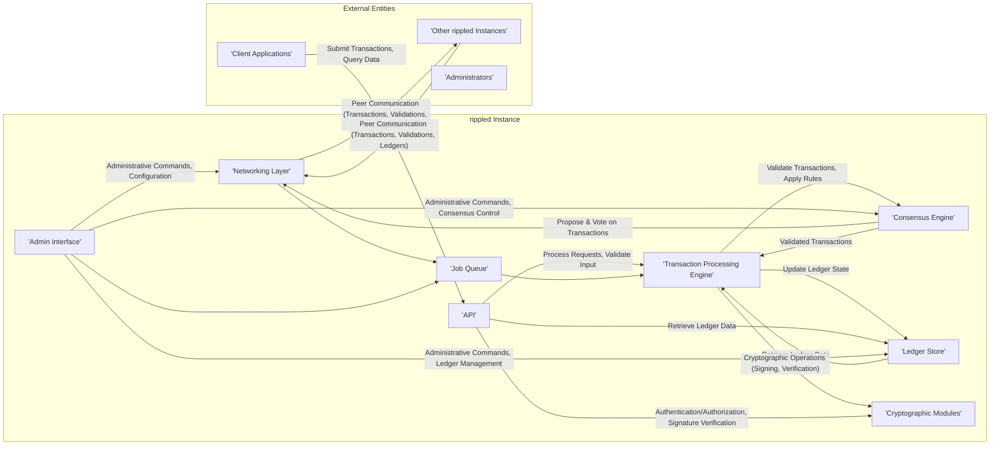

# Project Design Document: RippleD

**Version:** 1.1
**Date:** October 26, 2023
**Author:** AI Software Architect

## 1. Introduction

This document provides a detailed architectural design of the `rippled` project, the core server software for the XRP Ledger. This document serves as a foundation for subsequent threat modeling activities, providing a comprehensive understanding of the system's components, interactions, and data flows. The focus is on aspects relevant to identifying potential security vulnerabilities and attack vectors.

## 2. Project Overview

The `rippled` software implements the core functionality of the XRP Ledger, a decentralized, open-source, permissionless cryptographic ledger. It facilitates the transfer of value across the network and maintains the shared, immutable record of all XRP transactions and ledger states. Key features include:

* **Decentralized Consensus:**  A federated Byzantine Agreement (FBA) based consensus protocol for validating transactions without a central authority.
* **Cryptographically Secured Ledger:**  Maintaining a tamper-proof, shared database across multiple independently operated nodes.
* **Atomic Transactions:** Ensuring that transactions either fully succeed or completely fail, maintaining data consistency.
* **Built-in Decentralized Exchange (DEX):**  Functionality for trading assets directly on the ledger.
* **Open API:** Providing well-defined interfaces for external applications to interact with the ledger.
* **Peer-to-Peer Network:**  A resilient network architecture where nodes communicate directly with each other.

## 3. Architectural Design

The `rippled` architecture is modular, with distinct components responsible for specific functionalities. Understanding these components and their interactions is crucial for identifying potential threat surfaces.

### 3.1. Core Components

* **Networking Layer:**
    * **Purpose:** Establishes and manages connections with other `rippled` nodes in the peer-to-peer network.
    * **Functionality:**
        * Peer discovery and connection management.
        * Secure message transport using TCP, often with TLS encryption.
        * Message routing and delivery between peers.
        * Handling network partitions and reconnections.
    * **Security Relevance:**  Vulnerable to network attacks like eavesdropping, man-in-the-middle, and denial-of-service.
* **Consensus Engine (Voting/Protocol):**
    * **Purpose:** Implements the XRP Ledger's consensus protocol to achieve agreement on the validity and order of transactions.
    * **Functionality:**
        * Receiving and evaluating transaction proposals.
        * Participating in the multi-round voting process.
        * Applying validation rules and checks.
        * Reaching agreement on the next validated ledger version.
    * **Security Relevance:**  Susceptible to attacks that could disrupt the consensus process, such as Byzantine attacks or manipulation of validators.
* **Transaction Processing Engine:**
    * **Purpose:** Executes validated transactions and updates the ledger state.
    * **Functionality:**
        * Applying the effects of transactions (e.g., transferring funds, creating trust lines).
        * Enforcing transaction rules and constraints defined by the protocol.
        * Managing account balances and object states within the ledger.
    * **Security Relevance:**  Potential vulnerabilities in transaction logic could lead to unauthorized fund transfers or manipulation of ledger state.
* **Ledger Store:**
    * **Purpose:** Persistently stores the validated ledger data, including transaction history and account states.
    * **Functionality:**
        * Writing new ledger versions to persistent storage (typically RocksDB).
        * Providing efficient read access to historical ledger data.
        * Managing ledger history and pruning older, less frequently accessed data.
    * **Security Relevance:**  Compromise of the ledger store could lead to data loss, corruption, or unauthorized modification of historical records.
* **Application Programming Interface (API):**
    * **Purpose:** Provides interfaces for external applications to interact with the `rippled` server.
    * **Functionality:**
        * Accepting transaction submissions.
        * Querying account information, ledger history, and network status.
        * Subscribing to real-time ledger events.
        * Supporting protocols like WebSocket, HTTP(S), and potentially gRPC.
        * Implementing authentication and authorization mechanisms.
    * **Security Relevance:**  A major attack surface, vulnerable to injection attacks, authentication bypass, and unauthorized data access.
* **Admin Interface:**
    * **Purpose:** Provides administrative functionalities for managing the `rippled` server instance.
    * **Functionality:**
        * Configuring server parameters.
        * Monitoring server status and performance.
        * Performing maintenance tasks (e.g., database backups).
        * Managing node identity and keys.
    * **Security Relevance:**  If compromised, attackers could gain full control over the `rippled` instance.
* **Cryptographic Modules:**
    * **Purpose:** Provides cryptographic functionalities for securing transactions and data.
    * **Functionality:**
        * Generating and managing cryptographic keys (signing keys, master keys).
        * Signing transactions to prove authenticity.
        * Verifying transaction signatures.
        * Implementing cryptographic hash functions for data integrity.
    * **Security Relevance:**  Vulnerabilities in cryptographic implementations or key management practices could undermine the security of the entire system.
* **Job Queue:**
    * **Purpose:** Manages asynchronous tasks within the `rippled` server.
    * **Functionality:**
        * Queuing and processing background tasks like ledger synchronization and transaction processing.
        * Managing resource utilization for asynchronous operations.
    * **Security Relevance:**  Potential for resource exhaustion attacks or manipulation of queued tasks.

### 3.2. Component Interactions

### 3.3. Data Flow

A detailed understanding of how data flows through the `rippled` system is essential for identifying potential interception or manipulation points.

* **Transaction Submission and Propagation:**
    1. A client application (Y) creates and signs a transaction using its private key.
    2. The signed transaction is submitted to a `rippled` server via the API (E), typically over a secure channel like WebSocket or HTTPS.
    3. The API (E) performs initial validation, including signature verification using the Cryptographic Modules (G).
    4. If valid, the Networking Layer (A) broadcasts the transaction to a subset of connected peers (X).
    5. Other `rippled` instances (X) receive the transaction and may further propagate it across the network.
* **Consensus and Ledger Validation:**
    1. Each participating `rippled` instance's Consensus Engine (B) evaluates the received transactions.
    2. Nodes exchange proposals and votes on which transactions should be included in the next ledger version.
    3. The consensus protocol ensures that a supermajority of validators agree on the set of transactions and their order.
    4. Once consensus is reached, a new validated ledger is formed, containing the agreed-upon transactions.
* **Ledger Application and Persistence:**
    1. The Transaction Processing Engine (C) applies the effects of the validated transactions to the current ledger state. This involves modifying account balances, trust lines, and other ledger objects.
    2. The updated ledger state is then written to the Ledger Store (D).
    3. The new validated ledger is digitally signed by the validating nodes, ensuring its integrity.
* **Ledger Synchronization:**
    1. The Networking Layer (A) facilitates the synchronization of the new validated ledger with other nodes (X) that may not have participated in the consensus round or are lagging behind.
    2. Nodes exchange ledger data to ensure all participants have an identical copy of the validated ledger.
* **Data Retrieval:**
    1. Client applications (Y) can query the `rippled` server via the API (E) to retrieve information about accounts, transactions, and ledger history.
    2. The API (E) interacts with the Ledger Store (D) to fetch the requested data.

## 4. Key Security Considerations

This section highlights potential security vulnerabilities and threats associated with each component.

* **Networking Layer:**
    * **Threats:**
        * **Denial of Service (DoS/DDoS):** Overwhelming the node with connection requests or malicious traffic.
        * **Eavesdropping:** Intercepting communication between nodes to steal transaction data or other sensitive information (mitigated by TLS).
        * **Man-in-the-Middle (MITM):** Intercepting and potentially altering communication between nodes.
        * **Sybil Attacks:** An attacker controlling multiple identities to disrupt the network.
    * **Mitigation Strategies:**
        * Implementing rate limiting and connection limits.
        * Enforcing TLS encryption for peer communication.
        * Using authenticated peer connections.
        * Employing network intrusion detection and prevention systems.
* **Consensus Engine:**
    * **Threats:**
        * **Byzantine Faults/Attacks:** Malicious validators attempting to disrupt the consensus process.
        * **Validator Collusion:** A group of validators conspiring to manipulate the ledger.
        * **Eclipse Attacks:** Isolating a node from the network to prevent it from participating in consensus.
    * **Mitigation Strategies:**
        * The XRP Ledger's consensus protocol is designed to be resilient to a certain number of Byzantine faults.
        * Relying on a diverse set of trusted validators.
        * Implementing mechanisms to detect and penalize misbehaving validators.
* **Transaction Processing Engine:**
    * **Threats:**
        * **Logic Errors:** Bugs in the transaction processing logic that could lead to unintended consequences (e.g., double-spending).
        * **Integer Overflow/Underflow:** Vulnerabilities in arithmetic operations that could be exploited to manipulate balances.
        * **Replay Attacks:** Rebroadcasting valid transactions to execute them multiple times (mitigated by sequence numbers).
    * **Mitigation Strategies:**
        * Rigorous testing and code reviews.
        * Formal verification of critical transaction logic.
        * Implementing safeguards against common programming errors.
* **Ledger Store:**
    * **Threats:**
        * **Data Corruption:** Accidental or malicious modification of the ledger database.
        * **Unauthorized Access:** Gaining access to the ledger store to read or modify sensitive data.
        * **Data Loss:** Failure of the storage system leading to loss of ledger history.
    * **Mitigation Strategies:**
        * Implementing strong access controls and encryption for the ledger store.
        * Regular backups and disaster recovery plans.
        * Using checksums and other integrity checks to detect data corruption.
* **API:**
    * **Threats:**
        * **Authentication/Authorization Bypass:** Gaining unauthorized access to API endpoints.
        * **Injection Attacks (SQL, Command):** Injecting malicious code through API parameters.
        * **Cross-Site Scripting (XSS):** Injecting malicious scripts into API responses (less likely for data-focused APIs).
        * **Denial of Service (DoS):** Overloading the API with requests.
        * **Data Exposure:** Unintentionally revealing sensitive information through API responses.
    * **Mitigation Strategies:**
        * Implementing robust authentication and authorization mechanisms (e.g., API keys, OAuth 2.0).
        * Input validation and sanitization to prevent injection attacks.
        * Rate limiting and request throttling.
        * Secure coding practices and regular security audits.
* **Admin Interface:**
    * **Threats:**
        * **Unauthorized Access:** Gaining access to administrative functionalities without proper credentials.
        * **Privilege Escalation:** Exploiting vulnerabilities to gain higher-level privileges.
        * **Malicious Configuration Changes:** Altering server settings to compromise security or functionality.
    * **Mitigation Strategies:**
        * Strong authentication mechanisms (e.g., multi-factor authentication).
        * Role-based access control (RBAC) to limit administrative privileges.
        * Auditing of administrative actions.
        * Restricting access to the admin interface to trusted networks.
* **Cryptographic Modules:**
    * **Threats:**
        * **Weak Cryptographic Algorithms:** Using outdated or insecure algorithms.
        * **Key Management Vulnerabilities:** Insecure storage or handling of private keys.
        * **Side-Channel Attacks:** Exploiting information leaked through the execution of cryptographic operations.
    * **Mitigation Strategies:**
        * Using well-vetted and up-to-date cryptographic libraries.
        * Implementing secure key generation, storage, and rotation practices.
        * Protecting against side-channel attacks through secure implementation techniques.
* **Job Queue:**
    * **Threats:**
        * **Resource Exhaustion:** Flooding the job queue with malicious tasks.
        * **Job Manipulation:** Altering or deleting queued tasks.
    * **Mitigation Strategies:**
        * Implementing limits on the number of queued jobs.
        * Authenticating and authorizing job submissions.

## 5. Deployment Considerations

Secure deployment practices are crucial for mitigating risks.

* **Network Segmentation:** Isolating `rippled` instances from untrusted networks.
* **Firewall Configuration:** Restricting network access to only necessary ports and protocols.
* **Secure Key Management:** Using hardware security modules (HSMs) or secure enclaves for storing private keys.
* **Regular Security Updates:** Keeping the operating system and `rippled` software up-to-date with security patches.
* **Intrusion Detection and Prevention Systems (IDPS):** Monitoring network traffic and system logs for suspicious activity.
* **Regular Security Audits and Penetration Testing:** Identifying potential vulnerabilities in the deployment environment.
* **Monitoring and Logging:** Implementing comprehensive monitoring and logging to detect and respond to security incidents.

## 6. Future Considerations

Ongoing development and potential future features may introduce new security considerations.

* **Smart Contracts:** If smart contract functionality is added, new vulnerabilities related to contract logic and execution environments will need to be addressed.
* **Privacy Enhancements:** Implementing privacy-preserving technologies may introduce new complexities and potential attack vectors.
* **Interoperability:** Connecting with other blockchains or systems may create new trust boundaries and security challenges.

This document provides a comprehensive architectural overview of `rippled` for threat modeling. The identified components, interactions, data flows, and security considerations serve as a basis for further in-depth analysis and the development of specific threat models.